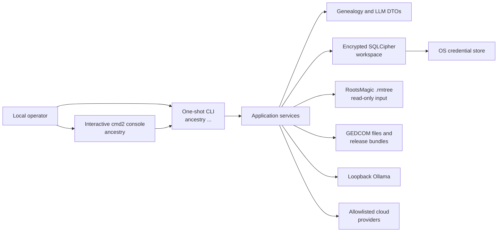
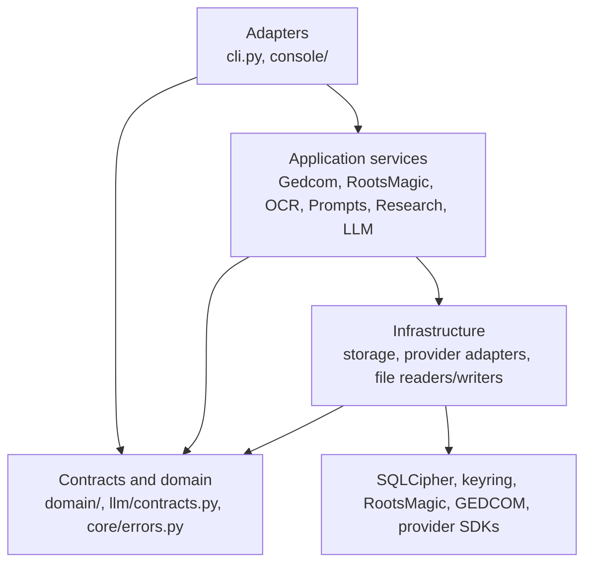
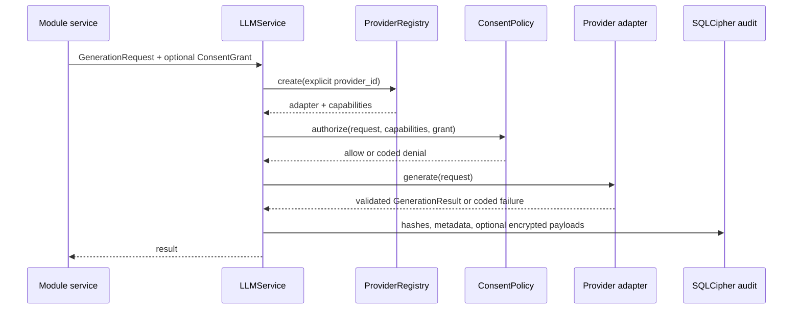

# AncestryLLM architecture

This document is the architectural source of truth for the repository. It
describes the system that exists now, the invariants new work must preserve,
and the boundaries that are intentionally not implemented. It should be read
with the operator-focused guides under `docs/`, especially the threat model,
privacy and consent policy, GEDCOM compatibility guide, and CLI reference.

AncestryLLM 0.2 is a single-user, local-first Python application for genealogy
research. It combines deterministic RootsMagic and GEDCOM workflows with
optional LLM assistance. There is no supported server, browser, or multi-user
runtime. The one-shot CLI and interactive console are sibling adapters over the
same application services so that a future API can reuse those services without
depending on terminal code.

## Architectural priorities

The priorities below are ordered. A convenience feature must not weaken an
earlier priority.

1. **Protect private genealogy data.** Real trees, databases, exports, notes,
   prompts, responses, credentials, and logs do not belong in the repository.
2. **Do not mutate source family trees.** RootsMagic files are immutable inputs.
   GEDCOM operations write new files or immutable generation bundles.
3. **Prefer deterministic local work.** Network access is opt-in, provider
   selection is explicit, and `none` is a real offline provider.
4. **Fail closed at trust boundaries.** Plaintext databases, unknown cloud
   endpoints, write-capable SQL, mismatched manifests, malformed structured
   output, and unsafe deletions are rejected.
5. **Preserve genealogy evidence.** GEDCOM processing is loss-minimizing:
   citations, custom/vendor structures, relationships, conflicts, and unknown
   records are retained whenever they can be represented safely.
6. **Publish atomically and make loss visible.** Configuration, GEDCOM exports,
   and sync generations are staged before replacement or publication. Export
   and sync reports disclose omissions and unsupported source data.
7. **Keep interfaces replaceable.** Adapters render and route; services own use
   cases; infrastructure implements storage, provider, and file boundaries.

## System context

The local operator is trusted to select files, providers, and consent. Imported
GEDCOM, RootsMagic content, prompt variables, OCR text, provider output, and
external snapshots are untrusted data. An LLM is never an authority for family
tree facts and receives no shell, SQL, filesystem, or other tool capability.

### Genealogy authority

The project has three deliberately different data roles:

- RootsMagic and ordinary GEDCOM files are authoritative source artifacts for
  deterministic read, merge, analysis, and export operations.
- The SQLCipher workspace stores curated supporting research, prompt versions,
  consent configuration, and privacy-minimal LLM audit metadata. It is not a
  replacement family tree.
- In incremental GEDCOM synchronization, the current `master.ged` and its
  matching private `manifest.json` are the synchronization authority. Website
  exports are versioned observations. A website name is not synthesized into a
  GEDCOM citation; standard `SOUR` records and fact citations remain evidence.

## Repository map

| Path | Architectural responsibility |
|---|---|
| `src/ancestryllm/cli.py` | Canonical argument grammar, one-shot dispatch, and application entry point. |
| `src/ancestryllm/console/` | Interactive shell, built-in command sets, and Rich presentation adapter. |
| `src/ancestryllm/core/` | Configuration, dependency composition, module registry, secret boundary, and stable errors. |
| `src/ancestryllm/domain/` | Provider- and adapter-independent genealogy value objects. |
| `src/ancestryllm/storage/` | SQLCipher lifecycle, schema, repositories, migrations, backup, and diagnostics. |
| `src/ancestryllm/llm/` | Provider contract, registry, adapters, consent policy, profiles, validation, and audited generation. |
| `src/ancestryllm/rootsmagic/` | Immutable database discovery/query and schema-adaptive GEDCOM export. |
| `src/ancestryllm/gedcom/` | Loss-minimizing parser/merge kernel, graph selection, quality analysis, and incremental sync. |
| `src/ancestryllm/prompts/` | Immutable prompt revisions and exact-variable rendering. |
| `src/ancestryllm/research/` | Curated encrypted research-person service. |
| `src/ancestryllm/ocr/` | Provider-neutral extraction from already-transcribed OCR text. |
| `tests/` | Characterization, regression, privacy, storage, and operations tests using fictional fixtures. |
| `scripts/` | Repository safety, local benchmark, GEDCOM demo, and deterministic Wiki publication tooling. |
| `docs/` | Canonical source for operator documentation published to the GitHub Wiki. |
| `.github/` | CI, security analysis, dependency updates, issue/PR policy, and Wiki publication. |
| `pyproject.toml`, `uv.lock`, `Makefile` | Package contract, locked dependency graph, tool policy, and supported developer commands. |

`family_trees/` is a local-only data boundary. Its contents and generated
genealogy artifacts must never be committed.

## Layering and dependency rules

The intended dependency rules are:

- Console command sets contain no business logic. They translate tokens into
  the canonical CLI dispatcher.
- Services do not import `cmd2`, Rich, or console modules. They return typed
  DTOs, paths, or serializable values and normally raise stable `AncestryError`
  subclasses.
- Presentation converts dataclasses, SQLAlchemy rows, paths, and collections to
  plain values. `--json` and human output represent the same result.
- Provider adapters implement generation only. They cannot discover modules,
  execute tools, or select themselves because a credential exists.
- Repositories are small SQLAlchemy session boundaries. They do not perform
  provider calls or file parsing.
- Future interfaces may depend on services and contracts. They must not import
  the console or bypass configuration, consent, storage, or file-safety
  factories.

The large GEDCOM engine and incremental synchronizer predate the full modular
split. Thin façade modules (`parser.py`, `identity.py`, `quality.py`,
`serialization.py`, `graph.py`, `service.py`, and `sync.py`) define the intended
public boundaries while the characterized kernel remains centralized in
`engine.py` and `incremental.py`.

## Startup, configuration, and composition

The installed entry point is `ancestryllm.cli:main`; `python -m ancestryllm`
calls the same function.

- With arguments, `main` parses the canonical CLI grammar and dispatches one
  operation.
- Without arguments, it constructs `AncestryConsole` and starts the local
  interactive shell.
- `AppContext.build()` is the composition root. It creates the configuration,
  secret store, lazy database object, provider registry, and shared application
  services.
- Feature services such as GEDCOM, RootsMagic, and OCR are imported by dispatch
  only when their command is used.

`AppConfig` contains only non-secret values. By default, `platformdirs` selects
the user configuration and data directories. `ANCESTRYLLM_CONFIG_DIR` and
`ANCESTRYLLM_DATA_DIR` may override them. Paths are expanded and resolved,
limits are clamped to safe ranges, directories are owner-only where the
platform permits it, and configuration is saved through an fsynced temporary
file plus `os.replace` with mode `0600`.

The configuration currently controls:

- configured RootsMagic directories;
- enabled interactive modules;
- a stored default provider value;
- query row/output caps and query/provider timeout values.

The one-shot CLI still defaults provider options to `none` directly; the stored
`default_provider` is not currently applied during dispatch. Similarly, module
enablement controls the interactive registry and module listing, but it is not
an authorization gate for one-shot CLI subcommands.

No `.env` file is loaded. Environment variables are limited to explicit path
configuration and headless/CI secret fallback. Merely installing a provider SDK
or defining an API key cannot select a provider or initiate a request.

## Interface adapters

### One-shot CLI

`cli.py` owns the supported command grammar for modules, RootsMagic, GEDCOM,
prompts, people, providers/consent, secrets, OCR, and database maintenance.
`dispatch()` constructs a use-case service where needed and renders its result
through `PresentationAdapter`. Stable application errors are rendered without
provider secrets or raw input payloads; ordinary input errors exit separately.

This parser and dispatcher are the compatibility contract. New console actions
must first exist here so one-shot and interactive behavior cannot drift.

### Interactive console

`console/app.py` is a `cmd2` shell over `run_tokens()`:

- command sets are explicit built-ins loaded only when enabled;
- `use`, `info`, `show`, `set`, `unset`, `run`, and `back` maintain local
  module state;
- shell execution, Python execution, script execution, redirection, editing,
  and shortcuts are disabled;
- secret-like option names are rejected, while secret entry uses no-echo
  `getpass` through the secrets command;
- history is stored under the private data directory with owner-only mode where
  supported.

`ModuleDescriptor` records the module ID, implementation path, actions,
configuration, and required-service metadata. This is an explicit built-in
registry, not entry-point discovery or a third-party plugin API.

## Stable contracts and domain objects

`core/errors.py` defines sanitized, coded exceptions with a message,
remediation, exit code, and serializable details. Adapters should expose these
codes rather than leaking arbitrary provider, database, or parser exceptions.

`domain/models.py` defines immutable genealogy value objects for people, names,
identifiers, provenance, citations, facts, and relationships. `LivingStatus`
is conservative: unknown and possibly-living data must not silently be treated
as deceased.

`llm/contracts.py` separately defines validated Pydantic DTOs for messages,
generation requests/results, provider capabilities, and data classifications.
The provider contract is deliberately narrow: generation and streaming only,
with no autonomous tool-use surface.

## Encrypted workspace and secret boundary

### Secrets

`SecretStore` is the only secret contract. Production uses the OS keyring under
the `AncestryLLM` service name. Environment injection is a fallback for
headless/CI use; keyring values take precedence. Tests use `MemorySecretStore`.
Secret status reports only presence, never values.

Registered secret references cover the SQLCipher master key plus OpenAI,
Anthropic, Gemini, and OpenRouter credentials. Ollama needs no stored API key.

### SQLCipher lifecycle

`Database` owns the writable application database and never opens RootsMagic
files. Its lifecycle is fail-closed:

1. Reject any existing file with a plaintext SQLite header.
2. Read the 256-bit database key from the secret store. Generate and store a
   key only for a new/empty workspace; never replace a missing key for an
   existing workspace.
3. Require the `sqlcipher3` driver and a non-empty cipher version.
4. Enable cipher memory security, foreign keys, secure deletion, and the
   non-WAL `DELETE` journal mode.
5. For an existing database, run the strongest available cipher/integrity
   check before use.
6. Create the schema and require schema revision `0001`.

SQLAlchemy uses one SQLCipher connection factory and `SingletonThreadPool`.
Sessions are short-lived within service/repository calls. Encrypted backups use
SQLCipher's online backup API, reuse the matching key, reject an existing
destination, and set mode `0600`.

Read-only diagnostics check the SQLCipher driver, keyring read path, data
directory, and existing file permissions without creating a database or
writing a credential.

### Persistence model

The initial schema groups data by responsibility:

| Group | Tables | Purpose |
|---|---|---|
| Research | `workspaces`, `people`, `person_identifiers`, `facts`, `relationships` | Curated supporting research and provenance. |
| Prompts | `prompt_templates`, `prompt_versions` | Immutable, incrementing prompt revisions and optional response schemas. |
| Provider policy | `provider_profiles`, `consent_profiles` | Explicit provider/model configuration and revocable disclosure grants. |
| Audit | `llm_runs` | Request/response hashes, status, token/cost metadata, and optional encrypted payload retention. |

The schema has room for identifiers, facts, and relationships, while the
current public research service exposes only add/list person operations.
Packaged Alembic-compatible migration files mirror revision `0001`; runtime
bootstrap currently uses `Base.metadata.create_all()` and rejects any other
revision. There is not yet a public in-place migration command.

## LLM boundary, providers, and consent

The registry recognizes `none`, Ollama, OpenAI, Anthropic, Gemini, and
OpenRouter. OpenRouter reuses the OpenAI-compatible adapter with a fixed
allowlisted endpoint. Provider packages are optional extras and are imported
only when selected.

Before a remote call, `ConsentPolicy` verifies:

- provider identity and an active provider-specific consent grant;
- allowed module and purpose;
- requested data classes as a subset of the grant;
- model name against the grant's allowlist patterns.

Remote provider endpoints must be HTTPS and match the built-in hostname
allowlist. Ollama may use HTTP only on loopback; a non-loopback endpoint must be
HTTPS. `none` is non-remote and always refuses generation, guaranteeing that an
operation cannot fall through to a configured cloud key.

Adapters validate structured output with JSON Schema before returning it.
OpenAI/OpenRouter can request strict JSON-schema output; Ollama uses its format
parameter; Anthropic and Gemini request JSON in the prompt and validate the
response locally. Output remains data and is never executed.

`LLMService` stores SHA-256 request/response hashes and operational metadata for
both success and failure. Full canonical requests and response text are stored
only when the selected consent grant explicitly enables payload retention; the
database is encrypted in either case.

Current limitations that new work must not hide:

- provider profile `settings_json` is persisted but is not yet used by the CLI
  to construct provider adapters;
- `max_cost_usd` is persisted in consent but is not yet enforced by
  `ConsentPolicy` or `LLMService`;
- timeout and cost fields exist in contracts, but consistent SDK-level timeout
  and preflight enforcement across every modular adapter remains incomplete;
- the GEDCOM legacy kernel still contains older direct AI adapters and
  environment-based model settings. Normal modular merge uses `LLMService`,
  while incremental sync defaults to `--ai-backend none` but can still enter
  the legacy path when explicitly requested.

These are tracked architectural gaps, not permission to bypass explicit
provider selection or cloud consent in new service code.

## RootsMagic subsystem

`RootsMagicService` composes an immutable reader, deterministic exporter, and
optional LLM-to-SQL use case.

### Immutable reader

`RootsMagicReader` accepts only `.rmtree` files inside configured directories.
Every connection uses SQLite URI `mode=ro`, `query_only`, disabled extension
loading, `trusted_schema=OFF`, an authorizer that denies writes/DDL/PRAGMA/
ATTACH/transactions, and a progress deadline.

Queries are parsed with `sqlglot`. Exactly one SELECT, CTE, or set operation is
allowed; forbidden AST nodes and tables outside the inspected schema are
rejected. The reader applies `LIMIT max_rows + 1`, returns a truncation flag,
and compares before/after SHA-256 hashes to detect concurrent source changes.

Natural-language questions are a two-stage operation: an explicitly selected
provider returns one schema-validated SQL string, then the same deterministic
AST validation and SQLite authorizer run it. The model cannot execute SQL
directly and cannot weaken the read-only connection.

### GEDCOM export

`RootsMagicExporter` adapts the inspected `PersonTable`, `NameTable`,
`FamilyTable`, and `ChildTable` into GEDCOM. It supports:

- portable and preservation profiles;
- GEDCOM 5.5.5 plus an explicit 5.5.1 compatibility mode;
- generic, Ancestry, Geni, and MyHeritage destination labels;
- connected, ancestor, or descendant scopes with generation limits;
- living-person exclusion, redaction, or explicit inclusion;
- an export report listing mapped tables, unmapped tables/columns, and counts.

Preservation mode retains safely attributable scalar person columns as
`_RM_*` custom tags. Binary values and unattached/unsupported records remain
report-only. The current exporter is intentionally schema-adaptive but narrow;
it does not claim complete coverage of every RootsMagic version or table.
Output and report files are atomic, and both are discarded if the source hash
changes during export.

Destination selection does not prove interoperability. Current Ancestry, Geni,
and MyHeritage imports require recorded manual smoke tests for every release.

## GEDCOM subsystem

### Kernel and façades

`gedcom/engine.py` is the characterized loss-minimizing kernel. It owns record
parsing, pointer allocation, date normalization, identity comparison, optional
adjudication, merge decisions, quality analysis, report rendering, validation,
and serialization. Its raw line/record representation is authoritative so
unknown tags and nested structures survive; `python-gedcom` is an additional
best-effort parser check, not the serialization source.

The smaller modules define stable seams:

- `parser.py` re-exports parsing and validation primitives;
- `identity.py` exposes similarity, candidates, and merge functions;
- `graph.py` selects connected, ancestor, or descendant subtrees;
- `quality.py` exposes deterministic findings and Markdown reports;
- `serialization.py` exposes supported versions and the writer;
- `service.py` provides merge, subtree, quality, and sync use cases;
- `sync.py` injects the engine into the incremental synchronizer and forces the
  update default to `--ai-backend none`.

### Merge and serialization flow

1. Load every input in deterministic priority order.
2. Parse level/tag/value lines and allocate collision-free global xrefs,
   including namespacing undefined references so they cannot bind to a record
   from another file accidentally.
3. Normalize representational details without inventing evidence.
4. Build enriched individual records and relationship context.
5. Use deterministic blocking and similarity scoring to find candidates.
6. Optionally ask the modular LLM boundary to adjudicate ambiguous identity;
   conflicting facts remain evidence and are not silently deleted.
7. Rewrite duplicate pointers to canonical survivors.
8. Optionally resolve a root person and retain the requested tree component.
9. Serialize preserved source blocks, non-person records, citations, families,
   notes, media, repositories, sources, and custom/vendor lines where possible.
10. Validate 5.5.5 output and atomically replace the destination.

The deliberate 5.5.1 mode exists for importer compatibility. Root resolution
accepts a pointer or unique name; ambiguous roots fail rather than select an
arbitrary person. Output may normalize headers, order, xrefs, dates, and line
wrapping, but must not overwrite an input file.

### Quality analysis

Quality analysis is deterministic first. Findings cover duplicate candidates,
date/place issues, source structure and coverage, relationship/family
consistency, married names, direct-ancestor priorities, and merge decisions.
Finding IDs are stable over canonical evidence so reports can be compared.
Optional AI refinement may rephrase or prioritize known findings but may not
invent or remove finding IDs.

### Incremental update and rebase

`gedcom/incremental.py` implements manifest-backed synchronization of website
snapshots. It has its own stable `SyncError`/exit-code contract because it was
migrated from a standalone operational tool.

An update:

- requires a master plus either one-time manifest initialization or the exact
  matching manifest;
- identifies each snapshot by stable source ID, vendor, exported date, and
  SHA-256 content ID;
- preserves protected baseline/manual blocks and standard citations;
- maps people and non-person records conservatively and records aliases;
- removes only sole-origin, uncited, explicitly removable facts when their
  active observation disappears;
- never automatically removes people, names, sex, relationships, families,
  cited facts, protected baseline/manual content, or source records;
- treats an already-active snapshot checksum as an idempotent no-op;
- stages and atomically publishes an immutable
  `gNNNN-YYYYMMDDTHHMMSSZ/` release containing `master.ged`, `manifest.json`,
  `update.md`, `quality.md`, and `rollback.json`.

Rebase is an explicit adoption of external edits. Added/changed person blocks
become protected manual content. Deletions require
`--accept-manual-deletions` and become tombstones so a later snapshot cannot
silently resurrect them. Rollback means selecting a previous matching master
and manifest; published generation directories are never overwritten.

The public sync route and offline initialization/idempotency tests now exist,
so the earlier standalone CLI wiring gap is closed. Verification depth is still
uneven: update initialization and idempotency have focused modular tests, while
rebase, tombstone non-resurrection, broad non-person remapping, checksum failure
paths, and multi-generation vendor replacement need stronger end-to-end
coverage before the subsystem should be described as fully hardened.

## Supporting application services

### Prompts

`PromptService` stores an immutable new revision for every save. Variable names
must be simple identifiers, declared variables must exactly match `string.Template`
placeholders, and rendering requires exactly the declared value set. Prompt
text is never evaluated as Python or shell. Response schemas are stored with
the revision for callers that need structured output.

### Research people

`ResearchService` exposes a minimal curated workspace: add and list people in a
named workspace with conservative living status and notes. It is supporting
research, not an automatic import of a complete source tree.

### OCR extraction

The current OCR module does not perform image recognition. It accepts bounded
UTF-8 text that has already been transcribed, normalizes it, marks it as
untrusted document data, and asks an explicitly selected provider for a small
genealogy JSON schema. `OcrService` uses the common LLM/consent/audit boundary.
`legacy_gemini.py` retains normalization and an older direct helper for
compatibility tests; the unified CLI uses the modular service.

## Operational tooling and documentation

The scripts are part of the repository architecture, not application runtime
plugins:

- `check_repository_safety.sh` rejects tracked private/runtime artifact types
  outside fictional fixtures and scans tracked text for private-key markers.
- `benchmark_local_llm.py` is dry-run by default. With `--execute`, it contacts
  only an already-running Ollama endpoint with fictional data and records
  aggregate metrics, never prompt/response text.
- `gedcom_merge_quickstart.sh` runs fictional merge fixtures offline in a new
  private temporary directory and verifies malformed input fails safely.
- `validate_wiki_docs.py`, `rewrite_wiki_links.py`,
  `sync_wiki_docs.py`, and `commit_wiki_changes.py` validate, flatten, rewrite,
  mirror, and commit the canonical `docs/` tree into the separate GitHub Wiki.

Wiki synchronization rejects symlinks, unsafe navigation, duplicate flattened
page names, and broken sidebar targets before changing a destination. It owns
all top-level Wiki Markdown pages, removes stale managed pages, avoids no-op
commits, and uses traceable bot identity plus the source commit SHA. The GitHub
workflow serializes publications and exposes credentials only during clone and
push.

`ARCHITECTURE.md` remains at the repository root and is not currently included
in the generated Wiki scope. Operator guides in `docs/` are the Wiki source;
this file governs code structure and architectural decisions.

## Verification and delivery architecture

The supported development environment is Python 3.12 through 3.14 with a
locked `uv.lock` dependency graph. The Make targets are the local contract:

| Command | Gate |
|---|---|
| `make test` | Pytest regression and characterization suite. |
| `make lint` | Ruff lint/format plus repository artifact safety. |
| `make typecheck` | Strict mypy over `ancestryllm`. |
| `make security` | Dependency audit and Semgrep Python/secret rules. |
| `make sbom` | CycloneDX environment SBOM. |

CI installs the locked environment with all extras and tests Python 3.12,
3.13, and 3.14. Coverage is branch-aware with a current 65% floor. Python 3.12
also runs Ruff, strict mypy, and the repository safety script. A separate job
runs `pip-audit`, Semgrep, and uploads an SBOM. CodeQL runs on pushes, pull
requests, and a weekly schedule. Dependabot covers Python and GitHub Actions.
Pinned action commit SHAs reduce workflow supply-chain drift.

Tests are intentionally split by risk:

- `tests/modular/` covers composition, console restrictions, provider policy,
  encrypted storage, prompt/research services, RootsMagic export, and basic
  incremental sync;
- `tests/test_gedcom_merge.py` and `tests/test_gedcom_quality.py` characterize
  the large legacy kernel and preservation behavior;
- router tests prove bounded read-only RootsMagic SQL and source hash stability;
- Wiki tests cover validation, deterministic mirroring, deletion, no-op
  behavior, commits, and workflow structure;
- all genealogy fixtures are fictional and isolated under `tests/fixtures/`.

Strict type checking currently exempts `gedcom/engine.py` and
`gedcom/incremental.py`, and Ruff carries targeted exceptions for those files.
This is acknowledged migration debt. New modular code must remain fully typed,
and changes to the kernel require focused regression tests rather than expanding
the exception surface.

The pre-commit configuration adds gitleaks, private-key detection, large-file
checks, format/whitespace checks, and a no-direct-commit-to-`main` guard. CI and
the repository safety script are authoritative even if a developer has not
installed local hooks.

## Current capability and assurance status

| Area | Current state | Remaining assurance boundary |
|---|---|---|
| CLI and interactive console | Implemented with shared dispatch and modular tests. | A future console migration must preserve command/JSON/error compatibility. |
| Encrypted workspace | Implemented and tested for encryption, wrong/missing keys, backup, and diagnostics. | Cross-platform keyring/SQLCipher packaging must be verified per release. |
| RootsMagic query | Implemented with layered read-only controls and synthetic tests. | Vendor schema variation and live-file behavior need release testing. |
| RootsMagic export | Implemented for core tables with explicit loss reports. | It is not a complete exporter for every RootsMagic table/version. |
| GEDCOM merge and quality | Broadly characterized with fictional regression tests. | The kernel remains large and partially outside strict static checks. |
| Incremental update | Publicly wired; initialization and idempotency are tested offline. | Multi-generation, rebase, tombstone, and non-person paths need deeper coverage. |
| LLM policy/adapters | Policy and offline behavior are tested; adapters are explicit. | Live provider compatibility, uniform timeouts, and cost-cap enforcement are not CI-proven. |
| External GEDCOM interoperability | Output supports 5.5.5 and a 5.5.1 fallback. | Ancestry/Geni/MyHeritage import claims require manual release evidence. |
| Web/API/multi-user runtime | Not implemented. | Authentication, authorization, CSRF, tenant isolation, and server operations are future design work. |

## Non-goals and prohibited shortcuts

The current release intentionally excludes:

- an HTTP API, WebUI, browser authentication, or multi-user authorization;
- autonomous agents, LLM tool execution, generated shell/Python execution, or
  write-capable generated SQL;
- third-party module/provider discovery or runtime plugin installation;
- embeddings, vector stores, RAG ingestion, and model training;
- silently selecting a cloud provider from installed packages or credentials;
- writing to RootsMagic, overwriting source GEDCOM, or treating the encrypted
  research workspace as the master family tree;
- claiming production interoperability without current manual importer tests.

Adding one of these is an architectural change, not an ordinary feature. It
requires a dedicated design, threat-model update, privacy review, migration
plan, and tests before implementation.

## Change guide

Use these paths when extending the system:

| Change | Primary locations | Required architectural checks |
|---|---|---|
| New command | `cli.py`, service, console command set, CLI docs | One-shot/console parity, serializable result, stable errors. |
| New built-in module | `core/modules.py`, `console/`, service package | Explicit registry only; disabled module is not imported; no adapter business logic. |
| New provider | `llm/providers/`, `llm/registry.py`, extras/docs/tests | Explicit selection, endpoint policy, consent, schema validation, redacted failures, no auto-discovery. |
| New persisted data | `storage/models.py`, migration, repository/service | SQLCipher only, schema revision path, provenance/privacy/backup impact. |
| GEDCOM behavior | façade plus kernel as necessary, fictional fixtures | Loss-minimal preservation, stable pointers, conflicts/citations/families, atomic output, 5.5.5 and fallback impact. |
| RootsMagic behavior | reader/exporter/service | Source remains hash-identical, bounded query, no write path, loss report. |
| Cloud data use | module service, `GenerationRequest`, consent docs/tests | Correct data classes, purpose/model/module grant, minimization, retention, network-offline test. |
| Documentation page | `docs/`, sidebar if needed, Wiki tests | Unique flattened basename, safe links, deterministic sync. |

## Architecture governance

Every pull request that changes a boundary, data flow, persistence model,
provider policy, source-file guarantee, supported runtime, or release gate must
update this file in the same change. Behavioral details belong in the focused
guides under `docs/`; this document should name the boundary, invariant, owner,
and known limitation without becoming a second CLI manual.

Architecture review should answer:

1. Which layer owns the new behavior?
2. What private data enters, leaves, or persists?
3. Can it cause network access, and how is that made explicit?
4. Can untrusted input become executable or affect a filesystem/database path?
5. Which source artifacts can change, and what proves immutability or atomicity?
6. What is the stable DTO/error/migration contract?
7. Which deterministic and offline regression tests enforce the invariant?
8. Does the threat model, privacy guide, compatibility guide, or release
   evidence need to change?

If the code and this document disagree, treat the discrepancy as a defect:
verify the implementation, then update either the code or architecture in a
focused branch before building further work on the disputed assumption.
