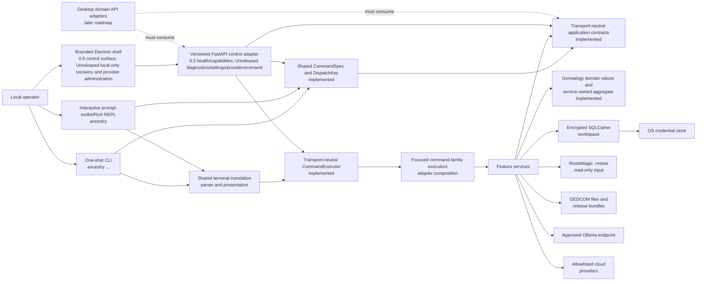
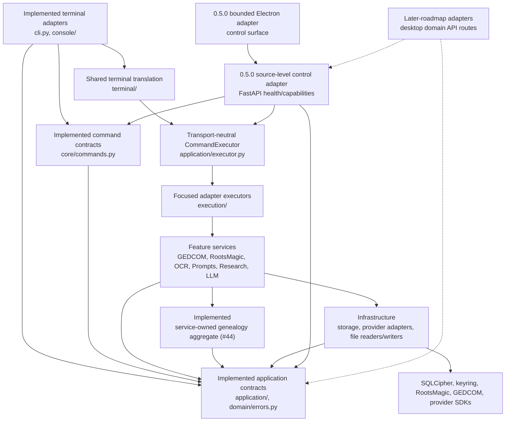
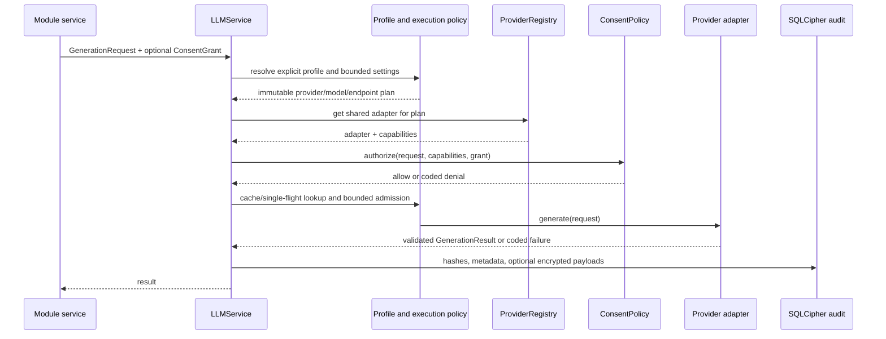

# AncestryLLM architecture

This document is the architectural source of truth for the repository. It
distinguishes the last published behavior, implemented Unreleased changes, and
later-roadmap boundaries that are intentionally not implemented.
Executable ownership and import rules are specified in
[`docs/reference/ARCHITECTURE_CONTRACTS.md`](docs/reference/ARCHITECTURE_CONTRACTS.md). The focused
REPL layers and migration compatibility contract are specified in
[`docs/explanation/REPL_ARCHITECTURE.md`](docs/explanation/REPL_ARCHITECTURE.md). It should be read
with the implemented shared execution contract in
[`docs/reference/COMMAND_EXECUTOR.md`](docs/reference/COMMAND_EXECUTOR.md),
with the accepted desktop decision in
[`docs/ADR-0025-electron-fastapi-desktop.md`](docs/ADR-0025-electron-fastapi-desktop.md)
and the accepted deployment direction and implemented profile control plane in
[`docs/ADR-0026-local-first-container-remote-deployment.md`](docs/ADR-0026-local-first-container-remote-deployment.md),
and the operator-focused guides under `docs/`, especially the threat model,
privacy and consent policy, GEDCOM compatibility guide, and CLI reference.

The released `0.5.0` runtime is a single-user, local-first Python application
for genealogy research. It combines deterministic RootsMagic and GEDCOM
workflows with optional LLM assistance. Version `0.5.0` adds an
authenticated FastAPI control adapter for health and capability discovery, a
UI-only Electron shell with Home, Diagnostics, a sanitized capability summary,
local visual Settings, and a bounded first-run Home welcome, plus native
packaged-sidecar build, pre-spawn payload verification, full-process-tree
supervision, and bounded shutdown drain.
Unreleased source work adds three path-free opaque file-grant methods, five
fixed settings/credential methods, six fixed provider-configuration and
consent methods, and five fixed task-lifecycle request methods plus one
validated event listener. Settings expose only reviewed non-secret metadata and
presence-only credential status; secret values are write-only and never return
across HTTP or IPC. Issue #107 adds a local-only first-run choice, a typed
sanitized startup-diagnostic report, and fail-closed read-only recovery. Issue
#108 adds explicit endpoint tests, optimistic-revision provider profiles, and
complete consent previews and grants without adding provider execution.
Issue #109 adds a Tasks presentation that reloads backend snapshots, follows
bounded monotonic events, distinguishes cooperative cancellation phases, and
shows only coded failures and path-free artifact metadata. It adds no task
admission, provider execution, direct artifact action, or genealogy operation.
Packaged desktop startup uses the OS keyring only, blocks settings, preference,
credential, provider-profile, and consent mutations while a required startup
component is degraded, and never repairs configuration, creates a database, or
replaces a key as part of diagnostics. The API exposes no genealogy, provider
execution, domain, or generic command-dispatch route. Development uses
deterministic fictional data, and packaged Electron main alone may call the
authenticated fixed routes. A supported 0.x
desktop release requires a target-matched,
manually installed official unsigned installer and all release assurance gates.
macOS and Windows can display an unknown-publisher or Gatekeeper prompt; users
must verify published checksums and release evidence before installation.
Unsigned CI artifacts and unpacked development builds are verification inputs
only. Version 0.5.0 has no updater or background update channel.

There is no current supported production browser, public/LAN, application
container, or remote application runtime. Unreleased source implements
ADR-0026's versioned, local-default deployment-profile control plane, Issue
#363's host-only container-control foundation, Issue #348's macOS arm64 runtime
acquisition and lifecycle surface, and Issue #349's probe-only OCI and Compose
verification topology. Issue #348 installs and manages only the app-owned
Colima/Lima, Docker CLI, Compose, and Buildx substrate. Issue #349 builds a
non-root gateway and optional worker but deliberately exposes only private
health/capability probes, publishes no port, and cannot initialize or migrate
genealogy storage. Neither issue activates a deployment profile, brokers
application secrets, mounts user genealogy data, or exposes Docker authority
to the renderer or containers. Remote enrollment and remote runtime remain
unimplemented. The application does not accept a browser client, general
public API, multi-user server, or multi-tenant service. The one-shot CLI and
interactive console remain the implemented genealogy-capable user-facing
adapters. Every adapter
must consume the same application contracts and services without depending on
terminal presentation or redefining domain behavior.

## Architectural priorities

The priorities below are ordered. A convenience feature must not weaken an
earlier priority.

1. **Protect private genealogy data.** Real trees, databases, exports, notes,
   prompts, responses, credentials, and logs do not belong in the repository.
2. **Do not mutate source family trees.** RootsMagic files are immutable inputs.
   GEDCOM operations write new files or immutable generation bundles.
3. **Prefer deterministic local work.** Network access is opt-in, provider
   selection is explicit, and `none` is a real offline provider.
4. **Fail closed at trust boundaries.** Plaintext databases, unknown cloud
   endpoints, write-capable SQL, mismatched manifests, malformed structured
   output, untrusted renderer requests, unauthenticated loopback clients, and
   unsafe deletions are rejected.
5. **Preserve genealogy evidence.** GEDCOM processing is loss-minimizing:
   citations, custom/vendor structures, relationships, conflicts, and unknown
   records are retained whenever they can be represented safely.
6. **Publish atomically and make loss visible.** Configuration, GEDCOM exports,
   and sync generations are staged before replacement or publication. Export
   and sync reports disclose omissions and unsupported source data.
7. **Keep interfaces replaceable.** Adapters render and route; services own use
   cases; infrastructure implements storage, provider, and file boundaries.

## System context

```mermaid
flowchart LR
    Operator["Local operator"]
    CLI["One-shot CLI\nancestry ..."]
    Console["Interactive prompt-toolkit/Rich REPL\nancestry"]
    Specs["Shared CommandSpec and DispatchKey\nimplemented"]
    Contracts["Transport-neutral application contracts\nimplemented"]
    Terminal["Shared terminal translation\nparser and presentation"]
    Executor["Transport-neutral CommandExecutor\nimplemented"]
    Handlers["Focused command-family executors\nadapter composition"]
    Services["Feature services"]
    Domain["Genealogy domain values and\nservice-owned aggregate implemented"]
    Workspace["Encrypted SQLCipher\nworkspace"]
    Keyring["OS credential store"]
    RM["RootsMagic .rmtree\nread-only input"]
    GED["GEDCOM files and\nrelease bundles"]
    LocalLLM["Approved Ollama endpoint"]
    Cloud["Allowlisted cloud\nproviders"]
    ControlAPI["Versioned FastAPI control adapter\n0.5 health/capabilities; Unreleased diagnostics/settings/providers/consent"]
    Desktop["Bounded Electron shell\n0.5 control surface; Unreleased local-only recovery and provider administration"]
    Future["Desktop domain API adapters\nlater roadmap"]

    Operator --> CLI
    Operator --> Console
    Operator --> Desktop
    CLI --> Specs
    Console --> Specs
    CLI --> Terminal
    Console --> Terminal
    Terminal --> Executor
    Executor --> Handlers
    Handlers --> Services
    Specs --> Contracts
    Services --> Contracts
    Services --> Domain
    Services --> Workspace
    Workspace --> Keyring
    Services --> RM
    Services --> GED
    Services --> LocalLLM
    Services --> Cloud
    Desktop --> ControlAPI
    ControlAPI --> Specs
    ControlAPI --> Contracts
    ControlAPI --> Executor
    Future -. "must consume" .-> ControlAPI
    Future -. "must consume" .-> Contracts
```

The one-shot CLI and REPL are sibling terminal adapters. Both use the generated
parser and terminal translation layer to create the same transport-neutral
`CommandInvocation`, then resolve it through the same immutable
`CommandExecutor` registry. Neither adapter imports the other. Focused
command-family executors translate application invocations to the existing
feature services without owning genealogy, provider-policy, or file-safety
rules.

The local operator is trusted to select files, providers, and consent. Imported
GEDCOM, RootsMagic content, prompt variables, OCR text, provider output, and
external snapshots are untrusted data. An LLM is never an authority for family
tree facts and receives no shell, SQL, filesystem, or other tool capability.

### Genealogy authority

The project has three deliberately different data roles:

- RootsMagic and ordinary GEDCOM files are authoritative source artifacts for
  deterministic read, merge, analysis, and export operations.
- The SQLCipher workspace stores curated supporting research, prompt versions,
  consent configuration, and privacy-minimal LLM audit metadata. It is not a
  replacement family tree.
- In incremental GEDCOM synchronization, the current `master.ged` and its
  matching private `manifest.json` are the synchronization authority. Website
  exports are versioned observations. A website name is not synthesized into a
  GEDCOM citation; standard `SOUR` records and fact citations remain evidence.

## Repository map

| Path | Architectural responsibility |
|---|---|
| `src/ancestryllm/cli.py` | Thin one-shot compatibility adapter and application entry point over the shared terminal path. |
| `src/ancestryllm/console/` | Implemented prompt-toolkit/Rich REPL input, session, completion, and job adapter. |
| `src/ancestryllm/terminal/` | Shared terminal parser, invocation translation, presentation, and dispatch composition used by CLI and REPL. |
| `src/ancestryllm/application/` | Transport-neutral DTO, operation, port, artifact, error, invocation, outcome, `CommandExecutor`, and service-owned genealogy aggregate contracts. Unreleased `SettingsService`, `SecretManagementService`, and `DeploymentService` own reviewed non-secret settings, write-only credentials, and explicit deployment intent. Unreleased Issue #104's `JobLifecycleService` owns strict schema-v1 job snapshots/events, replay, cooperative cancellation, terminal-state reconciliation, and shutdown assessment without depending on API or Electron types. |
| `src/ancestryllm/execution/` | Focused adapter composition for modules, RootsMagic, GEDCOM, prompts, people, providers, secrets, deployment profiles, OCR, and database commands. |
| `src/ancestryllm/core/commands.py` | Single framework-independent command specification, aliases, route identity, and dispatch metadata. |
| `src/ancestryllm/core/` | Configuration, typed deployment-profile schema, dependency composition, module registry, cancellation, secret boundary, and compatibility errors. |
| `src/ancestryllm/domain/` | Provider- and adapter-independent genealogy identity, change, quality, provenance, and failure value objects. |
| `src/ancestryllm/storage/` | SQLCipher lifecycle, schema, repositories, migrations, backup, diagnostics, and the Unreleased bounded job snapshot/event repository. |
| `src/ancestryllm/llm/` | Provider contract, registry, adapters, consent policy, profiles, validation, and audited generation. |
| `src/ancestryllm/rootsmagic/` | Public immutable-source, query-orchestration, and GEDCOM mapping/export boundaries over characterized compatibility modules. |
| `src/ancestryllm/gedcom/` | Public parser, graph, identity, quality, serialization, service, and sync boundaries over characterized loss-minimizing kernels. |
| `src/ancestryllm/prompts/` | Immutable prompt revisions and exact-variable rendering. |
| `src/ancestryllm/research/` | Curated encrypted research-person service. |
| `src/ancestryllm/ocr/` | Provider-neutral extraction from already-transcribed OCR text. |
| `src/ancestryllm/api/` | Internal FastAPI control adapter: authenticated health/capability discovery in 0.5.0 plus Unreleased fixed startup-diagnostics, settings read/patch, credential status/set/delete, provider-configuration, endpoint-validation, consent, and Issue #104 job list/status/cancel/SSE/shutdown routes, strict DTOs and errors, loopback server configuration, and deterministic OpenAPI. Startup diagnostics are side-effect-free, sanitized, and gate mutations when required components are degraded. Provider routes administer profiles and consent only; job routes adapt a UI-neutral application lifecycle but submit or execute no operation. They expose no credential value, provider execution, domain command, or generic command route. |
| `containers/` | Issue #349's minimal production OCI build plus base, Local Desktop, and Host Remote Compose validation models. They contain only a probe gateway and optional dormant worker, publish no host port, attach the data placeholder read-only, and do not activate a deployment profile. |
| `desktop/` | UI-only Electron adapter governed by ADR-0025. Its bounded first-run and Home-based welcome review, Home, Diagnostics, sanitized capability-summary, and local visual Settings surface now use Issue #106's reusable responsive presentation shell and fixed accessibility-state contracts; Issue #107 adds explicit local-only onboarding, a typed four-component startup report, read-only degraded recovery, and bounded retry; Issue #108 adds separate provider, endpoint-test, consent, privacy, limits, storage, and secret presentation; Issue #109 adds a bounded Tasks presentation, five fixed task-lifecycle requests, one validated event listener, backend snapshot reload, and sender-owned main subscriptions; sandboxed renderer; six 0.5 control methods plus three scoped opaque file-grant, five fixed settings/credential, six fixed provider-configuration/consent, five fixed task-lifecycle request, and three fixed local-runtime methods in Unreleased source; main-owned native dialogs, path mediation, revocation, and output locks; hardened main-process shell; fixed local protocol/CSP; global session/window denials; private native-sidecar supervisor and authenticated fixed-route clients; bounded main-owned durable preferences; Issue #104's main-process-only safe-shutdown preflight and native wait/cancel/stay decision; Issue #363's Main-only container-control foundation; Issue #348's policy-bound macOS arm64 runtime manager; local fuse/ASAR inspection; and unsigned unpacked package assembly are implemented. Settings, provider, runtime, and task DTOs contain only reviewed non-secret fields, presence-only credential status, redacted endpoint identity, sanitized lifecycle state, coded failures, and path-free artifact metadata. Issue #109 adds no job producer, submission route, direct artifact action, provider execution, or genealogy operation; future artifact access remains grant-mediated. The #106 shell and #107 onboarding add no bridge, transport, service, or domain authority, and the fictional review gallery is excluded from production. The host container authority validates an app-owned endpoint and exact hardened plans; the local-runtime bridge can manage only the verified app-owned tool substrate, and it exports no socket, path, arbitrary arguments, or general process capability to the renderer or containers. No AncestryLLM application container is started. Genealogy integration, provider execution, domain routes, remote enrollment/hosting, and updating are excluded. A supported 0.x release requires a target-matched manually installed official unsigned installer and all release assurance gates; macOS and Windows prompts must be addressed by verifying published checksums and release evidence, and unsigned CI artifacts are not supported distribution packages. |
| `tests/` | Characterization, regression, privacy, storage, and operations tests using fictional fixtures. |
| `scripts/` | Executable architecture and repository-safety gates, local benchmark, GEDCOM demo, characterization, and deterministic documentation-site and Wiki publication tooling. |
| `docs/` | Canonical source for operator documentation published to the [GitHub Pages site](https://sodejm.github.io/AncestryLLM/) and the GitHub Wiki. |
| `.github/` | CI, security analysis, dependency updates, issue/PR policy, and documentation publication. |
| `pyproject.toml`, `uv.lock`, `Makefile` | Package contract, locked dependency graph, tool policy, and supported developer commands. |

`family_trees/` is a local-only data boundary. Its contents and generated
genealogy artifacts must never be committed.

## Layering and dependency rules

```mermaid
flowchart TB
    Adapters["Implemented terminal adapters\ncli.py, console/"]
    Terminal["Shared terminal translation\nterminal/"]
    Specs["Implemented command contracts\ncore/commands.py"]
    Contracts["Implemented application contracts\napplication/, domain/errors.py"]
    Executor["Transport-neutral CommandExecutor\napplication/executor.py"]
    Handlers["Focused adapter executors\nexecution/"]
    App["Feature services\nGEDCOM, RootsMagic, OCR, Prompts, Research, LLM"]
    Aggregate["Implemented\nservice-owned genealogy aggregate (#44)"]
    Infra["Infrastructure\nstorage, provider adapters, file readers/writers"]
    External["SQLCipher, keyring, RootsMagic, GEDCOM, provider SDKs"]
    ControlAPI["0.5.0 source-level control adapter\nFastAPI health/capabilities"]
    Desktop["0.5.0 bounded Electron adapter\ncontrol surface"]
    Future["Later-roadmap adapters\ndesktop domain API routes"]

    Adapters --> Specs
    Adapters --> Contracts
    Adapters --> Terminal
    Terminal --> Executor
    Executor --> Handlers
    Handlers --> App
    Specs --> Contracts
    App --> Contracts
    App --> Infra
    App --> Aggregate
    Aggregate --> Contracts
    Infra --> Contracts
    Infra --> External
    Desktop --> ControlAPI
    ControlAPI --> Specs
    ControlAPI --> Contracts
    ControlAPI --> Executor
    Future -.-> ControlAPI
    Future -.-> Contracts
```

The intended dependency rules are:

- CLI and REPL derive grammar and route identity from the one shared
  `CommandSpec` registry. No adapter may add a second command registry.
- Console command sets contain no business logic. Both terminal adapters
  translate parser state into transport-neutral invocations and invoke the same
  `CommandExecutor`; neither adapter may call the other.
- Focused executors are adapter composition. They may translate path strings
  and construct existing services, but cannot own domain algorithms, provider
  authorization, immutable-input rules, or terminal presentation.
- Services do not import `prompt_toolkit`, Rich, or console modules. They return
  typed values through the application contracts and raise stable,
  transport-neutral failures at the application boundary.
- Focused executors normalize service returns into declared transport-neutral
  command result contracts for status text, tables, Markdown, file artifacts,
  warnings, errors, and structured compatibility values. Presentation adapters
  render those contracts without guessing result semantics; `--json` uses each
  result's strict-JSON representation.
- Provider adapters implement generation only. They cannot discover modules,
  execute tools, or select themselves because a credential exists.
- Repositories are small SQLAlchemy session boundaries. They do not perform
  provider calls or file parsing.
- Future interfaces may depend on services and contracts. They must not import
  the console or bypass configuration, consent, storage, or file-safety
  factories.

These rules are executable in `scripts/check_architecture_contracts.py` and
documented with the public-façade and temporary-exception lifecycle in
[`docs/reference/ARCHITECTURE_CONTRACTS.md`](docs/reference/ARCHITECTURE_CONTRACTS.md). The #42
migration removed every CLI/REPL compatibility exception; the gate now rejects
any sibling-adapter import without an explicit, reviewed exception record.

### Accepted desktop adapter

The desktop target is governed by
[`docs/ADR-0025-electron-fastapi-desktop.md`](docs/ADR-0025-electron-fastapi-desktop.md),
and the bounded 0.5.0 user contract is documented in
[`docs/explanation/DESKTOP_SHELL.md`](docs/explanation/DESKTOP_SHELL.md). The source implementation
includes Home, Diagnostics, a sanitized capability summary, and local visual
Settings, plus a bounded first-run Home welcome and temporary Home-based
welcome review. Unreleased Issue #106 adds a reusable responsive application
shell and presentation contracts. Issue #107 replaces the first-run choice and
startup recovery presentation with local-only, fail-closed contracts without
changing the process topology, bridge, service authority, data flow, or trust
boundaries. Issue #108 adds a settings-only provider-profile, endpoint-test,
and consent-administration surface through the same existing renderer, preload,
main, sidecar, and application-service boundaries. A supported release claim
still requires its distribution and target-assurance gates to pass.

- The sandboxed renderer is untrusted presentation and input. It receives no
  Node.js, Electron, filesystem, network, keyring, provider, database, shell, or
  unrestricted path capability.
- The Issue #106 shell owns only presentation contracts: `AppRoute`,
  `NavigationItem`, `CapabilityGate`, `AsyncState`, `CodedErrorView`, semantic
  tokens, and command/dialog focus behavior. Routes and capability gates consume
  existing validated state but cannot create authority, select a provider,
  grant cloud consent, or choose a service operation. The review gallery uses
  fictional fixtures in development only; production verification rejects its
  code and copy. This is an implementation of the already accepted renderer
  adapter, not a new UI-specific command registry or application boundary.
- Issue #107 presents Local Desktop as the recommended and only available
  first-run mode. Connect Remote and Host Remote are visible but unavailable;
  the renderer performs no discovery, public binding, enrollment, container
  activation, or ambient-profile selection. A degraded report opens read-only
  Diagnostics instead of bypassing startup policy.
- A static typed preload bridge calls an Electron main-process
  backend-for-frontend. Main validates the sender/frame/origin, supervises the
  sidecar, and proxies only declared endpoints. The original control surface is
  `getAppInfo`, `getStartupDiagnostics`, `getCapabilities`, `retrySidecar`,
  `getPreferences`, and `updatePreferences`. Unreleased code adds
  `requestOpenFileGrant`, `requestSaveFileGrant`, `revokeFileGrant`,
  `getSettings`, `updateSettings`, `getSecretStatus`, `setSecret`,
  `deleteSecret`, `getProviderConfiguration`, `createProviderProfile`,
  `validateProviderEndpoint`, `previewConsent`, `createConsent`, and
  `revokeConsent`. File-grant DTOs contain opaque IDs and safe display metadata,
  never paths; settings, credential, provider-profile, endpoint-test, and
  consent DTOs contain only reviewed non-secret metadata, presence-only status,
  and redacted endpoint identity.
- Electron main alone owns native file dialogs and the grant-to-path map. It
  validates regular files, link count, exact purpose, content signature, size,
  canonical identity, and filesystem fingerprint before issuing random 256-bit
  grant IDs. Grants are bound to one renderer, purpose, access mode, application
  session, and one redemption; renderer loss, cross-document navigation,
  explicit revocation, and restart invalidate them. Trusted same-document
  application route changes preserve the renderer identity and its grants.
  Existing-output replacement requires explicit
  native confirmation and identity revalidation, while main-owned locks prevent
  concurrent output grants and source/output aliasing.
- `resolveReadGrant` and `resolveWriteGrant` are main-only adapter operations.
  A future genealogy workflow may pass their internally resolved path only to
  the trusted Python ingress adapter, which must reopen and revalidate through
  the shared bounded file-ingress policy. The renderer cannot supply a path,
  resolve a grant, or use a direct filesystem API. The selected-file card is a
  reusable path-free presentation component, not a new 0.5 domain workflow.
- Electron main owns the exact channel map and accepts each request only from
  the registered `WebContents`, its current main frame, and its exact trusted
  application URL. Strict runtime schemas and structured-clone byte, item, and
  depth limits apply in both directions; malformed prototypes, accessors,
  symbols, sparse arrays, cycles, repeated references, and non-finite values
  fail closed. Non-coalesced work is limited to four active and eight queued
  operations per renderer, while capability reads coalesce for at most 32
  callers. Absolute deadlines, cross-document or unclassifiable navigation,
  renderer loss, bridge replacement, sidecar-session invalidation, and shutdown
  cancel work with stable redacted errors. Trusted same-document route changes
  preserve work while the exact current frame and application URL are still
  rechecked on every request. An underlying operation retains its active slot
  until settlement even after its caller times out, preventing hidden work from
  escaping the concurrency cap.
  Preference updates carry the renderer-visible revision; main owns the storage
  boundary and rejects stale updates. The renderer advances past onboarding
  only after a fresh valid preference snapshot reports completion; malformed,
  unavailable, or conflicting state remains gated.
  Unreleased settings updates likewise carry an exact revision and replace the
  complete owner-only `AppConfig` atomically. The renderer uses uncontrolled
  password inputs, copies and clears a value before invoking the bridge, clears
  again after every outcome, and retains only presence status. Electron
  `safeStorage`, renderer storage, preferences, logs, and bridge caches are not
  credential stores.
  Provider-profile writes also carry an exact configuration revision and may
  use only the reviewed built-in cloud endpoint or a loopback Ollama endpoint.
  The Python service performs a direct numeric-address probe with normal TLS
  hostname verification, ignores proxies, refuses redirects, resolves DNS both
  before and after the probe, and stores only a SHA-256 endpoint-identity digest.
  It rechecks that identity before profile persistence, consent issuance, and
  provider execution. A consent grant must exactly match the immediately prior
  preview, including provider, profile, model, every purpose and data class,
  retention, cost limit, living-person warning, and remote-retention warning.
  Credential presence alone neither selects a provider nor grants consent.
- The supervisor retains authenticated session coordinates only in Electron
  main, grants them only while ready, and otherwise exposes a sanitized degraded
  lifecycle plus a bounded single-flight manual retry. Manifest-bound integrity
  failures do not consume the automatic crash-restart budget because unchanged
  invalid payload bytes cannot self-repair; a repaired payload can use the
  separate manual retry. Bootstrap material,
  ports, tokens, endpoints, executable or preference-file paths, stderr, raw
  sidecar or bridge errors, and stacks never cross preload or renderer IPC.
- Issue #102 verifies an embedded-digest-bound, target/build-specific full
  sidecar payload manifest before token generation or process spawn. This
  detects payload substitution relative to the built Electron main process; it
  is neither publisher signing nor whole-bundle protection. Project-produced
  0.x binaries remain unsigned, and Issue #132 owns publisher signing and
  notarization. The macOS CI verification overlay signs the outer application
  ad hoc but excludes only `Contents/Resources/sidecar/` from Electron's second
  signing pass: PyInstaller's nested Mach-O signatures remain intact, the outer
  signature seals the resource tree, and the payload manifest continues to
  describe the exact bytes verified before spawn. Verification and spawn are
  separate filesystem operations, so a narrow local time-of-check/time-of-use
  replacement residual remains.
- POSIX launch uses an isolated process group and bounded `SIGTERM`/`SIGKILL`
  escalation over the complete group. The Windows sidecar joins a
  kill-on-close Job Object and Electron main requests full-tree termination.
  Closing the final desktop window requests `app.quit()` on every supported OS,
  including macOS, so the sidecar never remains resident without a visible
  application window. After Electron main owns the sidecar supervisor, it also
  translates its own `SIGTERM` into `app.quit()` and retains that handler during
  shutdown. Both entry points are vetoed until the native job preflight and
  verified sidecar stop finish. Electron uses `app.exit(0)` only from that
  authorized completion callback, after every owned resource has been released,
  to avoid a second platform-specific quit cycle.
  Shutdown fails closed when termination cannot be verified. The implemented
  drain covers the Uvicorn server and listener, stdio, process tree, temporary
  launch directory, and Issue #104's application job admission, cooperative
  cancellation or bounded wait, and encrypted snapshot/event repository.
  Future provider streams and other database sessions must register their own
  drains before their routes ship.
- A loopback-only FastAPI sidecar authenticates every request before body
  parsing and adapts versioned DTOs to application services. The source-level
  Issue #11 foundation, Issue #225 packaged runtime, and Issue #102 supervision
  hardening implement authenticated health and capability discovery. Unreleased
  Issue #105 adds only fixed settings read/patch and credential
  status/set/delete routes. Issue #107 adds the fixed
  `/api/v1/startup-diagnostics` route and blocks those mutation routes whenever
  its side-effect-free startup report contains a blocking component. Issue #108
  adds fixed provider-configuration, endpoint-test, profile, consent-preview,
  consent-create, and consent-revoke routes; these administer reviewed state but
  do not execute a provider. Issue #104 adds fixed authenticated list, status,
  cancellation, bounded SSE replay, and shutdown-assessment routes around the
  UI-neutral application job lifecycle. Those routes do not submit a job or
  execute a domain/provider operation. Domain and provider-execution routers
  remain separately owned future work. The adapter does not
  import CLI or console presentation and is not a public API.
- Issue #106's responsive renderer shell owns presentation only: persistent
  navigation and local/offline status, typed routes and async states,
  deterministic keyboard focus, coded-error views, and capability display.
  It adds no IPC, filesystem, network, provider, consent, service, or domain
  authority, and its fictional component gallery is excluded from production.
- Issue #107 combines the supervisor lifecycle with the sidecar report in
  Electron main before exposing startup state. The renderer does not request
  capabilities while degraded, and main rejects preference, settings, and
  credential mutations with a stable code. One manual retry is permitted per
  degraded presentation; it re-runs startup checks but does not initialize a
  database, overwrite a key, rewrite configuration, or fall back to plaintext.
- Issue #108 presents provider configuration and consent within the existing
  Settings route. Local and remote choices remain explicit, credential input is
  blank and write-only, endpoints must pass a separate test before a profile
  can be saved, and cloud consent shows the full bounded disclosure before an
  exact atomic grant is issued. Connect Remote and Host Remote remain disabled,
  and the new surface cannot start provider execution or widen a listener.
- Issue #109 presents backend-owned job snapshots in Tasks. Electron main owns
  at most 32 sender-bound authenticated event subscriptions, suppresses stale
  or duplicate sequences, and closes them on terminal state or sender/session
  teardown. The renderer reloads snapshots instead of persisting job state,
  resynchronizes on gaps, announces meaningful changes through one polite
  atomic live region, and receives only coded errors and path-free artifact
  metadata. It admits no work and adds no direct artifact, provider, genealogy,
  or domain authority.
- Python services remain the policy authority. Bounded workers handle
  genealogy parsing and publication; source RootsMagic and GEDCOM invariants
  do not move into the renderer or main process.
- Offline-first behavior remains mandatory: `provider=none` opens no network
  socket even when provider credentials and SDKs exist.
- Supported 0.x distribution is a manually installed official unsigned
  installer for macOS 15 and 26 on arm64 and x64, Windows 11 on arm64, or
  Ubuntu 24.04 on x64 after the applicable release gates pass. macOS and
  Windows can display an unknown-publisher or Gatekeeper prompt, so users must
  verify published checksums and release evidence before installation.
  Unsigned CI artifacts and unpacked builds are verification inputs only.
  Version 0.5.0 has no updater, update feed, background update channel, or
  staged rollout.

The secure-development baseline is OWASP Top 10:2025 plus applicable OWASP ASVS
5.0.0 requirements and NIST SP 800-218 SSDF practices. The control IDs, STRIDE
ledger, abuse cases, evidence-backed residual-risk policy, and assurance gates
are in [`docs/THREAT_MODEL.md`](docs/THREAT_MODEL.md).

### Accepted deployment profiles

[ADR-0026](docs/ADR-0026-local-first-container-remote-deployment.md) ratifies
three deployment intents while preserving the current runtime boundary:

- **Local Desktop** remains the default. It has no non-loopback listener. A
  future container backend may replace the native sidecar only behind the same
  service contracts and privacy controls.
- **Connect Remote** is an explicit, advanced enrolled-client mode for one
  pre-existing HTTPS deployment. It is never inferred from environment,
  runtime discovery, or stale settings.
- **Host Remote** is an explicit, advanced, self-supported operator mode for
  one trusted household. Only a validated TLS edge may be public; internal
  gateway, worker, data, administrative, and Docker services remain private
  and independently authenticated. Network membership is not identity.

Unreleased source implements the transport-neutral profile control plane:
schema-v1 parsing, an absent-profile migration to Local Desktop, optimistic
revision checks, exact target-bound preview confirmation, atomic Local Desktop
recovery, mismatch diagnostics, and redacted backup/support metadata. The
`deployment` command family exposes those capabilities to headless tooling.
Unknown schemas, malformed topology, stale revisions, endpoint substitution,
and ambient environment state fail closed. Connect Remote activation remains
owned by authenticated enrollment in #357; Host Remote activation remains
owned by the host bootstrap in #348. This layer starts no listener, container,
supervisor, or remote session and moves no genealogy data.

Issue #363 separately implements the minimum host-only container-control
interface needed by #348 and #349. Electron Main validates a closed schema-v1
policy and exact Compose plan, ignores ambient Docker selection, permits only
an app-owned Unix socket/context/profile, verifies socket ownership and mode
plus engine identity and compatibility, and performs bounded no-shell
operations against exactly named and labeled resources. Plans require
digest-pinned images, a non-root user, read-only root filesystem, dropped
capabilities, `no-new-privileges`, named volumes, internal networks, and at
most loopback publications. Start, repair, and uninstall require a short-lived,
one-use confirmation bound to the exact operation; stop is bounded but
non-destructive. The renderer, preload, shared DTO layer, and containers receive
no Docker socket, executable, context, client, or generic process authority.
Issue #348 connects that foundation to exactly three typed desktop bridge
methods: `getLocalRuntimeStatus`, `previewLocalRuntime`, and
`applyLocalRuntime`. The Settings surface and equivalent noninteractive
commands can inspect, review, install, start, stop, repair, or uninstall the
local substrate; the renderer receives no Docker socket, executable path,
process authority, environment, or general command channel, and this wiring
still supplies no application image, service readiness, secret broker,
migration, genealogy mount, or deployment-profile activation.

The packaged `macos-arm64-runtime-policy-v1.json` is the single executable
trust policy. It admits only Apple silicon on macOS 13 or later with hardware
virtualization and at least 24 GiB free, then selects exact repository, release,
asset, source URL, byte length, SHA-256, license identity, and license digest
for every component. Downloaded bytes remain inert until length and digest
verification passes. Archive extraction rejects links, devices, traversal,
absolute paths, duplicate members, and unexpected executables before an atomic
install. No implicit latest version, mirror, package manager, ambient `PATH`,
alternate architecture, administrator installer, or privilege escalation is
accepted.

The manager owns Colima profile `ancestryllm-local-arm64`, Docker context
`colima-ancestryllm-local-arm64`, a configuration root, and a Unix socket
beneath the application data directory. Every subprocess receives
an explicit minimal environment; ambient Docker context and configuration are
ignored. Kubernetes and address publication are disabled, and Docker Desktop
remains optional as a compatible installation that the manager neither selects
nor changes. Destructive operations require a revision-bound preview plus an
exact operation-specific confirmation. Partial `.part` downloads are safe to
resume, offline mode uses only a complete reverified cache, and uninstall
offers distinct preserve-children and delete-children plans. This management
surface does not start an application container.

Native macOS arm64 evidence exercises isolated start, stop, repair,
preserve-data uninstall, restart, and delete-data uninstall against an
app-owned Colima profile, then proves exact cleanup and that the ambient
default context and engine were unchanged. The sanitized receipt is
[`docs/release-evidence/issue-363-macos-arm64-container-supervisor.json`](docs/release-evidence/issue-363-macos-arm64-container-supervisor.json).
That evidence establishes the Issue #363 control subset. Issue #348 adds the
runtime acquisition and lifecycle implementation, but the remaining G5 and G7
application-image, workload-authentication, data, recovery, and
independent-review gates still block an application-container availability
claim.

Issue #349 adds the first production-shaped application images and Compose
models, but preserves that availability boundary. One image target runs an
internal probe-only gateway and one optional profile-gated target runs a
dormant, signal-aware worker. The gateway constructs the existing API with the
new closed `probe` surface, so only authenticated health and capability routes
exist; settings, credentials, providers, deployment, genealogy, generic
commands, and database initialization are absent. Both processes run as UID
65532 with a read-only root, all capabilities dropped, `no-new-privileges`,
bounded CPU, memory, PIDs, logs, startup, and shutdown, and no Docker authority.
The topology has one internal network, publishes no port, permits no host path,
and attaches its named data placeholder read-only. A short-lived random probe
credential exists only in a private `/run` tmpfs and is never emitted in
evidence.

CI builds gateway and worker images separately on native Linux amd64 and arm64
runners, addresses the resulting images by exact digest, rejects architecture
or build/version skew, and exercises health, optional-worker readiness, crash
visibility, graceful termination, read-only and disk-full behavior, log
redaction, and the absence of a database initializer or migration entrypoint.
That last control is source-policy evidence, not an executed migration-path
test. The generated
schema-v1 inventory accounts for every installed Python distribution and every
installed Debian package, including normalized license identities and a digest
of the retained package copyright file. Unknown inventory fields, missing
licenses, unsafe Compose features, mutable image inputs, unsupported platforms,
or incomplete lifecycle assertions fail closed. These are source and CI
verification contracts only. #350 still owns workload authentication and
network publication; #351 still owns secrets, encrypted storage, migration,
backup, and recovery. Until those gates pass, no deployment profile may start
this topology and schema migrations remain disabled.

`provider=none` is incompatible with Connect Remote and Host Remote. It forces
Local Desktop/local execution and opens no network socket; endpoint state,
ambient credentials, or a previously enrolled client cannot weaken that rule.
Remote execution requires a separate explicit profile and may not claim
`provider=none`. The offline profile selects the socket-free native
application-service path and does not start the container backend, host
supervisor, Engine API, gateway, workers, or containers.

Host Remote v1 authorizes one household as one configured OIDC principal. The
gateway rejects every other OIDC subject before route or object access, and
administrative actions require fresh authentication by the same principal.
This is not individual multi-user authorization. Unrelated or mutually
distrusting households require separate hosts, secrets, volumes, and identity
realms.

The shared Python service owns persistent profile state, revision-bound
transitions, diagnostics, and redacted evidence. Future Electron Main adapters
own presentation, enrollment API use, error sanitization, and the narrow host
lifecycle boundary without redefining that service contract. The sandboxed renderer receives no Node,
filesystem, raw network, Docker socket or client credential, API/enrollment
bearer, keyring value, provider secret, SQLCipher key, or unrestricted path.
It uses only a fixed, typed, versioned preload bridge. Profile changes clear
endpoint-specific state and commit only after preflight; failure rolls back to
the prior safe profile without publishing a listener or mutating data.

Docker Engine API compatibility plus Docker Compose is the portable runtime
contract. Colima/Lima is the open-source macOS arm64 default; Docker Desktop is
optional, separately selected, and separately licensed. Electron, FastAPI,
Uvicorn, SQLCipher, OS-keyring integration, and the existing transport-neutral
application and executor contracts remain authoritative. Kubernetes, a service
mesh, Redis, an external database, or a broker needs measured evidence,
lifecycle ownership, and a separate ADR.

Local lifecycle belongs to a host supervisor: verify engine identity and the
rendered Compose model, acquire digest-pinned images, broker secrets from the OS
keyring, start and authenticate private services, migrate atomically, enforce
resource/network policy, preserve recoverable data during upgrade or rollback,
and remove only exactly owned resources after informed confirmation. A remote
operator instead owns host, DNS, TLS, identity, firewall, capacity, monitoring,
updates, backups, and recovery. The project provides no hosting or operations
SLA for the self-supported profile.

Containerized source ingress is grant-mediated. The host supervisor may render
only an allowlisted read-only `family_trees` mount resolved from an opaque
native-dialog grant, revalidated as immutable, and attached only to the worker
performing the authorized operation. The renderer receives no filesystem path,
and writable, broad, ungranted, aliased, or additional host mounts fail closed.

Cold/warm/remote readiness, shutdown, idle memory, VM ceiling, compressed image
size, local and remote listener exposure, and offline egress have quantitative
fail-closed budgets in ADR-0026. Native evidence on every claimed architecture
is required; emulation is labeled and cannot establish native support.
Local Desktop containers require `G0`, `G5`, and their applicable `G7` evidence.
Connect Remote requires `G0`, its applicable client-side `G6`, and `G7` evidence.
Host Remote requires `G0`, `G6`, and its applicable `G7` evidence.
AB-11 through AB-22 remain fail-closed according to their owning profile; a
failed gate blocks the affected availability or release claim.

GEDCOM parsing, serialization, deterministic sync algorithms, manifests,
publication/recovery, operation orchestration, and legacy argument translation
now have focused physical owners. `gedcom.engine` and `gedcom.incremental` are
import-only compatibility façades; production composition uses those owners
directly. RootsMagic immutable source/schema access, query execution, pure
mapping, and application-owned export publication also have focused physical
owners. Legacy reader, schema, and exporter paths remain characterized aliases
or compatibility façades. The executable architecture checker allows private
module imports only through exact named gateways, including inside each owner
package; broad same-package access is not an exemption.

## Startup, configuration, and composition

The installed entry point is `ancestryllm.cli:main`; `python -m ancestryllm`
calls the same function.

- With arguments, `main` parses the canonical CLI grammar and dispatches one
  operation.
- Without arguments, it constructs `AncestryConsole` and starts the local
  interactive shell.
- `AppContext.build()` is the composition root. It creates the configuration,
  secret store, lazy database object, operational profile service, provider
  registry, bounded execution/cache services, and shared application services.
- Context shutdown first stops provider admission, discards process-local cache
  entries, and closes shared SDK clients, then closes encrypted storage.
- Feature services such as GEDCOM, RootsMagic, and OCR are imported by dispatch
  only when their command is used.

`AppConfig` contains only non-secret values. By default, `platformdirs` selects
the user configuration and data directories. `ANCESTRYLLM_CONFIG_DIR` and
`ANCESTRYLLM_DATA_DIR` may override them. Paths are expanded and resolved,
limits are clamped to safe ranges, directories are owner-only where the
platform permits it, and configuration is saved through an fsynced temporary
file plus `os.replace` with mode `0600`.

The optional schema-v1 `[deployment]` table records only explicit non-secret
mode, topology, and—after reviewed remote enrollment—canonical endpoint origin
and endpoint-identity digest. An absent table safely resolves to Local Desktop;
unknown schemas, fields, topology combinations, and endpoint forms are rejected.
Environment variables and service discovery cannot select or alter a mode.

Unreleased `SettingsService` publishes a schema version, an optimistic revision,
and reviewed metadata for exactly five settings: default provider, query row
and output limits, and query/provider timeouts. A patch must name only those
fields and carry the current revision; validation completes before one atomic
whole-file replacement. Unknown fields, secret-shaped fields, and stale
revisions fail with stable coded errors.

The configuration currently controls:

- configured RootsMagic directories;
- enabled interactive modules;
- a stored default provider value;
- query row/output caps and query/provider timeout values.

The one-shot CLI still defaults provider options to `none` directly; the stored
`default_provider` is not currently applied during dispatch. Similarly, module
enablement controls the interactive registry and module listing, but it is not
an authorization gate for one-shot CLI subcommands.

No `.env` file is loaded. Environment variables are limited to explicit path
configuration and headless/CI secret fallback. Merely installing a provider SDK
or defining an API key cannot select a provider or initiate a request.

## Interface adapters

### One-shot CLI

`core/commands.py` owns the supported command specification for modules,
RootsMagic, GEDCOM, prompts, people, providers/consent, secrets, OCR, and
database maintenance. `terminal/parser.py` translates that shared
specification into the one-shot and REPL `argparse` grammar. `cli.py` preserves
the shipped entry points and secret-confirmation behavior, then delegates to
the shared terminal translator and `CommandExecutor`. Presentation and exit
behavior remain adapter concerns.

The shared command specification and application operation inventory are the
command contract. New actions must be added there first so one-shot and
interactive behavior cannot drift or acquire a UI-specific registry.

### Interactive console

The current `console/app.py` compatibility entry point starts the asynchronous
prompt-toolkit/Rich REPL implemented in `console/shell.py`. Its UI-independent
`SessionRouter` parses commands from the shared `CommandSpec` metadata, and the
shell executes parser namespaces through the shared terminal dispatch path
described in
[`docs/explanation/REPL_ARCHITECTURE.md`](docs/explanation/REPL_ARCHITECTURE.md):

- command sets are explicit built-ins loaded only when enabled;
- `use`, `info`, `show`, `set`, `unset`, `run`, and `back` maintain local
  module state;
- shell execution, Python execution, script execution, redirection, editing,
  and shortcuts are disabled;
- secret-like option names are rejected, while the secrets command uses
  no-echo prompt-toolkit password prompts;
- history is stored under the private data directory with owner-only mode where
  supported;
- bounded background jobs expose structured progress, cooperative cancellation,
  and cancellation-resistant shutdown.

The REPL is a sibling adapter over the same executor and application services
as the one-shot CLI. The transport-neutral DTO, port, artifact, operation,
invocation, declared result/event, outcome, executor, and stable-error boundary
is implemented under `application/`. Issue #104 adds the UI-neutral schema-v1
job lifecycle there: queued, running, cancelling, pending-safe-point,
completed, failed, and cancelled snapshots; determinate or indeterminate
progress; monotonic bounded events and replay; idempotent cancellation; exactly
one terminal result; restart reconciliation; and a bounded shutdown assessment.
The SQLCipher repository persists snapshots and events, while the internal API
only adapts list, status, cancel, SSE replay, and shutdown routes. Issue #109
adds the renderer presentation adapter without moving lifecycle authority: five
fixed task requests and one validated event listener over main-owned,
sender/session-bound subscriptions. It adds no job producer, submission route,
direct artifact action, provider execution, or domain operation. Long-running
operations publish bounded, strict-JSON progress events through `ProgressPort`,
with no UI dependency. The
migration removed the earlier CLI/REPL dependency inversions while retaining
one-shot grammar, JSON serialization, stable coded errors, consent
authorization, and network-free `provider=none` behavior.

`ModuleDescriptor` records the module ID, implementation path, actions,
configuration, and required-service metadata. This is an explicit built-in
registry, not entry-point discovery or a third-party plugin API.

## Stable contracts and domain objects

`application/dto.py`, `application/operations.py`, and
`application/ports.py` define immutable, strict, serialization-only requests,
results, opaque artifact/secret references, and interaction ports for every
`DispatchKey`. They contain no terminal, web, desktop, Pydantic, provider-SDK,
database-session, or host-filesystem objects. `application/errors.py` maps the
complete pure domain failure set to sanitized stable envelopes. The boundary
and operation inventory are documented in
[`docs/reference/APPLICATION_CONTRACTS.md`](docs/reference/APPLICATION_CONTRACTS.md).

`core/errors.py` defines sanitized, coded exceptions with a message,
remediation, exit code, and serializable details for shipped compatibility.
Command executors propagate those stable failures to the terminal boundary;
future transports map them through the application error-envelope contract.
Adapters must not leak arbitrary provider, database, parser, or host
exceptions.

`domain/models.py` defines immutable genealogy value objects for people, names,
identifiers, provenance, citations, facts, and relationships. `LivingStatus`
is conservative: unknown and possibly-living data must not silently be treated
as deceased.

`llm/contracts.py` separately defines validated Pydantic DTOs for messages,
generation requests/results, provider capabilities, and data classifications.
These provider-internal validation models are not the application-service DTO
boundary. The provider contract is deliberately narrow: generation and
streaming only, with no autonomous tool-use surface.

## Encrypted workspace and secret boundary

### Secrets

`SecretStore` is the only secret contract. Production uses the OS keyring under
the `AncestryLLM` service name. Environment injection is a read-only fallback
for CLI/headless/CI use; keyring values take precedence and an
environment-managed reference cannot be overwritten or deleted through the
application. The packaged desktop sidecar explicitly selects keyring-only mode,
so ambient environment values cannot satisfy or replace a desktop credential.
Normal launches inherit only the minimal platform environment. On Linux, that
allowlist includes the active D-Bus session address and XDG runtime directory
needed to reach the user's native Secret Service, but not home, cache,
configuration, or data directories. Exact-head Linux packaged verification may
set the exact internal marker `ANCESTRYLLM_NATIVE_KEYRING_SESSION=1`; Electron
main then additionally forwards only that verifier's disposable home and XDG
cache, configuration, and data directories. The marker itself, provider
credentials, `PATH`, and alternate Python keyring selectors remain excluded
from the child environment.
Tests use `MemorySecretStore`. Secret status reports only `present`, `missing`,
or `unavailable`, never values.

Registered secret references cover the SQLCipher master key plus OpenAI,
Anthropic, Gemini, and OpenRouter credentials. Ollama needs no stored API key.
Unreleased `SecretManagementService` accepts only that exact reference
allowlist, exposes explicit set/delete operations, and verifies absence before a
delete succeeds. Keyring unavailable, locked, denied, or unverifiable outcomes
fail closed with stable redacted errors. Plaintext configuration, Electron
`safeStorage`, renderer storage, generated contracts, logs, and fixtures are
not secret stores and never receive credential values.

### SQLCipher lifecycle

`Database` owns the writable application database and never opens RootsMagic
files. Its lifecycle is fail-closed:

1. Reject any existing file with a plaintext SQLite header.
2. Read the 256-bit database key from the secret store. Generate and store a
   key only for a new/empty workspace; never replace a missing key for an
   existing workspace.
3. Require the `sqlcipher3` driver and a non-empty cipher version.
4. Enable cipher memory security, foreign keys, secure deletion, and the
   non-WAL `DELETE` journal mode.
5. For an existing database, run the strongest available cipher/integrity
   check before use.
6. Inspect the user-table inventory with one bounded `sqlite_master` query.
   Create revision `0002` only for a truly empty workspace, without per-table
   driver reflection; require an exact revision-to-table match for an existing
   workspace; and fail closed on partial or unexpected layouts. Revision
   `0001` is the sole automatic upgrade path and adds only the job tables.

SQLAlchemy uses one SQLCipher connection factory and `SingletonThreadPool`.
Sessions are short-lived within service/repository calls. Encrypted backups use
SQLCipher's online backup API, reuse the matching key, reject an existing
destination, and set mode `0600`.

Read-only diagnostics check configuration, the SQLCipher driver, keyring read
availability, and workspace/data-directory state without creating a database,
rewriting configuration, changing permissions, or writing a credential. The
schema-v1 report always contains exactly `config`, `sqlcipher`, `keyring`, and
`workspace`, plus stable codes, reviewed remediation, restart requirements,
mutation-blocking state, and non-sensitive normalized OS/architecture values.
It contains no secret, environment value, hostname, username, full path,
genealogy record, prompt, payload, response body, or backend exception detail.

### Persistence model

The initial schema groups data by responsibility:

| Group | Tables | Purpose |
|---|---|---|
| Research | `workspaces`, `people`, `person_identifiers`, `facts`, `relationships` | Curated supporting research and provenance. |
| Prompts | `prompt_templates`, `prompt_versions` | Immutable, incrementing prompt revisions and optional response schemas. |
| Provider policy | `provider_profiles`, `consent_profiles` | Explicit provider/model configuration and revocable disclosure grants. |
| Audit | `llm_runs` | Request/response hashes, status, token/cost metadata, and optional encrypted payload retention. |
| Jobs | `jobs`, `job_events` | Restart-safe bounded job snapshots and event replay. |

The schema has room for identifiers, facts, and relationships, while the
current public research service exposes only add/list person operations.
Packaged Alembic-compatible migration files retain the revision history.
Runtime bootstrap creates the complete revision `0002` schema only after a
single inventory query proves that no user table exists. It uses ordered DDL
without SQLAlchemy's per-table reflection, which avoids native SQLCipher driver
recursion while preserving atomic bootstrap. Existing revision `0002` layouts
are inventory-validated and reused without DDL; exact revision `0001` layouts
receive only the reviewed job-table migration. Empty version rows, unknown
revisions, and incomplete or unexpected table inventories return
`DATABASE_MIGRATION_REQUIRED` without implicit repair. There is not yet a
public in-place migration command.

## LLM boundary, providers, and consent

```mermaid
sequenceDiagram
    participant M as Module service
    participant L as LLMService
    participant C as Profile and execution policy
    participant R as ProviderRegistry
    participant P as ConsentPolicy
    participant A as Provider adapter
    participant D as SQLCipher audit

    M->>L: GenerationRequest + optional ConsentGrant
    L->>C: resolve explicit profile and bounded settings
    C-->>L: immutable provider/model/endpoint plan
    L->>R: get shared adapter for plan
    R-->>L: adapter + capabilities
    L->>P: authorize(request, capabilities, grant)
    P-->>L: allow or coded denial
    L->>C: cache/single-flight lookup and bounded admission
    C->>A: generate(request)
    A-->>L: validated GenerationResult or coded failure
    L->>D: hashes, metadata, optional encrypted payloads
    L-->>M: result
```

The registry recognizes `none`, Ollama, OpenAI, Anthropic, Gemini, and
OpenRouter. OpenRouter reuses the OpenAI-compatible adapter with a fixed
allowlisted endpoint. Provider packages are optional extras and are imported
only when selected.

The provider-`none` Electron sidecar distribution installs the base runtime and
the `desktop-build` sidecar packager only. Native package jobs require prebuilt
third-party wheels and fail instead of compiling third-party source; only the
local AncestryLLM application code is built in those jobs.

Before a remote call, `ConsentPolicy` verifies:

- provider identity and an active grant for the exact selected profile/endpoint;
- allowed module and purpose;
- requested data classes as a subset of the grant;
- model name against the grant's allowlist patterns.

Remote provider endpoints must be HTTPS and match the built-in hostname
allowlist. Ollama may use HTTP only on loopback; a non-loopback endpoint must be
HTTPS. `none` is non-remote and always refuses generation, guaranteeing that an
operation cannot fall through to a configured cloud key.

Adapters validate structured output with JSON Schema before returning it.
OpenAI/OpenRouter can request strict JSON-schema output; Ollama uses its format
parameter; Anthropic and Gemini request JSON in the prompt and validate the
response locally. Output remains data and is never executed.

`LLMService` stores SHA-256 request/response hashes and operational metadata for
both success and failure. Full canonical requests and response text are stored
only when the selected consent grant explicitly enables payload retention; the
database is encrypted in either case.

Named profiles are operational request plans. Their validated settings control
the stored model, approved endpoint, provider options, tighter request bounds,
per-profile/model concurrency and pending limits, and an optional bounded
process-local exact-result cache. Ollama adapters and timed SDK clients are
shared per endpoint/profile until context shutdown. Deterministic structured
cache entries use process-random HMAC keys, consent/workspace scope, TTL/LRU
bounds, and single-flight; only successful schema-valid results enter the
cache, and no cache payload is persisted. The total pending limit includes
single-flight waiters, and cancellation interrupts queue, cache, and retry
backoff waits. Profile retries are an explicit bounded opt-in for safe,
pre-output failures rather than an ambient provider default.

Only explicit loopback Ollama endpoints are classified as local. A non-loopback
HTTPS Ollama profile is a remote route and must pass the same exact
profile-bound consent checks as a cloud adapter.

`max_cost_usd` remains persisted in consent but is not yet enforced by
`ConsentPolicy` or `LLMService`; provider-side spending limits remain required.

These are tracked architectural gaps, not permission to bypass explicit
provider selection or cloud consent in new service code.

Provider adapters under `llm/providers/` are the only application modules that
initiate LLM network requests. GEDCOM merge, incremental update, and quality
refinement all construct the shared request contract through `GedcomService`;
the kernel receives only narrow provider-neutral resolver callbacks. Ambient
keys and installed SDKs never select one of those callbacks.

## RootsMagic subsystem

`RootsMagicService` composes an immutable reader, a dedicated query
orchestrator, and a deterministic mapper/exporter. `rootsmagic/core.py` is the
public immutable-source and schema boundary. The private
`application/_rootsmagic.py` module owns SQL/provider orchestration behind the
typed `RootsMagicQueryRequest` and `RootsMagicQueryResult` boundary;
`rootsmagic/query.py` is its compatibility façade, not a second policy owner.
`rootsmagic/mapping.py` is the reusable GEDCOM mapping boundary.
Application-owned validation and publication live in
`application/_rootsmagic_export.py`; the public `rootsmagic/export.py` façade
retains its declared mapper, exporter, and result imports while the legacy
`rootsmagic/exporter.py` name aliases that application boundary. The
physical read-only source and schema implementations live in
`rootsmagic/source.py` and `rootsmagic/schema.py`; `reader.py` and
`schema_adapter.py` are compatibility aliases only.

### Immutable reader

`RootsMagicReader` accepts only `.rmtree` files inside configured directories.
Every connection uses SQLite URI `mode=ro`, `query_only`, disabled extension
loading, `trusted_schema=OFF`, an authorizer that denies writes/DDL/PRAGMA/
ATTACH/transactions, and a progress deadline.

Queries are parsed with `sqlglot`. Exactly one SELECT, CTE, or set operation is
allowed; forbidden AST nodes and tables outside the inspected schema are
rejected. The reader applies `LIMIT max_rows + 1`, returns explicit truncation
metadata, represents binary and non-finite query values with tagged JSON-safe
objects, and binds schema inspection, row validation, and query execution to
one filesystem identity and SHA-256 fingerprint to detect concurrent source
changes. Deterministic database/table schema DTOs expose names, columns, and
declared types without importing application configuration, providers, UI
grants, keyring, GEDCOM mapping, or artifact publication.

Natural-language questions are a two-stage operation: an explicitly selected
provider returns one schema-validated SQL string, then the same deterministic
AST validation and SQLite authorizer run it. File limits and the source
fingerprint are verified before provider use and carried into the query. The
model cannot execute SQL directly and cannot weaken the read-only connection.
Direct SQL always bypasses provider resolution, including when credentials are
present. The typed result carries deterministic rows plus safe execution
metadata; progress publishes only coded stages and counters. SQL validation,
authorization, timeout, cancellation, provider policy, and execution failures
retain their stable coded errors at the service boundary.

### GEDCOM export

`RootsMagicMapper` adapts the inspected `PersonTable`, `NameTable`,
`FamilyTable`, and `ChildTable` into GEDCOM. It supports:

- portable and preservation profiles;
- GEDCOM 5.5.5 plus an explicit 5.5.1 compatibility mode;
- generic, Ancestry, Geni, and MyHeritage destination labels;
- connected, ancestor, or descendant scopes with generation limits;
- living-person exclusion, redaction, or explicit inclusion;
- an export report listing mapped tables, unmapped tables/columns, and counts.

`RootsMagicMapper.map()` returns a typed, deterministic
`RootsMagicGedcomDocument` containing GEDCOM content, a value-free structured
loss report, and an opaque content-derived source reference. The public DTO is
JSON-safe and does not expose source paths, filesystem metadata, fingerprints,
or publication state. Mapping does not validate or publish artifacts.
Application-owned `RootsMagicExporter.export()` is the compatibility
publication boundary: it privately retains the verified source lease, maps
first, validates the typed document through the public GEDCOM validator, and
only then stages and publishes the GEDCOM/report pair. Output paths, overwrite
checks, source revalidation, and rollback-capable atomic publication do not
cross into the reusable RootsMagic package core.

Preservation mode retains safely attributable scalar person columns as
`_RM_*` custom tags. Binary values and unattached/unsupported records remain
report-only. The current exporter is intentionally schema-adaptive but narrow;
it does not claim complete coverage of every RootsMagic version or table.
Output and report files are published as a rollback-capable bundle. Existing
targets are restored if either publication step or the final source
fingerprint check fails.

The public modules above are the dependency contracts future adapters and
mapping work must preserve.

The application boundary also owns the sanitized
`RootsMagicSourceSummary`, `RootsMagicQueryDefinition`,
`RootsMagicQueryRequest`, `RootsMagicResultPage`, and
`RootsMagicExportArtifact` DTOs. They are transport-neutral values, not an
Electron or FastAPI implementation: adapters may present allowlisted query
definitions and translate validated parameters, while source grants,
providers, consent, and publication remain outside the reusable RootsMagic
source, schema, and mapping modules.

Destination selection does not prove interoperability. Current Ancestry, Geni,
and MyHeritage imports require recorded manual smoke tests for every release.

## GEDCOM subsystem

### Kernel and façades

`gedcom/engine.py` is an import-only compatibility façade. It preserves
established symbol paths but owns no algorithms, adapters, or artifact
publication. `gedcom/incremental.py` is the equivalent import-only façade for
the historical synchronizer. New production code imports the physical owner
of each responsibility instead of either compatibility module.

The operation modules physically own deterministic analysis and transformation
behavior. They depend on the #163 document model and transport-neutral resolver
ports, not the private engine, UI adapters, configuration, providers, keyring,
or publication infrastructure. Cancellation checkpoints remain inside bounded
loops. `GedcomService` imports only the stable public seams:

- `parser.py` owns bounded path ingress, document-envelope validation, and
  collision-free global xref assignment over the loss-minimal record model;
- `identity.py` owns date normalization, identity evidence, bounded candidate
  discovery, similarity, optional resolver adjudication, and conservative
  record merge;
- `graph.py` owns root resolution, relationship traversal, and connected,
  ancestor, or descendant subtree selection;
- `quality.py` owns immutable deterministic findings, optional resolver
  annotations, and Markdown rendering;
- `serialization.py` owns loss-minimal rendering and validation, delegating
  single-artifact atomic staging to `artifact_publication.py`;
- `service.py` provides merge, subtree, quality, and sync use cases;
- `sync_kernel.py` owns path-free, immutable stage contracts and the
  deterministic synchronization coordinator;
- `sync_contracts.py` owns typed commands, results, coded errors, and
  accounting; `sync_algorithms.py` owns deterministic reconciliation;
  `sync_manifest.py` owns snapshot identity and manifest validation;
  `sync_publication.py` owns capability-safe generation publication, rollback,
  and recovery; and `sync_operations.py` coordinates typed update and rebase
  operations;
- `sync_cli.py` translates the retained legacy argument vector to typed
  commands without performing terminal I/O, and `sync_gedcom.py` supplies the
  narrow module-shaped GEDCOM dependency used by supported entry points and
  focused test doubles;
- `sync.py` adapts shared application decision, cancellation, and progress
  ports to the pure coordinator and exposes the supported typed and legacy
  synchronization entry points.
  Compatibility updates default to `--provider none`, and rebase never invokes
  a provider.

The pure synchronization boundary is implemented by #165, and CORE-24 (#166)
has physically extracted the concrete behavior from the two historical
modules. Ordinary production and test consumers now target the physical owner
modules. Exactly two imports remain in one explicit compatibility assertion
that verifies the retained `engine` and `incremental` re-exports; neither is a
production dependency. The public-façade, operation-purity, exact-gateway, and
stale-exception checks prevent growth of that compatibility surface. Exact
internal owner gateways permit physical owner modules to compose private
helpers without making those helpers supported consumer API.

### Merge and serialization flow

1. Load every input in deterministic priority order.
2. Parse level/tag/value lines and allocate collision-free global xrefs,
   including namespacing undefined references so they cannot bind to a record
   from another file accidentally.
3. Normalize representational details without inventing evidence.
4. Build enriched individual records and relationship context.
5. Use deterministic blocking and similarity scoring to find candidates.
6. Optionally ask the modular LLM boundary to adjudicate ambiguous identity;
   conflicting facts remain evidence and are not silently deleted.
7. Rewrite duplicate pointers to canonical survivors.
8. Optionally resolve a root person and retain the requested tree component.
9. Serialize preserved source blocks, non-person records, citations, families,
   notes, media, repositories, sources, and custom/vendor lines where possible.
10. Validate 5.5.5 output and atomically replace the destination.

The deliberate 5.5.1 mode exists for importer compatibility. Root resolution
accepts a pointer or unique name; ambiguous roots fail rather than select an
arbitrary person. Output may normalize headers, order, xrefs, dates, and line
wrapping, but must not overwrite an input file.

### Quality analysis

Quality analysis is deterministic first. Findings cover duplicate candidates,
date/place issues, source structure and coverage, relationship/family
consistency, married names, direct-ancestor priorities, and merge decisions.
Finding IDs are stable over canonical evidence so reports can be compared.
Optional AI refinement may rephrase or prioritize known findings but may not
invent or remove finding IDs.

### Incremental update and rebase

The supported synchronization façade and its split owners implement
manifest-backed synchronization of website snapshots. The retained import
façade preserves the stable `SyncError`/exit-code contract that originated in
the standalone operational tool.

An update:

- requires a master plus either one-time manifest initialization or the exact
  matching manifest;
- identifies each snapshot by stable source ID, vendor, exported date, and
  SHA-256 content ID;
- preserves protected baseline/manual blocks and standard citations;
- maps people and non-person records conservatively and records aliases;
- removes only sole-origin, uncited, explicitly removable facts when their
  active observation disappears;
- never automatically removes people, names, sex, relationships, families,
  cited facts, protected baseline/manual content, or source records;
- treats an already-active snapshot checksum as an idempotent no-op;
- stages and atomically publishes an immutable
  `gNNNN-YYYYMMDDTHHMMSSZ/` release containing `master.ged`, `manifest.json`,
  `update.md`, `quality.md`, and `rollback.json`.

Rebase is an explicit adoption of external edits. Added/changed person blocks
become protected manual content. Deletions require
`--accept-manual-deletions` and become tombstones so a later snapshot cannot
silently resurrect them. Rollback means selecting a previous matching master
and manifest; published generation directories are never overwritten.

`gedcom/sync_kernel.py` defines the transport-neutral synchronization sequence:
snapshot, comparison, planning, explicit decisions, unpublished application,
atomic commit, and recovery. Its request, plan, decision, loss-report,
publication, recovery, event, and result values are immutable, bounded,
serializable, path-free, and identified by safe opaque references. Plans are
content-addressed and deterministic over normalized inputs, including explicit
update, deletion, tombstone, conflict, and rebase actions. Decisions can be
persisted and replayed through the shared application `DecisionPort`.

Cancellation is cooperative only before the atomic publication boundary.
Every pre-publication cancellation or stage failure invokes recovery with coded
metadata and opaque references; a successful recovery must preserve the prior
revision and remove unpublished state. Commit adapters must validate their
publication result before crossing the boundary and must not raise afterward.
Structural progress failures after a successful commit therefore cannot
invalidate or misreport the immutable publication.

The `sync.py` CLI/service functions now dispatch directly to the split contract,
algorithm, manifest, publication, and operation owners. The #160
characterization baseline continues to cover offline initialization,
idempotency, rebase, tombstone non-resurrection, rollback metadata, and
failed-publication preservation. Broader non-person remapping and
multi-generation vendor replacement still need release evidence before the
subsystem should be described as fully hardened.

## Supporting application services

### Prompts

`PromptService` stores an immutable new revision for every save. Variable names
must be simple identifiers, declared variables must exactly match `string.Template`
placeholders, and rendering requires exactly the declared value set. Prompt
text is never evaluated as Python or shell. Response schemas are stored with
the revision for callers that need structured output.

### Research people

`ResearchService` exposes a minimal curated workspace: add and list people in a
named workspace with conservative living status and notes. It is supporting
research, not an automatic import of a complete source tree.

### OCR extraction

The current OCR module does not perform image recognition. It accepts bounded
UTF-8 text that has already been transcribed, normalizes it, marks it as
untrusted document data, and asks an explicitly selected provider for a small
genealogy JSON schema. `OcrService` uses the common LLM/consent/audit boundary.
Normalization is deterministic local code; all provider traffic remains in the
built-in adapter package.

## Operational tooling and documentation

The scripts are part of the repository architecture, not application runtime
plugins:

- `check_architecture_contracts.py` enforces inward dependencies, declared
  public façades, private owner modules, and exact temporary exceptions without
  importing the application.
- `check_repository_safety.sh` rejects tracked private/runtime artifact types
  outside fictional fixtures and scans tracked text for private-key markers.
- `benchmark_local_llm.py` is dry-run by default. With `--execute`, it contacts
  only an already-running Ollama endpoint with fictional data and records
  aggregate metrics, never prompt/response text.
- `gedcom_merge_quickstart.sh` runs fictional merge fixtures offline in a new
  private temporary directory and verifies malformed input fails safely.
- `validate_wiki_docs.py`, `rewrite_wiki_links.py`,
  `sync_wiki_docs.py`, and `commit_wiki_changes.py` validate, flatten, rewrite,
  mirror, and commit the canonical `docs/` tree into the separate GitHub Wiki.
- `prepare_pages_source.py` validates the same canonical documentation and
  creates an isolated Jekyll staging tree with layout metadata and Pages-style
  local links. It never changes `docs/`.
- `scripts/run_dependency_audit.py` exports the complete locked graph,
  compares its normalized package identities with `uv.lock`, and only then
  invokes the locked dependency auditor. `scripts/check_gfm_markdown.py`
  applies the repository's deterministic GFM structural checks to every
  tracked Markdown file.

Wiki synchronization rejects symlinks, unsafe navigation, duplicate flattened
page names, and broken sidebar targets before changing a destination. It owns
all top-level Wiki Markdown pages, removes stale managed pages, avoids no-op
commits, and uses traceable bot identity plus the source commit SHA. The GitHub
workflow serializes publications and exposes credentials only during clone and
push.

`ARCHITECTURE.md` remains at the repository root and is not currently included
in either generated documentation scope. Operator guides in `docs/` source both
published views; this file governs code structure and architectural decisions.

## Verification and delivery architecture

The supported development environment is a system-supplied Python 3.12 through
3.14 with a locked `uv.lock` dependency graph. The checked-in
`.python-version` selects 3.12 by default. `[tool.uv]` requires exactly `uv`
0.12.1, prefers only the system interpreter, and disables Python downloads;
the verified bootstrap is the sole source of the repository-local executable.
The Make targets are the command contract:

| Command | Gate |
|---|---|
| `make setup` | Verify `uv`, validate the system interpreter, and synchronize all locked extras and groups. |
| `make lock-check` | Verify `uv` and prove `uv.lock` matches project metadata without installing a group. |
| `make test` | Pytest regression and characterization suite. |
| `make lint` | Ruff lint/format, executable architecture contracts, and repository artifact safety. |
| `make typecheck` | Strict mypy over `ancestryllm`. |
| `make typecheck-ty` | Exact ty advisory evaluation over the complete `ancestryllm` source tree, preserving its real status. |
| `make security` | Dependency audit and curated, content-pinned Semgrep rules spanning Python, secrets, JavaScript/TypeScript, generic command/transport hardening, and GitHub Actions. |
| `make sbom` | CycloneDX environment SBOM. |
| `make package` | Locked build-group construction and artifact validation. |
| `make evaluate-uv-build` | Maintainer-only, fail-closed setuptools versus uv_build artifact comparison for one clean commit. |
| `make workflow-audit` | Locked security-group GitHub Actions audit. |

Version 1 security work has a separate repository-governance contract. The
schema-v1 policy in `config/version-1-security-policy.json` binds the exact
Project, repository, issue owners, release iterations, native GitHub dependency
edges, iteration order, and the #131 release-evidence consumer. The shared
GraphQL document in `config/release-project-query-v1.graphql` is used by proof,
readiness, and release workflows. Its verifier rejects missing or contradictory
edges, cycles, dependencies scheduled after their dependents, premature issue
closure, pagination that cannot be verified, and unknown policy fields. A
deterministic report is bound to the canonical policy digest before #131 may
record the `version-1-security-dependencies` gate as passing.

This contract governs hosted planning and release evidence only; it changes no
application API, CLI command registry, service DTO, provider contract, GEDCOM
representation, storage schema, FastAPI contract, or Electron boundary. It
continues to trust authorized GitHub maintainers and GitHub's Project, issue,
dependency, API, and token enforcement. Missing access, incomplete data, or a
mutated policy/report fails closed rather than weakening that residual trust.

CI may synchronize a purpose-specific PEP 735 dependency group before running
a gate, but it invokes the same Make target and cannot vary the actual command
or flags. The Python 3.12-3.14 test matrix installs `test` with the `all-llm`
application extra; quality installs only `lint` and `typecheck`; dependency
audit, SBOM, and workflow audit install `security`; and package construction
installs `build`. The production artifact-verification job installs only the
non-default `release-verifier` group, while desktop sidecar packaging installs
the `desktop-build` application extra. Coverage is branch-aware with a current
75% floor supplied through the Make-owned test environment while the canonical
pytest command remains identical locally and in CI. Python 3.12 also runs Ruff,
strict mypy, the executable architecture contract, and the repository safety
script. Release readiness is the authoritative release gate and runs the same
architecture check; the tag workflow consumes that exact approved evidence
instead of repeating it.
Semgrep remains an independently pinned pull-request gate. CodeQL runs on
pushes, pull requests, and a weekly schedule. Dependabot covers Python and
GitHub Actions. Pinned action commit SHAs reduce workflow supply-chain drift.

For the 0.6 advisory period, exact `ty 0.0.69` runs separately with
`continue-on-error: true`; strict mypy with `pydantic.mypy` remains the blocking
type checker and the release-evidence result remains schema-v1 `mypy`. The
advisory parity harness uses isolated invalid language and Pydantic fixtures,
while the complete-tree evaluation records 58 unresolved checker, model, and
third-party typing diagnostics in CI's narrow quality profile. Installing every
optional provider SDK resolves five import diagnostics but leaves 53; neither
profile passes. The conditional 0.7 cutover is a separate architecture decision
and cannot proceed without full-tree parity and the existing supported Python
range.

Setuptools remains the production build backend. The locked uv_build 0.12
candidate is confined to the maintainer-only `make evaluate-uv-build` harness,
which compares clean-source wheel and sdist contents, semantic metadata,
installation behavior, reconstruction, and reproducibility under one epoch.
The 0.6 comparison is incompatible, so package and release paths retain the
existing setuptools normalization and checks. This tooling-only evaluation
does not change application packages, command registries, DTOs, providers,
GEDCOM or RootsMagic handling, storage, FastAPI, or Electron boundaries.

This environment ownership changes repository tooling only and adds no
python-build-standalone executable trust chain. It does not add an application
dependency or alter CLI commands, service DTOs, provider selection, GEDCOM
handling, storage, FastAPI contracts, or Electron boundaries.

The #312 hooks, complete audit export, Markdown validation, installation
guidance, and VS Code settings are repository tooling only. They add no
application interface, runtime package, data flow, privilege boundary, cloud
consent path, or genealogy-format behavior.

Tests are intentionally split by risk:

- `tests/modular/` covers composition, console restrictions, provider policy,
  encrypted storage, prompt/research services, RootsMagic export, and basic
  incremental sync;
- `tests/test_gedcom_merge.py` and `tests/test_gedcom_quality.py` characterize
  the operation modules, owned publication adapters, and preservation behavior;
- router tests prove bounded read-only RootsMagic SQL and source hash stability;
- Documentation tests cover Pages staging, Wiki validation, deterministic
  mirroring, deletion, no-op behavior, commits, and workflow structure;
- all genealogy fixtures are fictional and isolated under `tests/fixtures/`.

The import-only compatibility façades and their physical owner modules are
covered by the standard strict type and Ruff gates without targeted exceptions.
Changes to a physical owner require focused regression tests and may not expand
the exact compatibility-import surface.

The pre-commit configuration retains local system gitleaks, private-key
detection, large-file checks, format/whitespace checks, and a
no-direct-commit-to-`main` guard. Exact-commit upstream Ruff hooks perform only
check and format-check behavior, and the exact-commit uv hook checks lock
consistency. CI and the repository safety script are authoritative even if a
developer has not installed local hooks.

## Current capability and assurance status

| Area | Current state | Remaining assurance boundary |
|---|---|---|
| CLI and interactive console | Implemented prompt-toolkit/Rich adapters share `CommandSpec`, route identity, terminal translation, and `CommandExecutor`; no sibling-adapter import exceptions remain. | Preserve command, JSON, coded-error, exit, consent, offline, and file-safety behavior as services evolve. |
| Application contracts | Transport-neutral DTOs, ports, operation inventory, opaque artifacts, invocations/outcomes, shared executor, and stable error mapping are implemented and tested. | Future adapters may consume these contracts but may not redefine them. |
| Genealogy contract ownership | The service-owned aggregate implements canonical identity, provenance, deterministic change/conflict accounting, quality findings, and stable result semantics; GEDCOM merge, subtree, quality, and sync services return the transport-neutral contracts. | Preserve these rules as future adapters consume the service surface; do not move them into presentation or provider code. |
| Encrypted workspace | Implemented and tested for encryption, wrong/missing keys, backup, and diagnostics. | Cross-platform keyring/SQLCipher packaging must be verified per release. |
| RootsMagic query | Public immutable reader and dedicated query-orchestration boundaries are implemented with physically separated source/schema cores, layered read-only controls, deterministic DTOs, and synthetic tests. | Vendor schema variation and live-file behavior need release testing. |
| RootsMagic export | Reusable mapping boundary and typed no-publication document are implemented for core tables with explicit loss reports; validation and rollback-safe publication are application-owned behind compatibility façades that preserve public imports. | Coverage is incomplete for every RootsMagic table/version. |
| GEDCOM merge and quality | The document model, bounded path parser, validator, line serializer, graph traversal, identity/merge operations, immutable quality analysis, and atomic text publication adapter are physically separated behind enforced façades and broadly characterized with fictional regression tests. `engine.py` is import-only compatibility. | Continue preservation and external-interoperability evidence; do not restore algorithms or publication ownership to the compatibility façade. |
| Incremental update | The staged pure kernel provides deterministic content-addressed plans, coded loss reports, replayable decisions, application-port cancellation/progress, atomic commit contracts, and explicit recovery; concrete contracts, algorithms, manifest validation, publication/recovery, orchestration, and legacy argument translation have physical owners. `incremental.py` is import-only compatibility, and exactly two imports in one explicit test assert retained re-exports. | Multi-generation and broad non-person paths need release evidence. |
| LLM policy/adapters | Policy and offline behavior are tested; adapters are explicit. | Live provider compatibility, uniform timeouts, and cost-cap enforcement are not CI-proven. |
| External GEDCOM interoperability | Output supports 5.5.5 and a 5.5.1 fallback. | Ancestry/Geni/MyHeritage import claims require manual release evidence. |
| Electron/internal API runtime | ADR-0025 was accepted and #98 is closed. The `0.5.0` foundation implements authenticated `/api/v1/health` and `/api/v1/capabilities`, strict shared error and version contracts, fail-closed loopback configuration, deterministic OpenAPI, Issue #228's bounded Home, Diagnostics, sanitized capability-summary, and local visual Settings shell, Issue #229's renderer-only first-run welcome and Home-based revisit over Issue #227's main-owned `onboardingCompleted` preference, Issue #226's exact six-method validated control bridge and main-only capabilities client, a fixed `app://` asset/CSP boundary, global session/window denials, fuse/ASAR package inspection, Issue #225's private native-sidecar bootstrap and unsigned unpacked package assembly, Issue #102's embedded-digest payload verification, bounded supervision, full-process-tree cleanup, current-resource drain, smoke testing, and exact-head process-tree evidence, plus Issue #227's bounded main-owned durable preferences under Electron's OS app-data directory. Unreleased Issue #103 adds three path-free renderer methods over a main-owned opaque file-grant broker. Unreleased Issue #104 adds a UI-neutral, encrypted, restart-safe job lifecycle with bounded snapshots/events, coded SSE replay resynchronization, idempotent cooperative cancellation, one terminal outcome, and a main-process-only native wait/cancel/stay shutdown decision. Unreleased Issue #105 adds exact-revision atomic settings read/patch plus write-only OS-keyring credential status/set/delete through five fixed bridge methods and fixed authenticated routes; DTOs, errors, OpenAPI responses, renderer state, and mock fixtures never expose credential values. Unreleased Issue #106 adds a reusable responsive renderer shell with persistent local/offline navigation, deterministic keyboard focus, seven semantic async states, and presentation-only capability/error contracts; it adds no bridge, transport, service, or domain authority and its fictional gallery is excluded from production. Unreleased Issue #107 adds explicit local-only onboarding, a typed four-component startup-diagnostic route, packaged keyring-only secret selection, fail-closed mutation and capability gating, and one bounded non-repairing retry; it adds no genealogy or remote authority. Unreleased Issue #108 adds explicit endpoint tests, exact-revision profiles, full consent previews/grants/revocation, and separate Settings sections through six fixed bridge methods and routes. Endpoint identity is redacted and revalidated, credentials stay write-only, and no provider call occurs. Unreleased Issue #109 adds a bounded Tasks presentation through five fixed request methods and one validated listener. Main owns authenticated SSE and at most 32 sender-bound subscriptions; the renderer reloads backend snapshots, resynchronizes on sequence gaps, persists no job state, and receives only coded failures and path-free artifact metadata. It adds no admission, producer, direct artifact action, provider execution, genealogy integration, domain or generic command route, updater, update feed, or background update channel. | A support or release claim for the Unreleased additions requires target-matched packaged verification and Issue #131's adversarial secret-leak evidence. The Issue #103 dedicated packaged verification fixture is excluded from production and checked across the platform matrix; provider execution and native endpoint-network instrumentation remain #110/#131, while worker isolation, full parser budgets, atomic publication, target-matched screen-reader evidence, and packaged accessibility evidence remain owned by #114, #118, and #131. macOS and Windows can display an unknown-publisher or Gatekeeper prompt, so users must verify published checksums and release evidence before installation. Unsigned CI artifacts are verification inputs only. The manifest binding is not publisher signing or whole-bundle protection; #132 owns signing/notarization, and hosted exact-head Windows evidence remains the native process-tree proof. |
| Deployment profiles and future runtimes | The source-level schema-v1 profile control plane implements Local Desktop as the safe default plus explicit, unavailable Connect Remote and single-household Host Remote intents. Issue #363 adds an Electron-Main-only container-control foundation with exact policy/plan validation and isolated native macOS arm64 lifecycle evidence. Issue #348 adds policy-bound acquisition and user-visible lifecycle management for an app-owned macOS arm64 Colima/Lima and Docker tool substrate. Issue #349 adds native Linux amd64/arm64 OCI and Compose evidence for a private probe gateway and optional dormant worker, with no published port and migration disabled. None of these activate a deployment profile or supported application container, and no remote runtime is supported. | The remaining G5-G7 controls, workload identity, secret/data lifecycle, operator activation runbooks, native packaged evidence, and independent review must pass before application-runtime availability. |
| Browser, general public API, multi-user, or multi-tenant runtime | Not accepted. | A separate ADR would require authentication, authorization, CSRF, tenant isolation, deployment, and server-operations design. |

## Non-goals and prohibited shortcuts

The current release intentionally excludes:

- a browser WebUI, general public API, multi-user authorization, or multi-tenant
  service. ADR-0026's future Host Remote profile is a separately secured,
  single-household gateway, not permission to publish the current `/api/v1`;
- autonomous agents, LLM tool execution, generated shell/Python execution, or
  write-capable generated SQL;
- third-party module/provider discovery or runtime plugin installation;
- embeddings, vector stores, RAG ingestion, and model training;
- silently selecting a cloud provider from installed packages or credentials;
- writing to RootsMagic, overwriting source GEDCOM, or treating the encrypted
  research workspace as the master family tree;
- claiming production interoperability without current manual importer tests.

Adding one of these is an architectural change, not an ordinary feature. It
requires a dedicated design, threat-model update, privacy review, migration
plan, and tests before implementation.

## Change guide

Use these paths when extending the system:

| Change | Primary locations | Required architectural checks |
|---|---|---|
| New command | `core/commands.py`, `application/operations.py`, executor/service, adapters, CLI docs | One shared route identity, exact request/result contract, one-shot/REPL parity, stable errors; no UI registry. |
| New built-in module | `core/modules.py`, `console/`, service package | Explicit registry only; disabled module is not imported; no adapter business logic. |
| New provider | `llm/providers/`, `llm/registry.py`, extras/docs/tests | Explicit selection, endpoint policy, consent, schema validation, redacted failures, no auto-discovery. |
| New persisted data | `storage/models.py`, migration, repository/service | SQLCipher only, schema revision path, provenance/privacy/backup impact. |
| GEDCOM behavior | façade plus kernel as necessary, fictional fixtures | Loss-minimal preservation, stable pointers, conflicts/citations/families, atomic output, 5.5.5 and fallback impact. |
| RootsMagic behavior | reader/exporter/service | Source remains hash-identical, bounded query, no write path, loss report. |
| Cloud data use | module service, `GenerationRequest`, consent docs/tests | Correct data classes, purpose/model/module grant, minimization, retention, network-offline test. |
| Deployment profile or container topology | ADR-0026, host supervisor, Compose policy, threat/privacy/operator docs | Explicit intent, renderer invariants, verified engine identity, authenticated workloads, minimal ingress/egress, key separation, rollback, budgets, native evidence, G5-G7. |
| Documentation page | `docs/`, sidebar if needed, publishing tests | Unique flattened basename, safe links, deterministic Pages staging and Wiki sync. |

## Architecture governance

Every pull request that changes a boundary, data flow, persistence model,
provider policy, source-file guarantee, supported runtime, or release gate must
update this file in the same change. Behavioral details belong in the focused
guides under `docs/`; this document should name the boundary, invariant, owner,
and known limitation without becoming a second CLI manual.

Architecture review should answer:

1. Which layer owns the new behavior?
2. What private data enters, leaves, or persists?
3. Can it cause network access, and how is that made explicit?
4. Can untrusted input become executable or affect a filesystem/database path?
5. Which source artifacts can change, and what proves immutability or atomicity?
6. What is the stable DTO/error/migration contract?
7. Which deterministic and offline regression tests enforce the invariant?
8. Does the threat model, privacy guide, compatibility guide, or release
   evidence need to change?
9. Which OWASP Top 10:2025, applicable OWASP ASVS 5.0.0, and NIST SP 800-218
   requirements apply, and where is their negative-test evidence?

If the code and this document disagree, treat the discrepancy as a defect:
verify the implementation, then update either the code or architecture in a
appropriately classified `feature/*`, `bugfix/*`, or `hotfix/*` branch before
building further work on the disputed assumption.
