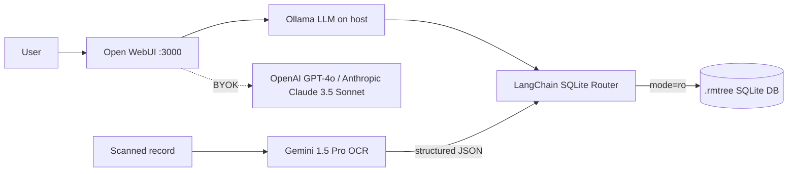

# Local AI Genealogy Tool

[](https://github.com/sodejm/AncestryLLM/actions/workflows/ci.yml)
[](LICENSE)
[](https://www.python.org/downloads/)

A local-first, privacy-preserving AI assistant for exploring **RootsMagic 11**
genealogy databases. It pairs a fully local large language model with an
optional cloud OCR pipeline so you can ask natural-language questions about your
family tree without ever exposing the underlying database to the network.

## Project Overview

This project is a **hybrid local-first architecture**. The reasoning and data
access run entirely on your machine; only optional cloud features use the network.

| Layer | Component | Role |
| --- | --- | --- |
| Inference | [Ollama](https://ollama.com) | Runs the local LLM natively on the host (GPU-accelerated). |
| Interface | [Open WebUI](https://github.com/open-webui/open-webui) | Chat UI served in a Docker container on port `3000`. |
| Data access | LangChain SQLite Router ([`tools/sql_router.py`](tools/sql_router.py)) | Routes questions to the correct `.rmtree` database in strict read-only mode. |
| Cloud OCR (optional) | Gemini 1.5 Pro ([`tools/gemini_transcription.py`](tools/gemini_transcription.py)) | Transcribes scanned records into structured JSON. |
| Orchestration | OS-aware bootstrapper ([`tools/bootstrap.py`](tools/bootstrap.py)) | Installs/starts Ollama and launches the container stack. |

The design goal is simple: **your genealogy data never leaves your computer**,
and the live database is never modified.

## System Architecture & Data Safety

### Local-first, with optional frontier models (BYOK)

The system is **local-first**: by default all inference runs through Ollama on
your own hardware, and the only optional cloud dependency is Gemini 1.5 Pro for
OCR of scanned records. No cloud account is required to use the core product.

For users who already hold active subscriptions, the stack also natively
supports **bring-your-own-key (BYOK)** access to frontier cloud models through
Open WebUI:

- **OpenAI — GPT-4o** via `OPENAI_API_KEY`.
- **Anthropic — Claude 3.5 Sonnet** via `ANTHROPIC_API_KEY`.

These keys are entirely optional. When left blank the container starts normally
and the project remains fully local-first; when provided, the corresponding
models appear as selectable options in the Open WebUI model picker.

### How RootsMagic 11 stores data

RootsMagic 11 `.rmtree` files are **standard SQLite databases**. Internally they
contain the relational tables that model a family tree, including:

- `PersonTable` — one row per individual in the tree.
- `NameTable` — names (primary and alternate) linked to each person.
- `EventTable` — life events such as births, marriages, and deaths.

Because a `.rmtree` file is just SQLite, it can be queried with ordinary SQL —
which is exactly what the LangChain SQLite Router does.

### Why read-only access is mandatory

A **live** RootsMagic database is extremely sensitive to improper writes. If a
second process opens the file with write intent while RootsMagic (or another
connection) holds it, or if a partial write occurs, SQLite can report:

```
sqlite3.DatabaseError: database disk image is malformed   (SQLite Error 11)
```

This **"malformed disk image"** corruption can render an entire family tree
unreadable. To eliminate this risk, the project **never** opens a `.rmtree` file
for writing.

This is enforced at two independent layers:

1. **Docker volume mount** — the `family_trees` directory is mounted strictly
   read-only with the `:ro` flag in [`docker-compose.yml`](docker-compose.yml):

   ```yaml
   volumes:
     - ${FAMILY_TREES_HOST_DIR:-./family_trees}:${FAMILY_TREES_DIR:-/app/backend/data/family_trees}:ro
   ```

2. **SQLite connection URI** — the router opens each database with the
   `mode=ro` immutable read-only URI parameter
   (`sqlite+pysqlite:///<path>?mode=ro&uri=true`), so even the application code
   is physically incapable of issuing a write.

Together these guarantee the original RootsMagic file is treated as immutable.

### Request flow



## Prerequisites

| Requirement | Notes |
| --- | --- |
| [Docker Desktop](https://www.docker.com/products/docker-desktop/) or [Colima](https://github.com/abiosoft/colima) | Runs the Open WebUI container and exposes Docker-compatible APIs. |
| [Homebrew](https://brew.sh) | macOS only — used by the bootstrapper to install and start Ollama. |
| Python **3.10+** | Required for the tooling (the codebase uses 3.10 union syntax). |
| [Ollama](https://ollama.com) | Installed automatically on macOS; install manually on Linux/Windows. |

> On Linux and Windows the bootstrapper assumes Ollama is provided through your
> own Docker Compose setup rather than Homebrew.

## Quickstart Guide

### Fastest Path (Recommended)

```bash
git clone https://github.com/sodejm/AncestryLLM.git local-ai-genealogy-tool
cd local-ai-genealogy-tool
make quickstart
```

This runs environment diagnostics, creates `.venv`, installs dependencies,
installs pre-commit hooks, creates `.env` from `.env.example` if needed, and
starts the stack. It also generates `WEBUI_SECRET_KEY` automatically when
missing so Open WebUI can boot under the read-only container policy. If admin
credentials are missing, quickstart bootstraps `admin@localhost` with a
generated one-time password and prompts you to rotate it after first login.

By default, WebUI is bound to `127.0.0.1:3000` (localhost-only). For hosted
deployments, use:

```bash
make quickstart-hosted
```

For a one-command setup that also installs missing system dependencies/services
(Homebrew/apt packages and a local Docker runtime where supported),
run:

```bash
make quickstart-auto-install
```

1. **Clone the repository**

   ```bash
   git clone <your-fork-url> local-ai-genealogy-tool
   cd local-ai-genealogy-tool
   ```

2. **Configure environment variables**

   Copy the template and add your Gemini API key (only needed for OCR):

   ```bash
   cp .env.example .env
   ```

   Then edit `.env` and set the paths you want to use locally. The defaults keep
   the current behavior, but `FAMILY_TREES_HOST_DIR` can point at any directory
   on your machine that already contains `.rmtree` files:

   ```dotenv
   OPEN_WEBUI_DATA_DIR=./open-webui-data
   FAMILY_TREES_HOST_DIR=/absolute/path/to/RootsMagic
   FAMILY_TREES_DIR=/app/backend/data/family_trees
   WEBUI_ADMIN_EMAIL=admin@localhost
   GEMINI_API_KEY=your-real-gemini-key
   ```

3. **(Optional) Unlock frontier cloud models (BYOK)**

   If you have active OpenAI or Anthropic subscriptions, paste your keys into
   `.env` **before** running the bootstrapper to enable GPT-4o and
   Claude 3.5 Sonnet inside Open WebUI. Leave them blank to stay fully
   local-first:

   ```dotenv
   OPENAI_API_KEY=your-openai-key
   ANTHROPIC_API_KEY=your-anthropic-key
   ```

4. **Add a family tree**

   Either keep using the default `family_trees/` directory, or point
   `FAMILY_TREES_HOST_DIR` at the directory where your RootsMagic files already
   live. If you stay with the default:

   ```bash
   cp /path/to/MyTree.rmtree family_trees/
   ```

   The configured RootsMagic directory is mounted read-only and is never
   modified.

5. **Bootstrap the stack**

   Create a virtual environment, install dependencies, and run the bootstrapper.
   On macOS this installs/starts Ollama via Homebrew, then launches the
   container stack with Docker Compose (`docker compose up -d`, with automatic
   fallback to `docker-compose up -d` when needed):

   ```bash
   python -m venv .venv
   source .venv/bin/activate          # Windows: .venv\Scripts\activate
   pip install -r requirements.txt
   python -m tools.bootstrap
   ```

6. **Open the Web UI**

   Visit **http://localhost:3000** and start asking questions about your tree.

### Useful Make Targets

```bash
make help       # list all tasks
make doctor     # validate prerequisites
make setup      # create venv + install deps
make dev-tools  # install language servers + recommended editor tooling
make dev-setup  # setup + hooks + dev-tools
make quickstart-auto-install  # quickstart + auto-install missing system deps
make quickstart-hosted  # expose WebUI on all network interfaces
make start      # run bootstrapper
make test       # run pytest --verbose
make security   # run semgrep, pip-audit, trivy, gitleaks
```

### Developer Tooling (Fresh Machine)

To provision development tooling on a clean machine:

```bash
make dev-setup
```

This installs project language servers (Python, Bash, YAML, Dockerfile, JSON,
SQL) from [`package.json`](package.json) and applies recommended VS Code
extensions when the `code` CLI is available.

## Configuration Reference

All settings are read from environment variables (see [`.env.example`](.env.example)):

| Variable | Default | Purpose |
| --- | --- | --- |
| `GEMINI_API_KEY` | _(empty)_ | API key for Gemini 1.5 Pro OCR. |
| `GEMINI_MODEL` | `gemini-1.5-pro` | Cloud OCR model name. |
| `OLLAMA_BASE_URL` | `http://host.docker.internal:11434` | URL the container uses to reach native Ollama. |
| `OLLAMA_MODEL` | `llama3.1` | Local model used by the SQL router. |
| `OLLAMA_NUM_CTX` | `8192` | Bounded context window to fit within a typical VRAM budget. |
| `SQL_AGENT_TOP_K` | `20` | Maximum rows the SQL agent may return per query. |
| `OPEN_WEBUI_DATA_DIR` | `./open-webui-data` | Host storage location for Open WebUI data. Keep the default local bind mount (gitignored), or set an absolute path outside the repo. |
| `WEBUI_SECRET_KEY` | _(generated by quickstart)_ | Secret used by Open WebUI session/security internals. Must be set when running the container read-only. |
| `WEBUI_ADMIN_EMAIL` | `admin@localhost` | First-run admin account identifier used when no users exist yet. |
| `WEBUI_ADMIN_PASSWORD` | _(generated by quickstart)_ | First-run admin password. Rotate immediately after initial sign-in. |
| `DEPLOYMENT_MODE` | `localhost` | `localhost` keeps `127.0.0.1:3000` binding; `hosted` applies `docker-compose.hosted.yml` and exposes `0.0.0.0:3000`. |
| `OLLAMA_BOOTSTRAP_MODELS` | `gemma4,llama3.1,qwen3,mistral` | Comma-separated models pulled during bootstrap so key local models are ready. |
| `FAMILY_TREES_HOST_DIR` | `./family_trees` | Host directory that contains your `.rmtree` files. Set an absolute path to read trees in place. |
| `FAMILY_TREES_DIR` | `/app/backend/data/family_trees` | Container mount point for RootsMagic files. Change only if you need a different in-container path. |
| `OPENAI_API_KEY` | _(empty)_ | Optional BYOK key to enable GPT-4o in Open WebUI. |
| `ANTHROPIC_API_KEY` | _(empty)_ | Optional BYOK key to enable Claude 3.5 Sonnet in Open WebUI. |

> Some runtime integrations are imported lazily and only required when used:
> `langchain-ollama` (local LLM) and `google-genai` (Gemini OCR). Both are
> declared in `requirements.txt` and installed by the standard setup.

## Running the Tests

```bash
source .venv/bin/activate
pip install -r requirements.txt
pytest --verbose
```

## Troubleshooting

### The container cannot reach `host.docker.internal`

- Confirm Ollama is running on the host: `ollama list` should respond.
- On Linux, `host.docker.internal` is not available by default. Add it to the
  service in `docker-compose.yml`:

  ```yaml
  extra_hosts:
    - "host.docker.internal:host-gateway"
  ```

- Verify the port: Ollama listens on `11434`. Test with
  `curl http://localhost:11434/api/tags`.

### macOS unified memory / GPU limitations

- Apple Silicon shares RAM and VRAM (unified memory). A large model plus a large
  context window can spill into host RAM and slow generation dramatically.
- Keep `OLLAMA_NUM_CTX` bounded (default `8192`) and choose a model that fits
  your memory budget (e.g. an 8B model for machines with 16–24 GB).
- If responses are sluggish, reduce the model size or lower `OLLAMA_NUM_CTX`.

### SQLite file permission locks or "malformed disk image"

- **Close RootsMagic** before querying. While the database is treated as
  read-only here, a live editor holding the file can still cause lock contention.
- Ensure the configured `.rmtree` file is readable by your user, for example:
  `chmod u+r /absolute/path/to/MyTree.rmtree`.
- If you ever see SQLite Error 11 (malformed disk image), restore the tree from a
  RootsMagic backup — this project never writes to the file, so corruption
  originates from the live editor or a copy made mid-write.

## License

Distributed under the MIT License. See [LICENSE](LICENSE) for details.

## Community

- Contribution guide: [CONTRIBUTING.md](CONTRIBUTING.md)
- Code of Conduct: [CODE_OF_CONDUCT.md](CODE_OF_CONDUCT.md)
- Security policy: [SECURITY.md](SECURITY.md)
