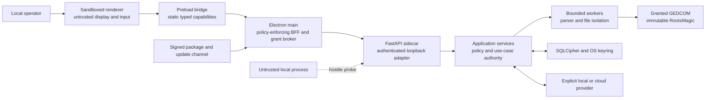

# ADR-0025: adopt a hardened Electron and FastAPI desktop architecture

- **Status:** Accepted
- **Date:** 2026-07-24
- **Decision owner:** Issue #98 (`EL-01`)
- **Scope:** Desktop product requirements, process boundaries, internal
  contracts, security gates, backlog reconciliation, and path ownership

## Context

AncestryLLM is a local-first Python application whose application services
already enforce immutable RootsMagic inputs, loss-minimizing GEDCOM handling,
SQLCipher storage, OS-keyring secrets, explicit provider consent, stable coded
errors, and a network-free `provider=none`. A desktop UI must reuse those
services without turning a compromised web renderer into a path to genealogy
records, credentials, the filesystem, provider clients, or arbitrary Python
execution.

Electron contains both a browser engine and a privileged Node.js main process.
The internal Python adapter adds a loopback HTTP boundary and a supervised
process. Neither "local" nor "desktop" makes those boundaries trusted: renderer
content can be compromised, another local process can probe loopback, imported
files and model output are hostile input, and build or update artifacts can be
replaced.

The security baseline is:

- [OWASP Top 10:2025](https://owasp.org/Top10/) for risk awareness;
- [OWASP ASVS 5.0.0](https://github.com/OWASP/ASVS/tree/v5.0.0_release) as a
  versioned source of testable application-security requirements;
- [NIST SP 800-218, Secure Software Development Framework 1.1](https://csrc.nist.gov/pubs/sp/800/218/final)
  for the secure-development lifecycle; and
- the [Electron security checklist](https://www.electronjs.org/docs/latest/tutorial/security)
  for framework-specific hardening.

The traceable control, threat, abuse-case, and risk ledgers are in
[the threat model](THREAT_MODEL.md). This ADR decides the architecture those
ledgers protect.

## Decision

Build a cross-platform Electron application whose renderer communicates through
a narrow typed preload bridge to an Electron main-process backend-for-frontend.
Electron main alone supervises and authenticates an internal FastAPI sidecar.
FastAPI is an adapter over existing transport-neutral Python application
services, never a wrapper around CLI or console subprocesses.

The internal API is not a supported public API, browser endpoint, LAN service,
or compatibility commitment to third parties. The renderer gets no direct
filesystem, network, keyring, provider, database, shell, Electron, or Node.js
capability.

### Version 0.5.0 implemented shell profile

This ADR defines the broader accepted desktop target architecture. The
implemented 0.5.0 profile is intentionally narrower: Home, Diagnostics, a
sanitized capability summary, and local visual Settings only. It has no
genealogy, file or folder, GEDCOM or RootsMagic, job, chat, provider or
credential, cloud or account, domain-dispatch, updater, or background-channel
surface. See the [desktop shell guide](explanation/DESKTOP_SHELL.md) for the supported
surface and recovery contract.

The 0.5.0 preload bridge exposes exactly `getAppInfo`,
`getStartupDiagnostics`, `getCapabilities`, `retrySidecar`, `getPreferences`,
and `updatePreferences`. The renderer never receives the sidecar port, bearer,
endpoint, executable or preference-file path, stderr, raw sidecar or bridge
errors, or stack traces. Electron main is the sole authenticated sidecar
client. Main reauthorizes the exact registered `WebContents`, current main
frame, and trusted application URL on every call; validates strict schemas and
structured-clone bounds in both directions; and owns fixed concurrency, queue,
coalescing, deadline, cancellation, and lifecycle-cleanup limits. There is no
renderer-selected channel or endpoint. Saturation, timeout, cancellation, and
internal failure cross the bridge only as stable redacted error codes.

Supported 0.5.0 distribution uses manually installed installers after the
platform-specific release gates pass. The official 0.x release workflow
requires unsigned project-produced release binaries and an unsigned annotated
release tag; full production/trusted signing is not used until the first full version
release, v1.0.0. Release notes and evidence disclose the mode and warn that the
OS may report an unknown publisher. There is no updater, update feed,
background update channel, or staged rollout in this version.

### Target desktop product requirements

- Launch is local and uses **no in-app authentication**. The signed-in OS user
  is the operator; that assumption does not authorize renderer or loopback
  clients.
- First launch and ordinary local workflows work with `provider=none`.
  Credentials or installed SDKs never select a remote provider automatically.
- Sidecar, database, keyring, or optional-module failure opens an **accessible
  degraded diagnostics** route. Recovery information remains keyboard and
  screen-reader accessible, does not depend on color, and discloses no secret,
  record, prompt, response, unrestricted path, port, or bearer value.
- Every remote disclosure is preceded by provider, model, purpose, data-class,
  retention, and consent decisions enforced by Python policy.
- RootsMagic inputs remain immutable. GEDCOM and backup publications remain
  atomic and loss behavior remains visible.

### Target MVP navigation and capability language

MVP navigation is driven by a typed `CapabilityManifest`, not by renderer
probing of databases, keyrings, providers, files, or networks:

| Route | MVP purpose | Capability presentation |
|---|---|---|
| Home | Local status, recent fictional-safe activity summaries, and next actions. | Local by default. |
| Chat | Explicit-provider sessions with visible consent, retention, and streaming state. | Remote badge when a cloud provider is selected; local badge for approved loopback models. |
| GEDCOM | Intake, inspect, validate, merge, quality, incremental update, and artifact review through opaque grants. | Sensitive-file badge; destructive styling only for operations that replace an app-owned output. |
| Tasks | Bounded progress, cancellation, coded failures, and granted output artifacts. | Local/remote and sensitive labels inherited from each task. |
| Settings and privacy | Provider profiles, consent, secret presence, budgets, and retention. | Sensitive controls; secret values are write-only. |
| Diagnostics | Fail-closed health, recovery steps, and privacy-minimal support evidence. | Accessible degraded state; never exposes bootstrap material. |

Capability distinctions use text and icons as well as color:

- **Local** means the operation is designed to open no network connection.
- **Remote** names the selected provider and requires applicable consent.
- **Sensitive** means private data, secret presence, a grant, or retention is
  involved; it does not imply that the renderer receives the protected value.
- **Destructive** is reserved for an authorized mutation of app-owned state or
  replacement of a staged output and requires explicit confirmation, scope,
  and recovery consequences.
- **Post-MVP** capabilities are shown only as non-interactive "Planned" content
  when product context requires it. They are absent from dispatch and cannot
  be enabled through renderer state.

The target MVP contains the secure application shell, diagnostics,
settings/consent, chat, task handling, and GEDCOM workflows. Existing-module
desktop parity may follow. Retrieval, full family-tree editing/writeback,
executable plugins, third-party UI code, and general-purpose network access are
Post-MVP and require their own renewed architecture-risk gate.

## Process and trust-boundary inventory

| Process or boundary | Authority | Must not do |
|---|---|---|
| **Sandboxed renderer** | Present DTOs, collect input, and request one declared bridge operation. | Import Node types/modules, open sockets, read paths/secrets, dynamically choose IPC, render raw HTML, or enforce security policy. |
| **Preload bridge** | Expose frozen, static, asynchronous methods with runtime validation and bounded payloads. | Export `ipcRenderer`, generic send/listen, Electron objects, synchronous IPC, dynamic channels, unrestricted event listeners, or raw bootstrap values. |
| **Electron main** | Create hardened windows, validate IPC sender/frame/origin, mediate file grants, proxy an endpoint allowlist, supervise the sidecar, and verify packages/updates. | Parse genealogy files, store provider secrets, run renderer-supplied commands, expose the sidecar port/token, follow redirects, or become a second business-service layer. |
| **FastAPI sidecar** | Authenticate before body parsing, validate versioned DTOs, apply limits, map stable errors, and call application services. | Bind publicly, trust proxy/browser headers, enable CORS/cookies/package docs, import console presentation, execute arbitrary command names, or serialize arbitrary exceptions. |
| **Application services** | Enforce provider, consent, storage, genealogy, file, and stable-error policy. | Depend on Electron, React, FastAPI request objects, or console presentation. |
| **Bounded workers** | Parse or transform granted files with resource, cancellation, and publication limits. | Receive unrestricted renderer paths, mutate sources, inherit credentials, make provider calls, or publish partial outputs. |

The renderer is assumed compromised. The sidecar loopback listener is assumed
reachable by other processes running as the user. Imported genealogy data,
provider output, Markdown, plugin packages, update metadata, and file paths are
untrusted even when they originated locally.

## Hardened runtime decisions

### Electron

- Serve only packaged assets from a standard secure `app://` protocol backed by
  a fixed route/MIME manifest; reject traversal, unknown assets, service
  workers, and CSP bypass.
- Call `app.enableSandbox()` before readiness. Every window explicitly uses
  `contextIsolation: true`, `nodeIntegration: false`, `sandbox: true`,
  `webSecurity: true`, and `webviewTag: false`.
- Production CSP defaults to:
  `default-src 'none'; script-src 'self'; style-src 'self' 'unsafe-inline'; img-src 'self'; font-src 'self'; connect-src 'none'; object-src 'none'; frame-src 'none'; base-uri 'none'; form-action 'none'`.
- Deny unexpected navigation, new windows, permissions, downloads, remote
  content, and packaged developer tools. A dedicated main-process operation may
  open an allowlisted `https:` destination only after explicit user intent and
  displays the destination first. It is not a general renderer bridge method;
  any renderer-facing link workflow requires a separately reviewed bounded
  contract.
- Render provider Markdown through an AST allowlist with raw HTML and images
  disabled. Never use `dangerouslySetInnerHTML`.
- Disable Electron features and fuses that expose Node execution or inspection;
  enable ASAR integrity and only-load-from-ASAR where supported. Packaged tests
  verify the actual fuse and window state. The desktop security gate inspects
  the built `app.asar`, all eight declared fuses, and supported integrity
  metadata rather than trusting build configuration alone.

### Sidecar and internal API

- Package a Python sidecar with a deterministic, target/build-specific full
  payload manifest bound to the built Electron main by an embedded digest.
  Verify it before token generation or process spawn. This detects payload
  substitution relative to that main process; it is not publisher signing or
  whole-bundle protection. Project-produced 0.x binaries remain unsigned, and
  Issue #132 owns publisher signing and notarization.
- Spawn the sidecar directly with no shell, a minimal allowlisted environment,
  an isolated working directory, and no inherited provider secrets in packaged
  mode. Verification and spawn are separate filesystem operations, leaving a
  narrow local time-of-check/time-of-use replacement residual.
- Bind one worker to `127.0.0.1` on an OS-selected ephemeral port. Supply a
  fresh 256-bit per-launch bearer through a private stdin frame, never through
  arguments, environment, files, logs, or the renderer.
- Authenticate every route, including health and shutdown, in constant time
  before parsing a request body. Reject unexpected `Host`, `Origin`, `Cookie`,
  forwarding headers, content type, version, route, redirect, or size.
- Keep API docs and runtime OpenAPI routes disabled in packaged builds. Commit a
  deterministic OpenAPI 3.1.0 artifact, explicitly pinned at the application
  factory rather than inherited from FastAPI defaults, for TypeScript types,
  validators, mocks, and contract-drift tests.
- Use a token-derived readiness proof and exact app/sidecar build and protocol
  handshake. Keep the port and bearer only in Electron main memory. Disable
  access logs and use privacy-minimal structural stderr.
- Terminate the full isolated POSIX process group or Windows process tree with
  bounded graceful/forced escalation and fail closed when termination cannot be
  verified. The current lifespan drains the Uvicorn listener/server, stdio,
  process tree, temporary launch directory, and Issue #104's application job
  admission, cooperative cancellation or bounded wait, and encrypted event
  repository. Future provider streams and other database sessions must register
  their own drains before their routes ship.

## Internal contract principles

All cross-process data is a versioned, serializable DTO with strict unknown-field
rejection, explicit byte/item/depth limits, and no secret, arbitrary path,
framework object, or executable content. Python schemas are authoritative;
generated TypeScript and fictional mock fixtures must match the committed
OpenAPI artifact exactly.

| Contract | Principle |
|---|---|
| `ApiVersion` | The initial namespace is `/api/v1`. Main sends an exact supported contract version and build identity. Unsupported versions fail closed. |
| `CapabilityManifest` | Lists available built-in capabilities and safe presentation metadata without probing private resources. It is availability metadata, not authorization. |
| `ErrorEnvelope` | Contains stable code, sanitized message, optional remediation, correlation identifier, and allowlisted non-sensitive details. Raw exceptions and tracebacks never cross the boundary. |
| `FileGrant` | Opaque, high-entropy, window-scoped, operation-scoped, expiring, revocable identifier created by a native dialog. It never contains or reveals an unrestricted path. |
| `EventEnvelope` | Carries job ID, event ID, monotonic sequence, kind, bounded typed payload, and terminal state. Consumers acknowledge progress; gaps, duplicates, backpressure, cancellation, reload, and shutdown have explicit semantics. |
| `SecretMutation` | Supports set, delete, and presence only. The Python `SecretStore` and OS keyring remain the sole secret authority; no DTO can retrieve a secret value. |
| `PluginPackageManifest` | Post-MVP signed declarative metadata only. Known UI slots/actions and permission declarations do not grant execution. |
| `UpdateManifest` | Signed, expiring metadata binds platform, app and sidecar versions, hashes, sizes, key identity, and monotonic rollback state. |

`/api/v1` is internal but versioned deliberately. Additive fields require
consumer tolerance only where the schema explicitly permits them. A breaking
change creates a new namespace and coordinated main, sidecar, generated-client,
mock, migration, and rollback plan. A version is removed only after every
supported packaged application using it is outside the support window. There
is no public compatibility promise and no renderer-configurable API URL.

Issue #104 implements this event contract in the UI-neutral Python application
layer with strict schema-v1 snapshots, bounded SQLCipher persistence and replay,
increasing per-job sequences, cooperative safe-point cancellation, and exactly
one terminal result after ordinary completion or restart reconciliation. Fixed
authenticated list, status, cancel, SSE, and shutdown-assessment routes adapt
that lifecycle. Electron main alone calls shutdown assessment and presents the
native **Wait**, **Request cancellation**, or **Stay open** choice.

Issue #109 separately implements the target Tasks presentation through five
fixed request methods and one validated event listener. Main owns the
authenticated SSE connection and sender-scoped subscription lifecycle; the
renderer reconstructs state from backend snapshots after reload, resynchronizes
on event gaps, and receives path-free artifact metadata only. It adds no job
producer, submission route, direct artifact action, provider stream, GEDCOM or
RootsMagic operation, or other domain authority.

File payloads are not copied wholesale through JSON or IPC. Electron main
resolves a grant to a path only for the declared operation; Python rechecks
regular-file type, realpath/fingerprint, size, source/output aliasing, and
immutability at use time. Large parsing and publication occur in bounded
workers and app-owned scratch/output locations.

## Secure-development and assurance gates

The issue/control ledger in `THREAT_MODEL.md` is part of the change contract:

1. Translate behavior and abuse cases into negative tests before privileged
   implementation.
2. Review cross-boundary designs and map them to OWASP Top 10:2025, applicable
   OWASP ASVS 5.0.0 requirements, and NIST SP 800-218 practices.
3. Run formatting, lint, strict type checking, unit/contract/integration tests,
   Semgrep, CodeQL for Python and JavaScript/TypeScript, secret scanning,
   dependency audit, lockfile review, and SBOM generation as applicable.
4. Verify packaged behavior, not configuration text alone: window preferences,
   CSP, fuses, sidecar binding/authentication, no-source-map/no-remote-asset
   output, package signatures, manifests, and updater failure modes.
5. Record every finding as fixed, false positive with evidence, or accepted
   residual risk with owner, independent reviewer, compensating control, review
   date, and expiry. Critical/high findings cannot be accepted for an affected
   gate.

Passing scanners is evidence for named controls, not proof that vulnerabilities
are absent. Manual threat review and adversarial tests remain required.

## Backlog reconciliation

Do not create a competing public API, UI epic, plugin lifecycle, retrieval, or
editing issue. The existing issue is retained or expanded as follows:

| Existing issue | Binding disposition |
|---|---|
| #11 | Expanded as `EL-03`, the internal FastAPI/OpenAPI foundation. It is not a public API and does not run CLI subprocesses. |
| #16 | Expanded as `EL-29`, the signed declarative plugin-package lifecycle. Execution and UI are separate gated issues. |
| #18 | Remains the design gate for Post-MVP tree editing/writeback. RootsMagic remains immutable unless that gate is approved. |
| #19 | Remains the release-evidence prerequisite; desktop evidence extends rather than replaces it. |
| #39 and #41 | Preserve transport-neutral REPL and command-specification contracts; verify or narrow completed scope. They do not block desktop scaffolding. |
| #43 | Owns remaining transport-neutral result/progress gaps. Desktop event DTOs adapt rather than duplicate those semantics. |
| #45 | Owns Rich terminal presentation only. React never imports or serializes Rich objects. |
| #52 | Closed by merged PR #97 and retained as prior art for progress lifecycle; do not reopen or duplicate it. |
| #60 | Remains gated on its REPL prerequisites and is not an Electron dependency. |

The foundation sequence is:

| Catalog ID / issue | Responsibility | Start gate |
|---|---|---|
| `EL-01` / #98 | This ADR, threat/control/risk ledgers, scope, overlap, and ownership. | None. |
| `EL-02` / #99 | Reproducible desktop workspace, strict TypeScript, accessible shell, and deterministic mock bridge. | #98 merged. |
| `EL-03` / #11 | Authenticated internal API bootstrap and deterministic OpenAPI contract. | #98 merged. |
| `EL-04` / #102 | Manifest-bound sidecar packaging, private bootstrap, supervision, and full-process-tree shutdown. Publisher signing remains owned by #132. | #11 merged. |
| `EL-05` / #100 | Electron sandbox, CSP, protocol, navigation, permissions, and fuse policy. | #98 and #99 merged. |
| `EL-06` / #101 | Typed context bridge and main-process API proxy. | #99, #11, #102, and #100 merged. |
| `EL-07` / #103 | Opaque grants and bounded file mediation. | Privileged bridge/runtime prerequisites merged. |
| `EL-08` / #104 | Jobs, bounded events, backpressure, cancellation, and safe shutdown. | Source implementation adds the UI-neutral lifecycle, encrypted persistence, fixed authenticated routes, and main-only shutdown preflight; packaged/provider-worker evidence remains with #111/#131. |
| `EL-09` / #105 | Atomic settings and write-only OS-keyring operations. Source API, fixed bridge, status-only mock, and renderer controls implemented; packaged-runtime proof remains with #131. | Internal API and bridge prerequisites merged. |
| `EL-10` / #106 | Responsive accessible design-system shell and presentation-only interaction contracts. | Renderer foundation and fixed bridge prerequisites merged. |
| `EL-13` / #109 | Bounded Tasks presentation, main-owned event subscriptions, cancellation UX, coded failures, and safe artifact metadata. | #103, #104, and #106 merged; packaged and adversarial evidence remains #131. |
| `EL-36` / #131 | Desktop contract, security, accessibility, E2E, and performance evidence. | Begins with #99/#11; gates the MVP. |

## Exclusive ownership and coordination

| Path or shared surface | Exclusive owner |
|---|---|
| `desktop/` package manifest, lockfile, build/test configuration, initial root Make targets | #99 (`EL-02`) until scaffolding merges; later renderer, preload, main, and contract subtrees follow their published issue ownership. |
| `desktop/src/renderer/src/design-system/`, shell integration, and fictional development gallery | #106 (`EL-10`). |
| `src/ancestryllm/api/`, FastAPI dependencies, deterministic OpenAPI artifact | #11 (`EL-03`) for foundation; later domain routers stay with their published issues. |
| `pyproject.toml` and `uv.lock` | The issue introducing the Python dependency, coordinated serially; #11 owns initial FastAPI/Uvicorn additions. |
| Root JavaScript dependency and lock files | Not permitted. `desktop/pnpm-lock.yaml` is the sole JavaScript lockfile and #99 owns it initially. |
| GitHub workflows | The issue explicitly assigned a CI/release change; shared edits are coordinated and never copied across worktrees. |
| Root `Makefile` | #99 owns initial desktop delegation targets; later edits require coordinator review. |
| Architecture and security documents: `ARCHITECTURE.md`, this ADR, `THREAT_MODEL.md`, privacy, contributor, and desktop backlog decisions | #98 (`EL-01`) for ratification; later boundary changes update them in the owning issue. |

Each implementation issue uses one `feature/*`, `bugfix/*`, or `hotfix/*`
branch/worktree based on current `origin/main` after its hard dependencies
merge. Work outside exclusive ownership is a
coordinated change request, not an opportunistic edit. A resumable issue
checkpoint records baseline, branch/worktree, changed files, validation,
blocker, and exactly one next action without private data or bootstrap values.

## Rejected alternatives

- Public or LAN API, browser clients, fixed/default credentials, cookies, CORS,
  proxy trust, public docs, or renderer-configurable endpoints.
- Renderer Node integration, network, filesystem, keyring, provider or database
  access; generic/dynamic/synchronous IPC; remote pages; `<webview>`; raw HTML;
  renderer plugins; or security policy enforced only in React.
- Duplicate secret stores, localStorage/IndexedDB secrets, `.env` auto-loading,
  bootstrap values in environment/arguments/files/logs, or secret-read DTOs.
- Direct CLI subprocess execution, console imports in the API, arbitrary
  command names, loose request dictionaries, or raw exception serialization.
- Source-file mutation, renderer/main GEDCOM parsing, whole-file IPC, unbounded
  reads, partial publication, or trusting a filename extension.
- Executable plugin code in renderer/main/Python, dynamic imports, unsigned
  packages or updates, mutable releases, payload telemetry, or security
  requirements deferred until implementation is complete.

## Consequences

The architecture adds process and contract complexity, coordinated versioning,
packaged negative tests, and explicit issue ordering. In return, a renderer
compromise does not automatically inherit Node, Python, filesystem, keyring, or
provider authority; local-only behavior remains testable; and security
requirements become reviewable gates rather than release-time aspirations.

The next implementation issue should prove the development workflow and mock
contract without weakening these boundaries. The internal API and runtime
hardening can then proceed in separate, reviewable branches.
