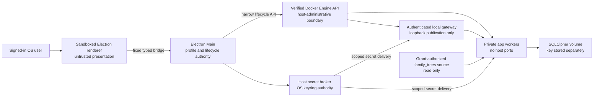
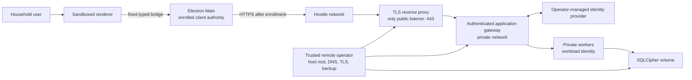

# ADR-0026: Local-first container and advanced remote deployment profiles

- Status: Accepted architecture; profile control, host control, macOS arm64 runtime-tool management, and probe-only OCI topology implemented; application-runtime gates remain open
- Date: 2026-08-09
- Decision owner: AncestryLLM maintainer
- Supersedes: no prior ADR
- Extends: [ADR-0025](ADR-0025-electron-fastapi-desktop.md)
- Security record: [data-flow threat model](THREAT_MODEL.md)

## Context and decision boundary

AncestryLLM is local-first, single-household genealogy software. ADR-0025
accepted Electron as a UI-only desktop adapter over a private authenticated
FastAPI sidecar. Issue #346 asks whether later releases may reuse that service
surface in containers and, only after an explicit operator decision, across a
remote boundary.

This ADR accepts the target architecture. Unreleased Issue #347 implements the
shared, non-secret deployment-profile control plane: the schema, Local Desktop
default, reviewed mode copy, explicit previews, confirmation-bound local
recovery, diagnostics, and redacted backup/support metadata. Issue #363 adds a
host-only minimum container-control foundation inside Electron Main, with an
exact policy and plan, app-owned Docker selection, bounded lifecycle commands,
and owned-resource reconciliation. Issue #348 adds a narrow status, review, and
apply surface for policy-bound acquisition and lifecycle of an app-owned macOS
arm64 Colima/Lima and Docker tool substrate. No Docker socket, executable,
arbitrary command, or ambient context crosses into the renderer or a container,
and the manager remains disconnected from profile activation, secret brokering,
and genealogy services. Issue #349 adds production-shaped gateway and worker
images plus a two-service Compose model strictly for probe and lifecycle
validation. That topology exposes only authenticated health and capability
probes, publishes no host port, loads no provider or genealogy workload, keeps
the placeholder data volume read-only, and disables schema migration. The
current release still has no supported workload-capable application container,
LAN, public, browser, or remote application runtime. Each non-local profile remains
unavailable until its linked issues, threat-model gates, native-platform
evidence, operator documentation, and release decision pass. In particular,
accepting Host Remote does not make the current internal API public and does
not approve a multi-user service.

## Decision

Three explicit deployment intents are accepted:

1. **Local Desktop** is the default. Electron Main owns a local backend and the
   renderer stays a sandboxed presentation process. No non-loopback listener is
   opened. A future container implementation may replace the native sidecar,
   but it must preserve the same application contracts, privacy policy, and
   local-only behavior.
2. **Connect Remote** is an advanced desktop-client mode. A user deliberately
   enrolls the desktop with one pre-existing, HTTPS remote deployment. Profile
   switching is transactional and never inferred from environment variables,
   Docker availability, a discovered endpoint, or stale state.
3. **Host Remote** is an advanced, self-supported operator mode for one trusted
   household. The operator separately provisions the host, DNS, TLS edge,
   identity provider, firewall, backups, upgrades, and recovery. Only the TLS
   gateway is public. Internal application services remain private and
   authenticated.

Issue #347 persists those intents as a versioned configuration contract shared
by CLI, future desktop first-run/settings UI, diagnostics, upgrades, backup
metadata, and support evidence. A profile switch never starts a runtime, opens
a listener, discovers a server, moves a family tree, or migrates data. The
current executor can safely retain or recover Local Desktop; Connect Remote and
Host Remote activation fail closed until their enrollment and host-setup
authorities exist.

Issue #363 establishes the minimum host-only control interface required by
#348 and #349. Its closed schema-v1 policy binds Darwin arm64 to an app-owned
runtime profile, Docker context, Unix socket, configuration directory, working
directory, Engine identity and compatibility range, and exact Compose resource
labels. Before and after a lifecycle command, Main revalidates the socket's
canonical identity, owner, mode, device and inode, the selected endpoint, and
the Engine identity. It ignores ambient Docker selection and runs only fixed,
bounded, no-shell commands with a minimal environment. Start, repair, and both
uninstall choices require operation-bound authorization; stop is bounded but
non-destructive. The accepted plan requires immutable image digests, a non-root
user, a read-only root filesystem, all capabilities dropped,
`no-new-privileges`, named volumes, internal networks, and loopback-only ports.
Only exact app-owned resources may be reconciled. Neither the renderer nor any
container receives the socket, context, executable, generic process authority,
or a supervisor bridge. Issue #348 uses this boundary to select, verify,
install, and manage only the app-owned macOS arm64 runtime-tool substrate. It
does not render an application image, broker secrets, grant family-tree
sources, migrate storage, activate a profile, or expose an application route.

Issue #349 establishes the first production-shaped OCI and Compose validation
surface without activating a deployment profile. The gateway and optional
worker images share a minimal locked application environment, run as UID 65532,
use read-only roots, drop all capabilities, forbid privilege escalation, and
apply explicit CPU, memory, PID, log, startup, and shutdown bounds. The Compose
model permits exactly one internal network, one read-only named data volume,
and memory-backed runtime state. It publishes no host port and admits no host
path, Docker socket, provider credential, genealogy record, database
initialization, or migration command. The gateway's only routes are
authenticated health and capability probes; the worker is dormant unless its
validation profile is explicitly selected. Native Linux amd64 and arm64 builds
exercise exact image digests without QEMU and produce a closed schema-v1
inventory of every Python and Debian runtime package, version, architecture,
license identity, and copyright digest. This is evidence for the image and
topology shell only. Issues #350 and #351 still own workload authentication,
secret delivery, writable encrypted storage, migrations, and application
activation; #353 owns publication provenance.

The native macOS arm64 evidence record exercises the #363 subset against an
isolated Colima profile and app-owned context, including start, stop, repair,
preserving uninstall, deleting uninstall, conflict rejection, and cleanup:
[`issue-363-macos-arm64-container-supervisor.json`](release-evidence/issue-363-macos-arm64-container-supervisor.json).
It establishes the #363 lifecycle subset but predates #348's policy-bound
acquisition implementation. Neither source surface satisfies the remaining
`G5` or `G7` application-image, secret, storage, workload, quantitative-budget,
packaged-release, or cross-platform gates.

The offline invariant is stronger than a provider-egress restriction:
`provider=none` is incompatible with Connect Remote and Host Remote. Selecting
it forces Local Desktop/local execution, rejects remote-profile activation,
and opens no network socket even when remote endpoints or ambient credentials
exist. Remote use requires a separate explicit profile and may never claim or
silently translate `provider=none`. It selects the socket-free native
application-service path and does not start the container backend, host
supervisor, Engine API, gateway, workers, or any container. The Local Desktop
container subprofile is therefore unavailable while `provider=none` is active.

Docker Engine API compatibility and Docker Compose are the portable container
contract. On macOS arm64 the open-source default is Colima/Lima with a
Docker-compatible Engine API and Compose. Docker Desktop is an optional,
separately selected and separately licensed runtime; it is neither bundled nor
the default. Linux and Windows support require their own native validation and
documented runtime choice before a release claim.

Electron, FastAPI, Uvicorn, SQLCipher, OS keyring integration, transport-neutral
application contracts, and the existing `CommandInvocation`/`CommandExecutor`
boundary remain the preferred components. A new UI command registry, generic
command endpoint, renderer networking path, or duplicated domain policy is
prohibited.

## Architecture and trust boundaries

### Local Desktop

The Engine API is root-equivalent host authority even when the daemon runs
inside a VM. Electron Main may invoke only a narrow, identity-verified lifecycle
surface. Neither renderer nor containers receive the Docker socket, a generic
Docker proxy, client certificates, SSH context, or arbitrary build, exec, copy,
mount, device, or volume authority. Application containers run non-root, drop
capabilities, use read-only filesystems where practical, have bounded resources
and logs, and mount only application-owned paths. The one source-data exception
is an allowlisted read-only `family_trees` mount. Electron Main must first
resolve an opaque native-dialog grant through the host supervisor, which
canonicalizes and revalidates the immutable source before rendering that exact
mount into Compose. The renderer receives only the grant ID, never the path.
Compose validation rejects writable, broad, ungranted, aliased, or additional
host mounts, and only the worker that performs the authorized operation may
receive the source mount.

Local Desktop publishes exactly one authenticated loopback gateway and no
worker, database, administration, or Docker endpoint. Network membership is
never identity: every sensitive service route authenticates a workload or user
credential before parsing a body. `provider=none` remains network-free and
cannot be combined with a remote profile. Under `provider=none`, this
socket-backed container topology is not started; the native application-service
path handles the authorized local operation directly.

### Connect Remote and Host Remote

Host Remote cannot start unless preflight validates TLS, the exact public
origin, trusted proxy sources, OIDC issuer and audience, redirect and callback
ownership, PKCE/state/nonce, hardened sessions, CSRF defenses, rate limits,
default-deny route authorization, administrative reauthentication, recovery,
and clock bounds. No anonymous health, schema, documentation, bootstrap, setup,
or internal service route is public. Enrollment is explicit, bound to the
server/user/client/profile, short-lived, and single-use.

Host Remote v1 has exactly one authorized household principal. The configured
OIDC issuer, audience, and subject identify that principal; every other OIDC
subject is rejected before route or object access. Administrative actions
require fresh authentication by that same principal. Multiple people are not
represented as separately authorized users, and credential sharing is not a
multi-user authorization model. Supporting another principal requires a new
ADR and authorization threat model.

The remote operator is a trusted data custodian. Host root or control of the
container runtime can observe application memory, keys during use, plaintext
records, and backups. Containers are a defense-in-depth boundary, not a defense
against a malicious or compromised operator. Host Remote is not multi-tenant;
unrelated or mutually distrusting households require separate hosts, secrets,
volumes, and identity realms.

### Renderer invariants in every profile

The renderer receives **no**:

- Node.js or Electron objects;
- filesystem, database, keyring, shell, process, or Docker capability;
- raw network, socket, URL-fetching, or browser-authentication authority;
- Docker socket, client credentials, context, or enrollment bootstrap material;
- API bearer, session secret, SQLCipher key, provider secret, or secret value;
- unrestricted path, raw stderr, stack, or sensitive support data.

Only a fixed, versioned, typed preload bridge may cross into Electron Main.
Main owns endpoint selection, certificate validation, enrollment, API calls,
profile state, supervision, and error sanitization. Switching profiles clears
all endpoint-specific session and capability state before the new profile is
committed; a failed transition rolls back without starting a listener or
mutating data.

## Ownership and lifecycle

| Concern | Local Desktop owner | Host Remote owner | Required behavior |
|---|---|---|---|
| Intent and consent | Electron Main plus signed-in OS user | Operator explicitly enables hosting; each client explicitly enrolls | Default to Local Desktop; never infer or auto-migrate a profile. |
| Runtime bootstrap | Host supervisor | Operator | Verify engine identity/version and the rendered Compose model before use. |
| Images and configuration | Release tooling and host supervisor | Operator using project release metadata | Pull by immutable digest; verify platform, SBOM, provenance, and configuration policy. |
| Start/readiness | Host supervisor | Operator runbook | Start private networks and services in dependency order; readiness proves authenticated service identity, not merely an open port. |
| Secrets | OS keyring and narrow host broker | Operator-approved secret file/manager and narrow delivery path | Containers do not query the desktop keyring; delivery uses non-pageable or locked no-swap memory, or a no-swap memory-backed filesystem with equivalent platform evidence. No plaintext fallback, Compose value, image, environment, argument, log, swap, or renderer readback is allowed. |
| Database and migrations | Application services over SQLCipher volume | Same application services; operator schedules maintenance | One active backend; staged migration; integrity check; atomic rollback before reporting ready. |
| Backup and restore | Desktop workflow and user-selected separate destination | Operator | Keep keys separate; verify a cross-container restore before release/upgrade; never treat a live volume snapshot alone as a backup. |
| Upgrade and rollback | Host supervisor after informed approval | Operator | Preserve the previous trusted version and recoverable data; no silent channel switch or downgrade. |
| Stop, repair, uninstall | Host supervisor; destructive action requires confirmation | Operator | Bounded graceful stop, orphan reconciliation by exact project labels, and explicit preserve/export/delete choices. Never delete unrelated resources. |
| Monitoring and support | Privacy-minimal local diagnostics | Operator monitoring; project provides self-support docs only | No payload/access logging by default; support artifacts contain no genealogy data, secrets, tokens, raw paths, or container output. |

Remote mode carries no project-operated hosting, uptime, incident-response, or
backup SLA. The project may supply a validated Compose model and self-service
runbooks. The operator owns host hardening, capacity, availability, certificates,
identity availability, vulnerability response, backups, and disaster recovery.

## Component and license policy

| Component | Role | License/support decision |
|---|---|---|
| Electron | Desktop Main, preload, and renderer | MIT; project-packaged and lifecycle-owned. |
| Bundled Chromium and Node.js | Electron runtime internals, never renderer authority | Chromium BSD-style plus third-party notices; Node.js MIT; versions follow the supported Electron release. |
| Python | Application runtime | PSF-2.0; project-packaged and pinned. |
| FastAPI / Uvicorn | Transport adapter and ASGI server | MIT / BSD-3-Clause; private gateway by default. |
| SQLCipher / keyring | Encrypted workspace and host secret integration | BSD-style / MIT; keys remain separate from database data. |
| Docker Engine (Moby) / Compose | Portable runtime API and declarative topology | Apache-2.0; supported API/version range must be pinned and tested. |
| Colima / Lima | Open-source macOS arm64 runtime default | MIT / Apache-2.0; selected or installed separately, not silently bundled. |
| Docker Desktop | Optional runtime | Proprietary/commercial terms; user selects and licenses it separately; never bundled or required by default. |
| TLS edge / OIDC provider | Remote ingress and identity | No implementation selected by this ADR. The first supported reference stack must pin, license-inventory, threat-model, and lifecycle-own its choice; a materially new platform requires a measured ADR. |
| OCI registry | Artifact distribution | Release-maintainer controlled metadata; images are consumed by digest, not mutable tag. |

Exact versions, transitive notices, supported lifetimes, hashes/digests, and
license files are release evidence derived from lockfiles and SBOMs. The table
does not replace that evidence or grant permission to redistribute a component.

## Quantitative acceptance budgets

These are fail-closed release budgets measured on every supported native host
and architecture. Virtualization or emulation evidence must be labeled and does
not substitute for native support.

| Budget | Limit | Verification method |
|---|---|---|
| Local cold readiness | p95 at or below 60 seconds across 10 clean launches | Time from user launch through engine verification, service start, migration check, and authenticated capability response on the minimum supported host. |
| Local warm/reconnect readiness | p95 at or below 15 seconds across 10 launches | Reuse an already-running healthy runtime; still authenticate and verify version/identity. |
| Connect Remote readiness | p95 at or below 10 seconds, excluding interactive identity-provider time | Time endpoint validation and authenticated capability response for 10 trials over the documented reference network. |
| Graceful shutdown | at or below 20 seconds before a coded recovery state | Verify bounded stop, child cleanup, and restart recovery after normal, stalled, and interrupted shutdown. |
| Idle application memory | Electron plus application containers at or below 1.5 GiB RSS after 10 idle minutes | Record host process metrics and `docker stats` (or Engine API equivalents); exclude the container VM but report it separately. |
| macOS runtime VM memory | configured ceiling at or below 4 GiB for the minimum profile | Inspect Colima/Lima configuration and repeat the canonical fictional workload without OOM or swapping-induced readiness failure. |
| OCI image footprint | total compressed application image set at or below 1.5 GiB; no application image above 1 GiB | Inspect native and multi-architecture manifests by digest; base/runtime duplication counts against the total. |
| Local exposure | one authenticated loopback listener; zero wildcard/LAN, worker, data, admin, and Docker publications | Scan IPv4 and IPv6 from host, runtime VM, and peer LAN host; inspect Compose and host firewall state. |
| Host Remote exposure | one public TCP 443 edge; zero direct backend, worker, data, admin, and Docker publications | Scan externally, from host, and from sibling containers; inspect IPv4/IPv6 listeners, proxy routes, firewall, and network attachments. |
| Offline profile | zero network sockets or traffic with `provider=none`; remote profiles are rejected and the container backend remains stopped | Assert that the supervisor, Engine API, gateway, workers, and containers never start; instrument host sockets and traffic during the native canonical fictional workload with ambient provider credentials and remote state present. |

The following per-profile ceilings are release defaults, not sizing
suggestions. A supported profile may lower them. Raising one requires measured
evidence, updated one-over tests, and an ADR amendment. "Aggregate" covers all
application-owned processes or containers in that profile; infrastructure
outside the application remains separately operator-bounded.

| Budget | Local Desktop | Connect Remote client | Host Remote reference deployment |
|---|---:|---:|---:|
| CPU quota | 2.0 host CPU cores aggregate | 1.0 host CPU core aggregate over the canonical remote workload | 4.0 host CPU cores aggregate |
| PID ceiling | 256 aggregate | 128 aggregate | 512 aggregate |
| Writable storage | 20 GiB encrypted data plus scratch | 1 GiB endpoint/session cache; no genealogy database | 100 GiB encrypted data plus scratch |
| Inode ceiling | 100,000 | 20,000 | 500,000 |
| Log retention | 100 MiB aggregate, at most 5 files | 50 MiB aggregate, at most 5 files | 500 MiB aggregate, at most 10 files |
| Concurrent connections | 64 at the loopback gateway | 8 outbound to the enrolled origin | 256 at the TLS edge and 128 at the private gateway |
| API workers | exactly 1 gateway worker | 0 server workers | exactly 1 gateway worker |
| Concurrent jobs | 2 bounded genealogy jobs | 0 server jobs | 4 bounded genealogy jobs |
| Non-file request body | 1 MiB | 1 MiB | 1 MiB |

Typed file-ingress limits remain operation-specific and do not inherit the
non-file request limit. Boundary and one-over tests must prove the profile
rejects excess work with a stable coded error (`413` or `429` at HTTP
boundaries), does not mutate genealogy data, retains bounded host control, and
returns to a ready or documented recovery state within the 20-second shutdown
budget. Disk-full, inode-full, fork, connection, request, job, and log-growth
tests are mandatory evidence for `AB-14` and `TM-K01`.

A budget change requires measured evidence and an ADR amendment. A release may
support a smaller host matrix than the architecture target, but must name it and
must not convert emulation, an untested engine, or an untested architecture into
a native support claim.

## Non-goals and prohibited shortcuts

This decision does not accept:

- Kubernetes, a service mesh, Redis, an external database, a message broker, or
  an orchestration control plane without demonstrated need, measurements, an
  ownership model, and a separate ADR;
- multi-user or multi-tenant hosting, anonymous access, a general public API,
  a browser client, federation, synchronization, project-operated SaaS, or an
  availability SLA;
- direct renderer networking, filesystem, Docker, keyring, database, provider,
  shell, or enrollment authority;
- Docker Desktop as a bundled requirement, a remote Docker context, or a
  container-mounted Docker socket;
- trust based only on loopback, a container network, source IP, service name,
  or an open health port;
- automatic public firewall changes, DNS/TLS provisioning, port forwarding,
  remote-mode activation, profile inference, or destructive migration;
- plaintext databases, secrets embedded in images/Compose/environment/logs, or
  a backup stored only with the live volume or its key.

## Abuse cases and residual risks

The canonical details and evidence status are `AB-11` through `AB-21` in the
[threat model](THREAT_MODEL.md#abuse-case-and-risk-ledger). They cover profile
confusion; Docker-context impersonation; daemon/runtime compromise; container
escape and exhaustion; network spoofing/lateral movement; secret and volume
disclosure; remote TLS/identity/session failure; enrollment theft; registry and
bootstrap compromise; destructive lifecycle behavior; and operator compromise.

The following residual risks cannot be designed away:

- a trusted remote operator or compromised host root can access plaintext data
  and secrets while the application is running;
- Docker/VM/kernel and native-parser vulnerabilities can cross intended
  isolation boundaries before an update is available;
- a compromised identity, TLS, DNS, registry, runtime, or update authority can
  cause outage or targeted attack despite validation and recovery controls;
- self-supported remote operation can fail through missed patches, certificate
  expiry, inadequate capacity, or untested backups;
- traffic metadata and authentication events remain visible to the operator
  and relevant infrastructure even when genealogy payloads are encrypted.

These risks remain at their inherent rating until the threat model's negative
tests and release evidence support a residual rating. Critical or High residual
risk blocks the affected gate.

## Linked-issue reconciliation

| Issue | Contract retained by this ADR | Status effect |
|---|---|---|
| #98 | Architecture and threat-model approval precede implementation. | Closed baseline; ADR-0026 adds, not replaces, its gates. |
| #101 | Electron Main is the only renderer-host authority; use the existing typed bridge and application contracts. | Open implementation dependency. |
| #102 | Reusable supervision, one active backend, bounded readiness/recovery, no renderer/container Docker socket. | Open lifecycle dependency. |
| #363 | Electron Main is the sole Docker authority; endpoint, Engine, plan, and owned-resource identity fail closed around bounded lifecycle operations. | Host-control foundation and one native macOS arm64 evidence row implemented. |
| #348 | Verified macOS arm64 Colima/Lima and Docker-tool acquisition, app-owned lifecycle, consent, recovery, and removal remain inside fixed Main-owned contracts. | Runtime-tool substrate implemented; workload activation and target-matched packaged release evidence remain open. |
| #349 | Minimal multi-architecture OCI services and a closed Compose topology preserve least privilege, private networking, bounded resources, native execution, and complete package/license inventory. | Probe-only native Linux amd64/arm64 image and lifecycle evidence implemented; workload activation, secrets, writable data, migrations, and complete G5/G7 evidence remain open. |
| #105 | OS keyring is Local Desktop root of trust; containers use a broker; secrets support presence/write/delete, never readback. | Closed source-level secret foundation; runtime broker evidence remains open. |
| #107 | Local convenience still authenticates traffic; Host Remote needs explicit TLS, identity, authorization, enrollment, and recovery. | Open authentication dependency. |
| #108 | Profiles and consent are explicit, endpoint-bound, transactional, and never inferred. | Source and packaged settings flow, #110's bounded chat execution, #111's private streaming transport, and #112's explicit bounded presentation are implemented; target-matched network and adversarial evidence remains #131. |
| #123 | SQLCipher data and key remain separate; migrations and cross-container backup/restore fail safely. | Open persistence dependency. |
| #131 | Native engine/lifecycle, multi-architecture, auth, network, offline, secret, recovery, adversarial, and budget tests are release evidence. | Open quality dependency. |
| #132 | Pre-1.0 artifacts need checksums, SBOM, provenance, immutable OCI digests, and no embedded credentials/daemon authority. | Open distribution dependency. |
| #199 | Minimal networks, authenticated workloads, explicit ingress/egress, and zero egress for `provider=none`. | Open network dependency. |
| #291 | OpenAPI remains transport-neutral; remote routes require a separately secured gateway and may not expose internal operations by default. | Open API dependency. |

## Alternatives rejected

- **Keep native sidecars forever:** viable today, but rejects a portable,
  separately testable backend without a demonstrated security advantage.
- **Expose the current FastAPI sidecar:** it is a private control adapter and
  lacks the remote authentication, authorization, ingress, and operations
  boundary required here.
- **Give renderer or containers Docker access:** turns compromise into
  host-administrative authority.
- **Make Docker Desktop the default:** introduces a proprietary licensing and
  support dependency where an open-source macOS arm64 path is available.
- **Add Kubernetes, service mesh, Redis, broker, or external database now:**
  increases supply chain, operations, attack surface, and resource cost without
  measured need.
- **Trust an internal network:** permits sibling-container impersonation and
  lateral movement; authenticated workload identity is required.
- **Auto-enable remote mode:** violates local-first consent and can unexpectedly
  publish private genealogy services.

## Consequences

The architecture now has a ratified direction for local containerization and
advanced self-hosting while retaining Local Desktop as the safe default. Work
can be decomposed against named security and release gates without redesigning
domain behavior.

The cost is a larger native-platform test matrix, a privileged host supervisor,
operator-facing lifecycle and recovery work, runtime/license maintenance, and
substantial remote identity and ingress assurance. Until those costs are paid
and independently reviewed, no workload-capable container or remote application runtime
described here is supported or shipped.
