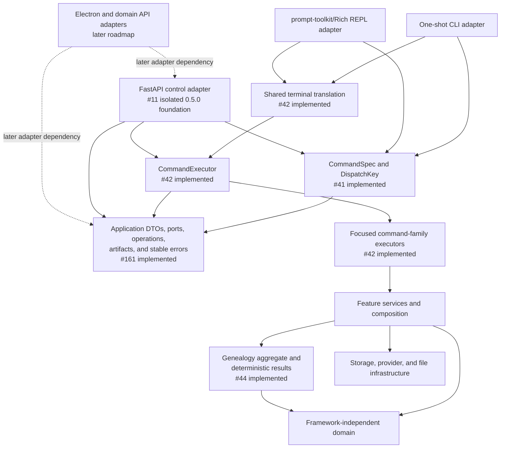

# Architecture ownership and dependency contracts

Status: executable in the 0.4.0 Unreleased development tree.
`ARCHITECTURE.md` is the repository-wide source of truth; this page explains
the checks that enforce its public façades, ownership boundaries, and
current-versus-target graph.

## State legend

The repository distinguishes four states deliberately:

| State | Meaning |
|---|---|
| Implemented | Present in this tree and protected by tests or an executable gate. |
| Unreleased 0.4.0 candidate | Implemented or proposed work that has not passed a dedicated 0.4.0 release process. |
| Isolated 0.5.0 foundation | Source-level work that may proceed independently but cannot be promoted before the 0.4.0 release gate completes. |
| Later roadmap | Accepted or proposed direction outside the next release; no runtime may depend on it yet. |

The shared command specifications, transport-neutral application contracts,
shared `CommandExecutor`, and service-owned genealogy aggregate (#44) are
implemented. The isolated Issue #11 slice implements authenticated FastAPI
health and capability discovery over those contracts. Issue #225 packages and
supervises that control-only sidecar from Electron main. The renderer's domain
bridge and FastAPI domain routers remain later-roadmap adapters.

## Dependency graph and owners



| Concern | Authoritative owner |
|---|---|
| Command grammar, aliases, route identity, and dispatch metadata | `ancestryllm.core.commands` (#41) |
| Request/result DTOs, operation inventory, ports, opaque artifact and secret references, stable error envelopes | `ancestryllm.application` and `ancestryllm.domain.errors` (#161) |
| Executable dependency direction, public-façade allowlists, and architecture-state documentation | `scripts/check_architecture_contracts.py`, this page, and `ARCHITECTURE.md` (#162) |
| Shared use-case dispatch and CLI/REPL adapter translation | `ancestryllm.application.executor`, `ancestryllm.terminal`, and `ancestryllm.execution` (#42 implemented) |
| Internal API versioning, strict schemas, authenticated control routes, capability projection, safe error mapping, and deterministic OpenAPI | `ancestryllm.api` (#11 isolated `0.5.0` foundation) |
| Identity, provenance, deterministic changes/conflicts, quality findings, and genealogy result semantics | `ancestryllm.application.genealogy` over `ancestryllm.domain.genealogy` (#44 implemented) |
| GEDCOM document model, bounded path parser, validator, deterministic line serializer, graph, identity, quality, service, synchronization, and publication seams | pure document modules plus physically owned parser, serialization, graph, identity, quality, synchronization-contract, algorithm, manifest, publication/recovery, operation, and legacy-argument modules behind declared façades; `engine` and `incremental` are import-only compatibility façades (#163-#166) |
| RootsMagic immutable source/schema, typed query orchestration, and GEDCOM mapping/export seams | `ancestryllm.rootsmagic.core`, `ancestryllm.application._rootsmagic` behind the `.query` façade, and `ancestryllm.rootsmagic.export`; private compatibility access is limited by `PRIVATE_MODULE_GATEWAYS` |
| Focused REPL compatibility and migration documentation | `docs/REPL_ARCHITECTURE.md` (#39) |
| User, contributor, module-authoring, versioning, and release consistency | final cross-document pass (#179) |

## Enforced inward dependencies

`scripts/check_architecture_contracts.py` parses imports without importing the
application. It is run by `make lint`, the ordinary CI workflow, and release
readiness. The tag workflow consumes the exact approved readiness evidence
instead of repeating the check.

The checker enforces these rules:

- public application, domain, and core-contract modules may use only the Python
  standard library and declared inward AncestryLLM contracts;
- application DTOs, ports, domain objects, and core command contracts cannot
  import Click, prompt-toolkit, Rich, FastAPI, Pydantic, Electron, provider
  SDKs, configuration, keyring, storage, publication implementations, or
  host-filesystem `Path` objects;
- the GEDCOM document model, validator, and deterministic line serializer may
  depend only on the Python standard library and one another; they cannot
  import application, infrastructure, adapter, provider, publication, or
  compatibility-engine code;
- GEDCOM graph, identity, and quality operation modules cannot import UI
  adapters, runtime configuration, publication or secret storage, keyring, or
  provider implementations; optional intelligence enters through
  transport-neutral resolver ports;
- private RootsMagic compatibility modules may be imported only by the exact
  importer modules declared in `PRIVATE_MODULE_GATEWAYS`; owner package
  membership does not grant blanket access, and application services cannot
  bypass the public façades;
- the GEDCOM `engine` and `incremental` import-only compatibility façades may be
  imported only by the exact retained re-export assertions; ordinary
  application and test consumers must import the physical owner modules;
- an adapter cannot import a sibling adapter or become an application
  dependency;
- imports from declared public façade modules must use names in their literal
  `__all__` allowlists.

Characterization tests may import private modules to preserve shipped behavior.
That test access does not make a private kernel an application or adapter API.

## CORE-24 GEDCOM consumer migration inventory

At the CORE-24 baseline (`5ac6f195b6218d86633e7de8275297df3a0bf283`),
eleven test modules imported `gedcom.engine` or `gedcom.incremental` directly:
the cancellation, file-ingress, provider-boundary, rooted-closure, incremental,
incremental-cancellation, RootsMagic-export, adversarial, duplicate-benchmark,
merge, and quality suites. The duplicate-performance, merge, quality, and
adversarial suites also reached underscore-prefixed helpers through façade
module aliases. The application service and terminal command paths already
entered through supported GEDCOM façades; the control API consumes only shared
command metadata and application execution contracts. There is no Electron or
domain-API consumer in this release line.

After the migration, ordinary consumers and tests import only the physical
parser, serialization, graph, identity, quality, service, synchronization, and
publication owners. Exactly two compatibility imports remain in a single
explicit test in `CHARACTERIZATION_IMPORT_EXCEPTIONS`:

| Characterization importer | Private seam and test purpose | Owner and removal trigger |
|---|---|---|
| `tests.modular.test_incremental` | `gedcom.engine`; assert that the legacy import path re-exports its supported physical owner contract | Compatibility owner; remove in a breaking release after deprecation. |
| `tests.modular.test_incremental` | `gedcom.incremental`; assert that the legacy import path re-exports its supported physical owner contract | Compatibility owner; remove in a breaking release after deprecation. |

The repository scan rejects every other consumer import of the two private
modules (`ARCH501`), rejects a stale exception (`ARCH502`), and rejects direct
or alias-based access to underscore-prefixed façade members (`ARCH503`). The
test fixtures that prove those diagnostics are source strings, not live
private consumers.

Production imports of both compatibility façades are empty. Their physical
ownership is:

| Module | Physical responsibility |
|---|---|
| `gedcom.parser` | Bounded file ingress, envelope validation, and collision-free xref allocation. |
| `gedcom.serialization` | Loss-minimal rendering, supported envelope normalization, and validation before staging. |
| `gedcom.artifact_publication` | Single-artifact atomic text staging and rollback cleanup. |
| `gedcom.sync_contracts` | Typed commands, results, coded errors, cancellation callbacks, and accounting. |
| `gedcom.sync_algorithms` | Deterministic matching, reconciliation, rewriting, and report algorithms. |
| `gedcom.sync_manifest` | Snapshot identity, ingress verification, and manifest validation. |
| `gedcom.sync_publication` | Capability-safe generation publication, rollback, and recovery. |
| `gedcom.sync_operations` | Typed update/rebase orchestration and stable error translation. |
| `gedcom.sync_cli` | Legacy argument-vector translation to typed commands, without terminal I/O. |
| `gedcom.sync_gedcom` | Narrow module-shaped GEDCOM dependency for supported composition and focused test doubles. |
| `gedcom.sync` | Public application-port coordinator and supported typed/legacy entry points. |
| `gedcom.engine`, `gedcom.incremental` | Import-only compatibility re-exports; no algorithms, adapters, or publication. |

`PUBLIC_FACADE_INTERNAL_GATEWAYS` records exact physical-owner composition.
Those imports are owner-internal and may not be used by consumers; stable
consumer names remain limited to literal `__all__` inventories. The migration
also removes the unused engine loader and private argument-parser/CLI paths.
The supported one-shot CLI and REPL continue to dispatch through the
application executor.

## Public façade lifecycle

`PUBLIC_FACADE_MODULES` is the executable façade inventory. Each listed module
has a literal, bound, duplicate-free `__all__` allowlist. A new public symbol
requires all of the following in the same change:

1. an owner and dependency direction consistent with `ARCHITECTURE.md`;
2. the explicit `__all__` addition;
3. contract or regression tests for its stable behavior;
4. documentation when an adapter or module author may consume it.

Removing a symbol requires the compatibility and versioning process. Renaming
an implementation detail does not require a compatibility shim unless that
detail was already in a declared façade.

The `0.4.0` RootsMagic public inventory includes the package façade plus
`core`, `query`, and `export`. The reusable mapper lives in the physical
`mapping` implementation. The `query` module is a compatibility façade for
the private typed application orchestrator, so provider and SQL policy have one
owner;
validation and atomic publication are owned by the private application
exporter. The public `export` façade preserves its declared mapper, exporter,
and result imports, while `rootsmagic.exporter` remains a compatibility alias.
The private `source` and `schema` modules own the
implementation behind `core`; `reader` and `schema_adapter` retain import
compatibility but are not alternate public contracts. The GEDCOM inventory
exposes the pure `model`,
`serializer`, and `validator` modules directly alongside parser, graph,
identity, quality, serialization, service, and synchronization seams. The
parser and serialization façades may re-export supported pure-kernel symbols,
but consumers can depend on the declared implementation-module façades without
reaching through a private engine. Graph traversal,
identity/merge, immutable quality analysis, and publication are physically
owned by focused modules. Exact internal owner gateways allow those
implementations to share private helpers without expanding the supported
consumer API.

## Temporary exception lifecycle

An exception is allowed only when it names one exact importer, imported module,
and imported symbol tuple, plus a responsible owner, a blocking issue, and a
reason. Wildcards, package-wide exemptions, and silent expansion are rejected.
A stale exception also fails the gate so completed migration debt is removed.

The #42 shared-executor migration removed all four former CLI/REPL
compatibility exceptions and the corresponding inverted imports. The executable
exception inventory is empty. Compatibility re-exports remain adapter-local,
are covered by focused tests, and do not form a second command registry or
service API. Any future exception must satisfy the exact owner, issue, reason,
and stale-record checks above.

## Validation and review

Run the focused boundary checks with:

```bash
PYTHONPATH=src .venv/bin/python scripts/check_architecture_contracts.py
PYTHONPATH=src .venv/bin/pytest tests/modular/test_architecture_contracts.py
```

The tests prove the repository graph passes, every declared exception is live,
valid inward imports are accepted, and representative framework, host-object,
GEDCOM-operation runtime, private-kernel (including same-owner-package),
undeclared-façade, expanded-exception, and stale-exception violations fail with
actionable codes.

Before accepting a boundary migration, rerun the core-contract
characterization suite, inspect the dependency diff, remove dead exceptions
and shims, and complete the canonical `make test`, `make lint`,
`make typecheck`, and uninterrupted `make security` gates. CORE-24 records its
before/after characterization evidence against the baseline above and keeps
provider-`none`, loss-minimal preservation, deterministic conflict handling,
and rollback-safe publication under their existing regression coverage. The
current evidence records zero production imports of either compatibility
façade and exactly two direct imports in one explicit re-export assertion.
