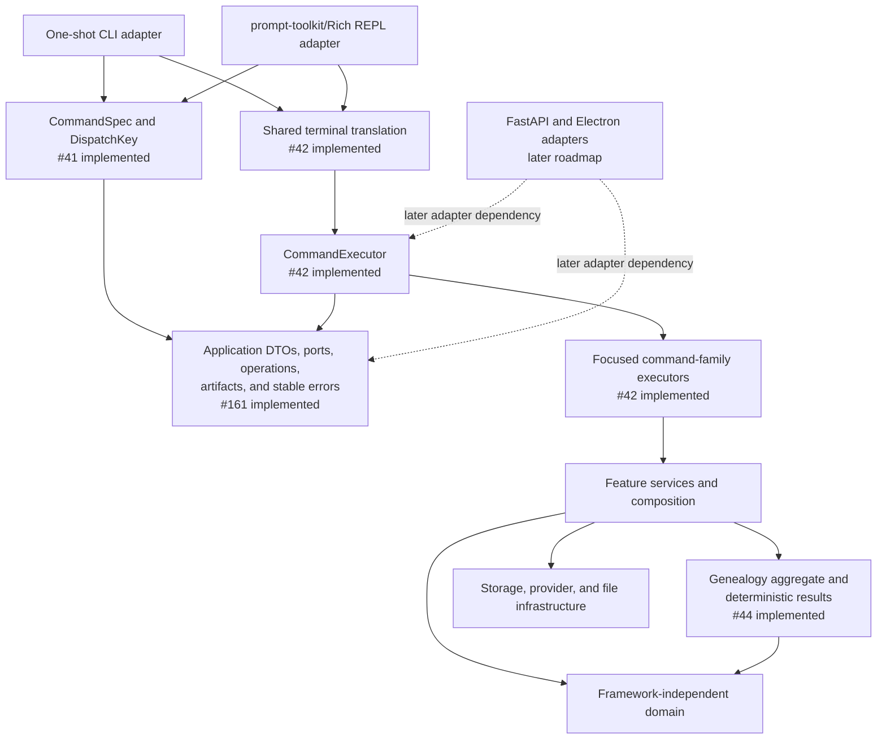

# Architecture ownership and dependency contracts

Status: executable for the `0.3.0` release candidate. `ARCHITECTURE.md` is the
repository-wide source of truth; this page explains the checks that enforce its
public façades, ownership boundaries, and current-versus-target graph.

## State legend

The repository distinguishes three states deliberately:

| State | Meaning |
|---|---|
| Implemented | Present in this tree and protected by tests or an executable gate. |
| Remaining `0.3.0` target | Required before the release, but not yet a claim about the current code. |
| Later roadmap | Accepted or proposed direction outside `0.3.0`; no runtime may depend on it yet. |

The shared command specifications, transport-neutral application contracts,
shared `CommandExecutor`, and service-owned genealogy aggregate (#44) are
implemented. FastAPI routes and the Electron application remain
later-roadmap adapters.

## Dependency graph and owners



| Concern | Authoritative owner |
|---|---|
| Command grammar, aliases, route identity, and dispatch metadata | `ancestryllm.core.commands` (#41) |
| Request/result DTOs, operation inventory, ports, opaque artifact and secret references, stable error envelopes | `ancestryllm.application` and `ancestryllm.domain.errors` (#161) |
| Executable dependency direction, public-façade allowlists, and architecture-state documentation | `scripts/check_architecture_contracts.py`, this page, and `ARCHITECTURE.md` (#162) |
| Shared use-case dispatch and CLI/REPL adapter translation | `ancestryllm.application.executor`, `ancestryllm.terminal`, and `ancestryllm.execution` (#42 implemented) |
| Identity, provenance, deterministic changes/conflicts, quality findings, and genealogy result semantics | `ancestryllm.application.genealogy` over `ancestryllm.domain.genealogy` (#44 implemented) |
| Focused REPL compatibility and migration documentation | `docs/REPL_ARCHITECTURE.md` (#39) |
| User, contributor, module-authoring, versioning, and release consistency | final cross-document pass (#179) |

## Enforced inward dependencies

`scripts/check_architecture_contracts.py` parses imports without importing the
application. It is run by `make lint`, the ordinary CI workflow, release
readiness, and the release workflow.

The checker enforces these rules:

- public application, domain, and core-contract modules may use only the Python
  standard library and declared inward AncestryLLM contracts;
- application DTOs, ports, domain objects, and core command contracts cannot
  import Click, prompt-toolkit, Rich, FastAPI, Pydantic, Electron, provider
  SDKs, configuration, keyring, storage, publication implementations, or
  host-filesystem `Path` objects;
- code outside `ancestryllm.gedcom` cannot import the private GEDCOM engine or
  incremental synchronizer directly, and code outside `ancestryllm.rootsmagic`
  cannot import its reader, exporter, or schema adapter directly;
- an adapter cannot import a sibling adapter or become an application
  dependency;
- imports from declared public façade modules must use names in their literal
  `__all__` allowlists.

Characterization tests may import private modules to preserve shipped behavior.
That test access does not make a private kernel an application or adapter API.

## Public façade lifecycle

`PUBLIC_FACADE_MODULES` is the executable façade inventory. Each listed module
has a literal, bound, duplicate-free `__all__` allowlist. A new public symbol
requires all of the following in the same change:

1. an owner and dependency direction consistent with `ARCHITECTURE.md`;
2. the explicit `__all__` addition;
3. contract or regression tests for its stable behavior;
4. documentation when an adapter or module author may consume it.

Removing a symbol requires the compatibility and versioning process. Renaming
an implementation detail does not require a compatibility shim unless that
detail was already in a declared façade.

## Temporary exception lifecycle

An exception is allowed only when it names one exact importer, imported module,
and imported symbol tuple, plus a responsible owner, a blocking issue, and a
reason. Wildcards, package-wide exemptions, and silent expansion are rejected.
A stale exception also fails the gate so completed migration debt is removed.

The #42 shared-executor migration removed all four former CLI/REPL
compatibility exceptions and the corresponding inverted imports. The executable
exception inventory is empty. Compatibility re-exports remain adapter-local,
are covered by focused tests, and do not form a second command registry or
service API. Any future exception must satisfy the exact owner, issue, reason,
and stale-record checks above.

## Validation and review

Run the focused boundary checks with:

```bash
PYTHONPATH=src .venv/bin/python scripts/check_architecture_contracts.py
PYTHONPATH=src .venv/bin/pytest tests/modular/test_architecture_contracts.py
```

The tests prove the repository graph passes, every declared exception is live,
valid inward imports are accepted, and representative framework, host-object,
private-kernel, undeclared-façade, expanded-exception, and stale-exception
violations fail with actionable codes.

Before accepting a boundary migration, rerun the core-contract
characterization suite, inspect the dependency diff, remove dead exceptions
and shims, and complete the canonical `make test`, `make lint`,
`make typecheck`, and uninterrupted `make security` gates.
