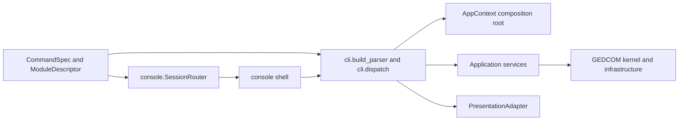
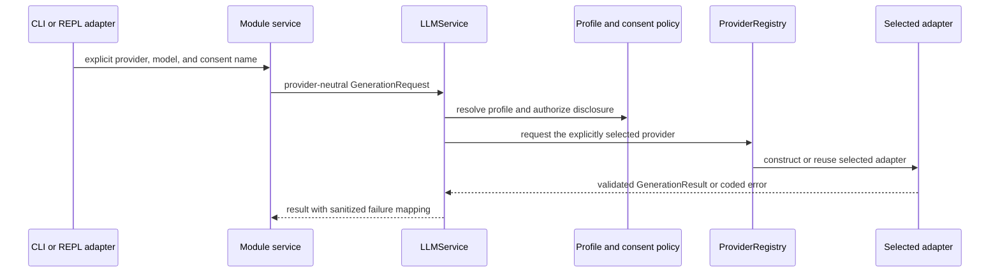

# Core-contracts characterization baseline

Status: immutable characterization of implemented `0.2.0` behavior and the
pre-migration #160 checkpoint, captured as factual input to the earlier Core
Contracts work. The dependency-flow descriptions below are historical
baseline evidence, not claims about the current tree. `ARCHITECTURE.md` is the
authoritative current and target architecture.

The baseline is intentionally executable, bounded, deterministic, fictional,
and payload-safe. It adds no production refactor. Generated reports belong in
an external temporary directory and must not be committed.

## Current command and composition flow



- `core/commands.py` owns the framework-independent `CommandSpec`,
  `ActionSpec`, `ArgumentSpec`, `ModuleDescriptor`, and derived `DispatchKey`
  metadata. `core/modules.py` retains the compatibility exports and owns only
  application-context enablement.
- `cli.build_parser()` translates that metadata into the one-shot `argparse`
  grammar. `cli.dispatch()` still receives an `argparse.Namespace`, selects the
  use case, calls a service, and renders through `PresentationAdapter`.
- `console.SessionRouter` parses interactive tokens from the same command
  metadata. The prompt-toolkit/Rich shell maintains local module state and sends
  executable commands through `cli.dispatch()`.
- `AppContext.build()` is the composition root for configuration, secrets,
  encrypted storage, provider policy and adapters, shared execution resources,
  and application services.
- `core/errors.py` owns sanitized coded exceptions. CLI and REPL compatibility
  tests fix their public code, message, and exit behavior.

The CLI and REPL therefore share command metadata, stable dispatch identities,
and a dispatcher today. They do not yet share a transport-neutral request DTO
and executor: argument normalization and use-case selection remain coupled to
`argparse` and `cli.py`.

## Current provider flow



Installed SDKs and ambient credentials do not select a provider. Cloud calls
require an explicit provider and matching consent grant. Provider adapters
under `llm/providers/` are the only modules permitted to initiate provider
network traffic. The built-in `none` provider refuses generation and the
baseline additionally blocks socket creation around its representative offline
GEDCOM operation, including when credential-shaped environment variables and
provider modules are present in the characterization tests.

## Current state and artifact flows

| Flow | Current owner and protected behavior |
|---|---|
| Configuration and secrets | `AppConfig` owns non-secret values and private directories. Its desktop service exposes exactly five reviewed fields through schema version 1, publishes owner-only configuration atomically, and rejects stale revisions. `SecretStore` is the sole OS-keyring authority; environment injection is a read-only headless/CI fallback. The desktop contract exposes only allowlisted status, set, and absence-verified delete operations. `.env` is never auto-loaded. |
| Application state | `storage.Database` owns the writable SQLCipher workspace. It does not open a RootsMagic family tree. Repositories provide bounded session-level persistence to application services. |
| GEDCOM merge and quality | `GedcomService` fingerprints immutable inputs, delegates parsing, identity, provenance, conflict, ordering, and serialization to the characterized GEDCOM kernel, revalidates inputs, stages new outputs, and publishes them atomically. Optional quality output is a coordinated secondary artifact. |
| Incremental GEDCOM sync | `gedcom.incremental` treats `master.ged` plus its private manifest as the synchronization authority. It retains snapshot history, tombstones manual deletions, makes rebase explicit, and publishes or rolls back the coordinated bundle. |
| RootsMagic query | `RootsMagicService` delegates to a read-only, authorizer-protected, deadline-bounded `RootsMagicReader`. The source identity and digest bind schema inspection and query execution; results are bounded and expose truncation. |
| RootsMagic export | Public `RootsMagicMapper` produces the typed, path-free GEDCOM document and loss report. Application-owned `RootsMagicExporter` validates and publishes the pair; source revalidation, coordinated staging, rollback, and source-hash tests protect the immutable `.rmtree` input and any prior destination pair. |
| Provider audit | `LLMService` records request and response hashes plus operational metadata. Canonical payload retention is allowed only by an exact consent grant and remains inside encrypted storage. |
| CLI/REPL rendering | Services currently return dataclasses, collections, and in some cases host `Path` objects. `PresentationAdapter` creates the human and JSON forms without exposing secrets or raw failures. |

## Dependency and façade inventory

`scripts/characterize_core_contracts.py` builds a deterministic AST import graph
for `src/ancestryllm`, records the declared runtime dependencies and `uv.lock`
hash, and fixes these supported façade modules:

- `ancestryllm.cli`
- `ancestryllm.console`
- `ancestryllm.core.errors`
- `ancestryllm.core.modules`
- `ancestryllm.gedcom.parser`
- `ancestryllm.gedcom.serialization`
- `ancestryllm.gedcom.service`
- `ancestryllm.llm.contracts`
- `ancestryllm.llm.service`
- `ancestryllm.rootsmagic.service`

Characterization tests may exercise implementation details to preserve shipped
behavior. New adapters must not treat centralized implementation modules such
as `gedcom.engine`, `gedcom.incremental`, `rootsmagic.reader`,
`rootsmagic.exporter`, provider adapters, storage internals, or console
presentation code as a second public application surface.

The executable manifest fixes 13 fictional GEDCOM fixtures by SHA-256 and 51
stable pytest function IDs in five semantic groups:

1. GEDCOM parsing, validation, loss-minimal serialization, identity, rooted
   closure, and deterministic ordering.
2. CLI/REPL action, JSON, stable-error, sanitization, and disabled-module
   compatibility.
3. Explicit provider consent, normalized failures, shared generation
   contracts, and network-free `none`.
4. Incremental allocation, provenance, idempotence, tombstones, rebase,
   rollback, interruption cleanup, and prior-output recovery.
5. Immutable RootsMagic query/export, schema and hostile-input handling,
   bounds, truncation, timeout, cancellation, coordinated artifacts, and loss
   reporting.

Every group runs in its own process. Captured test output is discarded rather
than copied into a report, fixtures are rehashed after every group, and the
source-tree digest is checked before and after all semantic and performance
work.

## Known historical boundary gaps

These observations identify work for the later core-contract issues; they are
not permission to change shipped behavior during characterization.

- Command metadata is shared, but `cli.dispatch()` is still the application
  dispatcher and consumes `argparse.Namespace`.
- The transport-neutral executor request/result envelope, port set, artifact
  references, and stable application error mapper now support CLI, REPL, and
  the bounded internal FastAPI/Electron foundation. Later domain workflows
  must keep using that shared boundary instead of defining UI-owned variants.
- Several service results expose `Path` and other host-oriented values instead
  of serialization-only DTOs.
- Provider generation contracts use Pydantic, so they are not the neutral core
  DTO boundary for every application service.
- Genealogy identity, provenance, change/conflict accounting, and
  serialization behavior are characterized but remain distributed across
  façade and centralized engine/synchronizer modules rather than one
  service-owned aggregate contract.
- The authenticated FastAPI foundation and bounded Electron shell are now
  implemented adapters. Their settings and credential-management source
  contract remains private and transport-thin, and neither adapter may
  redefine service, provider-consent, or genealogy behavior.

## Running and comparing the baseline

Use the repository environment while forcing imports to this checkout:

```bash
PYTHONPATH=src .venv/bin/python scripts/characterize_core_contracts.py verify
PYTHONPATH=src .venv/bin/python scripts/characterize_core_contracts.py capture \
  --output /tmp/ancestryllm-core-contracts-before.json
PYTHONPATH=src .venv/bin/python scripts/characterize_core_contracts.py capture \
  --output /tmp/ancestryllm-core-contracts-after.json
PYTHONPATH=src .venv/bin/python scripts/characterize_core_contracts.py compare \
  /tmp/ancestryllm-core-contracts-before.json \
  /tmp/ancestryllm-core-contracts-after.json \
  --output /tmp/ancestryllm-core-contracts-comparison.json
```

Choose an external temporary directory appropriate to the host when `/tmp` is
unavailable. The runner rejects report destinations inside the repository.
Reports contain hashes, counts, node IDs, dependency names, timings, peak RSS
where the platform exposes it, and pass/fail metadata. They contain no fixture
contents, genealogy values, prompts, provider responses, credentials, captured
test output, or generated family-tree artifacts.

Each performance scenario uses seven fresh worker processes and compares the
median. The representative warm scenario performs 60 offline `GedcomService`
merges per worker after prewarming. A warm operation is gated only when the
baseline median is at least 500 ms; then elapsed time and peak RSS may not
regress by more than 10%. CLI cold start may not regress by more than the larger
of 100 ms or 10%. Missing candidate RSS fails closed when the baseline contains
RSS data. Dependency graph changes are reported for review but are not treated
as performance failures.

The focused characterization tests verify inventory resolution, payload-safe
failure handling, network-blocked deterministic measurement, atomic external
reports, and every comparison threshold. The full `make test`, `make lint`,
`make typecheck`, and uninterrupted `make security` gates remain required
before this baseline or any dependent boundary migration is complete.
