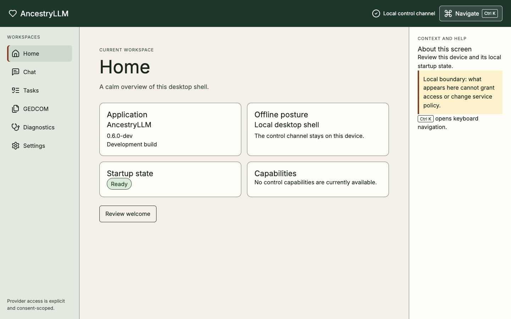

# AncestryLLM documentation

AncestryLLM is a local-first command-line tool for genealogy research. It
combines deterministic RootsMagic and GEDCOM workflows with optional,
explicitly selected LLM providers.

The canonical source is this `docs/` directory. It is published to the
[AncestryLLM documentation site](https://sodejm.github.io/AncestryLLM/) and the
[GitHub Wiki](https://github.com/sodejm/AncestryLLM/wiki); the Wiki remains
available, but neither published view is an independent documentation source.

## Current product surfaces

The CLI, interactive REPL, and released bounded Electron desktop control shell
are the implemented product surfaces. The shell supports Home, Diagnostics,
Settings, and capability onboarding.

The CLI and REPL use the same command specification, transport-neutral
executor, application DTOs, and genealogy services.

- Start with the [CLI reference](reference/CLI.md) for one-shot commands.
- Start with the [interactive console guide](CONSOLE.md) for the prompt-toolkit
  and Rich REPL.

All user-selected files are governed by the shared
[bounded file-ingress policy](reference/FILE_INGRESS.md), including byte and record
budgets, race detection, output alias rejection, and transactional publication.

The released bounded Electron desktop control shell uses the authenticated
health/capability sidecar. Unreleased source also includes explicitly bounded
file-grant, provider-configuration, presentation-only **Tasks** adapters, a
source-level synchronous transient-chat API, and a transient **Chat**
destination over a Main-owned private stream. That chat boundary requires an
exact stored profile and model plus current policy and compatible consent,
keeps bounded content only in memory, grants no tools or domain authority,
renders model Markdown through a closed allowlist, and keeps external-link
confirmation in Electron Main. Desktop-domain capabilities such
as target-matched packaged and adversarial chat evidence, genealogy/domain task
admission or execution, direct artifact access, cloud accounts, and updater
flows remain planned or incomplete. The current desktop records distinguish
released control surfaces
from Unreleased source and the verification needed for later expansion; they
are not a current journey for excluded domain capabilities.

The accepted deployment architecture now has a source-level profile control
plane: Local Desktop is the safe default, while Connect Remote and advanced
Host Remote remain explicit unavailable intents. The bounded desktop shell
also has reviewed macOS arm64 controls for acquiring and managing app-owned
Colima, Lima, Docker Engine, and Compose tools. Those controls do not ship or
activate an AncestryLLM application container or a remote runtime; the local
CLI, REPL, and bounded desktop shell remain the only product surfaces.

## v0.6 desktop learning path

Start with the local, provider-none Home state above, then use
[Desktop shell](explanation/DESKTOP_SHELL.md) to understand the bounded
control surface and its sanitized recovery path. Continue with the
[interactive console guide](CONSOLE.md) for genealogy commands, and use the
[CLI reference](reference/CLI.md) when a one-shot command is more appropriate.
These surfaces share application contracts, but the desktop shell does not
silently grant provider, network, filesystem, or genealogy authority.

## Tutorials

Learn a complete, safe workflow with fictional data:

- [Desktop first run](tutorials/desktop-first-run.md) — reach a verified,
  network-free Home state and choose the next supported surface
- [Merge fictional GEDCOM records offline](tutorials/offline-gedcom-merge.md)
  — produce a rooted GEDCOM 5.5.5 file and quality report with `provider=none`
  and no network calls.

## How-to guides

Task-oriented guidance for common goals:

- [Run an offline GEDCOM merge](how-to/run-an-offline-gedcom-merge.md) — merge
  the public fictional fixtures, verify the results, and recover from failure
- [Explore commands in the interactive console](how-to/explore-the-interactive-console.md)
  — inspect the implemented prompt-toolkit/Rich REPL safely
- [Recover with desktop diagnostics](how-to/desktop-diagnostics.md) — interpret
  sanitized startup state and retry the private desktop service
- [Grant desktop file access](how-to/desktop-file-access.md) — understand
  scoped opaque grants and the immutable-input boundary
- [Configure a desktop provider and consent](how-to/desktop-provider-consent.md)
  — test an endpoint, review exact disclosure scope, and revoke consent
- [Monitor and cancel desktop tasks](how-to/desktop-tasks.md) — follow
  backend-owned progress and cancellation safe points
- [Use transient desktop chat](how-to/desktop-chat.md) — work with the bounded,
  unsaved advisory conversation surface
- [Interactive console guide](CONSOLE.md) — start and use the REPL
- [Encrypted backup and recovery](ENCRYPTED_BACKUPS.md) — create and restore backups
- [First-run storage diagnostics](SETUP_DIAGNOSTICS.md) — troubleshoot setup
- [Release runbook](RELEASING.md) — prepare and publish a release

The established root paths for the last four guides remain published while
release packaging and contract consumers use them. Their inventory records the
later `git mv` cutover that will update those consumers together.

## Reference

Factual, accurate information to look up:

- [Desktop reference](reference/DESKTOP.md) — routes, states, stable codes,
  platform behavior, accessibility, and recovery
- [CLI reference](reference/CLI.md) — commands, options, and exit codes
- [Provider guide](reference/PROVIDERS.md) — provider policy, profiles, and capabilities
- [GEDCOM compatibility and release checks](reference/GEDCOM_COMPATIBILITY.md)
- [Versioning and compatibility](reference/VERSIONING.md)
- [Bounded file ingress](reference/FILE_INGRESS.md)
- [Continuous integration](reference/CI.md)
- [ty advisory evaluation](reference/TY_ADVISORY_EVALUATION.md) — 0.6 checker evidence and cutover disposition
- [Ruff rule-expansion evaluation](reference/RUFF_EXPANSION_EVALUATION.md) — reviewed 0.6 static-analysis batches and regression evidence
- [uv_build evaluation](reference/UV_BUILD_EVALUATION.md) — reproducible backend comparison and fail-closed adoption disposition
- [Architecture ownership and dependency contracts](reference/ARCHITECTURE_CONTRACTS.md)
- [Command executor](reference/COMMAND_EXECUTOR.md)
- [Built-in module authoring](reference/MODULE_AUTHORING.md) — constraints, registration, and tests
- [Application contracts](reference/APPLICATION_CONTRACTS.md) — service DTOs and ports
- [API reference](reference/api/API_REFERENCE.md) — authenticated health and capability control API
- [Local LLM benchmarks](reference/LOCAL_LLM_BENCHMARKS.md)
- [Local-first retrieval evaluation](reference/LOCAL_RETRIEVAL_EVALUATION.md)

## Explanation

Concepts, rationale, and design context:

- [Privacy and consent](explanation/PRIVACY_AND_CONSENT.md) — local-first boundaries and consent model
- [REPL architecture](explanation/REPL_ARCHITECTURE.md) — internal session and dispatch design
- [Desktop shell (released bounded v0.5.0 plus marked Unreleased source)](explanation/DESKTOP_SHELL.md) — released Home, Diagnostics, Settings, and onboarding plus bounded Unreleased Tasks presentation and transient-chat source contracts

## Supporting records and publishing

- [Wiki synchronization](WIKI_SYNC.md) — reproduce the publishing step locally
- [Wiki operations and recovery](WIKI_OPERATIONS.md) — dispatch, verify, rollback
- [Security response checklist](SECURITY_RESPONSE.md)
- [Verified uv bootstrap](security/verified-uv-bootstrap.md) — executable trust policy, receipts, and reviewed updates
- [Documentation authoring guide](DOCS_AUTHORING.md) — Diátaxis map and authoring rules
- [Release notes (planned v0.6)](release-notes/0.6.0.md) — release preparation, not a current release
- [Desktop verification (released bounded shell and later changes)](DESKTOP_VERIFICATION.md) — exact-head verification, not release approval
- [Desktop deployment (released bounded shell publication)](DEPLOYMENT.md) — installer publication and app-owned macOS arm64 runtime-tool controls, not a hosted application
- [Local-first container and advanced remote deployment ADR](ADR-0026-local-first-container-remote-deployment.md) — implemented profile and macOS arm64 runtime-tool boundaries plus future application-runtime gates
- [Electron and FastAPI desktop ADR](ADR-0025-electron-fastapi-desktop.md) — released control-shell boundary and excluded domain scope
- [Provider framework evaluation ADR](ADR-0024-provider-framework-evaluation.md) — recorded provider choice
- [Data-flow threat model and control matrix](THREAT_MODEL.md) — security governance
- [Release evidence index](release-evidence/README.md) — retained verification artifacts

## Documentation links

Documentation links use relative Markdown filenames (for example,
`[Console guide](CONSOLE.md)`). This keeps links valid from this `docs/`
directory in the repository. The Pages build rewrites local links only in its
generated staging directory, from `.md` targets to site paths. Wiki
synchronization rewrites the same local targets to extensionless Wiki page
links. The canonical source remains unchanged.

Use the sidebar to navigate the complete published documentation set.
