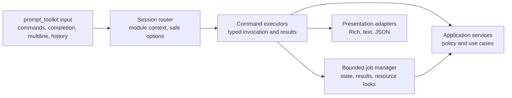

# REPL architecture and compatibility boundary

The interactive console is a local UI over the same application services used
by the one-shot CLI. The consolidated Issues #46–#49 implementation makes the
asynchronous prompt-toolkit/Rich REPL, installed by the main package, the only
supported no-argument interactive interface while preserving the one-shot
interface.

## Decision record

**Status:** Implemented for the prompt-toolkit/Rich REPL, context-aware
completion, multiline input, and bounded background jobs. Cooperative
cancellation and live progress presentation build on the job lifecycle.

The application uses transport-neutral command specifications and
invocation/result contracts between input adapters and application services.
`ancestry MODULE ACTION ...` remains the one-shot compatibility authority. A
no-argument `ancestry` invocation starts the asynchronous prompt-toolkit/Rich
REPL. No API, WebUI, multi-user server, autonomous agent, Python execution, or
LLM tool-execution capability is part of this decision.

## Target layers



1. **Input** owns terminal reads, asynchronous prompts, multiline editing,
   Tab completion, history, and EOF. It never interprets shell syntax or
   accesses databases, keyrings, providers, or networks.
2. **Session routing** owns root versus active-module state and non-secret
   saved options. It routes parsed invocations and never renders terminal
   text.
3. **Command execution** validates typed arguments and calls application
   services. It returns serializable DTOs, progress events, or stable
   `AncestryError` instances.
4. **Application services** own use cases and enforce consent, endpoint
   policy, immutable source handling, and provider `none` offline behavior.
   They do not import UI libraries.
5. **Background jobs** run long operations in bounded worker threads, expose
   serializable lifecycle snapshots, and serialize mutations by target resource.
6. **Presentation** renders DTOs, progress, and coded errors. Rich objects
   stay in this layer; JSON is a serialization of the same result contract.

The dependency direction is one-way: `input -> routing -> execution ->
services`. Presentation consumes execution results and is not a service
dependency.

## Compatibility contract

- One-shot `ancestry MODULE ACTION ...` usage and its parser, typed arguments,
  JSON output, stable error codes, serializable result shapes, and documented
  exit codes remain unchanged.
- The default no-argument REPL provides root controls (`modules`, `use`,
  `exit`/`quit`) and active-module controls (`info`, `show`, `set`, `unset`,
  `run`, `back`).
- Parsing supports strict quoting, escaped spaces, typed values, repeated
  flags, and `NAME=VALUE` forms. Shell/Python execution, scripts, aliases,
  macros, command substitution or expansion, pipes, redirection, and generated
  executable input are rejected.
- Tab completion is derived from command specifications and a frozen session
  snapshot. It offers commands, actions, unused flags, static enum values,
  enabled modules, configured profile/consent names, and static
  secret-reference types.
- Completion never offers secret values, keyring contents, people, trees,
  prompts, or workspaces. Prompt names are intentionally suppressed because
  they may contain sensitive data, despite being mentioned in the completion
  issue description.
- File completion applies only to file-valued arguments and is limited to the
  current working directory and descendants. It excludes hidden entries and
  symlinks, rejects traversal and outside absolute paths, and bounds the
  result count.
- Completion is read-only and must not call databases, keyrings, provider
  adapters, or networks. It uses command metadata, safe static/session
  snapshot data, and permitted local directory listings only.
- Secret entry is no-echo, secrets and secret-like commands are excluded from
  history, and interactive history is stored with owner-only permissions.
- Provider selection and consent stay explicit. `provider=none` remains
  network-free even when keys or provider SDKs are installed.
- Background jobs expose queued, running, completed, failed, and cancelled
  states. Progress presentation and cooperative cancellation extend this
  lifecycle without moving policy or mutation safety into the UI.

## Migration status

| Area | Status | Boundary |
|---|---|---|
| Shared command specifications and typed invocation contracts | Implemented | One-shot and REPL use the same command metadata |
| Session routing and root/active-module controls | Implemented | State is non-secret and UI-independent |
| Asynchronous prompt-toolkit/Rich REPL | Implemented | Starts with no arguments and is installed by the main package |
| Context-aware completion | Implemented | Static/snapshot-driven, privacy-filtered, CWD-bounded |
| Secure history and no-echo secret entry | Implemented | Owner-only history; secrets excluded and redacted |
| Bounded background jobs | Implemented | Serializable states/results; per-resource mutation serialization |
| Cooperative cancellation | Future work | Extends the job lifecycle around atomic sections and shutdown |

## Compatibility paths

```text
ancestry MODULE ACTION ...       -> unchanged one-shot parser and dispatcher
ancestry                          -> asynchronous prompt-toolkit/Rich REPL
```

The REPL and one-shot CLI are sibling adapters, not separate application service
paths. All supported adapters must preserve one-shot semantics, provider policy,
stable errors, and source-file safety guarantees.

## Command registration model

Built-in commands are declared once in the explicit module registry. Each
module has a `ModuleDescriptor` for identity and implementation location plus a
transport-neutral `CommandSpec` containing its actions and typed arguments. The
one-shot CLI parser, REPL router, help output, active-module `run` command, and
completion all consume that metadata.

Module implementations stay thin: they receive parsed, typed invocation data,
delegate to application services, and return serializable DTOs or stable coded
errors. They do not own terminal input, Rich rendering, storage, provider
selection, consent policy, or secret retrieval.

## Explicitly rejected shortcuts

- Calling application services directly from completion or input widgets.
- Reading databases, keyrings, provider state, or network resources while
  computing completions.
- Returning Rich renderables from services or making JSON depend on terminal
  formatting.
- Treating an installed SDK or environment key as provider authorization.
- Using shell-like parsing, aliases, redirection, expansion, generated code,
  or executable commands to make the REPL convenient.
- Suggesting genealogy records, prompt names, workspace names, secret values,
  or keyring contents from completion.
- Replacing encrypted workspace, GEDCOM atomic publication, or consent checks
  with in-memory UI state.

## Allowed dependencies

`prompt-toolkit` is a main-package dependency and supplies the asynchronous
prompt, completion primitives, history support, and terminal editing. Rich is
used only by presentation adapters for terminal rendering. The project-specific
completion adapter composes prompt-toolkit public primitives with the existing
command specifications and privacy policy; it does not introduce a second
completion library or a new runtime framework dependency.

The one-shot CLI and REPL are sibling adapters over the same execution and
service contracts. Any implementation that makes services depend on
`prompt_toolkit` or Rich remains outside the target architecture.
