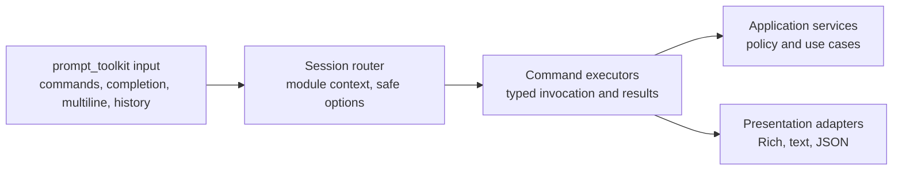

# REPL architecture and compatibility boundary

The interactive console is a local UI over the same application services used
by the one-shot CLI.  This document defines the migration boundary before a
`prompt_toolkit` REPL replaces the legacy console.

## Decision record

**Status:** Accepted target architecture; migration is incremental.

The application will use transport-neutral command specifications and
invocation/result contracts between input adapters and application services.
The existing one-shot CLI remains the compatibility authority while the
`prompt_toolkit`/Rich REPL is introduced behind the same execution boundary.
No API, WebUI, multi-user server, autonomous agent, or LLM tool-execution
capability is part of this decision.

## Target layers

1. **Input** owns terminal reads, multiline editing, completion, history, and
   EOF. It never interprets shell syntax or accesses databases/providers.
2. **Session routing** owns active-module state and non-secret saved options.
   It routes parsed invocations and never renders terminal text.
3. **Command execution** validates typed arguments and calls application
   services. It returns serializable DTOs, progress events, or stable
   `AncestryError` instances.
4. **Application services** own use cases and enforce consent, endpoint policy,
   immutable source handling, and provider `none` offline behavior. They do
   not import UI libraries.
5. **Presentation** renders DTOs, progress, and coded errors. Rich objects
   stay in this layer; JSON is a serialization of the same result contract.

The dependency direction is one-way: `input -> routing -> execution ->
services`. Presentation consumes execution results and is not a service
dependency. Background jobs, when introduced, execute service calls through a
job manager and report structured state rather than writing to the terminal.

## Compatibility contract

- One-shot commands remain supported and are not reinterpreted by the REPL.
- `--json` output, stable error codes, serializable result shapes, and
  documented exit codes remain supported throughout the migration.
- The REPL cannot execute shell commands, Python, scripts, pipes, redirects,
  aliases, or macros.
- Secret entry is no-echo, secrets never enter history, and diagnostic output
  must redact registered sensitive values.
- Provider selection and consent stay explicit.  `provider=none` remains
  network-free even when keys or provider SDKs are installed.
- Long-running work reports structured progress and may run asynchronously,
  but cancellation must preserve atomic GEDCOM and workspace writes.

| Existing contract | Target REPL behavior | Compatibility test |
|---|---|---|
| One-shot command grammar | Parse the same command specifications | Equivalent invocation DTOs |
| Human-readable output | Render through Rich or plain text | Captured renderer tests |
| `--json` output | Serialize the same DTOs without Rich objects | JSON schema/parity tests |
| `AncestryError` code and remediation | Preserve code, message, remediation, and exit status | Error mapping tests |
| Explicit provider and consent | Authorize before any provider call | Consent and `provider=none` tests |
| Atomic GEDCOM/workspace writes | Make cancellation pending in non-interruptible sections | Rollback and shutdown tests |

## Migration sequence

The migration must keep the legacy console available until the replacement has
parity coverage.

1. Define shared command specifications, typed invocations, result contracts,
   and progress events.
2. Extract session routing and command executors without importing UI code.
3. Add the asynchronous `prompt_toolkit` shell, completion, multiline input,
   and history policy behind an explicit compatibility switch.
4. Add bounded background jobs, cooperative cancellation, and Rich live
   rendering while retaining one-shot CLI behavior.
5. Run end-to-end parity, offline, consent, redaction, and no-shell tests;
   only then retire the `cmd2` implementation and update the entry point.

Each phase must leave the one-shot CLI, JSON output, stable errors, provider
policy, and source-file safety guarantees intact. A phase must not silently
introduce a second command grammar or a UI-specific service API.

## Explicitly rejected shortcuts

- Calling application services directly from completion or input widgets.
- Returning Rich renderables from services or making JSON depend on terminal
  formatting.
- Treating an installed SDK or environment key as provider authorization.
- Using shell-like parsing, aliases, redirection, or generated executable
  commands to make the REPL convenient.
- Replacing the encrypted workspace, GEDCOM atomic publication, or consent
  checks with in-memory UI state.

## Allowed dependencies

The one-shot CLI and REPL are sibling adapters over the same execution and
service contracts. This boundary is the acceptance criterion for future REPL
work: any implementation that makes services depend on `cmd2`,
`prompt_toolkit`, or Rich is out of scope for the target architecture.
