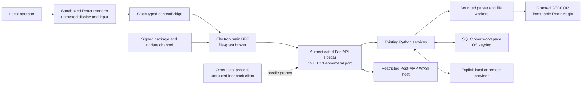
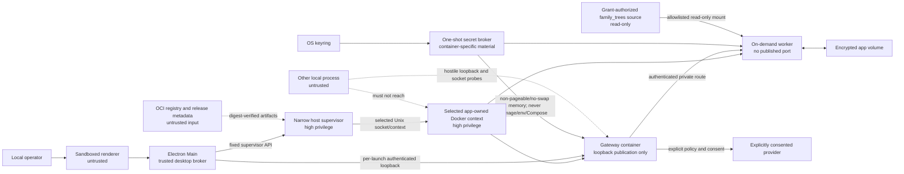
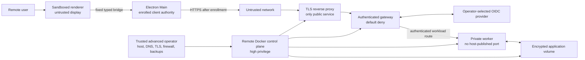

# Data-flow threat model and control matrix

## Implementation status

The `0.6.0` release tree implements the one-shot CLI and prompt-toolkit/Rich
REPL over shared command, application-service, and genealogy-core contracts.
Its Issue
#11 slice adds authenticated FastAPI health and capability routes,
strict version/error contracts, fail-closed loopback server configuration, and
a deterministic OpenAPI artifact. Issue #225 adds private-stdin bootstrap,
bounded Electron supervision, native sidecar smoke tests, and unsigned unpacked
package verification. Issue #102 adds pre-spawn, embedded-digest payload
verification, bounded crash recovery, full-process-tree termination, and drain
of the resources the current sidecar actually owns. Issue #101 implements the
exact six-method typed bridge with per-call sender/frame/origin authorization,
strict clone/schema limits, bounded concurrency and queues, single-flight
capability reads, deadlines, cancellation, and lifecycle cleanup. The `0.6.0`
source-level Issue #103 implementation adds three path-free renderer methods
over a main-owned opaque
file-grant broker with native dialogs, purpose and format checks, bounded
single-use grants, lifecycle revocation, fingerprint revalidation, replacement
confirmation, alias denial, and output locks. It does not implement domain API
routes. The `0.6.0` source-level Issue #105 implementation adds
optimistic-revision non-secret settings plus
write-only OS-keyring credential status/set/delete through fixed authenticated
routes and five fixed bridge methods. Credential values are never returned,
persisted in renderer state, or represented in status DTOs, generated clients,
logs, or fixtures. It does not implement provider execution, parser workers,
signed installers, plugins, or an update channel. The `0.6.0` source-level
Issue #106 implementation adds a
responsive presentation-only shell, fixed navigation and interaction contracts,
deterministic focus behavior, seven semantic async states, and a fictional
development-only review gallery. It adds no IPC, network, filesystem, provider,
consent, or domain authority, and the production verifier excludes the gallery.
The `0.6.0` source-level Issue #107 implementation adds a local-only first-run
choice and a schema-v1 startup
diagnostic report over the existing fixed bridge. Packaged desktop secret
resolution is keyring-only; blocking configuration, SQLCipher, keyring, or
workspace failures keep affected mutations disabled and expose only sanitized
recovery guidance plus one bounded retry. Diagnostics never initialize or
repair storage, replace a key, fall back to plaintext, discover a remote host,
or widen a listener.
The `0.6.0` source-level Issue #108 implementation adds six fixed
provider-configuration and consent methods
and authenticated routes without adding provider execution. Endpoint tests use
direct numeric-address connections, normal TLS hostname verification, no proxy
or redirect following, repeated DNS resolution, and a redacted identity digest.
Profile persistence, consent issuance, and execution recheck the tested
identity. Exact-revision consent previews disclose provider, profile, model,
purposes, data classes, retention, cost, and living-person and remote-retention
warnings before an atomic grant; a stored credential cannot enable a provider.
The `0.6.0` source-level Issue #109 implementation adds a presentation-only
task center over the existing
backend-owned job lifecycle. Five fixed request methods and one validated event
listener expose strict sanitized snapshots and events; Electron Main owns the
authenticated stream, caps sender-bound subscriptions, removes them on terminal
state or sender/session teardown, and rejects stale or duplicate sequences. The
renderer reloads backend snapshots, resynchronizes gaps, distinguishes
cancelling, pending-safe-point, cancelled, and terminal outcomes, and presents
only coded redacted errors plus path-free artifact metadata. It admits no task,
executes no provider or genealogy operation, retains no job state, and grants no
artifact authority.
The `0.6.0` source-level Issue #110 implementation adds five fixed
authenticated operations for synchronous,
transient chat behind a source-level `ChatService`. Every run uses the session's
exact named profile and model, rechecks endpoint identity, credentials, policy,
and consent before provider construction, and applies fixed message, context,
output, retry, timeout, and concurrent-session bounds before provider access.
The system prompt declares model output untrusted and advisory; requests expose
no tools, files, database, shell, plugins, genealogy operation, or autonomous
action. Messages remain in process memory only, teardown clears them, and audit
records contain identifiers, counters, usage, and hashes rather than payloads.
Issue #110 itself adds no Electron bridge, renderer chat, streaming, or generic
provider route. Issue #111 consumes it through fixed authenticated stream-start,
SSE, and cancellation routes plus a fixed Main/preload source bridge. Issue #112
adds the bounded renderer presentation and fixed Main-owned native actions;
target-matched packaged adversarial evidence remains #131.
The `0.6.0` source-level Issue #56 implementation adds only a service-internal
asynchronous adapter for
existing synchronous provider iterators. Profile, endpoint, credential,
policy, consent, and stream-capability checks complete before the worker starts.
The context-preserving off-loop bridge bounds queued items and UTF-8 chunk
bytes, applies one absolute lifecycle deadline, propagates cooperative
cancellation, and emits exactly one payload-minimal terminal audit outcome.
Structured output remains on the validated `generate()` path. Issue #56 itself
adds no API, Electron, renderer, or public stream surface. Issue #111 supplies
the bounded private chat transport, and Issue #112 supplies its source-level
renderer presentation. Target-matched packaged adversarial evidence remains
#131.
The `0.6.0` source-level Issue #347 implementation adds a
strict schema-v1, non-secret deployment profile with a safe Local Desktop
default, reviewed mode descriptions, revision-bound previews, explicit
confirmation, atomic local recovery, fail-closed runtime diagnostics, and
redacted backup/support metadata. It does not start containers, enroll a
remote client, host a server, widen a listener, or move genealogy data. The
`0.6.0` source-level Issue #363 implementation adds the Electron-Main-only
host container-control
foundation. Issue #348 wires only macOS arm64 runtime acquisition and lifecycle
through a policy-bound status/review/apply interface. It validates an app-owned
local Docker endpoint and exact hardened plans, ignores ambient daemon
selection, and performs only bounded inspection and lifecycle operations over
exactly owned resources. It starts no AncestryLLM application workload and
exposes no Docker authority to preload, renderer, shared DTOs, or containers.
Issue #349 adds production-shaped gateway and worker images plus an exact
two-service Compose topology for probe and lifecycle validation. The topology
publishes no host port, loads no provider or genealogy workload, keeps its
placeholder data volume read-only, and disables schema migration. The diagrams,
controls, abuse cases, and gates below define this runtime-tool and probe-only
substrate plus accepted later-roadmap requirements; implementation alone is not
evidence that every packaged assurance control has passed. Each adapter must
reuse the implemented service contracts and complete its named
verification before a planned control can be treated as effective.

[ADR-0026](ADR-0026-local-first-container-remote-deployment.md) accepts a
local-first multi-container backend, an advanced remote-client profile, and a
separately operated remote-server profile as the target architecture. Issue
#347 implements only the profile-selection portion of `TM-M01`; Issue #363
implements the host-control subset of `TM-H01`, `TM-B01`, `TM-O01`, and
`TM-C01`; Issue #348 implements the local acquisition portions of `TM-H01`,
`TM-K01`, `TM-N01`, and `TM-V01`; Issue #349 implements the probe-only source
and native-evidence portions of `TM-K01`, `TM-N01`, `TM-O01`, and `TM-B01`.
No workload-capable AncestryLLM application container or remote runtime is
implemented or supported. The deployment diagrams, remaining controls,
`STR-H-*` through `STR-M-*` and `STR-B-*`, AB-11 through AB-22, and G5 through
G7 below remain
requirements for planned work. The #363 native macOS arm64 receipt supports its
narrow evidence disposition below, but no deployment risk rating is reduced
until the owning runtime issues provide complete native-platform,
negative-test, and independent-review evidence at their named gates.

## Assets and trust boundaries

Sensitive assets are genealogy records, living-person status, notes, provider
credentials, SQLCipher keys, prompts/responses, consent grants, RootsMagic
source files, `0.6.0` source-level opaque desktop file grants, and internal API
bootstrap material. Later desktop assets additionally include event streams
and plugin packages, update metadata, release signatures, support evidence,
OCI images and digests,
generated Compose configuration, Docker contexts and sockets, workload
credentials, remote-enrollment material, encrypted application volumes, and
backups. The non-secret deployment profile and its redacted endpoint-identity
and support/backup evidence are current control-plane assets. Data crosses
boundaries at
prompt-toolkit/Rich REPL input, one-shot CLI input, GEDCOM/RootsMagic parsing,
the OS keyring, encrypted database, configured provider endpoints, and exported
files. The desktop runtime adds crossings through a sandboxed Electron renderer,
the fixed preload bridge, Electron main, and an authenticated FastAPI sidecar;
the credential value lifetime ends in the uncontrolled input and request path,
while the renderer retains presence status only. Issue #110's chat payloads
cross only the authenticated loopback route, the source-level `ChatService`, and
the already-controlled provider adapter; they are retained only in the service's
bounded process memory. Issue #56's asynchronous chunks cross only from that
controlled provider iterator through a bounded in-process queue to the service
caller. Audit output
uses hashes by default, and payload retention still requires explicit consent.
The current deployment-profile control plane crosses
the versioned config, application service, and canonical command executor
without crossing a network boundary. Proposed deployment
runtimes additionally cross Electron Main to a host deployment supervisor, the
supervisor to a selected Docker control plane, the host keyring to a secret
broker, containers to private application networks and encrypted volumes, and a
remote client through TLS ingress and an identity provider to an authenticated
gateway.

The local operator is trusted to choose data and consent. The renderer, other
local processes, imported genealogy content, file paths, plugins, packages,
updates, retrieved text, and every model response are untrusted. The accepted
desktop boundary and product decision are specified in
[ADR-0025](ADR-0025-electron-fastapi-desktop.md).

For the proposed Local Desktop profile, the selected Docker daemon or VM and the
narrow host supervisor are highly privileged. Possession of the Docker control
socket is treated as equivalent to administrative control over the containers
and potentially the host; it is never delegated to the renderer or an
application container. Other local users and processes, containers, registry
content, Compose input, network peers, and service responses remain untrusted.
The host OS account and its keyring are within the local user's trust boundary.

For the proposed Host Remote Server profile, the operator controls the host,
Docker daemon, DNS, TLS, identity-provider configuration, firewall, backups,
logs, and recovery keys. A root or administrator compromise can observe
plaintext while the application is running; SQLCipher and encrypted backups do
not protect against that trusted operator or a fully compromised host. Remote
mode is therefore appropriate only when every user trusts that operator. It is
single-household, non-multi-tenant software unless a future ADR and renewed
threat model establish isolation between mutually distrustful users. The
project's self-supported policy limits operational support; it does not reduce
security requirements or transfer security decisions to unsafe defaults.

```text
untrusted GEDCOM / RootsMagic -> bounded parsers -> application services
                                                 |-> SQLCipher workspace <- OS keyring
                                                 |-> consent + minimization -> LLM HTTPS
                                                 +-> atomic local exports
```

## OWASP Top 10:2025 control crosswalk

The Top 10 is an awareness and prioritization baseline, not a proof of
security. Each implementation issue must also select applicable, versioned
OWASP ASVS 5.0.0 requirements and produce negative-test evidence. Controls
remain planned—not effective—until that evidence passes.

| Risk | Applicability and controls | Verification |
|---|---|---|
| A01:2025 Broken Access Control | Privileged operations require narrow bridge/supervisor methods, authenticated internal routes, scoped grants, default-deny remote authorization, and immutable source policy (`TM-I01`, `TM-A01`, `TM-F01`, `TM-H01`, `TM-N01`, `TM-G01`). | Sender/origin, unauthorized-route/operation, disabled-capability, expired/cross-window grant, cross-profile, workload-identity, and traversal tests. |
| A02:2025 Security Misconfiguration | Secure Electron defaults, loopback-only local publication, explicit deployment modes, identity-verified Docker context, hardened containers, no implicit network, validated TLS/identity preflight, `provider=none`, restrictive permissions, and bounded limits (`TM-R01`, `TM-A03`, `TM-M01`, `TM-H01`, `TM-K01`, `TM-N01`, `TM-G01`). | Clean-install, production-config, context/socket substitution, Compose-policy, listener/firewall, IPv4/IPv6, forwarded-header, CSP/fuse, and native packaged-runtime assertions. |
| A03:2025 Software Supply Chain Failures | Locked dependencies, purpose-scoped PEP 735 tool groups, pinned CI actions, audits, SBOM/provenance, verified executable bootstrap, digest-pinned OCI/runtime/bootstrap/package inputs, signed production packages, embedded-digest sidecar manifests, and rollback protection (`TM-U01`, `TM-U02`, `TM-U03`, `TM-P02`, `TM-B01`). The sidecar manifest is not publisher signing. | Lockfile and environment-profile contract review, clean-profile execution, dependency audits, CodeQL, Semgrep, secret scan, CycloneDX SBOM, bootstrap policy/receipt, manifest integrity, digest/architecture/provenance, signature, rollback, and revoked-artifact tests. |
| A04:2025 Cryptographic Failures | SQLCipher is required; high-entropy database/API/workload material is never stored in renderer, Compose, image, environment, arguments, or logs; OS keyring/broker, encrypted backups, TLS, identity, and expiring metadata are authoritative (`TM-S01`, `TM-A01`, `TM-V01`, `TM-G01`, `TM-U02`). | Plaintext header, wrong/lost/rotated key, key-unavailable, secret-delivery canaries, TLS/issuer/audience, bearer disclosure, expiry, rollback, integrity, backup, and restore tests. |
| A05:2025 Injection | SQL AST validation and authorizer, strict schemas, static IPC/endpoint allowlists, no generated command/code execution, raw-HTML denial, and untrusted prompt/model data (`TM-I01`, `TM-L02`, `TM-P01`). | SQL/prompt/console/API/IPC/HTML/URI injection suites, schema fuzzing, and Semgrep/CodeQL. |
| A06:2025 Insecure Design | Renderer-compromise, hostile-container, hostile-network, and compromised-remote-host cases; separated adapters/services; explicit modes/consent; immutable inputs; abuse-case review; risk expiry; and profile gates apply before code (`TM-R01`, `TM-F02`, `TM-L01`, `TM-M01`, `TM-H01`, `TM-N01`). | Architecture contract tests, threat-ledger review, source sentinels, offline tests, misuse cases, and G0-G7 exit evidence. |
| A07:2025 Authentication Failures | OS login is the Local Desktop user boundary, while every local and workload route is independently authenticated; remote mode adds validated OIDC, hardened sessions, default-deny authorization, and bound single-use enrollment (`TM-A01`, `TM-A03`, `TM-N01`, `TM-G01`, `TM-X01`). | Missing/wrong/replayed token, startup race/timing, service spoofing, issuer/audience/redirect/PKCE/state/nonce, session fixation/revocation, clock skew, enrollment replay, and endpoint-substitution tests. |
| A08:2025 Software or Data Integrity Failures | Source hashes, SQLCipher integrity, validated DTOs/model output, atomic writes, sequenced events, verified executable bootstrap, digest-pinned Compose/OCI/runtime/package inputs, signed production packages/updates, and anti-rollback state (`TM-F02`, `TM-E01`, `TM-U01`, `TM-U02`, `TM-U03`, `TM-B01`). | Hash, schema, sequence/gap, round-trip, partial-publication, bootstrap identity/archive/cache tamper, Compose/image/package tamper, wrong-platform/architecture, downgrade, rollback, migration, restore, and recovery tests. |
| A09:2025 Security Logging and Alerting Failures | Stable error codes and privacy-minimal structural evidence; payload/access logging is off; container, reverse-proxy, installer, and support output forbid secrets, paths, genealogy data, prompts, responses, ports, and bearers (`TM-O01`, `TM-O02`, `TM-V01`, `TM-G01`). | Canary-secret scans across UI, API, container/proxy stderr, Docker metadata, package logs, crash/support bundles, build artifacts, and release evidence. |
| A10:2025 Mishandling of Exceptional Conditions | Fail-closed provider/storage/API/deployment policy, typed errors, preflight, application and hosted-job timeouts, cancellation, resource quotas, bounded logs/queues/reads, idempotent terminal states, atomic output, migration safety, and rollback (`TM-D01`, `TM-E01`, `TM-C01`, `TM-K01`, `TM-V01`, `TM-U04`). | Boundary/one-over, malformed input, disconnect/reload, container/worker death, hosted-job hang, engine/keyring/IdP failure, disk-full, log growth, cancellation, restart, migration, restore, and rollback tests. |

## OWASP Top 10 for LLM Applications 2025

| Risk | Controls and disposition |
|---|---|
| LLM01 Prompt Injection | Imported text is untrusted data; models receive no tools; generated SQL is parsed and authorizer-enforced. |
| LLM02 Sensitive Information Disclosure | Pre-render consent, minimal fields, living-person denial, OS keyring, encrypted optional retention. |
| LLM03 Supply Chain | Provider SDKs are optional and locked; dependency/SBOM/security scans gate release. |
| LLM04 Data and Model Poisoning | Retrieval is not implemented. Any future local index must fingerprint sources, preserve provenance, treat retrieved text as untrusted context, and detect stale/conflicting material before display or generation. |
| LLM05 Improper Output Handling | JSON Schema validation and length caps; output is never executable. |
| LLM06 Excessive Agency | No autonomous agents, tool calls, shell, interactive-console escape hatch, write-capable SQL, or automatic destructive decisions. |
| LLM07 System Prompt Leakage | Prompts contain no credentials; templates and untrusted content are separated; disclosure is treated as possible. |
| LLM08 Vector and Embedding Weaknesses | Embeddings/vector stores remain unimplemented. A future feature requires SQLCipher-local storage by default, workspace and consent partitioning, restricted-data exclusion, versioned invalidation, bounded retrieval, and explicit cloud-retention consent. |
| LLM09 Misinformation | Deterministic evidence remains authoritative; LLM adjudication is optional and cannot delete conflicts. |
| LLM10 Unbounded Consumption | Token, output, timeout, cost, model, purpose, and row caps are enforced. |

## Desktop trust and data flow



## Proposed container and remote deployment data flow

These flows are design targets owned by #346 and its dependent work. Issues
#363 and #348 implement the Main-to-supervisor-to-app-owned-engine control and
runtime-acquisition segment. Issue #349 instantiates only a hardened gateway and
optional worker validation shell on an internal Compose network: it supplies no
application route, host listener, provider, secret, genealogy data flow,
writable volume, or schema migration. The complete runtimes must remain
unavailable until their respective assurance gates pass.





The only planned public entry point is the remote TLS edge. Local Desktop binds
only loopback, and internal services have no host-published ports. Docker
network membership is reachability, not identity: every sensitive gateway-to-
service route still requires an authenticated, authorized workload credential.
Connect to Remote accepts only an explicit enrolled endpoint. Host Remote starts
only after TLS, identity, authorization, backup, and recovery preflight succeeds;
mode is never inferred from interface availability, Docker state, or an
environment variable.

### Named desktop and accepted deployment controls

Controls `TM-M01` through `TM-B01` are accepted deployment requirements. Issue
#347 supplies source-level evidence for the profile-selection portion of
`TM-M01`; its listener, packaged UI, installer, upgrade, and native-runtime
claims remain unevidenced. The other deployment controls carry no security
credit until the owning issue and gate in the STRIDE and abuse-case ledgers have
produced the required evidence.

| ID | Required control |
|---|---|
| `TM-R01` | Renderer isolation: packaged local content only, `contextIsolation: true`, `nodeIntegration: false`, `sandbox: true`, global sandboxing, no `<webview>`, no remote code, and verified production fuses. |
| `TM-R02` | Restrictive production CSP and `app://` protocol: fixed asset/MIME manifest; no renderer network, frames, objects, forms, raw HTML, executable model output, service workers, or CSP bypass. |
| `TM-I01` | Least-privilege IPC: frozen static asynchronous bridge methods, runtime schemas and size limits, main-frame sender/origin checks, listener cleanup, and no generic send/listen, dynamic channels, Electron objects, or synchronous IPC. |
| `TM-A01` | Private internal API: loopback port `0`, fresh 256-bit per-launch bearer through private stdin, exact host/version validation, no cookies/CORS/browser origins, and packaged docs disabled. |
| `TM-A02` | Sidecar lifecycle: embedded-digest-bound exact payload-manifest verification before token creation and spawn, minimal environment, protocol/build handshake, one server worker, bounded restart, deadline-bounded verified full-process-tree shutdown, current-resource drain, and privacy-minimal stderr. The macOS CI verification overlay excludes only the manifest-bound sidecar payload from Electron's second signing pass so signing cannot mutate those bytes after manifest creation; PyInstaller's nested signatures remain and the outer ad hoc application signature seals the resource tree. Manifest binding is not publisher signing; Issue #132 owns signing and notarization. |
| `TM-A03` | Request integrity: authenticate every route before body parsing, compare credentials in constant time, reject proxy/origin/cookie headers and redirects, disable access logs, and require token-derived readiness proof. |
| `TM-S01` | Secret boundary: Python `SecretStore` and the OS keyring are the only write authority; renderer may set, delete, or check presence but can never read a value. Exact reference allowlists, presence-only status, read-only headless environment injection, verified deletion, stable redacted errors, and clearing the uncontrolled credential input before invocation and after every outcome keep values out of configuration, Electron storage, renderer state, generated contracts, logs, and fixtures. |
| `TM-F01` | Opaque file grants: native dialogs create high-entropy, window/operation-scoped, expiring, revocable grant IDs; renderer never supplies or receives unrestricted paths. |
| `TM-F02` | Backend file safety: regular-file checks, realpath/fingerprint revalidation, ingress budgets, source/output non-aliasing, immutable inputs, app-owned scratch space, atomic outputs, and failure cleanup. |
| `TM-L01` | Provider policy: explicit provider/profile/model/consent; HTTPS, DNS/private-address, proxy, TLS, host, and redirect validation; no ambient-key selection; `provider=none` remains network-free. |
| `TM-L02` | Model-output safety: output is untrusted data, schema/length validated, rendered through an allowlist, and never executed as tools, SQL, Python, shell, HTML, or plugin code. |
| `TM-D01` | Availability: bounded request/event/file sizes, queues, workers, memory/time/cost/token limits, cancellation, and deterministic overload errors. Public file boundaries use the typed limits and race checks in [bounded file ingress](reference/FILE_INGRESS.md). |
| `TM-P01` | Plugin isolation: signed declarative manifests/UI, deny-by-default WASI host capabilities, and no renderer/main/native/Python plugin code. |
| `TM-P02` | Plugin provenance: signatures cover the canonical package tree; publisher trust/revocation, safe extraction, compatibility, permission-diff approval, and restricted-host identity are verified before activation. |
| `TM-U01` | Supply chain and updates: reviewed lockfiles, purpose-scoped tool environments, SBOM/provenance, disclosed binary-signing mode, embedded-digest sidecar payload manifests, verified update metadata, ASAR integrity where supported, and tested rollback. Sidecar manifest binding detects substitution relative to the built Electron main but is neither publisher identity nor whole-application protection. Project-produced 0.x release binaries and annotated tags must be unsigned; Issue #132 owns signed/notarized production packages and signed annotated tags, which become mandatory at v1.0.0. |
| `TM-U02` | Update freshness: signed expiring metadata binds platform, application/sidecar versions, hashes, sizes, key identity, and monotonic release state; downgrade and freeze attempts fail closed. |
| `TM-U03` | Repository executable bootstrap: one reviewed schema-v1 policy binds the exact `uv` version, supported platform/architecture archive sizes and executable hashes, GitHub release source and signer provenance, verified GitHub CLI bootstrap, pinned setup action, and locked Python verifiers. Unknown or mismatched input fails before execution; downloads and attestation verification are time-bounded, archives extract safely, a fresh executable's identity is checked before atomic cache publication, cached binaries are re-hashed, and installation and receipt writes remain anchored to held parent handles so symlink, reparse-point, and ancestor-swap races fail closed. Sanitized receipts gate release evidence, and a post-preflight setup or installed-binary failure atomically replaces the canonical success status with a stable failure category. Hosted callers grant least-privilege attestation access only to the attestation subprocess, the repository Actions allowlist admits only the reviewed setup-action commit, and workflow auditing covers both workflow and local-action manifests. |
| `TM-U04` | Hosted CI timeout governance: every governed required CI, security, desktop, proof, release-readiness, and release job declares a literal reviewed timeout. A closed static contract rejects missing, extra, expression-based, or bypassed limits. A deterministic fictional hang retains sanitized pre-timeout and confirmed evidence and leaves the workflow failed. Queue delay and a broader GitHub platform outage remain outside job-level bounds and therefore leave required evidence incomplete rather than passing. |
| `TM-U05` | Version 1 security dependency governance: one schema-v1 policy binds the exact private Project, repository, issue owner and iteration assignments, native dependency edges, iteration order, and #131 evidence consumer. Proof, readiness, and release use one checked-in GraphQL query and reject incomplete pagination, missing or contradictory edges, cycles, prerequisites scheduled after dependents, premature closure, unknown fields, and reports not bound to the current policy digest. |
| `TM-E01` | Event integrity: bounded sequenced streams, acknowledgement/backpressure, gap handling, terminal-state idempotency, startup reconciliation, and no automatic replay of side-effecting work after output begins. |
| `TM-M01` | Deployment-mode integrity: Local Desktop is the safe default; Connect Remote and Host Remote require explicit, informed selection and separate configuration. `provider=none` is incompatible with Connect Remote and Host Remote, forces local execution, and opens no network socket. It selects the socket-free native application-service path and does not start the container backend, host supervisor, Engine API, gateway, workers, or containers. No environment, listener, interface, Docker context, installer flag omission, or discovered server may infer a remote mode, widen a bind, enable synchronization, or reuse credentials across profiles. |
| `TM-H01` | Docker control-plane least authority: use only an application-owned, identity-verified context and local socket selected by the host supervisor; ignore ambient `DOCKER_HOST`/`DOCKER_CONTEXT`; reject TCP/SSH endpoints; allowlist lifecycle and inspection operations; validate generated Compose before use; and expose no generic exec, copy, build, mount, image-load, plugin, swarm, or socket pass-through. The renderer and application containers never receive the socket or a Docker client credential. |
| `TM-K01` | Runtime and container isolation: native architecture, rootless or VM-isolated engine where supported, non-root users, read-only roots, dropped capabilities, `no-new-privileges`, default-deny seccomp/MAC policy, no host network/PID/IPC/devices/privilege, explicit resource limits, bounded logs, and platform-native firewall/socket tests. Generated Compose permits only application-owned paths plus an allowlisted read-only `family_trees` mount resolved from an opaque native-dialog grant, revalidated as an immutable source, and exposed only to the authorized worker; writable, broad, ungranted, aliased, and additional host mounts fail closed. Rootful-daemon, Docker-group, WSL2, Hyper-V, VM, named-pipe, user-namespace, and kernel limitations are disclosed and tested rather than assumed equivalent. |
| `TM-N01` | Network and workload identity: explicit internal networks, no implicit default network, no direct host publication for workers/data services, loopback-only local gateway, default-deny route authorization, short-lived service-specific credentials, replay resistance, bounded ingress/egress, provider-policy enforcement, and fail-closed IPv4/IPv6/proxy/forwarded-header handling. Network membership alone never authorizes a request. |
| `TM-V01` | Container secret and data custody: the OS keyring remains the local authority; a narrow broker delivers per-container, short-lived material only through non-pageable or locked no-swap memory, or a no-swap memory-backed filesystem with equivalent platform evidence. Material never enters Compose, images, environment, arguments, logs, swap, or inspectable metadata. SQLCipher keys, identity secrets, encrypted volumes, migrations, backups, restore, rotation, revocation, and uninstall are fail-closed, versioned, recoverable, and tested for loss as well as disclosure. |
| `TM-G01` | Remote edge and identity: only the TLS reverse proxy is public; TLS and certificate validation, exact external origin, trusted-proxy allowlists, OIDC issuer/audience/redirect/PKCE/state/nonce, session rotation/revocation, CSRF protection, rate limits, default-deny authorization, administrative re-authentication, and clock-skew bounds pass preflight before Host Remote starts. Host Remote authorizes exactly one configured household principal; every other OIDC subject is rejected before route or object access. No anonymous health, docs, setup, bootstrap, or internal service route is exposed. |
| `TM-X01` | Remote enrollment and endpoint pinning: Connect Remote uses an explicit normalized HTTPS endpoint and one-time, expiring, single-use enrollment ceremony bound to server identity, user, client instance, redirect, and intended profile. Discovery, redirects, DNS rebinding, private/link-local/metadata targets, callback/deep-link hijacking, token reuse, endpoint changes, and cross-profile credential reuse fail closed. |
| `TM-B01` | Deployment supply-chain integrity: OCI bases, application images, Compose models, runtime components, package-manager metadata, and bootstrap artifacts are versioned and digest-pinned, license-inventoried, SBOM/provenance checked, architecture-bound, rollback-protected, and acquired without remote-shell execution. Pre-1.0 uses published cryptographic digests and reproducibility evidence; production signing, notarization, and repository signing become mandatory at v1.0 under #132. |

### Issue #100 Electron boundary evidence

| Control | Source and runtime evidence | Packaged evidence and residual ownership |
|---|---|---|
| `TM-R01` | Secure window defaults and weakened-future-window regression tests; global web-content and session denials; production E2E proves no renderer Node object, child-window creation, added privileged bridge method, or developer-tools keyboard escape. | The desktop security gate inspects the built `app.asar` and all eight declared fuses. Signing and cross-platform release evidence remain #132/#131. |
| `TM-R02` | Exact `app://bundle` route/MIME/CSP tests reject encoded traversal, unknown assets, wrong hosts, and CSP bypass; production E2E proves fetch, WebSocket, and service-worker denial. Issue #112 adds a source-tested model-output AST allowlist and Main-confirmed external-link flow. | The fixed manifest is exercised from the production build. Target-matched packaged cross-platform XSS and model-output cases remain #131. |
| `TM-I01` | The #99 frozen bridge is not expanded for security reporting or external links; main-frame sender/origin checks remain in main; E2E asserts those methods are absent from the renderer. | Issue #101 owns the rich IPC proxy evidence below. Cross-platform adversarial packaged coverage remains #131. |
| `TM-U01` | The lockfile and package policy have static regression coverage. | The unpacked application is inspected for `app.asar`, declared fuses, and supported ASAR-integrity metadata. Signing, notarization, provenance, updates, and rollback remain #132. |
| `TM-C01` | Concurrency integrity: single-instance coordination, per-artifact output locks, optimistic revisions, and idempotency keys prevent duplicate mutations and concurrent publication. | Evidence pending under Issue #131 residual release-surface coverage. |
| `TM-O01` | Privacy-minimal observability: allowlisted stable codes and hashes/counts only by default; no secrets, unrestricted paths, genealogy values, prompts, responses, or bootstrap material. | Runtime policy evidence remains tracked in Issue #131 residual controls. |
| `TM-O02` | Runtime evidence hygiene: access-log suppression, structural redacted stderr, crash-dump/support-bundle policy, canary scans, and development-tool restrictions prevent payload capture. | Evidence pending in Issue #132 and related platform-runner checks. |

### Issue #101 typed bridge evidence

| Control | Source and runtime evidence | Packaged evidence and residual ownership |
|---|---|---|
| `TM-R01`, `TM-I01` | Exact channel registration and per-request checks require the registered `WebContents`, its exact current main frame, and the trusted application URL. Electron's structured lifecycle details preserve trusted same-document routes, while cross-document or malformed main-frame navigation cancels work and revokes renderer-owned grants. Tests reject lookalike senders, subframes, stale authorizations, navigation races, destroyed renderers, arbitrary channels, malformed lifecycle details, and non-idempotent cleanup. | Packaged E2E keeps the frozen exact six-method bridge after reload and exercises its capability path. Cross-platform XSS and additional adversarial cases remain #131. |
| `TM-D01` | Strict schema and structured-clone validation rejects unknown or inherited fields, custom prototypes, accessors, symbol or hidden keys, sparse arrays, cycles, repeated references, non-finite numbers, malformed values, and boundary-over byte/item/depth payloads before privileged work. Four active and eight queued non-coalesced operations are enforced per renderer; capability reads coalesce for at most 32 callers. Repeated stalled bursts prove underlying work remains capped after caller timeout. | Packaged E2E completes a 32-call capability burst under a fixed deadline. Exact-head hosted package rows are required before this evidence is credited for release. |
| `TM-A01` | The bridge backend exposes only declared operations. The main-owned capability client uses the fixed authenticated route and accepts an abort signal; the renderer cannot select a route, endpoint, header, credential, or transport. | The packaged burst reaches the private sidecar through the declared method only. Local package runs cannot replace native exact-head hosted rows. |
| `TM-O01` | Queue saturation, timeout, cancellation, validation failure, and internal failure map to allowlisted stable bridge codes without backend stacks, response bodies, bootstrap material, endpoints, ports, tokens, host details, or absolute paths. Tests assert overload remains redacted. | Release evidence must still pass the project-wide canary and support-artifact checks owned by #131/#132. |

### Issue #103 opaque file-grant evidence

| Control | Source and runtime evidence | Packaged evidence and residual ownership |
|---|---|---|
| `TM-I01`, `TM-F01` | Strict request and response schemas expose only `requestOpenFileGrant`, `requestSaveFileGrant`, and `revokeFileGrant`; DTOs contain random opaque IDs and safe metadata but no paths, URIs, descriptors, resolver, or generic filesystem operation. Main binds each grant to the authorized renderer, exact purpose and access mode, application session, and one redemption; close, cross-document navigation, explicit revocation, and restart invalidate it. Trusted same-document routes retain the same renderer binding and every request still rechecks the exact frame and application URL. | The dedicated packaged scenario verifies the path-free public surface and explicit revocation without adding its fixture adapter to production builds. Domain consumption remains #114/#118. |
| `TM-F02`, `TM-D01`, `TM-C01` | Main-owned native selection checks absolute normalized spelling, regular-file and one-link state, exact purpose-specific extension and content signature, byte limit, canonical identity, and filesystem fingerprint. Redemption reopens and revalidates inputs. Save replacement requires native confirmation followed by target revalidation; source/output aliases and concurrent output grants fail closed under canonical output locks. Tests cover corrupted/replaced/growing files, traversal and noncanonical spellings, symlinks, hard links, directories, devices/FIFOs where supported, size boundaries, wrong formats, stale/revoked/cross-renderer/cross-purpose grants, confirmation races, aliases, cancellation, and lock release. | Cross-platform exact-head packaged evidence covers native open/save mediation, path-free DTOs, explicit replacement confirmation, and revocation. Bounded parser workers, complete ingress budgets, and atomic publication remain #114/#118/#131. |
| `TM-O01` | Stable grant failures and receipt fields omit paths, usernames, hostnames, environment values, temporary roots, and response bodies. Safe renderer metadata is limited to basename, kind, byte size, and replacement status. | The verification-only adapter is rejected by the production build scan; its sanitized schema-v1 evidence is bound into the hosted receipt. Broader support-artifact canary coverage remains #131/#132. |

### Issue #105 settings and credential-management evidence

| Control | Source and runtime evidence | Packaged evidence and residual ownership |
|---|---|---|
| `TM-S01`, `TM-I01` | `SettingsService` exposes reviewed metadata for exactly five non-secret settings and requires the current revision before one atomic owner-only `AppConfig` replacement. `SecretManagementService` accepts only six static credential references and returns only `present`, `missing`, or `unavailable`; set and delete are explicit operations, delete verifies absence, and an environment-managed value is read-only. The authenticated sidecar and static bridge expose only settings read/patch and credential status/set/delete. Strict schemas reject unknown, secret-shaped, stale, and malformed input. | Source tests prove no credential value appears in read/status responses, OpenAPI response schemas, bridge responses, renderer state, mocks, errors, or logs. Target-matched packaged canary and crash/support-artifact scans remain required under #131 before release credit. |
| `TM-O01`, `TM-O02` | Keyring unavailable, locked, denied, and unverifiable outcomes map to stable redacted codes without response bodies or backend details. The renderer uses an uncontrolled password input, copies and clears it before invoking the bridge, clears again in `finally`, and caches only presence status. Plaintext configuration, Electron `safeStorage`, `localStorage`, IndexedDB, preferences, and mock fixtures are not credential stores. | Source-level component and contract tests cover success and failure lifetimes. Native keyring behavior and packaged renderer/crash/evidence canary scans remain #131/#132 release evidence. |
| `TM-L01` | Updating a default-provider setting does not select a provider for the current operation, grant cloud consent, read a credential, or make a network request. `.env` files remain unloaded, environment credentials remain explicit headless injection, and `provider=none` remains network-free. | #108 provides the desktop profile/consent contract and source-level endpoint controls. #110 adds a fixed source-level execution boundary; target-matched network instrumentation remains #131. |

### Issue #108 provider configuration and consent evidence

| Control | Source and runtime evidence | Packaged evidence and residual ownership |
|---|---|---|
| `TM-L01`, `TM-D01` | The endpoint test resolves the exact host, rejects non-loopback local addresses and non-global cloud addresses, connects directly to each numeric address with the original TLS server name, follows no redirects, ignores proxy configuration, and rejects a changed second DNS result. Only reviewed built-in cloud endpoints and loopback Ollama endpoints may become profiles. The redacted identity digest is reverified before profile persistence, consent issuance, and provider execution; a legacy profile without that binding cannot mint desktop consent. | Source negative tests cover redirects, proxy settings, private/link-local addresses, DNS rebinding, certificate mismatch, alternate cloud endpoints, malformed URLs, and identity changes. The packaged settings scenario uses the deterministic authenticated test adapter; #110 adds source-level execution checks, while target-matched real-network instrumentation remains #131. |
| `TM-I01` | Six fixed bridge methods and fixed authenticated routes expose provider configuration, endpoint testing, exact-revision profile creation, consent preview, exact-preview grant creation, and revocation. The complete preview includes provider, profile, model, every purpose and data class, retention, maximum cost, and explicit living-person and remote-retention warnings. Profile and consent writes are revision-bound and atomic; stored credential presence alone grants neither provider selection nor consent. | The packaged scenario proves separate local/cloud profile flows, explicit endpoint testing, complete disclosure, atomic grant creation, and revocation without adding a provider-execution path. #110 now owns the fixed source-level provider-call authorization boundary. |
| `TM-S01`, `TM-O01` | Credential values remain blank and write-only under #105's keyring boundary. Provider/profile/consent responses contain reviewed identifiers and policy fields only; endpoint identity is a SHA-256 digest rather than an address list, and stable errors omit response bodies and connection details. | Source DTO, OpenAPI, API, bridge, renderer, and packaged-UI tests cover the reviewed surface. Native keyring, endpoint-network, crash/support-artifact, and broad canary evidence remain #123/#131/#132. |

### Issue #110 transient-chat evidence

| Control | Source and runtime evidence | Packaged evidence and residual ownership |
|---|---|---|
| `TM-L01`, `TM-S01` | A session stores one exact named profile and model; `none`, direct provider IDs, missing or incompatible profiles, missing credentials, stale endpoint identity, denied policy, and absent, revoked, or mismatched consent fail before provider generation. Consent and the complete provider preflight are fetched again for every run. Tests cover fictional local and cloud profiles, ambient keys, consent denial and revocation, provider failure, offline behavior, and socket-denial paths. | This is source-level synchronous evidence. Issue #111 consumes it through a bounded private source transport, and #112 presents the exact selected profile, model, purpose, data classes, and consent without inferring authority. Native keyring and target-matched provider-network instrumentation remain #123/#131. |
| `TM-D01` | Strict DTOs and the service enforce at most 32 active or pending sessions, 32 stored messages per run, 16,384 characters per message, 65,536 context characters, 4,096 output tokens, one retry, and a 120-second timeout before provider access. A failed run does not append either message, and concurrent session creation cannot over-admit the cap. | Source cancellation and streaming backpressure are implemented under #111. Packaged stalled-provider and renderer-pressure evidence remains #131. |
| `TM-L02`, `TM-I01` | A fixed system prompt identifies user content and model output as untrusted, advisory data. Requests set no response schema or cache eligibility and expose no tool, file, database, shell, plugin, external-service, autonomous-action, genealogy-operation, or generic-provider surface. | Issue #112 supplies source-tested safe model-output rendering and hostile Markdown cases. Target-matched packaged adversarial evidence remains #131; #110 itself has no renderer output surface. |
| `TM-O01`, `TM-O02` | Session messages exist only in bounded process memory, explicit deletion and sidecar shutdown clear them, and failed runs leave history unchanged. Audit metadata is limited to reviewed identifiers, counters, usage, and payload hashes; stable API errors exclude prompts, responses, provider bodies, secrets, endpoints, and local identity. | Crash, support-artifact, and packaged canary scans remain #131/#132 before release credit. |

### Issue #111 audited chat-stream evidence

| Control | Source and runtime evidence | Packaged evidence and residual ownership |
|---|---|---|
| `TM-R01`, `TM-I01`, `TM-E01` | Electron Main exclusively owns the authenticated SSE connection and binds each run to the initiating sender. Fixed routes and bridge methods reject redirects, incorrect media types, owner/session/run mismatches, malformed DTOs, unknown fields, invalid event types, and non-monotonic sequences. Navigation, renderer destruction, and application shutdown revoke ownership and close the stream. | This source-level bridge is consumed by #112's bounded renderer state and model-output presentation. Target-matched packaged IPC and stream-race evidence remains #131. |
| `TM-D01`, `TM-E01` | Main batches events for at most 16 milliseconds or 4,096 UTF-8 JSON bytes, accounts acknowledged delivery bytes exactly, pauses sidecar reads above 262,144 unacknowledged bytes, and cancels with a stable coded terminal outcome after a 15-second acknowledgement stall. At most one reconnect resumes the same run from its exact cursor; provider generation is never retried after output begins. | Source tests cover boundary, one-over, pause/resume, stale/duplicate/gap, reload, cancellation, and bounded reconnect behavior. Target-matched stalled-provider and stalled-renderer evidence remains #131. |
| `TM-L01`, `TM-S01`, `TM-O01` | Every stream retains #110/#56's exact-profile, fresh-consent, endpoint, credential, policy, and capability preflight. Lifecycle and replay state are bounded process memory only. Completion, cancellation, failure, shutdown, or startup reconciliation records exactly one payload-free terminal audit result with stable coded status and no prompt, response, secret, endpoint, local path, or local identity. | The source transport adds no renderer network authority, model-output sink, tool use, file access, genealogy operation, or public API. Crash/support canary scans, native network instrumentation, and release-risk reduction remain #131/#132. |

### Issue #112 private chat renderer evidence

| Control | Source and runtime evidence | Packaged evidence and residual ownership |
|---|---|---|
| `TM-R01`, `TM-D01`, `TM-E01` | `ChatWorkspace` keeps owner-scoped session state in memory, limits the visible transcript to 24 turns, closes sessions on teardown, and exposes stop and regenerate without retrying output automatically. Its reducer accepts ordered monotonic events, suppresses stale and duplicate events, requests replay for gaps, fails closed on owner/session/run mismatch, and represents interruption and coded terminal outcomes. Keyboard, live-region, reduced-motion, forced-colors, responsive-layout, and 200% zoom tests cover the source presentation. | Target-matched screen-reader, sustained stream-pressure, reload-race, and packaged accessibility evidence remains #131. |
| `TM-R02`, `TM-L02` | `SafeMarkdown` parses CommonMark and GFM into a closed React component allowlist. Raw HTML, images, embeds, automatic links, executable actions, and unknown nodes are inert or omitted; input is capped at 16,384 characters. External HTTPS links display the normalized destination and require an explicit Main-process confirmation before the OS opens them. Copy emits plain text only. Hostile-output tests cover HTML, SVG, dangerous schemes, images, oversized output, links, and clipboard behavior. | Target-matched packaged Chromium XSS, CSP, link-confirmation, clipboard, and hostile-model-output evidence remains #131. |
| `TM-I01`, `TM-L01`, `TM-S01`, `TM-O01` | Six fixed chat methods, one bounded event listener, and two fixed native actions extend the typed bridge. The renderer selects an exact profile, model, purpose, data-class set, and consent; Main continues to own HTTP, streams, clipboard, and external-link opening. The renderer receives no bearer credential, direct network primitive, `window.open`, tool, file, database, genealogy operation, or persistent chat store. | Target-matched native network instrumentation, secret and payload canary scans, crash/support-artifact review, and release-risk reduction remain #123/#131/#132. |

### Issue #56 audited asynchronous provider-stream evidence

| Control | Source and runtime evidence | Packaged evidence and residual ownership |
|---|---|---|
| `TM-L01`, `TM-S01` | Named-profile planning, endpoint identity, credentials, policy, consent, and streaming capability are checked before a provider worker starts. `provider=none`, denied consent, absent streaming capability, and structured output fail without starting provider iteration. Structured requests retain the complete validated `generate()` path. | This is an internal source-level adapter consumed by #111's bounded private chat transport. Native credential and target-matched network evidence remains #123/#131. |
| `TM-D01` | A context-preserving daemon worker and bounded asynchronous queue adapt the synchronous iterator off the event loop. Defaults are 16 items and 64 KiB per chunk; configuration is capped at 256 items, 1 MiB per chunk, and 16 MiB of queue capacity. An absolute timer signals stop at the request deadline, while timeout scopes wrap only queue waits. Caller cancellation and early close signal the same cooperative stop and the execution lease remains held until iterator unwind. | A synchronous SDK can finish unwinding only on its next yield or return, so provider network timeouts remain required. Source transport backpressure is implemented under #111; packaged stalled-provider and renderer evidence remains #131. |
| `TM-E01`, `TM-O01` | Success, provider failure, timeout before or after output, caller cancellation, and early consumer close produce one terminal audit row. Request and output hashes are the default; retained payloads require explicit consent, cancelled partial output is discarded, and stable errors omit chunks, provider bodies, secrets, paths, and local identity. | Crash, support-artifact, and packaged canary evidence remains #131/#132 before release credit. |

### Issue #106 accessible shell evidence

| Control | Source and runtime evidence | Packaged evidence and residual ownership |
|---|---|---|
| `TM-R01` | The presentation shell retains local/offline status and primary navigation through responsive layouts. Keyboard tests prove deterministic skip-link, route-heading, command-palette initial focus, Escape restoration, and route-selection focus. Exact-lock Chromium `axe-core` scans cover every route in light, dark, and forced-colors themes; a 720-by-560 window at 200% zoom proves primary actions reflow without horizontal clipping. Reduced-motion and forced-color styles have explicit regression coverage. | The manual screen-reader procedure is recorded in `DESKTOP_SHELL.md`; target-matched assistive-technology and packaged accessibility evidence remains #131. |
| `TM-R02`, `TM-L02` | A closed design-system boundary rejects Node/Electron imports, direct bridge use, renderer network primitives, raw HTML sinks, and production fixture imports. The production build verifier rejects remote endpoints, remote assets, fictional fixture copy, and the development gallery. Stable coded-error views render reviewed React nodes only; #106 itself ships no model-output surface. | Issue #112 extends the source presentation with a strict model-output AST allowlist and hostile-output tests. Target-matched packaged adversarial evidence remains #131. |
| `TM-I01` | `AppRoute`, `NavigationItem`, `CapabilityGate`, `AsyncState`, and coded-error/dialog-focus contracts are presentation-only. `CapabilityGate` displays an already-authorized branch but cannot infer or grant authority. The shell consumes validated responses only through existing route hooks, adds no bridge method, and the E2E bridge allowlist remains exact. | Domain operations and any future bridge expansion require separately reviewed owning issues and #131 evidence. |

### Issue #107 local-only onboarding and startup-diagnostic evidence

| Control | Source and runtime evidence | Packaged evidence and residual ownership |
|---|---|---|
| `TM-A02`, `TM-D01` | First run offers Local Desktop as the recommended and only enabled mode. Connect Remote and Host Remote remain visibly unavailable; no discovery, enrollment, container activation, public binding, or ambient-profile selection occurs. Electron main combines the supervisor lifecycle with the authenticated sidecar report, the renderer omits capability reads while degraded, and main plus the sidecar reject affected preference, settings, and credential mutations with stable codes. One user-requested retry re-runs checks without duplicating database initialization, overwriting a key, rewriting configuration, changing permissions, or using plaintext fallback. | Source tests cover exact choices, disabled remote modes, blocked mutations, corrupt configuration, SQLCipher failure, keyring denial, workspace permission failure, sidecar mismatch, and bounded retry. Exact-head packaged rows exercise sidecar failure and startup diagnostics; broader target-specific filesystem and adversarial recovery evidence remains #131. |
| `TM-S01` | The packaged sidecar selects keyring-only secret resolution, so environment injection remains available only to CLI/headless/CI consumers and cannot satisfy a packaged desktop credential. Normal launches inherit only the minimal platform environment; Linux ignores ambient D-Bus and XDG runtime selectors, derives `unix:path=/run/user/<uid>/bus` from the kernel-reported process user ID, pins the child to the native Secret Service backend, and ignores ambient keyring selectors and configuration. Home, cache, configuration, data, provider credential, and `PATH` values remain excluded. Exact-head Linux verification uses a separate unpublished package whose compile-time adapter may read an owner-only temporary root through a Linux-only Electron switch; the ordinary production adapter never reads that switch and its build scan rejects the selector literal. Main requires an absolute Linux path and derives exact home, XDG, and `runtime/bus` values instead of accepting ambient selectors; the verifier launcher binds its private daemon to that owner-only socket. Missing, locked, denied, or unavailable keyring state fails closed and never causes credential or database-key creation. The renderer retains only presence and startup status. | The Ubuntu exact-head packaged check uses a private bus. Installer verification uses the canonical owner-only runtime endpoint: an absent socket receives an identity-tracked private bus, while an existing socket must be a stable current-user-and-group, non-symlink, responsive session bus with no Secret Service owner. The verifier never kills or removes a reused bus, prohibits alternate Python keyring backends, and retains no keyring state. A same-user process with runtime-directory access can still replace or interfere with the endpoint after validation, so the native test remains bounded by the operating system's user-session trust boundary and fails on detected type, ownership, liveness, identity, or name-ownership changes. Source tests prove the production package is assembled and scanned before the verifier build, reject ambient session selectors, credential and backend-selector canaries, and bind verifier paths to the explicit root. Broader native keyring denial/locking cases and canary scans across packaged UI, process environment, crash/support artifacts, and release evidence remain #123/#131. |
| `TM-O01` | The schema-v1 report always contains exactly `config`, `sqlcipher`, `keyring`, and `workspace`, with stable component codes, reviewed remediation, restart requirements, mutation-blocking state, and normalized non-sensitive OS/architecture. Validators and tests reject secrets, environment values, usernames, hostnames, full or temporary paths, genealogy records, prompts, payloads, response bodies, and backend details. | Broader packaged crash/support/evidence canary coverage and target-specific recovery review remain #131/#132. |
| `TM-V01`, `TM-F02` | Writable startup inventories SQLCipher user tables once, creates revision `0002` only when the workspace is truly empty, and performs no DDL for a complete current schema. Exact revision `0001` is the only automatic migration, and it starts one native SQLite transaction before DDL so a late table or index failure rolls back completely. Unknown revisions plus unversioned, missing, or unexpected tables fail with `DATABASE_MIGRATION_REQUIRED` before implicit repair. Regression tests prohibit per-table reflection and prove interrupted layouts and late packaged-migration failures leave no partial job schema. | A public migration/recovery command, interruption evidence against production-sized data, and packaged backup/restore remain #123/#131. |

### Issue #363 host container-control evidence

| Control | Source and native evidence | Residual ownership |
|---|---|---|
| `TM-H01`, `TM-B01` | Closed schema-v1 policy and plan validation admits only the application-owned Unix socket, context, CLI configuration, Compose project, working directory, exact labels, digest-pinned native-architecture image, and fixed lifecycle operation selected by policy. It rejects ambient Docker selectors, TCP/SSH/named-pipe endpoints, symlinked or replaced sockets, wrong owner/mode/engine identity, architecture or project drift, unknown fields, unsafe Compose features, and conflicting resources. Endpoint and engine identity are revalidated around each preflight and lifecycle action; realized container and network security state must exactly match the plan. Every Docker and Compose subprocess uses fixed argument vectors, a minimal environment, output/input/time limits, process-group termination, and stable redacted failures, while generated Compose disables implicit image pulls. | Issue #348 wires only verified runtime-tool acquisition and lifecycle, while #349 separately proves probe-only native OCI images and a closed topology. The supervisor still cannot start an AncestryLLM workload. OCI base/published-image provenance, SBOM publication, application rollback policy, and complete release evidence remain #353 and #358-#362 plus G5/G7. |
| `TM-K01`, `TM-C01` | Accepted plans require a non-root user, read-only root filesystem, all capabilities dropped, `no-new-privileges`, explicit CPU/memory/PID/log limits, named volumes only, internal networks, and loopback-only published ports. Inventory reconciles only exact project/name/label matches, deduplicates identical records, preserves collisions, and never broad-scans or removes unrelated resources. Start, repair, and uninstall require exact operation-bound authorization; stop is non-destructive. Preserve and delete uninstall plans are separate validated operations. | The isolated macOS ARM64 host lifecycle plus #349's native Linux amd64/arm64 probe lifecycle prove narrow control and isolation subsets. They do not prove genealogy workloads, writable volumes, secret delivery, migration, upgrade, rollback, interruption recovery with real data, daemon escape resistance, or calibrated production budgets; those remain #351, #358, #364, and #365 plus G5/G7. |
| `TM-I01`, `TM-O01` | The typed host-control port and process runner live only in Electron Main; boundary tests reject them from preload and renderer implementation, and neither the renderer nor any container receives Docker authority. Issue #348 adds only fixed status, preview, and apply DTOs; no socket, executable path, environment, arbitrary arguments, or general process capability crosses the bridge. Errors and receipts are limited to stable codes and reviewed structural identity, excluding arguments, output, environment, credentials, hostnames, usernames, paths, sockets, ports, and temporary state. | Packaged canary and support-artifact evidence remains #131/#132. |
| Native macOS ARM64 proof | An isolated Colima profile and application-owned Docker context completed the exact source-level start, stop, repair, preserve, restart, and delete sequence against the pinned fixture digest. The run verified daemon identity across operations, left no owned container/network/volume, removed the isolated profile, and proved the user's default Docker context and engine were unchanged. The sanitized receipt is `docs/release-evidence/issue-363-macos-arm64-container-supervisor.json`. | This is narrow host-control evidence only. It is not application-runtime, data, secret, network, persistence, install, upgrade, rollback, cross-platform, packaged, or complete G5/G7 evidence, and it does not reduce the inherent platform-risk rating by itself. |

### Issue #348 macOS arm64 runtime-bootstrap evidence

| Control | Source and contract evidence | Residual ownership |
|---|---|---|
| `TM-H01`, `TM-V01` | The packaged schema-v1 policy admits only Apple silicon on macOS 13 or later with hardware virtualization and 24 GiB available. Each Colima, Lima, Docker CLI, Compose, Buildx, and VM-image record binds one repository, version, release asset, source URL, exact byte length, SHA-256, license identity, and license digest. Unknown fields, platforms, architectures, archive names, URLs, missing trust fields, alternate indexes, implicit latest versions, mirror fallback, ambient `PATH`, requests for administrator privileges, and administrator installers fail closed. The downloaded bytes cannot execute before both size and digest verification; extraction rejects links, devices, traversal, absolute paths, duplicate members, and unexpected executables before atomic publication. | Target-matched packaged execution, upstream provenance attestations where available, and continuing upstream license review remain release evidence. The tool policy is not an application-image or updater trust policy. |
| `TM-K01`, `TM-N01` | Setup, start, and repair use one app-owned Colima profile, Docker context, configuration root, and Unix socket. Every process receives a minimal explicit environment; the ambient Docker context is ignored. Kubernetes and routable address publication are disabled, the resource envelope is policy-bounded, and Docker Desktop is optional and untouched. The renderer receives no Docker socket or process authority. | Colima and Lima retain their inherent host virtualization authority. #349 proves a private probe network and bounded probe containers separately; workload-authenticated networking, production budget calibration, writable data mounts, and workload readiness remain gated. |
| `TM-O01`, `TM-C01` | Status is read-only. Mutations require a current review revision and exact operation-specific confirmation. The desktop UI and noninteractive local-runtime commands share the Electron single-instance lock, so separate processes cannot race over one runtime root. Bounded `.part` files allow retry after cancellation, network loss, reboot, or partial setup; offline mode accepts only complete reverified cache entries. Repair and uninstall revalidate ownership, while preserve-data and delete-data removal are distinct plans. sanitized local-runtime diagnostics omit environment values, usernames, hostnames, absolute and temporary paths, subprocess output, response bodies, and tokens. | A power loss at an external virtualization boundary can still require an explicit repair. Delete-data confirmation is intentionally destructive only inside the validated application root. |

### Issue #349 probe-only OCI topology evidence

| Control | Source and native evidence | Residual ownership |
|---|---|---|
| `TM-K01`, `TM-N01` | Closed Compose-policy validation admits exactly one gateway and one optional worker on one internal network. Both images run as UID 65532 with read-only roots, all capabilities dropped, `no-new-privileges`, explicit CPU, memory, PID, log, startup, and shutdown bounds, no restart loop, no host namespace, device, path, or Docker-socket mount, and no published port. Native GitHub-hosted Linux amd64 and arm64 jobs build and exercise their exact image digests without QEMU. | The topology is probe-only and disconnected from the host supervisor. Default-deny seccomp/MAC evidence, workload authentication, bounded provider egress, hostile sibling tests, production sizing, and complete platform/runtime integration remain #350, #364, #365, and G5/G7. |
| `TM-A03`, `TM-O01`, `TM-C01` | The gateway exposes only authenticated health and capability probes, rejects the ordinary application surface, and emits stable privacy-safe coded failures. The optional worker is dormant and signal-aware. Exact-digest lifecycle tests cover startup, crash visibility without automatic restart, graceful gateway and worker shutdown, peer build/version skew, read-only and disk-full behavior, and log redaction. | The temporary probe credential exists only on a memory-backed runtime mount and is not a workload credential. Real application routes, service identity, replay resistance, secret brokering, and packaged recovery remain #350, #351, #364, #365, and G5. |
| `TM-B01`, `TM-V01` | The locked images contain the project and declared runtime dependencies. A closed schema-v1 inventory records every installed Python distribution and Debian package with exact version, architecture, license identity, and copyright-file SHA-256. The lifecycle report binds assertions to the exact native image digests. The placeholder named data volume is read-only, no host path is mounted, and source policy proves there is no database initializer or migration entrypoint. That is not an executed migration-path assertion. | OCI base and published-image provenance, SBOM publication, signing, rollback protection, secret/data custody, writable encrypted persistence, migration/backup/restore, and workload activation remain #351, #353, #358, and G5/G7. No registry or application-runtime release claim is made. |

### Issue #306 verified uv bootstrap evidence

| Control | Source and workflow evidence | Hosted evidence and residual ownership |
|---|---|---|
| `TM-U03` | The schema-v1 policy and standard-library bootstrap reject unknown policy fields, platforms, architectures, assets, URLs, indexes, archive sizes, and symlinked or reparse-point install and receipt paths. POSIX directory-descriptor tests prove an ancestor swap cannot redirect installation, initial receipt publication, or post-preflight failure publication; Windows holds ancestor handles without delete sharing while committing. Offline tests prove oversized, undersized, and overdue downloads leave no partial file; corrupted GitHub CLI archives never execute; corrupted `uv` archives never reach attestation; wrong repository/signer/workflow/source commit/ref/issuer/predicate fail; unsafe tar and ZIP members cannot escape; the reviewed root-level `uv.exe` member in both Windows archives is selected without deriving its path from the architecture-specific archive name; a missing member or wrong-version executable never reaches the repository cache; cached binaries are re-hashed; verifier authentication failures and bounded-timeout failures remain distinct from provenance failures; receipt cleanup cannot mask its stable write error; malformed receipts cannot be transitioned after preflight; and receipts exclude secrets and local paths. Workflow contracts require least-privilege attestation access, limit GitHub token variables to the attestation subprocess, use the same local composite action and exact pinned action commit, record setup-action or installed-binary failure before always-on receipt upload, and audit both workflow and local-action manifests wherever repository jobs use `uv`; release evidence validates the receipt against the current policy. | A live macOS ARM64 run verified the reviewed `uv` 0.12.1 archive and SLSA identity before execution. Native exact-head GitHub-hosted results for all supported Linux, macOS, and Windows x86-64/ARM64 rows remain required before merge and release. Protected-main push runs bind the full SHA to `origin/main`; authorized pre-merge manual dispatches bind it to GitHub's immutable event SHA for the selected same-repository ref and run with read-only repository permissions and no release credentials. This control covers only the repository's `uv` toolchain; application update channels, OCI/runtime acquisition, and other deployment bootstrap work remain owned by #132 and #353/#358-#362. |

### Issue #307 dependency-group evidence

| Control | Source and workflow evidence | Security and architecture disposition |
|---|---|---|
| `TM-U01` | Static contracts require the exact `lint`, `typecheck`, `test`, `security`, `build`, and `release-verifier` groups; preserve every user-facing provider and desktop extra; and reject the removed `dev` profile. Make requires locked group execution, while purpose-specific workflow contracts require `--no-default-groups`, exact job-to-profile mappings, a group-free lock check, independent pinned Semgrep execution, and unchanged stock-`pip` consumer smoke jobs. Clean profile runs prove commands do not rely on undeclared cross-group packages, while lock review proves the only package-record removal is the bootstrap-supplied `uv`. | Separating repository tools reduces the executable dependency surface for quality, audit, build, desktop, and release-verification jobs. The change adds no application dependency, data flow, network path, privilege boundary, API, CLI, provider, GEDCOM, storage, FastAPI, or Electron behavior. Existing `provider=none`, cloud-consent, immutable RootsMagic, and loss-minimal GEDCOM controls are unchanged. |

### Issue #308 uv environment-ownership evidence

| Control | Source and workflow evidence | Security and architecture disposition |
|---|---|---|
| `TM-U01`, `TM-U03` | `[tool.uv]` requires exactly `uv` 0.12.1, selects only a system interpreter, and disables Python downloads; `.python-version` defaults to 3.12 while a fail-closed preflight admits only Python 3.12-3.14 with stable coded errors. Make owns bootstrap, setup, lock, test, lint, typing, security, package, hook, and workflow-audit commands. Static workflow contracts prove canonical CI, readiness, and release jobs invoke those same Make targets after any allowed narrow group synchronization and retain exact SHA-pinned `actions/setup-python` plus the 3.12-3.14 test matrix. | No python-build-standalone executable trust chain is added, and a missing or unsupported system interpreter cannot trigger a download or unverified fallback. The change affects repository tooling only; application dependencies, runtime data flow, privilege boundaries, CLI/API/provider behavior, GEDCOM and RootsMagic safety, storage, FastAPI, and Electron boundaries remain unchanged. |

### Issue #309 ty advisory evidence

| Control | Source and workflow evidence | Security and architecture disposition |
|---|---|---|
| `TM-U01`, `TM-U03` | The `typecheck` group pins exact `ty==0.0.69` with lockfile artifact hashes. Make owns the complete-tree command and preserves ty's status; workflow contracts require a dedicated `continue-on-error` quality step without shell masking while strict mypy remains blocking. Isolated fixtures distinguish missed diagnostics from checker execution failures with stable codes, and the published evaluation records all diagnostic categories and unchanged suppression counts. | The candidate checker is acquired only through the verified, locked toolchain and receives no application data or credentials. It adds no runtime package, network path, privilege, provider import, or trust fallback. The focused progress-adapter keyword fix restores its declared protocol contract; provider consent, network-free `provider=none`, immutable RootsMagic sources, loss-minimal GEDCOM behavior, storage, FastAPI, and Electron boundaries remain unchanged. |

### Issue #104 job lifecycle and safe-shutdown evidence

| Control | Source and runtime evidence | Residual ownership |
|---|---|---|
| `TM-E01`, `TM-D01`, `TM-O01`, `TM-C01` | Strict schema-v1 sanitized snapshots/events use increasing per-job sequences and bounded payloads, history, lists, subscribers, and subscriber queues. SQLCipher persistence admits exactly one terminal event and startup reconciliation converts interrupted non-terminal work to a stable terminal outcome. Replay accepts an exact cursor or returns coded resynchronization; slow subscribers overflow independently and listeners are never called under the manager lock. Cancellation is idempotent and cooperative, distinguishes a request from a pending atomic safe point, and shares resource locks with shutdown. Fixed authenticated routes expose list, status, cancel, SSE, and shutdown assessment only. Electron main presents native **Wait**, **Request cancellation**, and **Stay open** choices; degraded startup is explicit safe-empty only before any authenticated session has been exposed and while the supervisor is `idle`, `starting`, or `unavailable`. Once a session has been exposed, losing it never restores that shortcut. The verified sidecar stop remains mandatory and drains any launch already in flight within a fixed 15-second deadline. A failed or timed-out stop leaves IPC available for recovery. | The change affects the application, SQLCipher storage, internal API, and Electron main-process lifecycle. It adds no application command or CLI surface, renderer job bridge/listener/UI, job submission, provider call/stream, GEDCOM or RootsMagic mutation, or public API. The #56/#111 source provider-stream transport is implemented; output workers and publication remain #114/#118, and target-matched packaged adversarial evidence remains #131. |
| `TM-U01` | The high-severity desktop audit rejects the vulnerable `extract-zip` installer dependency. The complete lock instead aliases it to exact Electron-maintained `@electron-internal/extract-zip` 1.0.5, records registry integrity, and applies a reviewed one-line Electron 39 CommonJS compatibility patch with an exact patch digest. The canonical desktop install performs a frozen install, explicitly rebuilds only Electron, and verifies that the active platform runtime exists; contract tests reject direct workflow installs that bypass this path. | Electron remains exactly 39.8.10 rather than taking an unreviewed major upgrade. The alias and compatibility patch affect only Electron's development-time runtime downloader, not application archive extraction or user data. Registry, Electron download hosting, pnpm, and the reviewed lock/patch remain supply-chain trust dependencies; audit, clean-store installation, packaging, and fuse inspection fail closed on drift or missing runtime state. |

### Issue #109 task-center evidence

| Control | Source and runtime evidence | Residual ownership |
|---|---|---|
| `TM-I01`, `TM-D01`, `TM-O01`, `TM-F01`, `TM-F02` | Five fixed request methods and one validated listener expose only strict sanitized job schemas. Electron Main owns authenticated SSE, caps sender-bound subscriptions at 32, applies a 1 MiB event-buffer limit and three-second stream-establishment deadline, suppresses stale or duplicate sequences, and closes streams on terminal state or sender/session teardown. The renderer reloads backend snapshots instead of persistent storage, refreshes and resubscribes on gaps, distinguishes cancelling from pending-safe-point and cancelled states, announces meaningful changes through one polite atomic live region, and renders only coded redacted errors plus artifact type, media type, byte count, and status. | The surface admits no task, executes no provider or genealogy operation, and offers no direct artifact action; future artifact access remains grant-mediated. Source tests cover event/reconnect/cancel races, subscription cleanup, reload reconstruction, safe output, accessibility, and Electron end-to-end behavior. Target-matched packaged and broader adversarial evidence remains #131; #56/#111 now supply the source provider-stream path, while output workers and publication remain #114/#118, so no risk rating is reduced. |

### Issue #311 uv_build evaluation evidence

| Control | Source and workflow evidence | Security and architecture disposition |
|---|---|---|
| `TM-U01`, `TM-U03`, `TM-B01` | The candidate `uv_build>=0.12.0,<0.13` resolves through the complete lock and verified `uv` bootstrap. A clean-commit harness supplies identical source trees, environment allowlist, Python, and source epoch; validates ZIP and tar members before inspection; compares explicit file allowlists, payload bytes, semantic metadata, entry points, `RECORD`, installation, sdist reconstruction, and two consecutive candidate builds; and emits a sanitized closed-schema record with stable failure codes. | Setuptools remains authoritative because the candidate omits license and metadata files, adds an unexpected private source file, and changes semantic wheel metadata and records. Only archive order and metadata timestamps are normalized; drift, nondeterminism, unsafe members, missing evidence, paths, or unknown schema fields fail closed. The evaluation adds no runtime dependency, network path, credential exposure, provider behavior, genealogy data flow, API, CLI, storage, FastAPI, or Electron boundary. |

### Issue #312 Astral cleanup evidence

| Control | Source and workflow evidence | Security and architecture disposition |
|---|---|---|
| `TM-U01`, `TM-U03` | Exact-commit upstream Ruff and uv hooks match the locked tool versions; local system gitleaks and the canonical pre-push gates remain. The locked dependency auditor exports every extra and group, proves normalized lock/export parity against a closed-schema allowlist, and fails before pip-audit on omissions or unknown exclusions. All tracked Markdown receives deterministic GFM structural validation, and editor settings keep strict mypy authoritative while ty remains advisory. | These are repository-tooling controls only. They add no application runtime dependency, provider import, network path, credential exposure, genealogy data flow, or CLI/API/storage/FastAPI/Electron boundary. Ruff hooks cannot apply fixes, the dependency audit does not replace Semgrep, zizmor, CycloneDX, gitleaks, TruffleHog, or CodeQL, and the `provider=none`, RootsMagic, GEDCOM, and release fail-closed properties remain unchanged. |

### Issue #417 deterministic screenshot-contract evidence

| Control | Source and test evidence | Security and architecture disposition |
|---|---|---|
| `TM-F02`, `TM-L01`, `TM-O01` | A closed schema-v1 manifest admits only tokenized allowlisted launch plans, exact repository-relative PNG destinations, matching surface geometry, fixed deterministic environment controls, and fictional fixtures with `provider=none` plus networking disabled. Path validation rejects traversal, absolute or drive-qualified paths, symlink components, undeclared and duplicate destinations, unknown schemas, shell syntax, URLs, and missing documentation anchors. The privacy-canary fixture cannot be selected for publication, and capture-text validation fails with a stable code if its canary appears. | This issue defines and validates plans only: it launches no application, captures or publishes no image, changes no workflow, and opens no network connection. It adds no runtime dependency, credential or genealogy data flow, application API or CLI command, UI registry, provider contract, GEDCOM representation, storage schema, FastAPI route, or Electron boundary. Electron and terminal adapters must preserve these controls when #418 and #419 add execution; broader image drift and publication remain #420. |

### Issue #418 deterministic Electron-capture evidence

| Control | Source and test evidence | Security and architecture disposition |
|---|---|---|
| `TM-F02`, `TM-L01`, `TM-O01`, `TM-U01` | The Electron adapter validates the shared closed schemas and every regular, non-symlink fixture before launch; requires the exact installed Electron binary, bundled locked Inter font, and existing explicit output root; and admits only the exact manifest command and two declared Electron destinations. Playwright launches a real `BrowserWindow` with fictional `provider=none` success and degraded states, fixed viewport, device scale, locale, UTC clock, light theme, bundled font, disabled motion, identifiers, and values. Declared visible text is the readiness signal, so no sleep establishes readiness. A narrow process-environment allowlist excludes credentials and provider configuration; renderer network requests are aborted and both observed requests and resource timing entries fail with a sanitized stable code. DOM privacy-canary inspection, two byte-identical captures, containment and symlink checks, and atomic allowlisted publication to the caller's output root fail closed. | Capture uses the existing E2E fixture build, typed bridge, and renderer routes only. Before navigating the ordinary Home surface, the success flow confirms the fixture bridge reports `provider=none` and no provider profiles; it introduces no documentation-only application events or profiles. The ordinary fixture behavior and production runtime bridge are unchanged. The adapter adds no application API or CLI command, UI registry, provider contract, GEDCOM representation, RootsMagic mutation, storage schema, FastAPI route, renderer network capability, or packaged Electron boundary. It writes no repository image by itself. Terminal execution remains #419; committed PNGs, documentation embedding, drift checks, and CI remain #420. |

### Issue #419 deterministic terminal-capture evidence

| Control | Source and test evidence | Security and architecture disposition |
|---|---|---|
| `TM-F02`, `TM-L01`, `TM-O01`, `TM-U01`, `TM-U03` | A closed schema-v1 policy pins the VHS image index and native amd64/arm64 descriptors, uv image, exact VHS, ttyd, Chromium and FFmpeg versions, JetBrains Mono path and hash, fixed environment, true-PTY geometry, and per-scenario readiness and timing. The adapter verifies the Docker server platform and native descriptor, builds the reviewed container, and preflights every executable and font before capture. Runtime uses a non-root user, read-only filesystem, dropped capabilities, `no-new-privileges`, PID limit, no network, private tmpfs mounts, and one writable temporary capture bind. It reconstructs the environment from a closed allowlist, supplies isolated fictional `provider=none` config and data, preserves the real child status, scans transcripts for privacy canaries, rejects undeclared output, requires byte-identical repeats, and atomically publishes only the two manifest-declared PNGs. Failure tests cover wrong pins or platforms, missing tools, PTY/command failure, missing readiness, network enablement, canary disclosure, unexpected output, nondeterminism, and temporary-state cleanup. | Capture invokes the existing `.venv/bin/ancestry` one-shot CLI and prompt-toolkit/Rich console without changing either application surface. It adds no application API, command registry, provider contract, genealogy data flow, GEDCOM representation, RootsMagic mutation, storage schema, FastAPI route, Electron bridge, or runtime dependency. The local Docker daemon and reviewed upstream image contents remain trusted build dependencies; the capture container receives neither the Docker socket nor host credentials. A stopped or unavailable engine, unsupported platform, unverifiable image, or incomplete capture is a failure rather than evidence. #420 still owns documentation embedding and hosted drift enforcement, so this issue does not claim those release controls. |

### Issue #420 screenshot-publication evidence

| Control | Source, publication, and workflow evidence | Security and architecture disposition |
|---|---|---|
| `TM-F02`, `TM-L01`, `TM-O01`, `TM-U01`, `TM-U03` | One orchestrator captures the closed manifest into isolated staging, validates the exact regular-file inventory, and structurally parses each PNG's chunks, CRCs, ordering, bounded decompression, scanline filters, and dimensions before use. It scans raw assets for privacy canaries, derives ownership from rendered Markdown image tokens, rejects wholly generic alt text, and publishes only the complete allowlisted set transactionally with `0644` modes while preserving prior bytes and modes on rollback. The selected manifest is forwarded to both adapters, and Electron setup uses the canonical locked desktop installer. Check mode copies only tracked working-tree source into temporary state, recaptures all scenarios, compares exact bytes, leaves the checkout unchanged, and still produces drift evidence when a committed asset is missing or invalid. Hosted failure evidence follows a closed schema and contains only scenario IDs, surface identifiers, per-scenario status, overall status, and expected and observed SHA-256 values; pixels, transcripts, response bodies, fixtures, environment, usernames, hostnames, and absolute paths are excluded. CI fixes locale, timezone, viewport, Node, pnpm, Playwright/Electron lock, virtual display, fonts, and digest-pinned terminal dependencies, and retains the hash-only report only on failure. | Publication contains only reviewed fictional `provider=none`, network-disabled states. The Electron adapter denies renderer requests and the terminal container remains network-disabled; neither receives credentials, real genealogy data, host home state, or provider configuration. The orchestrator is repository documentation tooling and changes no application API, command registry, provider contract, GEDCOM representation, RootsMagic mutation, storage schema, FastAPI route, Electron bridge, or release artifact. A missing dependency, invalid image structure, changed pixel, unverified platform, incomplete capture, report-schema error, or privacy-canary match fails closed. |

### Issue #421 screenshot-agent-workflow evidence

| Control | Source, orchestration, and test evidence | Security and architecture disposition |
|---|---|---|
| `TM-F02`, `TM-L01`, `TM-O01`, `TM-U01`, `TM-U03` | A repository-local skill treats the closed manifest as authoritative, resolves one requested scenario or surface to its exact output allowlist and owning documentation, checks the complete worktree without cleaning user changes, and stops before capture when attribution or isolation is unsafe. Quoted environment selectors reach only the canonical Make capture target; the existing pipeline retains fictional `provider=none`, network-disabled fixtures, privacy canaries, pinned tool verification, deterministic double capture, safe path validation, and allowlisted publication. The workflow preserves real command status, visually reviews selected outputs, distinguishes changed from unchanged assets, then runs the complete unfiltered drift check. Structural contracts and fixture dry-runs cover one Electron and one terminal scenario. | This is repository tooling only. It adds no application runtime dependency, provider or network path, credential or genealogy data flow, application API or CLI command, UI registry, GEDCOM representation, RootsMagic mutation, storage schema, FastAPI route, Electron bridge, or release artifact. Regeneration grants no authority to edit code or documentation, stage, commit, push, open a pull request, bypass a failed gate, or accept a changed baseline. Unsafe destinations, unrelated overlapping work, privacy or drift failures, missing prerequisites, unsupported architecture, and incomplete results fail closed. |

### Issue #437 release-SBOM sanitization evidence

| Control | Source and workflow evidence | Security and architecture disposition |
|---|---|---|
| `TM-U01`, `TM-O02`, `TM-B01` | The canonical `make sbom` path invokes the locked CycloneDX generator in reproducible mode and then applies a standard-library-only, schema-bound canonicalizer. It removes only the reviewed editable-project distribution reference, merges only semantically equivalent project roots into the exact versioned PyPI identity, remaps duplicate dependency references, and requires component references to exactly equal dependency nodes with no dangling edges. It strips volatile document identity, sorts the result deterministically, rejects any residual local path or unsupported structure with a stable code, and atomically replaces the destination only after validation. Fixture tests cover local POSIX, Windows, UNC, and file-URI disclosure; duplicate conflicts; graph drift; schema and project-identity drift; deterministic output; tool failure; and preservation of prior evidence on failure. | This remediation changes repository release evidence only. It adds no application dependency, provider or network path, credential or genealogy-data flow, application API or CLI command, GEDCOM representation, RootsMagic mutation, storage schema, FastAPI route, or Electron boundary. Source evidence alone does not authorize distribution: a replacement exact-head release-readiness run and independent artifact inspection must pass before tagging or publication. |

### Issue #366 backup-path redaction evidence

| Control | Source and runtime evidence | Residual ownership |
|---|---|---|
| `TM-F02`, `TM-O01`, `TM-O02` | Backup destination collisions return the stable `BACKUP_EXISTS` code with path-free recovery guidance while preserving the existing destination and publishing no staging file. Public job snapshots replace private lock paths with manager-local keyed opaque references; raw resource identifiers remain private to lock coordination. Canary tests cover exceptions, one-shot CLI output, REPL job snapshots, structured application and API boundaries, and logs without using real genealogy data. | Issue #366 closes the direct application disclosure. Low residual risk remains for an operator-controlled path disclosed by the OS, shell, or a future unreviewed adapter; project-owned output must remain path-free and regression tests own that boundary. |

### Issue #367 CI timeout-governance evidence

| Control | Source and workflow evidence | Hosted evidence and residual ownership |
|---|---|---|
| `TM-U04` | The closed workflow contract enumerates every job in the required CI, CodeQL, dependency-review, desktop, release-project proof, release-readiness, and release workflows and requires its exact reviewed literal timeout before executable steps. The manual CI proof uploads a deterministic schema-v1 fictional armed record before a five-minute sleep encounters its one-minute job limit; the always-run evidence job accepts only the expected failed result, uploads a confirmed record, and then fails with a stable code. Unknown fields, missing fields, nonfailure results, paths, credentials, environment values, host identity, genealogy, and application payloads are excluded or rejected. | [Issue #367](https://github.com/sodejm/AncestryLLM/issues/367) requires an exact-head hosted proof showing the bounded timeout, retained artifacts, and failed required check before closure. The control bounds a started job and runner retention; GitHub queue delay or platform outage can still prevent a job from starting or evidence from completing, which remains an incomplete fail-closed gate rather than a pass. Repository workflow evidence changes no application API, CLI, DTO, provider, GEDCOM, storage, FastAPI, or Electron boundary, so `ARCHITECTURE.md` is unchanged. |

### Issue #369 Version 1 security dependency evidence

| Control | Source and workflow evidence | Hosted evidence and residual ownership |
|---|---|---|
| `TM-U05` | A closed schema-v1 policy and shared GraphQL query define exact Project/repository identity, owner and iteration mappings, native `blocked by` edges, iteration ordering, and the #131 consumer. Fixture tests cover a passing graph plus missing fields, incomplete pagination, missing and reversed edges, cycles, iteration inversion, premature closure, unknown schema, and substituted reports. The deterministic report contains sanitized issue-number, overall-status, and edge data and is cryptographically bound to the canonical policy before release evidence accepts it. | [Issue #369](https://github.com/sodejm/AncestryLLM/issues/369) owns the repository gate and live Project alignment. Authorized maintainers and GitHub's Project, issue-dependency, API, and token enforcement remain trusted; compromised maintainer authority can alter both policy and hosted state, while API failure or insufficient access leaves evidence incomplete and blocks release. The control changes repository governance only and no application API, CLI, DTO, provider, GEDCOM, storage, FastAPI, or Electron boundary. |

### Issue #11 and Issue #102 source-level evidence

The `0.6.0` release tree incorporates and tests the source-level subset of
`TM-A01`, `TM-A02`, `TM-A03`, `TM-D01`, `TM-I01`, `TM-O02`, and `TM-U01`
owned by Issues #11 and #102:

- Uvicorn is configured for IPv4 loopback port `0`, with access logging, proxy
  headers, server headers, and date headers disabled.
- Authentication occurs before route or body processing with a constant-time
  bearer comparison. Exact host, API version, and paired app build are required;
  browser origin, cookie, and forwarding headers fail closed.
- Only authenticated health and capability discovery are exposed. Capabilities
  are the intersection of enabled `ModuleDescriptor` routes and registered
  `CommandExecutor` handlers; generic command and domain routes are absent.
- Strict DTOs, bounded request and pagination policies, sanitized shared error
  semantics, no CORS or cookies, no runtime docs/schema route, deterministic
  OpenAPI generation, and network-free `provider=none` discovery have focused
  negative tests.
- Electron main verifies the embedded manifest digest, exact target/build, and
  complete regular-file/symlink inventory before creating the launch token or
  spawning. Integrity failures expose only a generic diagnostic and do not
  consume the crash-restart budget; after an operator restores the exact payload,
  recovery uses the separately bounded manual retry.
- POSIX launch isolates a process group and verifies bounded full-group
  `SIGTERM`/`SIGKILL` cleanup. On Windows, the sidecar enters a kill-on-close Job
  Object and Electron main requests full-tree termination. The native Job Object
  behavior is proved only by the hosted exact-head Windows test; other rows
  record the intentional no-op/skip rather than emulating that proof.
- The current shutdown path drains the Uvicorn listener/server, stdio, complete
  sidecar process tree, temporary launch directory, and Issue #104's admitted
  jobs through a bounded wait or cooperative cancellation assessment backed by
  encrypted lifecycle persistence and restart reconciliation. Closing the final
  desktop window requests `app.quit()` on every supported OS, including macOS,
  so no invisible app-owned sidecar remains resident and every ordinary window
  close enters the fail-closed shutdown contract. Electron main installs its
  named `SIGTERM`-to-`app.quit()` handler before asynchronous runtime startup and
  idempotently re-arms it once the Electron-ready runtime owns the supervisor.
  Electron/Chromium initialization therefore cannot restore the signal's
  immediate-termination default and let service-manager shutdown bypass the
  same drain. The job preflight is owned before verification or process launch
  can yield. Stop cancels pre-spawn work and waits no more than 15 seconds for
  any launch already in flight and verified process-tree termination before
  failing closed. The initial quit is vetoed while cleanup runs; only the
  authorized completion callback calls
  `app.exit(0)`, after the IPC boundary and verified sidecar ownership have been
  released. The packaged Windows and Linux verifier first arms native-process
  exit, sends Chromium's native final-window close request with unload handling
  enabled, releases automation after that request is in flight, and then
  requires a normal zero-code Electron exit. Renderer-executed close shortcuts,
  raw CDP browser shutdown, force termination, and verifier-only production
  backdoors do not satisfy that evidence. Issue #111's chat stream registers its cancellation, payload-free
  terminal audit, and restart-reconciliation drain before exposing its routes.
  Other future provider streams and database sessions must register their own
  drains before their routes ship.

Private-stdin bootstrap, Electron supervision, token-derived readiness, bounded
restart/shutdown behavior, pre-spawn integrity, and native packaged-resource
assertions have focused tests. Verification and spawn remain separate
filesystem operations, leaving a narrow local time-of-check/time-of-use
replacement residual. Broader connect-first/replay/timing evidence, hosted
exact-head platform completion, Issue #132 publisher-signing assurance, and
every domain route are still pending. Because that release evidence is
incomplete, the residual-risk ledger below is not reduced by this implementation
alone.

## STRIDE boundary ledger

Every row is an owned threat statement. "Negative" names the minimum planned
adversarial test; the detailed test matrix belongs to Issue #131. A control is
not considered effective until its named test and packaged evidence pass.

| Threat ID | STRIDE threat | Controls | Owner / gate | Planned negative test |
|---|---|---|---|---|
| `STR-R-S` | Spoofing: a forged child frame or origin invokes a privileged renderer bridge method. | `TM-R01`, `TM-I01` | #100, #101 / G1 | Negative: wrong-frame, wrong-origin, destroyed-window, and navigation-race calls are denied. |
| `STR-R-T` | Tampering: malformed, oversized, or version-confused IPC changes privileged arguments. | `TM-I01`, `TM-D01` | #101, #131 / G1 | Negative: schema fuzz, unknown-field, boundary/one-over, and prototype-pollution payloads fail closed. |
| `STR-R-R` | Repudiation: a privileged action or event cannot be correlated with its window, request, and terminal job state. | `TM-E01`, `TM-O01` | #101, #104 / G1 | Negative: duplicate, gap, reload, cancellation, and terminal-state races remain attributable and idempotent. |
| `STR-R-I` | Information disclosure: bridge DTOs, errors, clipboard, or UI expose secrets, paths, provider payloads, or bootstrap material. | `TM-S01`, `TM-F01`, `TM-O01`, `TM-O02` | #101, #105, #108, #131 / G1 | Negative: canary values never appear in renderer globals, DTOs, errors, logs, crash/support artifacts, or snapshots. |
| `STR-R-D` | Denial of service: IPC or event flooding blocks main or exhausts renderer memory. | `TM-D01`, `TM-E01` | #101, #104, #131 / G1 | Negative: rate, queue, payload, subscriber, reload, and stalled-ack limits return bounded coded errors. |
| `STR-R-E` | Elevation: generic IPC, Node objects, navigation, raw HTML, or weak fuses escape the renderer sandbox. | `TM-R01`, `TM-R02`, `TM-I01` | #100, #101, #131 / G1 | Negative: absent-Node assertions, XSS payloads, unexpected navigation/windows, and packaged fuse inspection fail on any privilege. |
| `STR-A-S` | Spoofing: another local process races startup, replays a bearer, or impersonates the sidecar. | `TM-A01`, `TM-A02`, `TM-A03` | #11, #102 / G1 | Negative: connect-first, missing/wrong/replayed bearer, false readiness, and wrong-binary tests fail closed. |
| `STR-A-T` | Tampering: host, version, proxy metadata, redirect, response, or build identity is confused in transit. | `TM-A02`, `TM-A03` | #11, #102, #131 / G1 | Negative: wrong Host/version/content type/build, forwarding headers, redirect, malformed response, and port substitution are rejected. |
| `STR-A-R` | Repudiation: a sidecar request cannot be matched to a privacy-minimal result and terminal state. | `TM-E01`, `TM-O01` | #11, #104 / G1 | Negative: duplicate idempotency keys, disconnect, cancellation, and restart retain one structural terminal outcome. |
| `STR-A-I` | Information disclosure: bearer, port, path, exception, request body, or response payload reaches renderer, process metadata, or logs. | `TM-A01`, `TM-O01`, `TM-O02` | #11, #102, #131 / G1 | Negative: canary bootstrap/payload values are absent from arguments, environment, files, renderer, access logs, stderr, and support output. |
| `STR-A-D` | Denial of service: request, body, stream, readiness, restart, or shutdown storms exhaust the sidecar or app. | `TM-A02`, `TM-A03`, `TM-D01`, `TM-E01` | #11, #102, #104 / G1 | Negative: pre-auth oversized bodies, slow clients, stream floods, restart loops, and shutdown races stay bounded. |
| `STR-A-E` | Elevation: arbitrary routes, commands, public binding, docs, CORS, or console dispatch make the sidecar a local privilege proxy. | `TM-A01`, `TM-A03`, `TM-I01` | #11, #101 / G1 | Negative: non-loopback bind, unknown route/method, CLI name, docs/schema route, browser origin, and unmediated endpoint are unavailable. |
| `STR-F-S` | Spoofing: a symlink, replacement race, device, alias, or stale grant makes a different file appear selected. | `TM-F01`, `TM-F02` | #103, #114, #131 / G1 | Negative: link/device, case/realpath alias, replace-after-grant, expired/cross-window grant, and fingerprint mismatch are rejected. |
| `STR-F-T` | Tampering: a source or existing output is overwritten, partially published, or changed during processing. | `TM-F02`, `TM-C01` | #103, #114, #118 / G1 | Negative: source/output alias, concurrent writer, source-hash change, worker death, disk-full, and publish failure preserve sentinels. |
| `STR-F-R` | Repudiation: an import, export, backup, or mutation lacks source fingerprint and structural result evidence. | `TM-C01`, `TM-O01` | #103, #123 / G1 | Negative: missing correlation/source hash, duplicate publish, and recovery paths cannot report an untraceable success. |
| `STR-F-I` | Information disclosure: records, notes, keys, paths, plaintext databases, scratch files, or backups escape. | `TM-S01`, `TM-F01`, `TM-F02`, `TM-O01`, `TM-O02` | #103, #123, #131, #366 / G1 | Negative: backup collisions and job snapshots remain path-free; canaries are absent from DTOs/logs/temp remnants; plaintext, weak keyring fallback, broad permissions, and unencrypted backups fail. |
| `STR-F-D` | Denial of service: huge, recursive, corrupt, compressed, locked, or device-like input consumes memory, CPU, disk, or workers. | `TM-D01`, `TM-F02` | #114, #118, #131 / G2 | Negative: boundary/one-over size/count/depth/ratio, parser complexity, cancellation, queue-full, and scratch-quota tests remain bounded. |
| `STR-F-E` | Elevation: parser features, SQLite extensions, path traversal, or inherited worker capabilities reach the host. | `TM-F02`, `TM-D01` | #103, #114, #118 / G1 | Negative: traversal, extension loading, shell metacharacters, unexpected environment/socket/process access, and malformed native input fail closed. |
| `STR-L-S` | Spoofing: profile confusion, redirect, proxy, DNS rebinding, or ambient keys select an unapproved provider. | `TM-L01`, `TM-S01` | #108, #110, #131 / G1 | Negative: absent consent, ambient-only key, redirect, changed DNS/private address, proxy, wrong TLS host, and profile/model mismatch are denied. |
| `STR-L-T` | Tampering: provider output, structured data, Markdown, usage, or finish state is malformed or adversarial. | `TM-L02`, `TM-E01` | #110, #111, #112 / G2 | Negative: schema/length/sequence errors, raw HTML/SVG, unsafe URI/image, tool/code/SQL content, and usage mismatch remain inert. |
| `STR-L-R` | Repudiation: consent, provider/model identity, cancellation, usage, retention, or terminal status is not auditable. | `TM-E01`, `TM-O01` | #108, #110, #111 / G2 | Negative: cancelled/disconnected/reloaded streams and provider errors produce one redacted terminal audit state. |
| `STR-L-I` | Information disclosure: living-person data, credentials, prompts, responses, or retained content reaches an unapproved endpoint or artifact. | `TM-S01`, `TM-L01`, `TM-O01`, `TM-O02` | #108, #110, #131 / G2 | Negative: data-class/retention overreach, redirect, logging, crash, cache, and support-bundle canaries are denied or absent. |
| `STR-L-D` | Denial of service: token, retry, timeout, queue, stream, or cost exhaustion degrades the app. | `TM-D01`, `TM-E01` | #104, #110, #111 / G2 | Negative: token/cost/time/retry/event bounds, stalled provider, stalled renderer, and cancellation return deterministic terminal errors. |
| `STR-L-E` | Elevation: model output gains tool, filesystem, SQL, Python, shell, HTML, or plugin authority. | `TM-L02`, `TM-P01`, `TM-I01` | #110, #112, #125 / G2 | Negative: generated commands, tool calls, SQL, code fences, HTML, URIs, and plugin-like payloads remain display-only data. |
| `STR-U-S` | Spoofing: a plugin publisher, restricted host, package signer, update channel, or release identity is impersonated. | `TM-P02`, `TM-U01`, `TM-U02` | #16, #125, #132 / G3-G4 | Negative: unknown/revoked key, wrong publisher/host/platform/version, and mismatched certificate/signature are rejected. |
| `STR-U-T` | Tampering: package tree, manifest, ASAR, sidecar, update metadata, or release artifact is modified, including replacement during the verify-to-spawn interval. | `TM-P02`, `TM-U01`, `TM-U02` | #16, #102, #132 / G3-G4 | Negative: unexpected file, tree/hash/size mismatch, verify-to-spawn replacement, post-sign mutation, expired metadata, and wrong sidecar fail offline verification. |
| `STR-U-R` | Repudiation: install, permission approval, enable, update, rollback, revoke, disable, or removal lacks evidence. | `TM-P02`, `TM-U02`, `TM-O01` | #16, #126, #132 / G3-G4 | Negative: missing signer/version/permission diff/decision/release state prevents activation or an unverifiable success. |
| `STR-U-I` | Information disclosure: a plugin or updater receives undeclared data, secrets, paths, environment, network, or host resources. | `TM-P01`, `TM-S01`, `TM-O02` | #16, #125, #131 / G3 | Negative: raw-secret, filesystem, environment, socket, clock, process, database, and provider access are absent unless a narrow declared host call allows it. |
| `STR-U-D` | Denial of service: archive bombs, plugin loops/event floods, updater failures, or rollback loops disable the app. | `TM-D01`, `TM-P02`, `TM-U02` | #16, #125, #132 / G3-G4 | Negative: count/size/depth/ratio, CPU/memory/event quota, interrupted update, disk-full, and repeated rollback preserve the prior version. |
| `STR-U-E` | Elevation: scripts, `eval`, dynamic imports, native plugins, Python entry points, or unsigned updates execute with user rights. | `TM-P01`, `TM-P02`, `TM-U01` | #16, #125, #131 / G3 | Negative: script/hooks/native code, WASI escape, renderer/preload/main imports, unsigned packages, and unapproved permission expansion cannot activate. |
| `STR-M-T` | Tampering: installer, environment, stale configuration, or upgrade changes Local Desktop into a remote profile, widens a bind, or enables synchronization. | `TM-M01`, `TM-N01` | #346, #347, #358 / G0, G5-G7 | Negative: omitted/unknown flags, environment injection, stale remote state, downgrade, and upgrade/repair preserve local-only behavior until a separate informed transition succeeds. |
| `STR-M-R` | Repudiation: the selected deployment profile, remote operator, endpoint, trust warning, or destructive lifecycle decision cannot be attributed. | `TM-M01`, `TM-O01` | #346, #347, #358 / G0, G5-G7 | Negative: missing profile/endpoint/operator/version/decision evidence prevents activation without recording secrets or genealogy data. |
| `STR-M-E` | Elevation: mode confusion turns the desktop or package manager into an implicit remote-server bootstrapper. | `TM-M01`, `TM-G01` | #346, #347, #358 / G0, G6-G7 | Negative: interface discovery, daemon availability, package defaults, environment, unattended install, and first-run cancellation cannot select Host Remote or open a public listener. |
| `STR-H-S` | Spoofing: an attacker-controlled Docker context, socket, proxy, or daemon impersonates the application runtime. | `TM-H01`, `TM-M01` | #363 / G5 | Negative: ambient context variables, default-context changes, symlink/socket replacement, wrong owner/mode/peer identity, TCP/SSH endpoint, and daemon-version substitution fail closed. |
| `STR-H-T` | Tampering: malicious Compose input, engine responses, labels, names, or pre-existing resources redirect lifecycle operations to attacker or unrelated resources. | `TM-H01`, `TM-B01` | #363 / G5 | Negative: unknown Compose fields, unsafe interpolation, label/name collision, post-validation mutation, forged inspect output, and cross-profile resources cannot be started, changed, or removed. |
| `STR-H-I` | Information disclosure: Docker inspect, events, logs, environment, mounts, or diagnostics expose credentials, paths, records, or host metadata. | `TM-H01`, `TM-V01`, `TM-O02` | #351, #363 / G5 | Negative: canaries remain absent from Compose, image history, inspect/events, environment, arguments, logs, error text, and support bundles. |
| `STR-H-D` | Denial of service: engine stalls, event floods, restart loops, orphan resources, or unbounded output block the app or consume host resources. | `TM-H01`, `TM-K01`, `TM-D01` | #348, #349, #363 / G5 | Negative: unavailable/wedged daemon, bounded-output overflow, crash loops, orphan reconciliation, disk pressure, and cancellation return a stable recovery state. |
| `STR-H-E` | Elevation: a generic Docker proxy, renderer/container socket, build/exec/copy/mount primitive, or ambient daemon access becomes host-administrative authority. | `TM-H01`, `TM-I01`, `TM-K01` | #363 / G5 | Negative: renderer/container clients, unallowlisted API paths and methods, exec/build/copy/archive/plugin/swarm/volume/device operations, and hostile identifiers are unavailable. |
| `STR-K-E` | Elevation: a privileged/rootful container, daemon, VM integration, kernel/runtime flaw, broad capability, device, namespace, or host mount escapes isolation. | `TM-K01`, `TM-H01` | #348, #349, #364, #365 / G5, G7 | Negative: runtime-policy inspection and native attack cases reject privilege, root user, host namespaces/network, devices, Docker socket, broad mounts/capabilities, missing MAC/seccomp policy, and unsupported daemon mode. |
| `STR-K-D` | Denial of service: containers exhaust CPU, memory, PIDs, disk, inodes, connections, or logs and prevent recovery. | `TM-K01`, `TM-D01` | #349, #364, #365 / G5, G7 | Negative: native quota/one-over, log rotation, disk/inode full, fork/connection storms, and restart tests preserve bounded host control and documented recovery. |
| `STR-N-S` | Spoofing: a container or local process joins/reaches an application network and impersonates the gateway or worker. | `TM-N01`, `TM-A03` | #199, #350 / G5 | Negative: wrong workload identity, source container, audience, route, protocol, port, and replayed credential are rejected even from an attached network. |
| `STR-N-T` | Tampering: DNS, proxy, forwarded headers, redirects, dual-homing, or route/version confusion changes the intended service or provider destination. | `TM-N01`, `TM-L01` | #199, #350 / G5-G6 | Negative: IPv4/IPv6 wildcard, DNS rebinding, proxy injection, forged forwarding headers, redirect, network alias collision, dual-homed egress, and wrong service version fail closed. |
| `STR-N-I` | Information disclosure: host publication, lateral movement, unrestricted egress, or an unauthenticated internal route exposes genealogy or secret data. | `TM-N01`, `TM-V01` | #199, #350, #351 / G5-G6 | Negative: listener/firewall scans from host, VM, peer LAN host, sibling container, and remote network prove only the intended edge is reachable and every sensitive route authenticates. |
| `STR-V-T` | Tampering: volume replacement, rollback, partial migration, wrong key, or malicious backup/restore changes encrypted application state. | `TM-V01`, `TM-F02`, `TM-U02` | #123, #351 / G5-G6 | Negative: volume identity, schema/version, integrity, key binding, rollback, interruption, wrong-profile restore, and sentinel tests fail atomically. |
| `STR-V-R` | Repudiation: key rotation, migration, backup, restore, export, or destructive uninstall lacks privacy-minimal structural evidence. | `TM-V01`, `TM-O01` | #123, #351, #358 / G5-G7 | Negative: missing operation/version/result/owner evidence cannot report success; evidence contains no key, record, payload, or unrestricted path. |
| `STR-V-I` | Information disclosure: secrets or plaintext enter Compose, images, environment, arguments, files, logs, swap, snapshots, backups, or another container/profile. | `TM-V01`, `TM-S01`, `TM-O02` | #123, #351 / G5-G6 | Negative: canary scans, cross-container/profile reads, inspect/history, stopped-container remnants, backup inspection, and permission tests reveal no secret or plaintext. |
| `STR-V-D` | Denial of service: lost/unavailable keyring, failed rotation/migration, corrupt volume, bad backup, or destructive lifecycle action makes data unrecoverable. | `TM-V01`, `TM-C01` | #123, #351 / G5-G6 | Negative: keyring denial, wrong/lost key, cancellation, power loss, disk-full, corrupt backup, failed restore, upgrade rollback, and uninstall preserve the prior recoverable state or stop before mutation. |
| `STR-G-S` | Spoofing: a false DNS/TLS endpoint, issuer, redirect, proxy, or login response impersonates the remote server or identity provider. | `TM-G01`, `TM-X01` | #355, #356, #357 / G6 | Negative: invalid/expired/mismatched certificate, issuer/audience/origin/redirect, untrusted proxy, DNS rebind, login mix-up, and clock skew fail closed. |
| `STR-G-T` | Tampering: reverse-proxy headers, OIDC parameters, session state, cookies, or route metadata alter authenticated identity or destination. | `TM-G01`, `TM-N01` | #355, #356 / G6 | Negative: forwarded-header injection, parameter pollution, missing/changed PKCE/state/nonce, cookie fixation, CSRF, route smuggling, and version skew are rejected. |
| `STR-G-D` | Denial of service: public requests, login attempts, large bodies, slow clients, or IdP/clock/certificate failure exhaust or deadlock the remote service. | `TM-G01`, `TM-D01` | #355, #356 / G6 | Negative: unauthenticated and authenticated rate/size/time/concurrency bounds, slowloris, IdP outage, certificate expiry, and clock drift fail boundedly without bypass. |
| `STR-G-E` | Elevation: anonymous setup/health/docs, broken object/route authorization, stale admin session, or proxy trust grants a nonconfigured subject or administrator authority. | `TM-G01`, `TM-N01` | #355, #356 / G6 | Negative: anonymous and every nonconfigured OIDC subject in the object/route matrix, stale/revoked session, missing re-authentication, direct-backend access, and forged proxy source receive no privileged response. |
| `STR-X-S` | Spoofing: discovery, redirect, callback/deep-link hijacking, or enrollment mix-up binds the desktop to an attacker server or account. | `TM-X01`, `TM-G01` | #357 / G6 | Negative: non-HTTPS/ambiguous endpoint, redirect, DNS/private/link-local/metadata substitution, wrong callback owner, server identity, user, client, or profile fails closed. |
| `STR-X-I` | Information disclosure: enrollment/session material leaks through URLs, command history, referrers, logs, clipboard, deep links, renderer state, or reuse. | `TM-X01`, `TM-S01`, `TM-O02` | #357 / G6 | Negative: canary enrollment and session material is single-use/expiring and absent from URLs, process arguments, history, logs, clipboard, renderer globals, and another client/profile. |
| `STR-B-S` | Spoofing: a registry, image tag, runtime release, package repository, publisher, platform, or architecture is impersonated. | `TM-B01`, `TM-U01`, `TM-U02`, `TM-U03` | #306, #132, #353, #358-#362 / G7 | Negative: mutable tag, wrong digest/registry/publisher/platform/architecture, mirror substitution, unknown/revoked key, and expired metadata fail before execution. |
| `STR-B-T` | Tampering: an OCI layer, Compose model, bootstrap binary, package script, repository metadata, or downgrade alters the deployment. | `TM-B01`, `TM-U02`, `TM-U03` | #306, #132, #353, #358-#362 / G7 | Negative: hash/size/SBOM/provenance mismatch, unsafe archive or package hook, post-validation mutation, rollback/freeze, interrupted acquisition, and cross-channel conflict preserve the prior trusted version. |
| `STR-B-D` | Denial of service: a required hosted CI, security, desktop, proof, readiness, or release command hangs and retains a runner, quota, or release evidence indefinitely. | `TM-U04` | [#367](https://github.com/sodejm/AncestryLLM/issues/367) / G7 | Negative: every governed job has a reviewed literal ceiling, and a deterministic fictional hang exceeds the one-minute proof limit, preserves sanitized evidence, and leaves the required workflow failed. GitHub queue and platform outages remain an incomplete external residual. |
| `STR-B-R` | Repudiation: mutable Project fields or prose imply an approved Version 1 security sequence without the required native dependency, ownership, iteration, and #131 evidence. | `TM-U05` | [#369](https://github.com/sodejm/AncestryLLM/issues/369), #131 / G2, G7 | Negative: missing or reversed edges, cycles, iteration inversion, premature closure, incomplete pagination, stale policy digests, and substituted reports fail closed with sanitized coded evidence. |

## Abuse-case and risk ledger

An entry begins with **inherent risk**, before credit for controls. It may move
to **evidence-backed residual risk** only after the linked negative tests,
packaged assertions, and review evidence pass. A planned or implemented control
without passing evidence does not reduce the risk rating. The evidence link,
test environment, app/sidecar versions, reviewer, and date belong in the issue
or release evidence, never private payloads.

| ID | Abuse case | Inherent risk | Controls, owner, gate, and planned negative test | Evidence-backed residual risk |
|---|---|---|---|---|
| `AB-01` | A compromised renderer forges frames, invokes privileged IPC, or obtains Node/Electron objects. | Medium likelihood / Critical impact | `TM-R01`, `TM-R02`, `TM-I01`; #100, #101, #106, #109, #131; G1/G2. Negative: sender/origin fuzz, absent-Node assertions, CSP/XSS suite, window inheritance, and packaged fuse inspection. | Partially evidenced: #100 proves isolation, CSP, global session/window denial, and fuse/ASAR policy; #101 proves exact sender/frame/origin authorization, strict bridge bounds, cancellation, and lifecycle cleanup at source level; #106 proves source-level presentation isolation, deterministic keyboard focus, route/theme accessibility scans, and zoomed reflow; #109 proves a fixed validated task bridge plus capped sender-bound subscriptions with teardown cleanup. The risk rating is not reduced until exact-head packaged rows and #131's broader adversarial suite pass. |
| `AB-02` | Another local process races startup, probes loopback, replays credentials, or abuses health/shutdown. | Medium / Critical | `TM-A01`, `TM-A02`, `TM-A03`; #11, #102, #131; G1/G2. Negative: private-stdin bootstrap, connect-first/replay/timing, token-derived readiness, pre-parse auth, exact-host, pre-spawn payload integrity, verify-to-spawn replacement, and full-process-tree cleanup. | Not reduced: private bootstrap, manifest-bound payload verification, bounded supervision, current-resource drain, and full-tree cleanup are implemented, but the TOCTOU interval, replay/timing, exact-head hosted Windows and final platform evidence, and Issue #132 publisher signing remain pending. |
| `AB-03` | UI, generated contracts, logs, crash reports, backups, or support evidence disclose provider or SQLCipher material. | Medium / Critical | `TM-S01`, `TM-O01`, `TM-O02`; #105, #107, #108, #110, #112, #123, #131; G1/G2. Negative: canary-secret scans across responses, storage, diagnostics, logs, crash/support artifacts, fixtures, and release evidence. | Partially evidenced at source level: #105 proves exact reference allowlists, write-only requests, presence-only responses, input clearing, environment read-only handling, verified deletion, and redacted errors across service, API, bridge, renderer, and mock boundaries. #107 adds packaged keyring-only selection plus sanitized fixed-shape startup diagnostics that reject secret and local-identity fields. #108 adds reviewed profile and consent DTOs, a redacted endpoint identity, blank write-only secret controls, complete disclosure, and packaged UI revocation evidence. #110 keeps transient messages in bounded process memory and emits payload hashes rather than payloads in audit metadata. #112 keeps owner-scoped renderer history transient and bounded, closes sessions on teardown, and copies only explicit plain text. The risk rating is not reduced until native keyring and packaged canary scans across UI, process environment, generated artifacts, crash/support output, backups, and release evidence pass under #123/#131. |
| `AB-04` | A malicious or replaced GEDCOM exploits parser complexity, symlinks, aliasing, races, or partial publication. | High / High | `TM-F01`, `TM-F02`, `TM-D01`, `TM-C01`; #103, #114, #118, #131; G1/G2. Negative: boundary/one-over, replacement races, worker failure, output locks, cancellation, and sentinel preservation. | Partially evidenced: #103 proves path-free native selection, purpose and format checks, single-use lifecycle revocation, fingerprint and replacement-race rejection, source/output alias denial, output locking, cancellation, and sentinel preservation at source level. Its dedicated cross-platform packaged scenario proves native open/save mediation, path-free DTOs, explicit replacement confirmation, and revocation. Parser-worker isolation, complete ingress budgets, atomic publication, and the broader adversarial release surface remain #114/#118/#131. |
| `AB-05` | Model Markdown uses HTML, SVG, handlers, schemes, images, links, or copied content to execute or exfiltrate. | High / Critical | `TM-R02`, `TM-L02`; #112, #131; G2. Negative: AST allowlist tests for script, HTML, SVG, URI, image, copy, external-link, and CSP cases. | Partially evidenced at source level: #106 proves the shell uses React nodes without raw HTML, remote assets, or renderer network primitives and excludes its review gallery from production. #112 adds a bounded model-output parser with a closed React component allowlist, no raw HTML or images, visible normalized HTTPS destinations with explicit Main confirmation, plain-text-only copy, and hostile-output tests. The risk rating is not reduced until #131 supplies target-matched packaged Chromium, CSP, link, clipboard, and adversarial XSS evidence. |
| `AB-06` | Provider/profile confusion, redirects, DNS changes, proxies, or ambient keys send living-person data to an unapproved endpoint. | Medium / Critical | `TM-L01`, `TM-S01`, `TM-O01`; #108, #110, #131; G1/G2. Negative: explicit-profile/consent, redirect, TLS/host/DNS revalidation, proxy denial, and network instrumentation proving `provider=none` is offline. | Partially evidenced at source level: #108 proves explicit tested and revision-bound profiles, exact consent previews and grants, stored-key presence without provider selection, reviewed cloud and loopback endpoint policy, direct no-proxy/no-redirect probing, TLS host verification, and repeated DNS/identity checks at profile, consent, and execution boundaries. #110 adds exact named-profile/model execution, fresh preflight and consent on every run, direct-provider rejection, and pre-provider offline and socket-denial tests. The rating is not reduced until #131 supplies target-matched instrumented network and adversarial evidence. |
| `AB-07` | A provider or stalled renderer floods tokens, creates event gaps, prevents cancellation, or duplicates audit completion. | High / High | `TM-D01`, `TM-E01`; #56, #104, #109, #110, #111, #112, #131; G1/G2. Negative: bounded queue/ACK, gap/duplicate/reload races, idempotent terminal transitions, startup reconciliation, and no post-output retry. | Partially evidenced at source level: #104 proves bounded history/subscriber queues, monotonic replay with coded resynchronization, slow-consumer isolation, idempotent cooperative cancellation, exactly one terminal result, and startup reconciliation; #109 adds a bounded main-owned renderer stream, stale/duplicate suppression, gap resynchronization, reload reconstruction, subscription cleanup, distinct cooperative-cancellation states, and one safe live region; #110 bounds synchronous sessions, messages, context, output, retries, and timeout and never appends a failed run; #56 adds authorized bounded adaptation of synchronous provider iterators, byte and queue limits, an absolute lifecycle deadline, cooperative cancellation, and one payload-minimal terminal audit; #111 adds strict owner-bound SSE, 16-millisecond/4-KiB batches, exact byte acknowledgements, a 256-KiB pause threshold, 15-second stall cancellation, one same-run cursor reconnect, and exactly-once terminal audit/reconciliation; #112 adds a 24-turn visible bound, ordered event reduction, stale/duplicate suppression, gap replay, interruption state, explicit stop, and teardown closure. The rating is not reduced until #131 supplies target-matched stalled-provider, stalled-renderer, and packaged adversarial evidence. |
| `AB-08` | A plugin impersonates a publisher, traverses extraction, expands permissions, or escapes into native/renderer execution. | Medium / Critical | `TM-P01`, `TM-P02`; #16, #125, #131; G3. Negative: canonical signature, revocation, archive bomb/traversal/collision, permission diff, WASI escape, and restricted-host identity. | Not reduced: Post-MVP feature disabled pending renewed review. |
| `AB-09` | A compromised update channel serves a valid old release, wrong-platform sidecar, mutable artifact, or expired metadata. | Low / Critical | `TM-U01`, `TM-U02`; #102, #131, #132; G4. Negative: offline signature, expiry, anti-rollback, hash/size/platform/version, revoked key, interruption, and recovery. | Not reduced: distribution remains disabled pending evidence. |
| `AB-10` | Two app instances or jobs publish the same output or repeat a mutation after a crash. | Medium / High | `TM-C01`, `TM-E01`, `TM-F02`; #104, #117, #129, #131; G2/G3. Negative: single instance, idempotency, optimistic revision, artifact lock, crash recovery, and duplicate terminal state. | Partially evidenced at source level: #104 proves manager-local resource exclusion, cooperative pending-safe-point cancellation, one persisted/replayed terminal event, and deterministic restart reconciliation. The rating is not reduced until multiple-application ownership, real output publication, mutation idempotency, and target-matched packaged evidence pass under #117/#129/#131. |
| `AB-11` | Profile confusion or an installer/runtime default silently changes Local Desktop into Connect Remote or Host Remote. | Medium / Critical | `TM-M01`, `TM-O01`; #107, #346, #347, #358; G5-G7. Negative: missing/unknown settings, ambient environment, discovery, repair, upgrade, downgrade, cancellation, and stale profile state retain local-only behavior. | Partially evidenced at source level: #347 proves the Local Desktop default, strict schema/topology validation, environment-smuggling resistance, revision- and target-bound confirmation, atomic recovery, exact endpoint/identity diagnostics, non-loopback rejection, and non-local runtime denial. #107 proves native first-run presentation enables only Local Desktop and performs no remote discovery, public binding, enrollment, container activation, or degraded-state mutation. The risk rating is not reduced until target-matched installer/upgrade behavior and G5-G7 runtime evidence pass. |
| `AB-12` | A malicious Docker context, socket, daemon, or Compose response tricks the supervisor into host-administrative operations. | Medium / Critical | `TM-H01`, `TM-B01`; #363; G5. Negative: ambient contexts, socket replacement, remote endpoint, unsafe Compose fields, resource collisions, and unallowlisted Engine methods fail closed. | Partially evidenced: #363 proves the closed policy/plan schemas, app-owned local endpoint and engine-identity checks, ambient-selector rejection, fixed bounded no-shell operations, resource-conflict preservation, and one isolated macOS ARM64 lifecycle. The rating is not reduced until the remaining native platforms, application-runtime integration, OCI acquisition/provenance, and independent G5 evidence pass. |
| `AB-13` | A daemon, VM, container runtime, or kernel compromise escapes isolation and reaches host or genealogy data. | Medium / Critical | `TM-H01`, `TM-K01`; #348, #349, #364, #365; G5/G7. Negative: privileged/root execution, host namespaces, devices, broad mounts/capabilities, socket access, and unsupported runtime modes are rejected. | Partially evidenced: #349 proves non-root, read-only, capability-free, no-new-privileges images with no host namespace, device, host path, or Docker-socket mount on native Linux amd64 and arm64. The rating is not reduced because daemon, VM, kernel, seccomp/MAC, hostile workload, and integrated host-runtime evidence remain pending under #364/#365 and G5/G7. |
| `AB-14` | Containers exhaust CPU, memory, PIDs, storage, inodes, connections, or logs and make data or recovery unavailable. | High / High | `TM-K01`, `TM-D01`; #349, #364, #365; G5/G7. Negative: quota one-over, fork/connection storm, disk/inode full, log growth, restart loop, and shutdown tests preserve bounded host control. | Partially evidenced: #349 sets explicit CPU, memory, PID, log, startup, and shutdown bounds and exercises read-only, disk-full, crash-visible, no-restart, and graceful-stop behavior. The rating is not reduced because workload-scale pressure, inode/connection storms, host capacity, recovery under real data, and production budget calibration remain #364/#365 and G5/G7. |
| `AB-15` | A sibling container, local process, DNS/proxy manipulation, or network attachment impersonates a workload or moves laterally. | Medium / Critical | `TM-N01`, `TM-A03`; #199, #350; G5/G6. Negative: wrong workload/audience/route, replay, alias collision, dual-homing, IPv4/IPv6 wildcard, and direct-backend access are denied. | Partially evidenced: #349 supplies exactly one internal network, publishes no host port, restricts the gateway to authenticated probes, and exposes no application route. The rating is not reduced because workload identity, replay resistance, provider egress, sibling-hostility, DNS/proxy manipulation, and integrated host reachability remain #199/#350 and G5/G6. |
| `AB-16` | SQLCipher or provider material enters Compose, images, environment, inspect data, logs, volumes, snapshots, or backups. | Medium / Critical | `TM-V01`, `TM-S01`, `TM-O02`; #105, #123, #351; G5/G6. Negative: canary scans, cross-container/profile reads, wrong-key restore, rotation interruption, and backup inspection reveal no plaintext or secret. | Not reduced: secret broker and cross-container recovery evidence pending. |
| `AB-17` | TLS, DNS, proxy trust, OIDC, session, CSRF, authorization, or clock failure exposes Host Remote or grants the wrong identity. | High / Critical | `TM-G01`, `TM-N01`; #107, #355, #356; G6. Negative: invalid certificate/issuer/audience/origin, forged headers, login mix-up, fixation/revocation, CSRF, anonymous routes, and wrong-user access fail closed. | Not reduced: remote edge/identity implementation and external tests pending. |
| `AB-18` | Enrollment or endpoint material is stolen, replayed, logged, placed in a URL, or binds a client to an attacker server/account. | Medium / Critical | `TM-X01`, `TM-S01`; #357; G6. Negative: redirect/deep-link hijack, endpoint substitution, callback mix-up, expiry/replay, clipboard/history/log leakage, and cross-profile reuse fail closed. | Not reduced: enrollment implementation and adversarial evidence pending. |
| `AB-19` | A registry, mutable tag, wrong-architecture image, bootstrap package, or package repository supplies a compromised deployment. | Medium / Critical | `TM-B01`, `TM-U01`, `TM-U02`, `TM-U03`; #306, #437, #132, #353, #358-#362; G7. Negative: digest/platform/provenance/SBOM/license mismatch, rollback/freeze, mirror substitution, unsafe archive/hook, and interrupted acquisition preserve the trusted version. | Partially evidenced: #306 covers the verified `uv` trust chain, #437 proves source-level release-SBOM path removal, canonical identity and graph validation, and deterministic atomic publication, while #349 builds and tests exact native amd64/arm64 image digests and records complete Python and Debian package/license inventories. The rating is not reduced until #437's replacement exact-head readiness artifact passes independent inspection; OCI base and published-image provenance, signing, registry acquisition, rollback/freeze protection, and the remaining complete exact-head release evidence also remain #132/#353/#358-#362 and G7. |
| `AB-20` | Repair, migration, upgrade, rollback, uninstall, or orphan cleanup mutates data or deletes unrelated resources. | Medium / Critical | `TM-H01`, `TM-V01`, `TM-C01`; #123, #358, #363; G5-G7. Negative: label/name collision, partial migration, power loss, cancellation, wrong-profile restore, and preserve/export/delete choices retain recoverable prior state. | Partially evidenced: #363 proves exact owned-resource inventory, collision preservation, operation-bound authorization, non-destructive stop, distinct preserve/delete uninstall plans, and an isolated native lifecycle that left no owned resources. #349 keeps its placeholder data volume read-only and source policy proves there is no database initializer or migration entrypoint; it does not claim an executed migration-path test. The rating is not reduced because actual application data migration, upgrade, rollback, interruption, export, backup, restore, and production orphan recovery remain pending under #123/#351/#358 and G5-G7. |
| `AB-21` | A trusted remote operator, compromised host root, or support workflow reads plaintext genealogy data or secrets. | Medium / Critical | `TM-V01`, `TM-O02`, explicit operator trust; #346, #351, #358; G6/G7. Negative: least-data support bundles, access/log canaries, backup custody, and operator disclosure are verified. | Residual host-root access is unavoidable and must be explicitly accepted by the data owner; no multi-tenant claim is permitted. |
| `AB-22` | Project ownership, release iterations, or dependency relationships are missing, contradictory, or changed so Version 1 security work can appear ready out of order. | High / High | `TM-U05`; #369 and #131; G2/G7. Negative: exact owner/iteration and native-edge fixtures cover omissions, reversal, cycles, inversion, premature closure, incomplete pagination, stale policy digests, and substituted evidence. | Reduced to Medium only while the policy-bound exact-head gate passes. Authorized maintainer compromise and GitHub Project/API integrity remain trusted residuals; unavailable or unverifiable hosted state blocks release. |

### Risk decision and expiry policy

- Critical or High residual risk cannot be accepted for an affected privileged,
  MVP, high-risk-capability, or distribution gate. It must be avoided or
  mitigated and verified.
- Medium residual risk may be accepted only by the repository maintainer and a
  security reviewer other than the implementer. Low residual risk still needs
  an accountable owner and recorded rationale when it affects a trust boundary.
- Every acceptance records the risk and evidence, rationale, compensating
  controls, accountable owner, independent reviewer, decision/review dates, and
  an expiry no later than the next release or 90 days.
- Expired exceptions fail the gate. Renewal requires current evidence and a new
  review; copying the old rationale is insufficient.
- False positives record the tool/rule/version, exact non-sensitive evidence,
  reviewer, and conditions that would invalidate the disposition.
- No finding is silently waived. The release rule is zero known untriaged
  Critical/High findings and zero expired risk acceptances.

## NIST SP 800-218 SSDF adoption

The SSDF is outcome-based. This project uses its four practice groups as a
continuous lifecycle, not a one-time compliance checklist.

| Practice group | AncestryLLM outcome and evidence |
|---|---|
| `PO` | **Prepare the Organization:** ADR-0025, ADR-0026, this control/risk ledger, issue/path ownership, fictional-data policy, secure toolchain, review roles, severity/expiry rules, and G0-G7 criteria define the security requirements and development environment. |
| `PS` | **Protect the Software:** classified `feature/*`, `bugfix/*`, or `hotfix/*` branches/worktrees, protected review, pinned CI actions, reviewed lockfiles, verified executable bootstrap and receipt evidence, secret scanning, least-privilege CI, SBOM/provenance, signed immutable packages, and release access controls protect code and artifacts from tampering. |
| `PW` | **Produce Well-Secured Software:** threat modeling before code, strict types/schemas, narrow adapters, secure defaults, peer review, negative tests, SAST, dependency analysis, contract/fuzz/E2E tests, packaging assertions, and documented residual risk reduce introduced vulnerabilities. |
| `RV` | **Respond to Vulnerabilities:** `SECURITY.md` intake, `SECURITY_RESPONSE.md`, finding triage, owner/severity/expiry tracking, root-cause regression tests, revocation/emergency update plans, release evidence, and lessons fed back into controls address discovered vulnerabilities. |

Minimum pull-request evidence for desktop work includes:

1. changed control, OWASP Top 10:2025, applicable OWASP ASVS 5.0.0, and NIST
   SP 800-218 mappings;
2. positive, boundary, and negative tests with fictional canaries;
3. formatting, lint, strict type checks, Python and JavaScript/TypeScript tests,
   Semgrep, CodeQL, secret scanning, dependency audit, and SBOM results as
   applicable;
4. lockfile, generated-contract, build-output, source-map, remote-asset, CSP,
   Electron fuse/window, sidecar binding/auth, and package-signature evidence
   for affected boundaries; and
5. every finding linked to a fix, evidence-backed false positive, or permitted
   time-bounded residual-risk decision.

## Assurance gates

| Gate | Exit evidence |
|---|---|
| `G0 — Architecture` | #98 and #346 record assets, actors, flows, STRIDE threats, AB-01 through AB-22, controls, risk owners, OWASP/NIST mappings, rejected designs, negative tests, issue/path ownership, quantitative budgets, and reviewer decision. |
| `G1 — Privileged boundaries` | #11, #102, #100, #101, #103, #104, #105, #108, #110, and #111 pass pre-parse authentication, exact-host/version, sender/origin, CSP/fuse, secret non-retrieval, grant/race, event/cancellation, profile/consent revalidation, provider/stream bounds, redaction, and supervision tests. |
| `G2 — MVP candidate` | #118 and #131 provide packaged XSS, API/IPC fuzz, secret-leak, stream-race, GEDCOM, `provider=none`, accessibility, performance, SAST/dependency/SBOM, and three-OS evidence with no untriaged Critical/High risk. |
| `G3 — New high-risk capability` | #16/#125 plugins, #130 retrieval, #129 editing, and any new renderer network path remain disabled until renewed architecture review and all added control/negative-test evidence pass. |
| `G4 — Distribution and update` | #132 verifies app/sidecar integrity, signing/notarization, SBOM/provenance, update tamper/expiry/rollback/freeze handling, recovery, and emergency-response evidence on macOS, Windows, and Linux. |
| `G5 — Local container runtime` | #348-#351, #363-#365 and #131 verify explicit Local Desktop selection, renderer/Main separation, local Engine identity and least authority, validated Compose including grant-authorized read-only source mounts, non-root/resource-bounded containers, authenticated workloads, keyring broker, SQLCipher migration/backup/restore, `provider=none` rejecting remote profiles, opening zero sockets or traffic, and leaving every container component stopped, exact listener budgets, readiness/memory/image budgets, cleanup/rollback, and native evidence for every claimed engine, OS, and architecture. |
| `G6 — Advanced remote boundary` | #107, #347, #350, #351, and #355-#357 verify explicit hosting and enrollment, one public TLS 443 edge, no direct backend/admin/data/Docker publication, trusted-proxy policy, OIDC/session/CSRF/default-deny authorization, workload identity, one-time endpoint-bound enrollment, operator custody disclosure, backup/recovery drills, external IPv4/IPv6 scans, and zero untriaged Critical/High risk. |
| `G7 — Deployment distribution and operations` | #132, #353, #358-#362, #364, and #365 verify native multi-architecture images by immutable digest, checksums, license inventory, SBOM/provenance, bootstrap/runtime acquisition without remote shell, startup/shutdown/upgrade/rollback/uninstall safety, supported-lifetime ownership, operator runbooks, quantitative budgets, and a reviewer other than the implementer. Pre-1.0 and v1 signing rules remain those in #132. |

Threat modeling repeats for a new boundary, endpoint, IPC method, provider, data
class, parser/writer, plugin capability, updater, OS entitlement, remote-content
path, cryptographic format, retention mode, diagnostic/export surface, or
Critical/High incident; and before MVP or production release.

## Release decision

A release requires zero known untriaged Critical/High findings. Every relevant
finding must link to a fix, accepted-risk rationale with owner/expiry, or false
positive evidence. Manual Ancestry/Geni/MyHeritage import results and any control
exceptions must be recorded in release notes. This model does not prove absence
of vulnerabilities, and passing OWASP/NIST-mapped checks is not such a claim; it
defines required evidence, accountability, repeatable validation, and
fail-closed boundaries.
