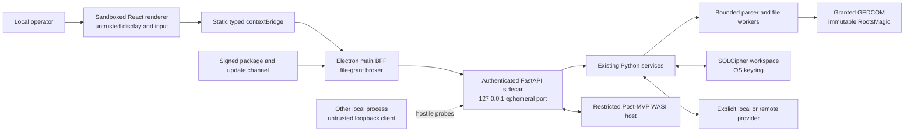
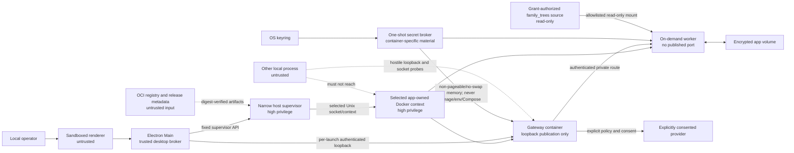
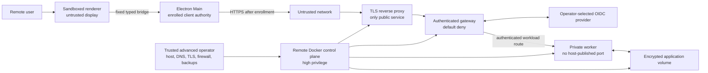

# Data-flow threat model and control matrix

## Implementation status

The 0.4.0 tree implements the one-shot CLI and prompt-toolkit/Rich REPL over
shared command, application-service, and genealogy-core contracts. The isolated
0.5.0 Issue #11 slice adds authenticated FastAPI health and capability routes,
strict version/error contracts, fail-closed loopback server configuration, and
a deterministic OpenAPI artifact. Issue #225 adds private-stdin bootstrap,
bounded Electron supervision, native sidecar smoke tests, and unsigned unpacked
package verification. It does not implement domain API routes, a renderer
domain bridge, signed installers, plugins, or an update channel. The diagrams,
controls, abuse cases, and gates below define both this partial runtime and
accepted later-roadmap requirements; implementation alone is not evidence that
every packaged assurance control has passed. Each
adapter must reuse the implemented service contracts and complete its named
verification before a planned control can be treated as effective.

[ADR-0026](ADR-0026-local-first-container-remote-deployment.md) accepts a
local-first multi-container backend, an advanced remote-client profile, and a
separately operated remote-server profile as the target architecture. None is
implemented or supported. The deployment diagrams, `TM-M01` through `TM-B01`,
`STR-H-*` through `STR-M-*` and `STR-B-*`, AB-11 through AB-21, and G5 through G7 below are
therefore requirements for planned work, not current protections. No deployment
risk is reduced until the owning issue provides native-runtime, negative-test,
and independent-review evidence at its named gate.

## Assets and trust boundaries

Sensitive assets are genealogy records, living-person status, notes, provider
credentials, SQLCipher keys, prompts/responses, consent grants, and RootsMagic
source files. Later desktop assets additionally include opaque file grants,
internal API bootstrap material, event streams, plugin packages, update
metadata, release signatures, support evidence, OCI images and digests,
generated Compose configuration, Docker contexts and sockets, workload
credentials, remote-enrollment material, encrypted application volumes, and
backups. Data crosses boundaries at
prompt-toolkit/Rich REPL input, one-shot CLI input, GEDCOM/RootsMagic parsing,
the OS keyring, encrypted database, configured provider endpoints, and exported
files. A future desktop runtime adds crossings through a sandboxed Electron
renderer and preload bridge and an authenticated FastAPI sidecar. The proposed
deployment profiles additionally cross Electron Main to a host deployment
supervisor, the supervisor to a selected Docker control plane, the host keyring
to a secret broker, containers to private application networks and encrypted
volumes, and a remote client through TLS ingress and an identity provider to an
authenticated gateway.

The local operator is trusted to choose data and consent. The renderer, other
local processes, imported genealogy content, file paths, plugins, packages,
updates, retrieved text, and every model response are untrusted. The accepted
desktop boundary and product decision are specified in
[ADR-0025](ADR-0025-electron-fastapi-desktop.md).

For the proposed Local Desktop profile, the selected Docker daemon or VM and the
narrow host supervisor are highly privileged. Possession of the Docker control
socket is treated as equivalent to administrative control over the containers
and potentially the host; it is never delegated to the renderer or an
application container. Other local users and processes, containers, registry
content, Compose input, network peers, and service responses remain untrusted.
The host OS account and its keyring are within the local user's trust boundary.

For the proposed Host Remote Server profile, the operator controls the host,
Docker daemon, DNS, TLS, identity-provider configuration, firewall, backups,
logs, and recovery keys. A root or administrator compromise can observe
plaintext while the application is running; SQLCipher and encrypted backups do
not protect against that trusted operator or a fully compromised host. Remote
mode is therefore appropriate only when every user trusts that operator. It is
single-household, non-multi-tenant software unless a future ADR and renewed
threat model establish isolation between mutually distrustful users. The
project's self-supported policy limits operational support; it does not reduce
security requirements or transfer security decisions to unsafe defaults.

```text
untrusted GEDCOM / RootsMagic -> bounded parsers -> application services
                                                 |-> SQLCipher workspace <- OS keyring
                                                 |-> consent + minimization -> LLM HTTPS
                                                 +-> atomic local exports
```

## OWASP Top 10:2025 control crosswalk

The Top 10 is an awareness and prioritization baseline, not a proof of
security. Each implementation issue must also select applicable, versioned
OWASP ASVS 5.0.0 requirements and produce negative-test evidence. Controls
remain planned—not effective—until that evidence passes.

| Risk | Applicability and controls | Verification |
|---|---|---|
| A01:2025 Broken Access Control | Privileged operations require narrow bridge/supervisor methods, authenticated internal routes, scoped grants, default-deny remote authorization, and immutable source policy (`TM-I01`, `TM-A01`, `TM-F01`, `TM-H01`, `TM-N01`, `TM-G01`). | Sender/origin, unauthorized-route/operation, disabled-capability, expired/cross-window grant, cross-profile, workload-identity, and traversal tests. |
| A02:2025 Security Misconfiguration | Secure Electron defaults, loopback-only local publication, explicit deployment modes, identity-verified Docker context, hardened containers, no implicit network, validated TLS/identity preflight, `provider=none`, restrictive permissions, and bounded limits (`TM-R01`, `TM-A03`, `TM-M01`, `TM-H01`, `TM-K01`, `TM-N01`, `TM-G01`). | Clean-install, production-config, context/socket substitution, Compose-policy, listener/firewall, IPv4/IPv6, forwarded-header, CSP/fuse, and native packaged-runtime assertions. |
| A03:2025 Software Supply Chain Failures | Locked dependencies, minimal extras, pinned CI actions, audits, SBOM/provenance, verified executable bootstrap, digest-pinned OCI/runtime/bootstrap/package inputs, signed production packages, sidecar manifests, and rollback protection (`TM-U01`, `TM-U02`, `TM-U03`, `TM-P02`, `TM-B01`). | Lockfile and image-layer review, dependency audits, CodeQL, Semgrep, secret scan, CycloneDX SBOM, bootstrap policy/receipt, digest/architecture/provenance, signature, rollback, and revoked-artifact tests. |
| A04:2025 Cryptographic Failures | SQLCipher is required; high-entropy database/API/workload material is never stored in renderer, Compose, image, environment, arguments, or logs; OS keyring/broker, encrypted backups, TLS, identity, and expiring metadata are authoritative (`TM-S01`, `TM-A01`, `TM-V01`, `TM-G01`, `TM-U02`). | Plaintext header, wrong/lost/rotated key, key-unavailable, secret-delivery canaries, TLS/issuer/audience, bearer disclosure, expiry, rollback, integrity, backup, and restore tests. |
| A05:2025 Injection | SQL AST validation and authorizer, strict schemas, static IPC/endpoint allowlists, no generated command/code execution, raw-HTML denial, and untrusted prompt/model data (`TM-I01`, `TM-L02`, `TM-P01`). | SQL/prompt/console/API/IPC/HTML/URI injection suites, schema fuzzing, and Semgrep/CodeQL. |
| A06:2025 Insecure Design | Renderer-compromise, hostile-container, hostile-network, and compromised-remote-host cases; separated adapters/services; explicit modes/consent; immutable inputs; abuse-case review; risk expiry; and profile gates apply before code (`TM-R01`, `TM-F02`, `TM-L01`, `TM-M01`, `TM-H01`, `TM-N01`). | Architecture contract tests, threat-ledger review, source sentinels, offline tests, misuse cases, and G0-G7 exit evidence. |
| A07:2025 Authentication Failures | OS login is the Local Desktop user boundary, while every local and workload route is independently authenticated; remote mode adds validated OIDC, hardened sessions, default-deny authorization, and bound single-use enrollment (`TM-A01`, `TM-A03`, `TM-N01`, `TM-G01`, `TM-X01`). | Missing/wrong/replayed token, startup race/timing, service spoofing, issuer/audience/redirect/PKCE/state/nonce, session fixation/revocation, clock skew, enrollment replay, and endpoint-substitution tests. |
| A08:2025 Software or Data Integrity Failures | Source hashes, SQLCipher integrity, validated DTOs/model output, atomic writes, sequenced events, verified executable bootstrap, digest-pinned Compose/OCI/runtime/package inputs, signed production packages/updates, and anti-rollback state (`TM-F02`, `TM-E01`, `TM-U01`, `TM-U02`, `TM-U03`, `TM-B01`). | Hash, schema, sequence/gap, round-trip, partial-publication, bootstrap identity/archive/cache tamper, Compose/image/package tamper, wrong-platform/architecture, downgrade, rollback, migration, restore, and recovery tests. |
| A09:2025 Security Logging and Alerting Failures | Stable error codes and privacy-minimal structural evidence; payload/access logging is off; container, reverse-proxy, installer, and support output forbid secrets, paths, genealogy data, prompts, responses, ports, and bearers (`TM-O01`, `TM-O02`, `TM-V01`, `TM-G01`). | Canary-secret scans across UI, API, container/proxy stderr, Docker metadata, package logs, crash/support bundles, build artifacts, and release evidence. |
| A10:2025 Mishandling of Exceptional Conditions | Fail-closed provider/storage/API/deployment policy, typed errors, preflight, timeouts, cancellation, resource quotas, bounded logs/queues/reads, idempotent terminal states, atomic output, migration safety, and rollback (`TM-D01`, `TM-E01`, `TM-C01`, `TM-K01`, `TM-V01`). | Boundary/one-over, malformed input, disconnect/reload, container/worker death, engine/keyring/IdP failure, disk-full, log growth, cancellation, restart, migration, restore, and rollback tests. |

## OWASP Top 10 for LLM Applications 2025

| Risk | Controls and disposition |
|---|---|
| LLM01 Prompt Injection | Imported text is untrusted data; models receive no tools; generated SQL is parsed and authorizer-enforced. |
| LLM02 Sensitive Information Disclosure | Pre-render consent, minimal fields, living-person denial, OS keyring, encrypted optional retention. |
| LLM03 Supply Chain | Provider SDKs are optional and locked; dependency/SBOM/security scans gate release. |
| LLM04 Data and Model Poisoning | Retrieval is not implemented. Any future local index must fingerprint sources, preserve provenance, treat retrieved text as untrusted context, and detect stale/conflicting material before display or generation. |
| LLM05 Improper Output Handling | JSON Schema validation and length caps; output is never executable. |
| LLM06 Excessive Agency | No autonomous agents, tool calls, shell, interactive-console escape hatch, write-capable SQL, or automatic destructive decisions. |
| LLM07 System Prompt Leakage | Prompts contain no credentials; templates and untrusted content are separated; disclosure is treated as possible. |
| LLM08 Vector and Embedding Weaknesses | Embeddings/vector stores remain unimplemented. A future feature requires SQLCipher-local storage by default, workspace and consent partitioning, restricted-data exclusion, versioned invalidation, bounded retrieval, and explicit cloud-retention consent. |
| LLM09 Misinformation | Deterministic evidence remains authoritative; LLM adjudication is optional and cannot delete conflicts. |
| LLM10 Unbounded Consumption | Token, output, timeout, cost, model, purpose, and row caps are enforced. |

## Desktop trust and data flow



## Proposed container and remote deployment data flow

These flows are design targets owned by #346 and its dependent work. They do
not describe the current runtime and they must remain unavailable until their
respective assurance gates pass.





The only planned public entry point is the remote TLS edge. Local Desktop binds
only loopback, and internal services have no host-published ports. Docker
network membership is reachability, not identity: every sensitive gateway-to-
service route still requires an authenticated, authorized workload credential.
Connect to Remote accepts only an explicit enrolled endpoint. Host Remote starts
only after TLS, identity, authorization, backup, and recovery preflight succeeds;
mode is never inferred from interface availability, Docker state, or an
environment variable.

### Named desktop and accepted deployment controls

Controls `TM-M01` through `TM-B01` are accepted requirements, not implemented
controls. They carry no security credit until the owning issue and gate in the
STRIDE and abuse-case ledgers have produced the required evidence.

| ID | Required control |
|---|---|
| `TM-R01` | Renderer isolation: packaged local content only, `contextIsolation: true`, `nodeIntegration: false`, `sandbox: true`, global sandboxing, no `<webview>`, no remote code, and verified production fuses. |
| `TM-R02` | Restrictive production CSP and `app://` protocol: fixed asset/MIME manifest; no renderer network, frames, objects, forms, raw HTML, executable model output, service workers, or CSP bypass. |
| `TM-I01` | Least-privilege IPC: frozen static asynchronous bridge methods, runtime schemas and size limits, main-frame sender/origin checks, listener cleanup, and no generic send/listen, dynamic channels, Electron objects, or synchronous IPC. |
| `TM-A01` | Private internal API: loopback port `0`, fresh 256-bit per-launch bearer through private stdin, exact host/version validation, no cookies/CORS/browser origins, and packaged docs disabled. |
| `TM-A02` | Sidecar lifecycle: signed manifest-verified bundled executable, minimal environment, protocol/build handshake, one server worker, bounded restart, clean process-tree shutdown, and privacy-minimal stderr. |
| `TM-A03` | Request integrity: authenticate every route before body parsing, compare credentials in constant time, reject proxy/origin/cookie headers and redirects, disable access logs, and require token-derived readiness proof. |
| `TM-S01` | Secret boundary: Python `SecretStore` and the OS keyring are the only authority; renderer may set, delete, or check presence but can never read a value. |
| `TM-F01` | Opaque file grants: native dialogs create high-entropy, window/operation-scoped, expiring, revocable grant IDs; renderer never supplies or receives unrestricted paths. |
| `TM-F02` | Backend file safety: regular-file checks, realpath/fingerprint revalidation, ingress budgets, source/output non-aliasing, immutable inputs, app-owned scratch space, atomic outputs, and failure cleanup. |
| `TM-L01` | Provider policy: explicit provider/profile/model/consent; HTTPS, DNS/private-address, proxy, TLS, host, and redirect validation; no ambient-key selection; `provider=none` remains network-free. |
| `TM-L02` | Model-output safety: output is untrusted data, schema/length validated, rendered through an allowlist, and never executed as tools, SQL, Python, shell, HTML, or plugin code. |
| `TM-D01` | Availability: bounded request/event/file sizes, queues, workers, memory/time/cost/token limits, cancellation, and deterministic overload errors. Public file boundaries use the typed limits and race checks in [bounded file ingress](FILE_INGRESS.md). |
| `TM-P01` | Plugin isolation: signed declarative manifests/UI, deny-by-default WASI host capabilities, and no renderer/main/native/Python plugin code. |
| `TM-P02` | Plugin provenance: signatures cover the canonical package tree; publisher trust/revocation, safe extraction, compatibility, permission-diff approval, and restricted-host identity are verified before activation. |
| `TM-U01` | Supply chain and updates: reviewed lockfiles, SBOM/provenance, disclosed binary-signing mode, sidecar manifests, verified update metadata, ASAR integrity where supported, and tested rollback. Project-produced 0.x release binaries and annotated tags must be unsigned; signed/notarized production packages and signed annotated tags become mandatory at v1.0.0. |
| `TM-U02` | Update freshness: signed expiring metadata binds platform, application/sidecar versions, hashes, sizes, key identity, and monotonic release state; downgrade and freeze attempts fail closed. |
| `TM-U03` | Repository executable bootstrap: one reviewed schema-v1 policy binds the exact `uv` version, supported platform/architecture archive sizes and executable hashes, GitHub release source and signer provenance, verified GitHub CLI bootstrap, pinned setup action, and locked Python verifiers. Unknown or mismatched input fails before execution; downloads and attestation verification are time-bounded, archives extract safely, a fresh executable's identity is checked before atomic cache publication, cached binaries are re-hashed, and installation and receipt writes remain anchored to held parent handles so symlink, reparse-point, and ancestor-swap races fail closed. Sanitized receipts gate release evidence, and a post-preflight setup or installed-binary failure atomically replaces the canonical success status with a stable failure category. Hosted callers grant least-privilege attestation access only to the attestation subprocess, the repository Actions allowlist admits only the reviewed setup-action commit, and workflow auditing covers both workflow and local-action manifests. |
| `TM-E01` | Event integrity: bounded sequenced streams, acknowledgement/backpressure, gap handling, terminal-state idempotency, startup reconciliation, and no automatic replay of side-effecting work after output begins. |
| `TM-M01` | Deployment-mode integrity: Local Desktop is the safe default; Connect Remote and Host Remote require explicit, informed selection and separate configuration. `provider=none` is incompatible with Connect Remote and Host Remote, forces local execution, and opens no network socket. It selects the socket-free native application-service path and does not start the container backend, host supervisor, Engine API, gateway, workers, or containers. No environment, listener, interface, Docker context, installer flag omission, or discovered server may infer a remote mode, widen a bind, enable synchronization, or reuse credentials across profiles. |
| `TM-H01` | Docker control-plane least authority: use only an application-owned, identity-verified context and local socket selected by the host supervisor; ignore ambient `DOCKER_HOST`/`DOCKER_CONTEXT`; reject TCP/SSH endpoints; allowlist lifecycle and inspection operations; validate generated Compose before use; and expose no generic exec, copy, build, mount, image-load, plugin, swarm, or socket pass-through. The renderer and application containers never receive the socket or a Docker client credential. |
| `TM-K01` | Runtime and container isolation: native architecture, rootless or VM-isolated engine where supported, non-root users, read-only roots, dropped capabilities, `no-new-privileges`, default-deny seccomp/MAC policy, no host network/PID/IPC/devices/privilege, explicit resource limits, bounded logs, and platform-native firewall/socket tests. Generated Compose permits only application-owned paths plus an allowlisted read-only `family_trees` mount resolved from an opaque native-dialog grant, revalidated as an immutable source, and exposed only to the authorized worker; writable, broad, ungranted, aliased, and additional host mounts fail closed. Rootful-daemon, Docker-group, WSL2, Hyper-V, VM, named-pipe, user-namespace, and kernel limitations are disclosed and tested rather than assumed equivalent. |
| `TM-N01` | Network and workload identity: explicit internal networks, no implicit default network, no direct host publication for workers/data services, loopback-only local gateway, default-deny route authorization, short-lived service-specific credentials, replay resistance, bounded ingress/egress, provider-policy enforcement, and fail-closed IPv4/IPv6/proxy/forwarded-header handling. Network membership alone never authorizes a request. |
| `TM-V01` | Container secret and data custody: the OS keyring remains the local authority; a narrow broker delivers per-container, short-lived material only through non-pageable or locked no-swap memory, or a no-swap memory-backed filesystem with equivalent platform evidence. Material never enters Compose, images, environment, arguments, logs, swap, or inspectable metadata. SQLCipher keys, identity secrets, encrypted volumes, migrations, backups, restore, rotation, revocation, and uninstall are fail-closed, versioned, recoverable, and tested for loss as well as disclosure. |
| `TM-G01` | Remote edge and identity: only the TLS reverse proxy is public; TLS and certificate validation, exact external origin, trusted-proxy allowlists, OIDC issuer/audience/redirect/PKCE/state/nonce, session rotation/revocation, CSRF protection, rate limits, default-deny authorization, administrative re-authentication, and clock-skew bounds pass preflight before Host Remote starts. Host Remote authorizes exactly one configured household principal; every other OIDC subject is rejected before route or object access. No anonymous health, docs, setup, bootstrap, or internal service route is exposed. |
| `TM-X01` | Remote enrollment and endpoint pinning: Connect Remote uses an explicit normalized HTTPS endpoint and one-time, expiring, single-use enrollment ceremony bound to server identity, user, client instance, redirect, and intended profile. Discovery, redirects, DNS rebinding, private/link-local/metadata targets, callback/deep-link hijacking, token reuse, endpoint changes, and cross-profile credential reuse fail closed. |
| `TM-B01` | Deployment supply-chain integrity: OCI bases, application images, Compose models, runtime components, package-manager metadata, and bootstrap artifacts are versioned and digest-pinned, license-inventoried, SBOM/provenance checked, architecture-bound, rollback-protected, and acquired without remote-shell execution. Pre-1.0 uses published cryptographic digests and reproducibility evidence; production signing, notarization, and repository signing become mandatory at v1.0 under #132. |

### Issue #100 Electron boundary evidence

| Control | Source and runtime evidence | Packaged evidence and residual ownership |
|---|---|---|
| `TM-R01` | Secure window defaults and weakened-future-window regression tests; global web-content and session denials; production E2E proves no renderer Node object, child-window creation, added privileged bridge method, or developer-tools keyboard escape. | The desktop security gate inspects the built `app.asar` and all eight declared fuses. Signing and cross-platform release evidence remain #132/#131. |
| `TM-R02` | Exact `app://bundle` route/MIME/CSP tests reject encoded traversal, unknown assets, wrong hosts, and CSP bypass; production E2E proves fetch, WebSocket, and service-worker denial. | The fixed manifest is exercised from the production build. Packaged cross-platform XSS and model-output cases remain #131/#112. |
| `TM-I01` | The #99 frozen bridge is not expanded for security reporting or external links; main-frame sender/origin checks remain in main; E2E asserts those methods are absent from the renderer. | Rich IPC proxy schemas, bounds, listener lifecycle, and sender/navigation-race coverage remain #101/#131. |
| `TM-U01` | The lockfile and package policy have static regression coverage. | The unpacked application is inspected for `app.asar`, declared fuses, and supported ASAR-integrity metadata. Signing, notarization, provenance, updates, and rollback remain #132. |
| `TM-C01` | Concurrency integrity: single-instance coordination, per-artifact output locks, optimistic revisions, and idempotency keys prevent duplicate mutations and concurrent publication. | Evidence pending under Issue #131 residual release-surface coverage. |
| `TM-O01` | Privacy-minimal observability: allowlisted stable codes and hashes/counts only by default; no secrets, unrestricted paths, genealogy values, prompts, responses, or bootstrap material. | Runtime policy evidence remains tracked in Issue #131 residual controls. |
| `TM-O02` | Runtime evidence hygiene: access-log suppression, structural redacted stderr, crash-dump/support-bundle policy, canary scans, and development-tool restrictions prevent payload capture. | Evidence pending in Issue #132 and related platform-runner checks. |

### Issue #306 verified uv bootstrap evidence

| Control | Source and workflow evidence | Hosted evidence and residual ownership |
|---|---|---|
| `TM-U03` | The schema-v1 policy and standard-library bootstrap reject unknown policy fields, platforms, architectures, assets, URLs, indexes, archive sizes, and symlinked or reparse-point install and receipt paths. POSIX directory-descriptor tests prove an ancestor swap cannot redirect installation, initial receipt publication, or post-preflight failure publication; Windows holds ancestor handles without delete sharing while committing. Offline tests prove oversized, undersized, and overdue downloads leave no partial file; corrupted GitHub CLI archives never execute; corrupted `uv` archives never reach attestation; wrong repository/signer/workflow/source commit/ref/issuer/predicate fail; unsafe tar and ZIP members cannot escape; a wrong-version executable never reaches the repository cache; cached binaries are re-hashed; verifier authentication failures and bounded-timeout failures remain distinct from provenance failures; receipt cleanup cannot mask its stable write error; malformed receipts cannot be transitioned after preflight; and receipts exclude secrets and local paths. Workflow contracts require least-privilege attestation access, limit GitHub token variables to the attestation subprocess, use the same local composite action and exact pinned action commit, record setup-action or installed-binary failure before always-on receipt upload, and audit both workflow and local-action manifests wherever repository jobs use `uv`; release evidence validates the receipt against the current policy. | A live macOS ARM64 run verified the reviewed `uv` 0.12.1 archive and SLSA identity before execution. Native exact-head GitHub-hosted results for all supported Linux, macOS, and Windows x86-64/ARM64 rows remain required before merge and release. This control covers only the repository's `uv` toolchain; application update channels, OCI/runtime acquisition, and other deployment bootstrap work remain owned by #132 and #353/#358-#362. |

### Issue #11 source-level evidence

The isolated 0.5.0 foundation implements and tests the source-level subset of
`TM-A01`, `TM-A03`, `TM-D01`, `TM-I01`, and `TM-O02` owned by Issue #11:

- Uvicorn is configured for IPv4 loopback port `0`, with access logging, proxy
  headers, server headers, and date headers disabled.
- Authentication occurs before route or body processing with a constant-time
  bearer comparison. Exact host, API version, and paired app build are required;
  browser origin, cookie, and forwarding headers fail closed.
- Only authenticated health and capability discovery are exposed. Capabilities
  are the intersection of enabled `ModuleDescriptor` routes and registered
  `CommandExecutor` handlers; generic command and domain routes are absent.
- Strict DTOs, bounded request and pagination policies, sanitized shared error
  semantics, no CORS or cookies, no runtime docs/schema route, deterministic
  OpenAPI generation, and network-free `provider=none` discovery have focused
  negative tests.

Private-stdin bootstrap, Electron supervision, token-derived readiness, bounded
restart/shutdown behavior, and native packaged-resource assertions have focused
tests. Broader connect-first/replay/timing evidence, signed-package and
process-tree assurance, final platform execution, and every domain route are
still pending. Because that release evidence is incomplete, the residual-risk
ledger below is not reduced by this implementation alone.

## STRIDE boundary ledger

Every row is an owned threat statement. "Negative" names the minimum planned
adversarial test; the detailed test matrix belongs to Issue #131. A control is
not considered effective until its named test and packaged evidence pass.

| Threat ID | STRIDE threat | Controls | Owner / gate | Planned negative test |
|---|---|---|---|---|
| `STR-R-S` | Spoofing: a forged child frame or origin invokes a privileged renderer bridge method. | `TM-R01`, `TM-I01` | #100, #101 / G1 | Negative: wrong-frame, wrong-origin, destroyed-window, and navigation-race calls are denied. |
| `STR-R-T` | Tampering: malformed, oversized, or version-confused IPC changes privileged arguments. | `TM-I01`, `TM-D01` | #101, #131 / G1 | Negative: schema fuzz, unknown-field, boundary/one-over, and prototype-pollution payloads fail closed. |
| `STR-R-R` | Repudiation: a privileged action or event cannot be correlated with its window, request, and terminal job state. | `TM-E01`, `TM-O01` | #101, #104 / G1 | Negative: duplicate, gap, reload, cancellation, and terminal-state races remain attributable and idempotent. |
| `STR-R-I` | Information disclosure: bridge DTOs, errors, clipboard, or UI expose secrets, paths, provider payloads, or bootstrap material. | `TM-S01`, `TM-F01`, `TM-O01`, `TM-O02` | #101, #105, #131 / G1 | Negative: canary values never appear in renderer globals, DTOs, errors, logs, crash/support artifacts, or snapshots. |
| `STR-R-D` | Denial of service: IPC or event flooding blocks main or exhausts renderer memory. | `TM-D01`, `TM-E01` | #101, #104, #131 / G1 | Negative: rate, queue, payload, subscriber, reload, and stalled-ack limits return bounded coded errors. |
| `STR-R-E` | Elevation: generic IPC, Node objects, navigation, raw HTML, or weak fuses escape the renderer sandbox. | `TM-R01`, `TM-R02`, `TM-I01` | #100, #101, #131 / G1 | Negative: absent-Node assertions, XSS payloads, unexpected navigation/windows, and packaged fuse inspection fail on any privilege. |
| `STR-A-S` | Spoofing: another local process races startup, replays a bearer, or impersonates the sidecar. | `TM-A01`, `TM-A02`, `TM-A03` | #11, #102 / G1 | Negative: connect-first, missing/wrong/replayed bearer, false readiness, and wrong-binary tests fail closed. |
| `STR-A-T` | Tampering: host, version, proxy metadata, redirect, response, or build identity is confused in transit. | `TM-A02`, `TM-A03` | #11, #102, #131 / G1 | Negative: wrong Host/version/content type/build, forwarding headers, redirect, malformed response, and port substitution are rejected. |
| `STR-A-R` | Repudiation: a sidecar request cannot be matched to a privacy-minimal result and terminal state. | `TM-E01`, `TM-O01` | #11, #104 / G1 | Negative: duplicate idempotency keys, disconnect, cancellation, and restart retain one structural terminal outcome. |
| `STR-A-I` | Information disclosure: bearer, port, path, exception, request body, or response payload reaches renderer, process metadata, or logs. | `TM-A01`, `TM-O01`, `TM-O02` | #11, #102, #131 / G1 | Negative: canary bootstrap/payload values are absent from arguments, environment, files, renderer, access logs, stderr, and support output. |
| `STR-A-D` | Denial of service: request, body, stream, readiness, restart, or shutdown storms exhaust the sidecar or app. | `TM-A02`, `TM-A03`, `TM-D01`, `TM-E01` | #11, #102, #104 / G1 | Negative: pre-auth oversized bodies, slow clients, stream floods, restart loops, and shutdown races stay bounded. |
| `STR-A-E` | Elevation: arbitrary routes, commands, public binding, docs, CORS, or console dispatch make the sidecar a local privilege proxy. | `TM-A01`, `TM-A03`, `TM-I01` | #11, #101 / G1 | Negative: non-loopback bind, unknown route/method, CLI name, docs/schema route, browser origin, and unmediated endpoint are unavailable. |
| `STR-F-S` | Spoofing: a symlink, replacement race, device, alias, or stale grant makes a different file appear selected. | `TM-F01`, `TM-F02` | #103, #114, #131 / G1 | Negative: link/device, case/realpath alias, replace-after-grant, expired/cross-window grant, and fingerprint mismatch are rejected. |
| `STR-F-T` | Tampering: a source or existing output is overwritten, partially published, or changed during processing. | `TM-F02`, `TM-C01` | #103, #114, #118 / G1 | Negative: source/output alias, concurrent writer, source-hash change, worker death, disk-full, and publish failure preserve sentinels. |
| `STR-F-R` | Repudiation: an import, export, backup, or mutation lacks source fingerprint and structural result evidence. | `TM-C01`, `TM-O01` | #103, #123 / G1 | Negative: missing correlation/source hash, duplicate publish, and recovery paths cannot report an untraceable success. |
| `STR-F-I` | Information disclosure: records, notes, keys, paths, plaintext databases, scratch files, or backups escape. | `TM-S01`, `TM-F01`, `TM-F02`, `TM-O02` | #103, #123, #131 / G1 | Negative: canaries are absent from DTOs/logs/temp remnants; plaintext, weak keyring fallback, broad permissions, and unencrypted backups fail. |
| `STR-F-D` | Denial of service: huge, recursive, corrupt, compressed, locked, or device-like input consumes memory, CPU, disk, or workers. | `TM-D01`, `TM-F02` | #114, #118, #131 / G2 | Negative: boundary/one-over size/count/depth/ratio, parser complexity, cancellation, queue-full, and scratch-quota tests remain bounded. |
| `STR-F-E` | Elevation: parser features, SQLite extensions, path traversal, or inherited worker capabilities reach the host. | `TM-F02`, `TM-D01` | #103, #114, #118 / G1 | Negative: traversal, extension loading, shell metacharacters, unexpected environment/socket/process access, and malformed native input fail closed. |
| `STR-L-S` | Spoofing: profile confusion, redirect, proxy, DNS rebinding, or ambient keys select an unapproved provider. | `TM-L01`, `TM-S01` | #108, #110, #131 / G1 | Negative: absent consent, ambient-only key, redirect, changed DNS/private address, proxy, wrong TLS host, and profile/model mismatch are denied. |
| `STR-L-T` | Tampering: provider output, structured data, Markdown, usage, or finish state is malformed or adversarial. | `TM-L02`, `TM-E01` | #110, #111, #112 / G2 | Negative: schema/length/sequence errors, raw HTML/SVG, unsafe URI/image, tool/code/SQL content, and usage mismatch remain inert. |
| `STR-L-R` | Repudiation: consent, provider/model identity, cancellation, usage, retention, or terminal status is not auditable. | `TM-E01`, `TM-O01` | #108, #110, #111 / G2 | Negative: cancelled/disconnected/reloaded streams and provider errors produce one redacted terminal audit state. |
| `STR-L-I` | Information disclosure: living-person data, credentials, prompts, responses, or retained content reaches an unapproved endpoint or artifact. | `TM-S01`, `TM-L01`, `TM-O01`, `TM-O02` | #108, #110, #131 / G2 | Negative: data-class/retention overreach, redirect, logging, crash, cache, and support-bundle canaries are denied or absent. |
| `STR-L-D` | Denial of service: token, retry, timeout, queue, stream, or cost exhaustion degrades the app. | `TM-D01`, `TM-E01` | #104, #110, #111 / G2 | Negative: token/cost/time/retry/event bounds, stalled provider, stalled renderer, and cancellation return deterministic terminal errors. |
| `STR-L-E` | Elevation: model output gains tool, filesystem, SQL, Python, shell, HTML, or plugin authority. | `TM-L02`, `TM-P01`, `TM-I01` | #110, #112, #125 / G2 | Negative: generated commands, tool calls, SQL, code fences, HTML, URIs, and plugin-like payloads remain display-only data. |
| `STR-U-S` | Spoofing: a plugin publisher, restricted host, package signer, update channel, or release identity is impersonated. | `TM-P02`, `TM-U01`, `TM-U02` | #16, #125, #132 / G3-G4 | Negative: unknown/revoked key, wrong publisher/host/platform/version, and mismatched certificate/signature are rejected. |
| `STR-U-T` | Tampering: package tree, manifest, ASAR, sidecar, update metadata, or release artifact is modified. | `TM-P02`, `TM-U01`, `TM-U02` | #16, #102, #132 / G3-G4 | Negative: unexpected file, tree/hash/size mismatch, post-sign mutation, expired metadata, and wrong sidecar fail offline verification. |
| `STR-U-R` | Repudiation: install, permission approval, enable, update, rollback, revoke, disable, or removal lacks evidence. | `TM-P02`, `TM-U02`, `TM-O01` | #16, #126, #132 / G3-G4 | Negative: missing signer/version/permission diff/decision/release state prevents activation or an unverifiable success. |
| `STR-U-I` | Information disclosure: a plugin or updater receives undeclared data, secrets, paths, environment, network, or host resources. | `TM-P01`, `TM-S01`, `TM-O02` | #16, #125, #131 / G3 | Negative: raw-secret, filesystem, environment, socket, clock, process, database, and provider access are absent unless a narrow declared host call allows it. |
| `STR-U-D` | Denial of service: archive bombs, plugin loops/event floods, updater failures, or rollback loops disable the app. | `TM-D01`, `TM-P02`, `TM-U02` | #16, #125, #132 / G3-G4 | Negative: count/size/depth/ratio, CPU/memory/event quota, interrupted update, disk-full, and repeated rollback preserve the prior version. |
| `STR-U-E` | Elevation: scripts, `eval`, dynamic imports, native plugins, Python entry points, or unsigned updates execute with user rights. | `TM-P01`, `TM-P02`, `TM-U01` | #16, #125, #131 / G3 | Negative: script/hooks/native code, WASI escape, renderer/preload/main imports, unsigned packages, and unapproved permission expansion cannot activate. |
| `STR-M-T` | Tampering: installer, environment, stale configuration, or upgrade changes Local Desktop into a remote profile, widens a bind, or enables synchronization. | `TM-M01`, `TM-N01` | #346, #347, #358 / G0, G5-G7 | Negative: omitted/unknown flags, environment injection, stale remote state, downgrade, and upgrade/repair preserve local-only behavior until a separate informed transition succeeds. |
| `STR-M-R` | Repudiation: the selected deployment profile, remote operator, endpoint, trust warning, or destructive lifecycle decision cannot be attributed. | `TM-M01`, `TM-O01` | #346, #347, #358 / G0, G5-G7 | Negative: missing profile/endpoint/operator/version/decision evidence prevents activation without recording secrets or genealogy data. |
| `STR-M-E` | Elevation: mode confusion turns the desktop or package manager into an implicit remote-server bootstrapper. | `TM-M01`, `TM-G01` | #346, #347, #358 / G0, G6-G7 | Negative: interface discovery, daemon availability, package defaults, environment, unattended install, and first-run cancellation cannot select Host Remote or open a public listener. |
| `STR-H-S` | Spoofing: an attacker-controlled Docker context, socket, proxy, or daemon impersonates the application runtime. | `TM-H01`, `TM-M01` | #363 / G5 | Negative: ambient context variables, default-context changes, symlink/socket replacement, wrong owner/mode/peer identity, TCP/SSH endpoint, and daemon-version substitution fail closed. |
| `STR-H-T` | Tampering: malicious Compose input, engine responses, labels, names, or pre-existing resources redirect lifecycle operations to attacker or unrelated resources. | `TM-H01`, `TM-B01` | #363 / G5 | Negative: unknown Compose fields, unsafe interpolation, label/name collision, post-validation mutation, forged inspect output, and cross-profile resources cannot be started, changed, or removed. |
| `STR-H-I` | Information disclosure: Docker inspect, events, logs, environment, mounts, or diagnostics expose credentials, paths, records, or host metadata. | `TM-H01`, `TM-V01`, `TM-O02` | #351, #363 / G5 | Negative: canaries remain absent from Compose, image history, inspect/events, environment, arguments, logs, error text, and support bundles. |
| `STR-H-D` | Denial of service: engine stalls, event floods, restart loops, orphan resources, or unbounded output block the app or consume host resources. | `TM-H01`, `TM-K01`, `TM-D01` | #348, #349, #363 / G5 | Negative: unavailable/wedged daemon, bounded-output overflow, crash loops, orphan reconciliation, disk pressure, and cancellation return a stable recovery state. |
| `STR-H-E` | Elevation: a generic Docker proxy, renderer/container socket, build/exec/copy/mount primitive, or ambient daemon access becomes host-administrative authority. | `TM-H01`, `TM-I01`, `TM-K01` | #363 / G5 | Negative: renderer/container clients, unallowlisted API paths and methods, exec/build/copy/archive/plugin/swarm/volume/device operations, and hostile identifiers are unavailable. |
| `STR-K-E` | Elevation: a privileged/rootful container, daemon, VM integration, kernel/runtime flaw, broad capability, device, namespace, or host mount escapes isolation. | `TM-K01`, `TM-H01` | #348, #349, #364, #365 / G5, G7 | Negative: runtime-policy inspection and native attack cases reject privilege, root user, host namespaces/network, devices, Docker socket, broad mounts/capabilities, missing MAC/seccomp policy, and unsupported daemon mode. |
| `STR-K-D` | Denial of service: containers exhaust CPU, memory, PIDs, disk, inodes, connections, or logs and prevent recovery. | `TM-K01`, `TM-D01` | #349, #364, #365 / G5, G7 | Negative: native quota/one-over, log rotation, disk/inode full, fork/connection storms, and restart tests preserve bounded host control and documented recovery. |
| `STR-N-S` | Spoofing: a container or local process joins/reaches an application network and impersonates the gateway or worker. | `TM-N01`, `TM-A03` | #199, #350 / G5 | Negative: wrong workload identity, source container, audience, route, protocol, port, and replayed credential are rejected even from an attached network. |
| `STR-N-T` | Tampering: DNS, proxy, forwarded headers, redirects, dual-homing, or route/version confusion changes the intended service or provider destination. | `TM-N01`, `TM-L01` | #199, #350 / G5-G6 | Negative: IPv4/IPv6 wildcard, DNS rebinding, proxy injection, forged forwarding headers, redirect, network alias collision, dual-homed egress, and wrong service version fail closed. |
| `STR-N-I` | Information disclosure: host publication, lateral movement, unrestricted egress, or an unauthenticated internal route exposes genealogy or secret data. | `TM-N01`, `TM-V01` | #199, #350, #351 / G5-G6 | Negative: listener/firewall scans from host, VM, peer LAN host, sibling container, and remote network prove only the intended edge is reachable and every sensitive route authenticates. |
| `STR-V-T` | Tampering: volume replacement, rollback, partial migration, wrong key, or malicious backup/restore changes encrypted application state. | `TM-V01`, `TM-F02`, `TM-U02` | #123, #351 / G5-G6 | Negative: volume identity, schema/version, integrity, key binding, rollback, interruption, wrong-profile restore, and sentinel tests fail atomically. |
| `STR-V-R` | Repudiation: key rotation, migration, backup, restore, export, or destructive uninstall lacks privacy-minimal structural evidence. | `TM-V01`, `TM-O01` | #123, #351, #358 / G5-G7 | Negative: missing operation/version/result/owner evidence cannot report success; evidence contains no key, record, payload, or unrestricted path. |
| `STR-V-I` | Information disclosure: secrets or plaintext enter Compose, images, environment, arguments, files, logs, swap, snapshots, backups, or another container/profile. | `TM-V01`, `TM-S01`, `TM-O02` | #123, #351 / G5-G6 | Negative: canary scans, cross-container/profile reads, inspect/history, stopped-container remnants, backup inspection, and permission tests reveal no secret or plaintext. |
| `STR-V-D` | Denial of service: lost/unavailable keyring, failed rotation/migration, corrupt volume, bad backup, or destructive lifecycle action makes data unrecoverable. | `TM-V01`, `TM-C01` | #123, #351 / G5-G6 | Negative: keyring denial, wrong/lost key, cancellation, power loss, disk-full, corrupt backup, failed restore, upgrade rollback, and uninstall preserve the prior recoverable state or stop before mutation. |
| `STR-G-S` | Spoofing: a false DNS/TLS endpoint, issuer, redirect, proxy, or login response impersonates the remote server or identity provider. | `TM-G01`, `TM-X01` | #355, #356, #357 / G6 | Negative: invalid/expired/mismatched certificate, issuer/audience/origin/redirect, untrusted proxy, DNS rebind, login mix-up, and clock skew fail closed. |
| `STR-G-T` | Tampering: reverse-proxy headers, OIDC parameters, session state, cookies, or route metadata alter authenticated identity or destination. | `TM-G01`, `TM-N01` | #355, #356 / G6 | Negative: forwarded-header injection, parameter pollution, missing/changed PKCE/state/nonce, cookie fixation, CSRF, route smuggling, and version skew are rejected. |
| `STR-G-D` | Denial of service: public requests, login attempts, large bodies, slow clients, or IdP/clock/certificate failure exhaust or deadlock the remote service. | `TM-G01`, `TM-D01` | #355, #356 / G6 | Negative: unauthenticated and authenticated rate/size/time/concurrency bounds, slowloris, IdP outage, certificate expiry, and clock drift fail boundedly without bypass. |
| `STR-G-E` | Elevation: anonymous setup/health/docs, broken object/route authorization, stale admin session, or proxy trust grants a nonconfigured subject or administrator authority. | `TM-G01`, `TM-N01` | #355, #356 / G6 | Negative: anonymous and every nonconfigured OIDC subject in the object/route matrix, stale/revoked session, missing re-authentication, direct-backend access, and forged proxy source receive no privileged response. |
| `STR-X-S` | Spoofing: discovery, redirect, callback/deep-link hijacking, or enrollment mix-up binds the desktop to an attacker server or account. | `TM-X01`, `TM-G01` | #357 / G6 | Negative: non-HTTPS/ambiguous endpoint, redirect, DNS/private/link-local/metadata substitution, wrong callback owner, server identity, user, client, or profile fails closed. |
| `STR-X-I` | Information disclosure: enrollment/session material leaks through URLs, command history, referrers, logs, clipboard, deep links, renderer state, or reuse. | `TM-X01`, `TM-S01`, `TM-O02` | #357 / G6 | Negative: canary enrollment and session material is single-use/expiring and absent from URLs, process arguments, history, logs, clipboard, renderer globals, and another client/profile. |
| `STR-B-S` | Spoofing: a registry, image tag, runtime release, package repository, publisher, platform, or architecture is impersonated. | `TM-B01`, `TM-U01`, `TM-U02`, `TM-U03` | #306, #132, #353, #358-#362 / G7 | Negative: mutable tag, wrong digest/registry/publisher/platform/architecture, mirror substitution, unknown/revoked key, and expired metadata fail before execution. |
| `STR-B-T` | Tampering: an OCI layer, Compose model, bootstrap binary, package script, repository metadata, or downgrade alters the deployment. | `TM-B01`, `TM-U02`, `TM-U03` | #306, #132, #353, #358-#362 / G7 | Negative: hash/size/SBOM/provenance mismatch, unsafe archive or package hook, post-validation mutation, rollback/freeze, interrupted acquisition, and cross-channel conflict preserve the prior trusted version. |

## Abuse-case and risk ledger

An entry begins with **inherent risk**, before credit for controls. It may move
to **evidence-backed residual risk** only after the linked negative tests,
packaged assertions, and review evidence pass. A planned or implemented control
without passing evidence does not reduce the risk rating. The evidence link,
test environment, app/sidecar versions, reviewer, and date belong in the issue
or release evidence, never private payloads.

| ID | Abuse case | Inherent risk | Controls, owner, gate, and planned negative test | Evidence-backed residual risk |
|---|---|---|---|---|
| `AB-01` | A compromised renderer forges frames, invokes privileged IPC, or obtains Node/Electron objects. | Medium likelihood / Critical impact | `TM-R01`, `TM-R02`, `TM-I01`; #100, #101, #131; G1/G2. Negative: sender/origin fuzz, absent-Node assertions, CSP/XSS suite, window inheritance, and packaged fuse inspection. | Partially evidenced: #100 proves isolation, CSP, global session/window denial, and fuse/ASAR policy. The risk rating is not reduced while #101 sender/race coverage and the #131 adversarial suite remain pending. |
| `AB-02` | Another local process races startup, probes loopback, replays credentials, or abuses health/shutdown. | Medium / Critical | `TM-A01`, `TM-A02`, `TM-A03`; #11, #102, #131; G1/G2. Negative: private-stdin bootstrap, connect-first/replay/timing, token-derived readiness, pre-parse auth, exact-host, and process-tree cleanup. | Not reduced: private bootstrap and bounded supervision are implemented, but replay/timing, process-tree, signed-package, and final platform evidence remain pending. |
| `AB-03` | UI, generated contracts, logs, crash reports, backups, or support evidence disclose provider or SQLCipher material. | Medium / Critical | `TM-S01`, `TM-O01`, `TM-O02`; #105, #123, #131; G1/G2. Negative: canary-secret scans across responses, storage, logs, crash/support artifacts, fixtures, and release evidence. | Not reduced: implementation and packaged evidence pending. |
| `AB-04` | A malicious or replaced GEDCOM exploits parser complexity, symlinks, aliasing, races, or partial publication. | High / High | `TM-F01`, `TM-F02`, `TM-D01`, `TM-C01`; #103, #114, #118, #131; G1/G2. Negative: boundary/one-over, replacement races, worker failure, output locks, cancellation, and sentinel preservation. | Not reduced: worker and packaged evidence pending. |
| `AB-05` | Model Markdown uses HTML, SVG, handlers, schemes, images, links, or copied content to execute or exfiltrate. | High / Critical | `TM-R02`, `TM-L02`; #112, #131; G2. Negative: AST allowlist tests for script, HTML, SVG, URI, image, copy, external-link, and CSP cases. | Not reduced: renderer and packaged XSS evidence pending. |
| `AB-06` | Provider/profile confusion, redirects, DNS changes, proxies, or ambient keys send living-person data to an unapproved endpoint. | Medium / Critical | `TM-L01`, `TM-S01`, `TM-O01`; #108, #110, #131; G1/G2. Negative: explicit-profile/consent, redirect, TLS/host/DNS revalidation, proxy denial, and network instrumentation proving `provider=none` is offline. | Not reduced: desktop contract and network evidence pending. |
| `AB-07` | A provider or stalled renderer floods tokens, creates event gaps, prevents cancellation, or duplicates audit completion. | High / High | `TM-D01`, `TM-E01`; #104, #111, #131; G1/G2. Negative: bounded queue/ACK, gap/duplicate/reload races, idempotent terminal transitions, startup reconciliation, and no post-output retry. | Not reduced: streaming evidence pending. |
| `AB-08` | A plugin impersonates a publisher, traverses extraction, expands permissions, or escapes into native/renderer execution. | Medium / Critical | `TM-P01`, `TM-P02`; #16, #125, #131; G3. Negative: canonical signature, revocation, archive bomb/traversal/collision, permission diff, WASI escape, and restricted-host identity. | Not reduced: Post-MVP feature disabled pending renewed review. |
| `AB-09` | A compromised update channel serves a valid old release, wrong-platform sidecar, mutable artifact, or expired metadata. | Low / Critical | `TM-U01`, `TM-U02`; #102, #131, #132; G4. Negative: offline signature, expiry, anti-rollback, hash/size/platform/version, revoked key, interruption, and recovery. | Not reduced: distribution remains disabled pending evidence. |
| `AB-10` | Two app instances or jobs publish the same output or repeat a mutation after a crash. | Medium / High | `TM-C01`, `TM-E01`, `TM-F02`; #104, #117, #129, #131; G2/G3. Negative: single instance, idempotency, optimistic revision, artifact lock, crash recovery, and duplicate terminal state. | Not reduced: concurrency and packaged evidence pending. |
| `AB-11` | Profile confusion or an installer/runtime default silently changes Local Desktop into Connect Remote or Host Remote. | Medium / Critical | `TM-M01`, `TM-O01`; #346, #347, #358; G5-G7. Negative: missing/unknown settings, ambient environment, discovery, repair, upgrade, downgrade, cancellation, and stale profile state retain local-only behavior. | Not reduced: accepted architecture only; implementation and native evidence pending. |
| `AB-12` | A malicious Docker context, socket, daemon, or Compose response tricks the supervisor into host-administrative operations. | Medium / Critical | `TM-H01`, `TM-B01`; #363; G5. Negative: ambient contexts, socket replacement, remote endpoint, unsafe Compose fields, resource collisions, and unallowlisted Engine methods fail closed. | Not reduced: supervisor and daemon-identity evidence pending. |
| `AB-13` | A daemon, VM, container runtime, or kernel compromise escapes isolation and reaches host or genealogy data. | Medium / Critical | `TM-H01`, `TM-K01`; #348, #349, #364, #365; G5/G7. Negative: privileged/root execution, host namespaces, devices, broad mounts/capabilities, socket access, and unsupported runtime modes are rejected. | Inherent platform risk remains; no residual reduction without native hardening evidence and a current risk review. |
| `AB-14` | Containers exhaust CPU, memory, PIDs, storage, inodes, connections, or logs and make data or recovery unavailable. | High / High | `TM-K01`, `TM-D01`; #349, #364, #365; G5/G7. Negative: quota one-over, fork/connection storm, disk/inode full, log growth, restart loop, and shutdown tests preserve bounded host control. | Not reduced: resource-budget and recovery evidence pending. |
| `AB-15` | A sibling container, local process, DNS/proxy manipulation, or network attachment impersonates a workload or moves laterally. | Medium / Critical | `TM-N01`, `TM-A03`; #199, #350; G5/G6. Negative: wrong workload/audience/route, replay, alias collision, dual-homing, IPv4/IPv6 wildcard, and direct-backend access are denied. | Not reduced: topology and workload-authentication evidence pending. |
| `AB-16` | SQLCipher or provider material enters Compose, images, environment, inspect data, logs, volumes, snapshots, or backups. | Medium / Critical | `TM-V01`, `TM-S01`, `TM-O02`; #105, #123, #351; G5/G6. Negative: canary scans, cross-container/profile reads, wrong-key restore, rotation interruption, and backup inspection reveal no plaintext or secret. | Not reduced: secret broker and cross-container recovery evidence pending. |
| `AB-17` | TLS, DNS, proxy trust, OIDC, session, CSRF, authorization, or clock failure exposes Host Remote or grants the wrong identity. | High / Critical | `TM-G01`, `TM-N01`; #107, #355, #356; G6. Negative: invalid certificate/issuer/audience/origin, forged headers, login mix-up, fixation/revocation, CSRF, anonymous routes, and wrong-user access fail closed. | Not reduced: remote edge/identity implementation and external tests pending. |
| `AB-18` | Enrollment or endpoint material is stolen, replayed, logged, placed in a URL, or binds a client to an attacker server/account. | Medium / Critical | `TM-X01`, `TM-S01`; #357; G6. Negative: redirect/deep-link hijack, endpoint substitution, callback mix-up, expiry/replay, clipboard/history/log leakage, and cross-profile reuse fail closed. | Not reduced: enrollment implementation and adversarial evidence pending. |
| `AB-19` | A registry, mutable tag, wrong-architecture image, bootstrap package, or package repository supplies a compromised deployment. | Medium / Critical | `TM-B01`, `TM-U01`, `TM-U02`, `TM-U03`; #306, #132, #353, #358-#362; G7. Negative: digest/platform/provenance/SBOM/license mismatch, rollback/freeze, mirror substitution, unsafe archive/hook, and interrupted acquisition preserve the trusted version. | Not yet reduced: #306 implementation, offline negative tests, and local macOS ARM64 live proof cover only `uv`; exact-head native supported-platform results and all non-`uv` publication/acquisition controls remain pending. |
| `AB-20` | Repair, migration, upgrade, rollback, uninstall, or orphan cleanup mutates data or deletes unrelated resources. | Medium / Critical | `TM-H01`, `TM-V01`, `TM-C01`; #123, #358, #363; G5-G7. Negative: label/name collision, partial migration, power loss, cancellation, wrong-profile restore, and preserve/export/delete choices retain recoverable prior state. | Not reduced: lifecycle implementation and destructive-path evidence pending. |
| `AB-21` | A trusted remote operator, compromised host root, or support workflow reads plaintext genealogy data or secrets. | Medium / Critical | `TM-V01`, `TM-O02`, explicit operator trust; #346, #351, #358; G6/G7. Negative: least-data support bundles, access/log canaries, backup custody, and operator disclosure are verified. | Residual host-root access is unavoidable and must be explicitly accepted by the data owner; no multi-tenant claim is permitted. |

### Risk decision and expiry policy

- Critical or High residual risk cannot be accepted for an affected privileged,
  MVP, high-risk-capability, or distribution gate. It must be avoided or
  mitigated and verified.
- Medium residual risk may be accepted only by the repository maintainer and a
  security reviewer other than the implementer. Low residual risk still needs
  an accountable owner and recorded rationale when it affects a trust boundary.
- Every acceptance records the risk and evidence, rationale, compensating
  controls, accountable owner, independent reviewer, decision/review dates, and
  an expiry no later than the next release or 90 days.
- Expired exceptions fail the gate. Renewal requires current evidence and a new
  review; copying the old rationale is insufficient.
- False positives record the tool/rule/version, exact non-sensitive evidence,
  reviewer, and conditions that would invalidate the disposition.
- No finding is silently waived. The release rule is zero known untriaged
  Critical/High findings and zero expired risk acceptances.

## NIST SP 800-218 SSDF adoption

The SSDF is outcome-based. This project uses its four practice groups as a
continuous lifecycle, not a one-time compliance checklist.

| Practice group | AncestryLLM outcome and evidence |
|---|---|
| `PO` | **Prepare the Organization:** ADR-0025, ADR-0026, this control/risk ledger, issue/path ownership, fictional-data policy, secure toolchain, review roles, severity/expiry rules, and G0-G7 criteria define the security requirements and development environment. |
| `PS` | **Protect the Software:** classified `feature/*`, `bugfix/*`, or `hotfix/*` branches/worktrees, protected review, pinned CI actions, reviewed lockfiles, verified executable bootstrap and receipt evidence, secret scanning, least-privilege CI, SBOM/provenance, signed immutable packages, and release access controls protect code and artifacts from tampering. |
| `PW` | **Produce Well-Secured Software:** threat modeling before code, strict types/schemas, narrow adapters, secure defaults, peer review, negative tests, SAST, dependency analysis, contract/fuzz/E2E tests, packaging assertions, and documented residual risk reduce introduced vulnerabilities. |
| `RV` | **Respond to Vulnerabilities:** `SECURITY.md` intake, `SECURITY_RESPONSE.md`, finding triage, owner/severity/expiry tracking, root-cause regression tests, revocation/emergency update plans, release evidence, and lessons fed back into controls address discovered vulnerabilities. |

Minimum pull-request evidence for desktop work includes:

1. changed control, OWASP Top 10:2025, applicable OWASP ASVS 5.0.0, and NIST
   SP 800-218 mappings;
2. positive, boundary, and negative tests with fictional canaries;
3. formatting, lint, strict type checks, Python and JavaScript/TypeScript tests,
   Semgrep, CodeQL, secret scanning, dependency audit, and SBOM results as
   applicable;
4. lockfile, generated-contract, build-output, source-map, remote-asset, CSP,
   Electron fuse/window, sidecar binding/auth, and package-signature evidence
   for affected boundaries; and
5. every finding linked to a fix, evidence-backed false positive, or permitted
   time-bounded residual-risk decision.

## Assurance gates

| Gate | Exit evidence |
|---|---|
| `G0 — Architecture` | #98 and #346 record assets, actors, flows, STRIDE threats, AB-01 through AB-21, controls, risk owners, OWASP/NIST mappings, rejected designs, negative tests, issue/path ownership, quantitative budgets, and reviewer decision. |
| `G1 — Privileged boundaries` | #11, #102, #100, #101, #103, #104, and #105 pass pre-parse authentication, exact-host/version, sender/origin, CSP/fuse, secret non-retrieval, grant/race, event/cancellation, redaction, and supervision tests. |
| `G2 — MVP candidate` | #118 and #131 provide packaged XSS, API/IPC fuzz, secret-leak, stream-race, GEDCOM, `provider=none`, accessibility, performance, SAST/dependency/SBOM, and three-OS evidence with no untriaged Critical/High risk. |
| `G3 — New high-risk capability` | #16/#125 plugins, #130 retrieval, #129 editing, and any new renderer network path remain disabled until renewed architecture review and all added control/negative-test evidence pass. |
| `G4 — Distribution and update` | #132 verifies app/sidecar integrity, signing/notarization, SBOM/provenance, update tamper/expiry/rollback/freeze handling, recovery, and emergency-response evidence on macOS, Windows, and Linux. |
| `G5 — Local container runtime` | #348-#351, #363-#365 and #131 verify explicit Local Desktop selection, renderer/Main separation, local Engine identity and least authority, validated Compose including grant-authorized read-only source mounts, non-root/resource-bounded containers, authenticated workloads, keyring broker, SQLCipher migration/backup/restore, `provider=none` rejecting remote profiles, opening zero sockets or traffic, and leaving every container component stopped, exact listener budgets, readiness/memory/image budgets, cleanup/rollback, and native evidence for every claimed engine, OS, and architecture. |
| `G6 — Advanced remote boundary` | #107, #347, #350, #351, and #355-#357 verify explicit hosting and enrollment, one public TLS 443 edge, no direct backend/admin/data/Docker publication, trusted-proxy policy, OIDC/session/CSRF/default-deny authorization, workload identity, one-time endpoint-bound enrollment, operator custody disclosure, backup/recovery drills, external IPv4/IPv6 scans, and zero untriaged Critical/High risk. |
| `G7 — Deployment distribution and operations` | #132, #353, #358-#362, #364, and #365 verify native multi-architecture images by immutable digest, checksums, license inventory, SBOM/provenance, bootstrap/runtime acquisition without remote shell, startup/shutdown/upgrade/rollback/uninstall safety, supported-lifetime ownership, operator runbooks, quantitative budgets, and a reviewer other than the implementer. Pre-1.0 and v1 signing rules remain those in #132. |

Threat modeling repeats for a new boundary, endpoint, IPC method, provider, data
class, parser/writer, plugin capability, updater, OS entitlement, remote-content
path, cryptographic format, retention mode, diagnostic/export surface, or
Critical/High incident; and before MVP or production release.

## Release decision

A release requires zero known untriaged Critical/High findings. Every relevant
finding must link to a fix, accepted-risk rationale with owner/expiry, or false
positive evidence. Manual Ancestry/Geni/MyHeritage import results and any control
exceptions must be recorded in release notes. This model does not prove absence
of vulnerabilities, and passing OWASP/NIST-mapped checks is not such a claim; it
defines required evidence, accountability, repeatable validation, and
fail-closed boundaries.
