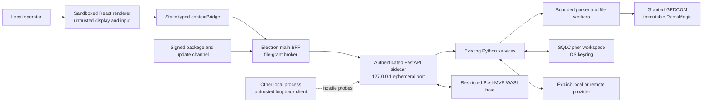

# Data-flow threat model and control matrix

## Implementation status

The 0.4.0 tree implements the one-shot CLI and prompt-toolkit/Rich REPL over
shared command, application-service, and genealogy-core contracts. It does not
implement FastAPI routes, an Electron application, a renderer or preload bridge,
desktop packaging, plugins, or an update channel. Desktop diagrams, controls,
abuse cases, and gates below define accepted later-roadmap requirements; they
are not evidence that those adapters exist or that their controls have passed.
Each future adapter must reuse the implemented service contracts and complete
its named verification before a planned control can be treated as effective.

## Assets and trust boundaries

Sensitive assets are genealogy records, living-person status, notes, provider
credentials, SQLCipher keys, prompts/responses, consent grants, and RootsMagic
source files. Later desktop assets additionally include opaque file grants, internal
API bootstrap material, event streams, plugin packages, update metadata,
release signatures, and support evidence. Data crosses boundaries at
prompt-toolkit/Rich REPL input, one-shot CLI input, GEDCOM/RootsMagic parsing,
the OS keyring, encrypted database, configured provider endpoints, and exported
files. A future desktop runtime adds crossings through a sandboxed Electron
renderer and preload bridge and an authenticated FastAPI sidecar.

The local operator is trusted to choose data and consent. The renderer, other
local processes, imported genealogy content, file paths, plugins, packages,
updates, retrieved text, and every model response are untrusted. The accepted
desktop boundary and product decision are specified in
[ADR-0025](ADR-0025-electron-fastapi-desktop.md).

```text
untrusted GEDCOM / RootsMagic -> bounded parsers -> application services
                                                 |-> SQLCipher workspace <- OS keyring
                                                 |-> consent + minimization -> LLM HTTPS
                                                 +-> atomic local exports
```

## OWASP Top 10:2025 control crosswalk

The Top 10 is an awareness and prioritization baseline, not a proof of
security. Each implementation issue must also select applicable, versioned
OWASP ASVS 5.0.0 requirements and produce negative-test evidence. Controls
remain planned—not effective—until that evidence passes.

| Risk | Applicability and controls | Verification |
|---|---|---|
| A01:2025 Broken Access Control | The app has no in-app user roles, but privileged operations still require narrow bridge methods, authenticated internal routes, scoped grants, capability gates, and immutable source policy (`TM-I01`, `TM-A01`, `TM-F01`). | Sender/origin, unauthorized-route, disabled-capability, expired/cross-window grant, and traversal tests. |
| A02:2025 Security Misconfiguration | Secure Electron window defaults, restrictive CSP, denied permissions/navigation, loopback-only sidecar, packaged docs disabled, `provider=none`, restrictive permissions, and bounded limits (`TM-R01`, `TM-R02`, `TM-A03`). | Clean-install, production-config, CSP, fuse, exact-host/header, console, and packaged-runtime assertions. |
| A03:2025 Software Supply Chain Failures | Locked Python and pnpm dependencies, minimal optional extras, pinned CI actions, Dependabot, audit, SBOM, signed packages, sidecar manifests, and provenance (`TM-U01`, `TM-U02`, `TM-P02`). | Lockfile review, `pip-audit`, JavaScript audit, CodeQL, Semgrep, secret scan, CycloneDX SBOM, signature/provenance and revoked-artifact tests. |
| A04:2025 Cryptographic Failures | SQLCipher is required; high-entropy database/API material is never stored in renderer state; OS keyring, encrypted backups, signed packages, and expiring update metadata are the authority (`TM-S01`, `TM-A01`, `TM-U02`). | Plaintext header, wrong-key, key-unavailable, bearer disclosure, signature, expiry, rollback, integrity, and backup tests. |
| A05:2025 Injection | SQL AST validation and authorizer, strict schemas, static IPC/endpoint allowlists, no generated command/code execution, raw-HTML denial, and untrusted prompt/model data (`TM-I01`, `TM-L02`, `TM-P01`). | SQL/prompt/console/API/IPC/HTML/URI injection suites, schema fuzzing, and Semgrep/CodeQL. |
| A06:2025 Insecure Design | Renderer-compromise assumption, separated adapters/services, explicit consent, immutable inputs, opaque grants, abuse-case review, risk expiry, and Post-MVP gates apply before code (`TM-R01`, `TM-F02`, `TM-L01`, `TM-C01`). | Architecture contract tests, threat-ledger review, source sentinels, offline tests, misuse cases, and G0-G4 exit evidence. |
| A07:2025 Authentication Failures | OS login is the no-auth product boundary; every sidecar route still uses a fresh per-launch bearer, pre-parse constant-time verification, exact host/version, and token-derived readiness (`TM-A01`, `TM-A02`, `TM-A03`). | Missing/wrong/replayed token, startup race, timing, health/shutdown auth, wrong-host/version, and renderer-disclosure tests. |
| A08:2025 Software or Data Integrity Failures | Source hashes, SQLCipher integrity, validated DTOs/model output, atomic writes, sequenced events, signed packages/updates, and anti-rollback state (`TM-F02`, `TM-E01`, `TM-U01`, `TM-U02`). | Hash, schema, sequence/gap, round-trip, partial-publication, tamper, wrong-platform, downgrade, rollback, and recovery tests. |
| A09:2025 Security Logging and Alerting Failures | Stable error codes and privacy-minimal structural evidence; payload/access logging is off; secrets, paths, genealogy data, prompts, responses, ports, and bearers are forbidden (`TM-O01`, `TM-O02`). | Canary-secret scans across UI, API, stderr, logs, crash/support bundles, build artifacts, and release evidence. |
| A10:2025 Mishandling of Exceptional Conditions | Fail-closed provider/storage/API policy, typed error envelopes, timeouts, cancellation, bounded queues/reads, idempotent terminal states, atomic output, and safe rollback (`TM-D01`, `TM-E01`, `TM-C01`). | Boundary/one-over, malformed input, disconnect/reload, worker death, keyring failure, disk-full, cancellation, restart, and rollback tests. |

## OWASP Top 10 for LLM Applications 2025

| Risk | Controls and disposition |
|---|---|
| LLM01 Prompt Injection | Imported text is untrusted data; models receive no tools; generated SQL is parsed and authorizer-enforced. |
| LLM02 Sensitive Information Disclosure | Pre-render consent, minimal fields, living-person denial, OS keyring, encrypted optional retention. |
| LLM03 Supply Chain | Provider SDKs are optional and locked; dependency/SBOM/security scans gate release. |
| LLM04 Data and Model Poisoning | Retrieval is not implemented. Any future local index must fingerprint sources, preserve provenance, treat retrieved text as untrusted context, and detect stale/conflicting material before display or generation. |
| LLM05 Improper Output Handling | JSON Schema validation and length caps; output is never executable. |
| LLM06 Excessive Agency | No autonomous agents, tool calls, shell, interactive-console escape hatch, write-capable SQL, or automatic destructive decisions. |
| LLM07 System Prompt Leakage | Prompts contain no credentials; templates and untrusted content are separated; disclosure is treated as possible. |
| LLM08 Vector and Embedding Weaknesses | Embeddings/vector stores remain unimplemented. A future feature requires SQLCipher-local storage by default, workspace and consent partitioning, restricted-data exclusion, versioned invalidation, bounded retrieval, and explicit cloud-retention consent. |
| LLM09 Misinformation | Deterministic evidence remains authoritative; LLM adjudication is optional and cannot delete conflicts. |
| LLM10 Unbounded Consumption | Token, output, timeout, cost, model, purpose, and row caps are enforced. |

## Desktop trust and data flow



### Named desktop controls

| ID | Required control |
|---|---|
| `TM-R01` | Renderer isolation: packaged local content only, `contextIsolation: true`, `nodeIntegration: false`, `sandbox: true`, global sandboxing, no `<webview>`, no remote code, and verified production fuses. |
| `TM-R02` | Restrictive production CSP and `app://` protocol: fixed asset/MIME manifest; no renderer network, frames, objects, forms, raw HTML, executable model output, service workers, or CSP bypass. |
| `TM-I01` | Least-privilege IPC: frozen static asynchronous bridge methods, runtime schemas and size limits, main-frame sender/origin checks, listener cleanup, and no generic send/listen, dynamic channels, Electron objects, or synchronous IPC. |
| `TM-A01` | Private internal API: loopback port `0`, fresh 256-bit per-launch bearer through private stdin, exact host/version validation, no cookies/CORS/browser origins, and packaged docs disabled. |
| `TM-A02` | Sidecar lifecycle: signed manifest-verified bundled executable, minimal environment, protocol/build handshake, one server worker, bounded restart, clean process-tree shutdown, and privacy-minimal stderr. |
| `TM-A03` | Request integrity: authenticate every route before body parsing, compare credentials in constant time, reject proxy/origin/cookie headers and redirects, disable access logs, and require token-derived readiness proof. |
| `TM-S01` | Secret boundary: Python `SecretStore` and the OS keyring are the only authority; renderer may set, delete, or check presence but can never read a value. |
| `TM-F01` | Opaque file grants: native dialogs create high-entropy, window/operation-scoped, expiring, revocable grant IDs; renderer never supplies or receives unrestricted paths. |
| `TM-F02` | Backend file safety: regular-file checks, realpath/fingerprint revalidation, ingress budgets, source/output non-aliasing, immutable inputs, app-owned scratch space, atomic outputs, and failure cleanup. |
| `TM-L01` | Provider policy: explicit provider/profile/model/consent; HTTPS, DNS/private-address, proxy, TLS, host, and redirect validation; no ambient-key selection; `provider=none` remains network-free. |
| `TM-L02` | Model-output safety: output is untrusted data, schema/length validated, rendered through an allowlist, and never executed as tools, SQL, Python, shell, HTML, or plugin code. |
| `TM-D01` | Availability: bounded request/event/file sizes, queues, workers, memory/time/cost/token limits, cancellation, and deterministic overload errors. Public file boundaries use the typed limits and race checks in [bounded file ingress](FILE_INGRESS.md). |
| `TM-P01` | Plugin isolation: signed declarative manifests/UI, deny-by-default WASI host capabilities, and no renderer/main/native/Python plugin code. |
| `TM-P02` | Plugin provenance: signatures cover the canonical package tree; publisher trust/revocation, safe extraction, compatibility, permission-diff approval, and restricted-host identity are verified before activation. |
| `TM-U01` | Supply chain and updates: reviewed lockfiles, SBOM/provenance, signed/notarized packages, sidecar manifests, verified update metadata, ASAR integrity where supported, and tested rollback. |
| `TM-U02` | Update freshness: signed expiring metadata binds platform, application/sidecar versions, hashes, sizes, key identity, and monotonic release state; downgrade and freeze attempts fail closed. |
| `TM-E01` | Event integrity: bounded sequenced streams, acknowledgement/backpressure, gap handling, terminal-state idempotency, startup reconciliation, and no automatic replay of side-effecting work after output begins. |
| `TM-C01` | Concurrency integrity: single-instance coordination, per-artifact output locks, optimistic revisions, and idempotency keys prevent duplicate mutations and concurrent publication. |
| `TM-O01` | Privacy-minimal observability: allowlisted stable codes and hashes/counts only by default; no secrets, unrestricted paths, genealogy values, prompts, responses, or bootstrap material. |
| `TM-O02` | Runtime evidence hygiene: access-log suppression, structural redacted stderr, crash-dump/support-bundle policy, canary scans, and development-tool restrictions prevent payload capture. |

## STRIDE boundary ledger

Every row is an owned threat statement. "Negative" names the minimum planned
adversarial test; the detailed test matrix belongs to Issue #131. A control is
not considered effective until its named test and packaged evidence pass.

| Threat ID | STRIDE threat | Controls | Owner / gate | Planned negative test |
|---|---|---|---|---|
| `STR-R-S` | Spoofing: a forged child frame or origin invokes a privileged renderer bridge method. | `TM-R01`, `TM-I01` | #100, #101 / G1 | Negative: wrong-frame, wrong-origin, destroyed-window, and navigation-race calls are denied. |
| `STR-R-T` | Tampering: malformed, oversized, or version-confused IPC changes privileged arguments. | `TM-I01`, `TM-D01` | #101, #131 / G1 | Negative: schema fuzz, unknown-field, boundary/one-over, and prototype-pollution payloads fail closed. |
| `STR-R-R` | Repudiation: a privileged action or event cannot be correlated with its window, request, and terminal job state. | `TM-E01`, `TM-O01` | #101, #104 / G1 | Negative: duplicate, gap, reload, cancellation, and terminal-state races remain attributable and idempotent. |
| `STR-R-I` | Information disclosure: bridge DTOs, errors, clipboard, or UI expose secrets, paths, provider payloads, or bootstrap material. | `TM-S01`, `TM-F01`, `TM-O01`, `TM-O02` | #101, #105, #131 / G1 | Negative: canary values never appear in renderer globals, DTOs, errors, logs, crash/support artifacts, or snapshots. |
| `STR-R-D` | Denial of service: IPC or event flooding blocks main or exhausts renderer memory. | `TM-D01`, `TM-E01` | #101, #104, #131 / G1 | Negative: rate, queue, payload, subscriber, reload, and stalled-ack limits return bounded coded errors. |
| `STR-R-E` | Elevation: generic IPC, Node objects, navigation, raw HTML, or weak fuses escape the renderer sandbox. | `TM-R01`, `TM-R02`, `TM-I01` | #100, #101, #131 / G1 | Negative: absent-Node assertions, XSS payloads, unexpected navigation/windows, and packaged fuse inspection fail on any privilege. |
| `STR-A-S` | Spoofing: another local process races startup, replays a bearer, or impersonates the sidecar. | `TM-A01`, `TM-A02`, `TM-A03` | #11, #102 / G1 | Negative: connect-first, missing/wrong/replayed bearer, false readiness, and wrong-binary tests fail closed. |
| `STR-A-T` | Tampering: host, version, proxy metadata, redirect, response, or build identity is confused in transit. | `TM-A02`, `TM-A03` | #11, #102, #131 / G1 | Negative: wrong Host/version/content type/build, forwarding headers, redirect, malformed response, and port substitution are rejected. |
| `STR-A-R` | Repudiation: a sidecar request cannot be matched to a privacy-minimal result and terminal state. | `TM-E01`, `TM-O01` | #11, #104 / G1 | Negative: duplicate idempotency keys, disconnect, cancellation, and restart retain one structural terminal outcome. |
| `STR-A-I` | Information disclosure: bearer, port, path, exception, request body, or response payload reaches renderer, process metadata, or logs. | `TM-A01`, `TM-O01`, `TM-O02` | #11, #102, #131 / G1 | Negative: canary bootstrap/payload values are absent from arguments, environment, files, renderer, access logs, stderr, and support output. |
| `STR-A-D` | Denial of service: request, body, stream, readiness, restart, or shutdown storms exhaust the sidecar or app. | `TM-A02`, `TM-A03`, `TM-D01`, `TM-E01` | #11, #102, #104 / G1 | Negative: pre-auth oversized bodies, slow clients, stream floods, restart loops, and shutdown races stay bounded. |
| `STR-A-E` | Elevation: arbitrary routes, commands, public binding, docs, CORS, or console dispatch make the sidecar a local privilege proxy. | `TM-A01`, `TM-A03`, `TM-I01` | #11, #101 / G1 | Negative: non-loopback bind, unknown route/method, CLI name, docs/schema route, browser origin, and unmediated endpoint are unavailable. |
| `STR-F-S` | Spoofing: a symlink, replacement race, device, alias, or stale grant makes a different file appear selected. | `TM-F01`, `TM-F02` | #103, #114, #131 / G1 | Negative: link/device, case/realpath alias, replace-after-grant, expired/cross-window grant, and fingerprint mismatch are rejected. |
| `STR-F-T` | Tampering: a source or existing output is overwritten, partially published, or changed during processing. | `TM-F02`, `TM-C01` | #103, #114, #118 / G1 | Negative: source/output alias, concurrent writer, source-hash change, worker death, disk-full, and publish failure preserve sentinels. |
| `STR-F-R` | Repudiation: an import, export, backup, or mutation lacks source fingerprint and structural result evidence. | `TM-C01`, `TM-O01` | #103, #123 / G1 | Negative: missing correlation/source hash, duplicate publish, and recovery paths cannot report an untraceable success. |
| `STR-F-I` | Information disclosure: records, notes, keys, paths, plaintext databases, scratch files, or backups escape. | `TM-S01`, `TM-F01`, `TM-F02`, `TM-O02` | #103, #123, #131 / G1 | Negative: canaries are absent from DTOs/logs/temp remnants; plaintext, weak keyring fallback, broad permissions, and unencrypted backups fail. |
| `STR-F-D` | Denial of service: huge, recursive, corrupt, compressed, locked, or device-like input consumes memory, CPU, disk, or workers. | `TM-D01`, `TM-F02` | #114, #118, #131 / G2 | Negative: boundary/one-over size/count/depth/ratio, parser complexity, cancellation, queue-full, and scratch-quota tests remain bounded. |
| `STR-F-E` | Elevation: parser features, SQLite extensions, path traversal, or inherited worker capabilities reach the host. | `TM-F02`, `TM-D01` | #103, #114, #118 / G1 | Negative: traversal, extension loading, shell metacharacters, unexpected environment/socket/process access, and malformed native input fail closed. |
| `STR-L-S` | Spoofing: profile confusion, redirect, proxy, DNS rebinding, or ambient keys select an unapproved provider. | `TM-L01`, `TM-S01` | #108, #110, #131 / G1 | Negative: absent consent, ambient-only key, redirect, changed DNS/private address, proxy, wrong TLS host, and profile/model mismatch are denied. |
| `STR-L-T` | Tampering: provider output, structured data, Markdown, usage, or finish state is malformed or adversarial. | `TM-L02`, `TM-E01` | #110, #111, #112 / G2 | Negative: schema/length/sequence errors, raw HTML/SVG, unsafe URI/image, tool/code/SQL content, and usage mismatch remain inert. |
| `STR-L-R` | Repudiation: consent, provider/model identity, cancellation, usage, retention, or terminal status is not auditable. | `TM-E01`, `TM-O01` | #108, #110, #111 / G2 | Negative: cancelled/disconnected/reloaded streams and provider errors produce one redacted terminal audit state. |
| `STR-L-I` | Information disclosure: living-person data, credentials, prompts, responses, or retained content reaches an unapproved endpoint or artifact. | `TM-S01`, `TM-L01`, `TM-O01`, `TM-O02` | #108, #110, #131 / G2 | Negative: data-class/retention overreach, redirect, logging, crash, cache, and support-bundle canaries are denied or absent. |
| `STR-L-D` | Denial of service: token, retry, timeout, queue, stream, or cost exhaustion degrades the app. | `TM-D01`, `TM-E01` | #104, #110, #111 / G2 | Negative: token/cost/time/retry/event bounds, stalled provider, stalled renderer, and cancellation return deterministic terminal errors. |
| `STR-L-E` | Elevation: model output gains tool, filesystem, SQL, Python, shell, HTML, or plugin authority. | `TM-L02`, `TM-P01`, `TM-I01` | #110, #112, #125 / G2 | Negative: generated commands, tool calls, SQL, code fences, HTML, URIs, and plugin-like payloads remain display-only data. |
| `STR-U-S` | Spoofing: a plugin publisher, restricted host, package signer, update channel, or release identity is impersonated. | `TM-P02`, `TM-U01`, `TM-U02` | #16, #125, #132 / G3-G4 | Negative: unknown/revoked key, wrong publisher/host/platform/version, and mismatched certificate/signature are rejected. |
| `STR-U-T` | Tampering: package tree, manifest, ASAR, sidecar, update metadata, or release artifact is modified. | `TM-P02`, `TM-U01`, `TM-U02` | #16, #102, #132 / G3-G4 | Negative: unexpected file, tree/hash/size mismatch, post-sign mutation, expired metadata, and wrong sidecar fail offline verification. |
| `STR-U-R` | Repudiation: install, permission approval, enable, update, rollback, revoke, disable, or removal lacks evidence. | `TM-P02`, `TM-U02`, `TM-O01` | #16, #126, #132 / G3-G4 | Negative: missing signer/version/permission diff/decision/release state prevents activation or an unverifiable success. |
| `STR-U-I` | Information disclosure: a plugin or updater receives undeclared data, secrets, paths, environment, network, or host resources. | `TM-P01`, `TM-S01`, `TM-O02` | #16, #125, #131 / G3 | Negative: raw-secret, filesystem, environment, socket, clock, process, database, and provider access are absent unless a narrow declared host call allows it. |
| `STR-U-D` | Denial of service: archive bombs, plugin loops/event floods, updater failures, or rollback loops disable the app. | `TM-D01`, `TM-P02`, `TM-U02` | #16, #125, #132 / G3-G4 | Negative: count/size/depth/ratio, CPU/memory/event quota, interrupted update, disk-full, and repeated rollback preserve the prior version. |
| `STR-U-E` | Elevation: scripts, `eval`, dynamic imports, native plugins, Python entry points, or unsigned updates execute with user rights. | `TM-P01`, `TM-P02`, `TM-U01` | #16, #125, #131 / G3 | Negative: script/hooks/native code, WASI escape, renderer/preload/main imports, unsigned packages, and unapproved permission expansion cannot activate. |

## Abuse-case and risk ledger

An entry begins with **inherent risk**, before credit for controls. It may move
to **evidence-backed residual risk** only after the linked negative tests,
packaged assertions, and review evidence pass. A planned or implemented control
without passing evidence does not reduce the risk rating. The evidence link,
test environment, app/sidecar versions, reviewer, and date belong in the issue
or release evidence, never private payloads.

| ID | Abuse case | Inherent risk | Controls, owner, gate, and planned negative test | Evidence-backed residual risk |
|---|---|---|---|---|
| `AB-01` | A compromised renderer forges frames, invokes privileged IPC, or obtains Node/Electron objects. | Medium likelihood / Critical impact | `TM-R01`, `TM-R02`, `TM-I01`; #100, #101, #131; G1/G2. Negative: sender/origin fuzz, absent-Node assertions, CSP/XSS suite, window inheritance, and packaged fuse inspection. | Not reduced: implementation and packaged evidence pending. |
| `AB-02` | Another local process races startup, probes loopback, replays credentials, or abuses health/shutdown. | Medium / Critical | `TM-A01`, `TM-A02`, `TM-A03`; #11, #102, #131; G1/G2. Negative: private-stdin bootstrap, connect-first/replay/timing, token-derived readiness, pre-parse auth, exact-host, and process-tree cleanup. | Not reduced: implementation and packaged evidence pending. |
| `AB-03` | UI, generated contracts, logs, crash reports, backups, or support evidence disclose provider or SQLCipher material. | Medium / Critical | `TM-S01`, `TM-O01`, `TM-O02`; #105, #123, #131; G1/G2. Negative: canary-secret scans across responses, storage, logs, crash/support artifacts, fixtures, and release evidence. | Not reduced: implementation and packaged evidence pending. |
| `AB-04` | A malicious or replaced GEDCOM exploits parser complexity, symlinks, aliasing, races, or partial publication. | High / High | `TM-F01`, `TM-F02`, `TM-D01`, `TM-C01`; #103, #114, #118, #131; G1/G2. Negative: boundary/one-over, replacement races, worker failure, output locks, cancellation, and sentinel preservation. | Not reduced: worker and packaged evidence pending. |
| `AB-05` | Model Markdown uses HTML, SVG, handlers, schemes, images, links, or copied content to execute or exfiltrate. | High / Critical | `TM-R02`, `TM-L02`; #112, #131; G2. Negative: AST allowlist tests for script, HTML, SVG, URI, image, copy, external-link, and CSP cases. | Not reduced: renderer and packaged XSS evidence pending. |
| `AB-06` | Provider/profile confusion, redirects, DNS changes, proxies, or ambient keys send living-person data to an unapproved endpoint. | Medium / Critical | `TM-L01`, `TM-S01`, `TM-O01`; #108, #110, #131; G1/G2. Negative: explicit-profile/consent, redirect, TLS/host/DNS revalidation, proxy denial, and network instrumentation proving `provider=none` is offline. | Not reduced: desktop contract and network evidence pending. |
| `AB-07` | A provider or stalled renderer floods tokens, creates event gaps, prevents cancellation, or duplicates audit completion. | High / High | `TM-D01`, `TM-E01`; #104, #111, #131; G1/G2. Negative: bounded queue/ACK, gap/duplicate/reload races, idempotent terminal transitions, startup reconciliation, and no post-output retry. | Not reduced: streaming evidence pending. |
| `AB-08` | A plugin impersonates a publisher, traverses extraction, expands permissions, or escapes into native/renderer execution. | Medium / Critical | `TM-P01`, `TM-P02`; #16, #125, #131; G3. Negative: canonical signature, revocation, archive bomb/traversal/collision, permission diff, WASI escape, and restricted-host identity. | Not reduced: Post-MVP feature disabled pending renewed review. |
| `AB-09` | A compromised update channel serves a valid old release, wrong-platform sidecar, mutable artifact, or expired metadata. | Low / Critical | `TM-U01`, `TM-U02`; #102, #131, #132; G4. Negative: offline signature, expiry, anti-rollback, hash/size/platform/version, revoked key, interruption, and recovery. | Not reduced: distribution remains disabled pending evidence. |
| `AB-10` | Two app instances or jobs publish the same output or repeat a mutation after a crash. | Medium / High | `TM-C01`, `TM-E01`, `TM-F02`; #104, #117, #129, #131; G2/G3. Negative: single instance, idempotency, optimistic revision, artifact lock, crash recovery, and duplicate terminal state. | Not reduced: concurrency and packaged evidence pending. |

### Risk decision and expiry policy

- Critical or High residual risk cannot be accepted for an affected privileged,
  MVP, high-risk-capability, or distribution gate. It must be avoided or
  mitigated and verified.
- Medium residual risk may be accepted only by the repository maintainer and a
  security reviewer other than the implementer. Low residual risk still needs
  an accountable owner and recorded rationale when it affects a trust boundary.
- Every acceptance records the risk and evidence, rationale, compensating
  controls, accountable owner, independent reviewer, decision/review dates, and
  an expiry no later than the next release or 90 days.
- Expired exceptions fail the gate. Renewal requires current evidence and a new
  review; copying the old rationale is insufficient.
- False positives record the tool/rule/version, exact non-sensitive evidence,
  reviewer, and conditions that would invalidate the disposition.
- No finding is silently waived. The release rule is zero known untriaged
  Critical/High findings and zero expired risk acceptances.

## NIST SP 800-218 SSDF adoption

The SSDF is outcome-based. This project uses its four practice groups as a
continuous lifecycle, not a one-time compliance checklist.

| Practice group | AncestryLLM outcome and evidence |
|---|---|
| `PO` | **Prepare the Organization:** ADR-0025, this control/risk ledger, issue/path ownership, fictional-data policy, secure toolchain, review roles, severity/expiry rules, and G0-G4 criteria define the security requirements and development environment. |
| `PS` | **Protect the Software:** focused branches/worktrees, protected review, pinned CI actions, reviewed lockfiles, secret scanning, least-privilege CI, SBOM/provenance, signed immutable packages, and release access controls protect code and artifacts from tampering. |
| `PW` | **Produce Well-Secured Software:** threat modeling before code, strict types/schemas, narrow adapters, secure defaults, peer review, negative tests, SAST, dependency analysis, contract/fuzz/E2E tests, packaging assertions, and documented residual risk reduce introduced vulnerabilities. |
| `RV` | **Respond to Vulnerabilities:** `SECURITY.md` intake, `SECURITY_RESPONSE.md`, finding triage, owner/severity/expiry tracking, root-cause regression tests, revocation/emergency update plans, release evidence, and lessons fed back into controls address discovered vulnerabilities. |

Minimum pull-request evidence for desktop work includes:

1. changed control, OWASP Top 10:2025, applicable OWASP ASVS 5.0.0, and NIST
   SP 800-218 mappings;
2. positive, boundary, and negative tests with fictional canaries;
3. formatting, lint, strict type checks, Python and JavaScript/TypeScript tests,
   Semgrep, CodeQL, secret scanning, dependency audit, and SBOM results as
   applicable;
4. lockfile, generated-contract, build-output, source-map, remote-asset, CSP,
   Electron fuse/window, sidecar binding/auth, and package-signature evidence
   for affected boundaries; and
5. every finding linked to a fix, evidence-backed false positive, or permitted
   time-bounded residual-risk decision.

## Assurance gates

| Gate | Exit evidence |
|---|---|
| `G0 — Architecture` | #98 records assets, actors, flows, STRIDE threats, AB-01 through AB-10, controls, risk owners, OWASP/NIST mappings, rejected designs, negative tests, and issue/path ownership. |
| `G1 — Privileged boundaries` | #11, #102, #100, #101, #103, #104, and #105 pass pre-parse authentication, exact-host/version, sender/origin, CSP/fuse, secret non-retrieval, grant/race, event/cancellation, redaction, and supervision tests. |
| `G2 — MVP candidate` | #118 and #131 provide packaged XSS, API/IPC fuzz, secret-leak, stream-race, GEDCOM, `provider=none`, accessibility, performance, SAST/dependency/SBOM, and three-OS evidence with no untriaged Critical/High risk. |
| `G3 — New high-risk capability` | #16/#125 plugins, #130 retrieval, #129 editing, and any new renderer network path remain disabled until renewed architecture review and all added control/negative-test evidence pass. |
| `G4 — Distribution and update` | #132 verifies app/sidecar integrity, signing/notarization, SBOM/provenance, update tamper/expiry/rollback/freeze handling, recovery, and emergency-response evidence on macOS, Windows, and Linux. |

Threat modeling repeats for a new boundary, endpoint, IPC method, provider, data
class, parser/writer, plugin capability, updater, OS entitlement, remote-content
path, cryptographic format, retention mode, diagnostic/export surface, or
Critical/High incident; and before MVP or production release.

## Release decision

A release requires zero known untriaged Critical/High findings. Every relevant
finding must link to a fix, accepted-risk rationale with owner/expiry, or false
positive evidence. Manual Ancestry/Geni/MyHeritage import results and any control
exceptions must be recorded in release notes. This model does not prove absence
of vulnerabilities, and passing OWASP/NIST-mapped checks is not such a claim; it
defines required evidence, accountability, repeatable validation, and
fail-closed boundaries.
