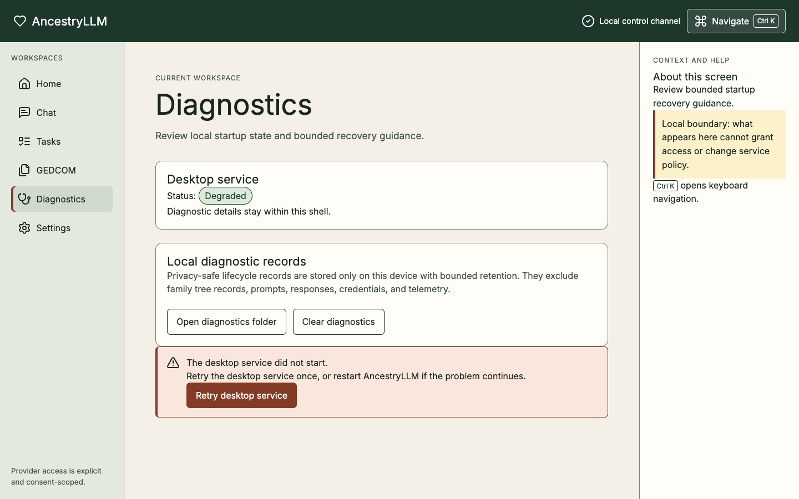

# Desktop shell

AncestryLLM 0.5.0 is a bounded, offline Electron control shell. It does not
move the genealogy-capable CLI or console into the desktop application and it
does not introduce a second command or domain layer.

The [desktop architecture decision, ADR-0025](../ADR-0025-electron-fastapi-desktop.md)
owns the process boundary, and the [data-flow threat model](../THREAT_MODEL.md)
owns its security controls. The sidecar's authenticated loopback channel is
not a public or LAN API. Electron Main keeps the launch secret and OS keyring
operations outside the sandboxed renderer, turns user-selected files into
opaque grants, and lets backend-owned cancellation finish at a declared safe
point.

For a source-level v0.6 learning path, start with
[Desktop first run](../tutorials/desktop-first-run.md), use the focused
[desktop how-to guides](../Home.md#how-to-guides), and keep the
[desktop reference](../reference/DESKTOP.md) open for exact states and stable
codes. These pages describe the current source contracts; they do not expand
the released 0.5.0 installer claim below.

## Supported surface


The supported desktop destinations are deliberately small:

- **Home** identifies the application, its offline posture, and sanitized
  startup and capability state. The capability summary reports only whether
  the bundled local runtime is ready; it does not expose
  accounts, providers, credentials, genealogy data, or cloud consent.
- **Diagnostics** shows stable, sanitized lifecycle state and offers bounded
  retry or restart recovery.
- **Settings** stores local visual preferences only: color scheme and reduced
  motion. The internal onboarding flag is not a user-facing setting.

Unreleased Issue #109 adds a **Tasks** destination to present backend-owned
work. It remains outside the released 0.5.0 installer claim.

Unreleased Issue #110 adds an internal, synchronous, transient-chat service and
fixed sidecar routes. Issue #111 adds the audited source transport owned by
Electron Main. Issue #112 adds the bounded **Chat** destination over six fixed
chat methods and one event listener. It does not add a tool call, genealogy
operation, renderer network client, persistent transcript, or generic dispatch
surface.

These destinations must remain usable with keyboard navigation and assistive
technology, and in loading, empty, degraded, failure, narrow-window, and
zoomed layouts.

## Accessible design-system shell

Unreleased Issue #106 implements the reusable presentation shell for the 0.6
desktop work. It preserves a persistent primary navigation region, workspace
header, context-and-help panel, and explicit **Local and offline** status across
Home, Diagnostics, Settings, and the unreleased Tasks and Chat destinations. The
compact layout keeps the current route and local status visible when the window
narrows; at the 720-by-560 minimum size and 200% zoom, primary actions reflow
without horizontal clipping.

The shell exposes one typed route and navigation contract rather than another
command registry. <kbd>Ctrl</kbd>+<kbd>K</kbd> or
<kbd>Command</kbd>+<kbd>K</kbd> opens a keyboard destination palette. Its
filter receives initial focus, <kbd>Escape</kbd> dismisses it and restores the
trigger, and choosing a destination focuses that route's heading. A
**Skip to workspace** link is the first backward-reachable control when route
focus starts on a heading. Focus indicators, reduced-motion preferences, and
forced-color behavior are explicit rather than dependent on browser defaults.

Shared presentation contracts live under
`desktop/src/renderer/src/design-system/`:

- `AppRoute` and `NavigationItem` define the bounded destinations and labels.
- `CapabilityGate` presents an already-authorized branch; it cannot create or
  infer authority.
- `AsyncState` provides plain-language loading, empty, offline, degraded,
  error, success, and permission-denied patterns. Meaning is always conveyed by
  text and semantics, not color alone.
- `CodedErrorView` accepts only stable coded errors, normalizes an unexpected
  code to `UNEXPECTED_ERROR`, and keeps recovery instructions beside the code.
- The dialog-focus contract records initial, dismiss, restoration, and
  route-selection behavior for keyboard regression tests.

These components import no bridge, Electron, Node.js, filesystem, or network
API. They consume data only when a route-level hook passes a validated bridge
response. The development gallery imports deterministic fictional fixtures,
while the production build verifier rejects the gallery and its copy from the
shipping renderer.

## First run and revisit

The current unreleased 0.6 first launch opens a bounded welcome on **Home** and
presents three explicit deployment intents:

- **Local Desktop (Recommended)** is the only available choice. It uses the
  private loopback sidecar and offline-first defaults on this device.
- **Connect Remote** is visible but unavailable in this release. First run does
  not discover or contact a remote service.
- **Host Remote** is an advanced intent that is visible but unavailable. First
  run never opens a listener or starts a container.

The welcome explains that updates are installed manually and asks for no
account, provider, API key, genealogy data, or cloud consent. Before it enables
**Continue**, the renderer validates a schema-v1 startup report containing
exactly four components: configuration, SQLCipher, keyring, and workspace.
Each component contains only a stable status, code, reviewed message,
remediation, restart requirement, and mutation-blocking flag. The report also
contains only normalized operating-system and architecture labels.

When a required component blocks startup, the application remains navigable
but read-only. **Open read-only diagnostics** replaces **Continue**;
capabilities are not queried, and preference, settings, and credential
mutations are rejected with `STARTUP_MUTATION_BLOCKED`. Inspection does not
repair configuration, create a workspace or database, replace a database key,
or select a plaintext fallback. One bounded retry is available, concurrent
requests share that launch attempt, and relaunch remains the final local
recovery step.

**Continue** records only the main-process-owned `onboardingCompleted`
preference. A new application process skips the welcome after a valid refreshed
preference snapshot reports completion; the flag is not exposed in **Settings**.
Conflict, unavailable, corrupt, unsupported, or invalid preference responses
fail closed and keep the welcome gated with a stable sanitized code and bounded
**Try again**, **Diagnostics**, or restart recovery. The renderer never repairs
or overwrites invalid preference storage.

Completed users can select **Review welcome** on **Home**. Review is temporary
renderer state: **Back to Home** neither creates a route nor changes a
preference. Keyboard focus begins on the welcome heading, reduced-motion
preferences are respected, and degraded runtime state does not block navigation
to **Diagnostics** or its bounded retry.

The 0.5.0 shell has no genealogy, file or folder, GEDCOM or RootsMagic, job,
chat, provider or credential, cloud or account, domain-dispatch, updater, or
background-channel surface. Those exclusions apply to navigation and hidden
controls as well as visible content.

## Offline and process boundary

Electron starts the packaged sidecar on a private, ephemeral loopback endpoint
from the network-free `provider=none` baseline; the Electron main process is
the sole authenticated client. Issue #110's internal chat boundary can execute
only after a caller supplies an exact stored profile and model and the Python
service rechecks endpoint policy and any required consent. Ambient credentials
cannot select a provider. The preload bridge exposes exactly these six methods:

- `getAppInfo`
- `getStartupDiagnostics`
- `getCapabilities`
- `retrySidecar`
- `getPreferences`
- `updatePreferences`

Unreleased source additions are fixed, separately reviewed contracts and do
not change that released six-method claim. Issue #109 contributes five task
request methods and one validated event listener. Issue #111 contributes three
chat-stream request methods and one validated event listener. Issue #112
contributes three chat-lifecycle methods and two fixed native actions for
confirmed HTTPS links and plain-text copy.

The renderer receives no Node.js, Electron, network, filesystem, keyring,
provider, database, shell, or arbitrary-path access. It must never receive the
sidecar port, bearer token, endpoint, executable path, preference-file path,
stderr, raw sidecar or bridge errors, or stack traces. See the
[packaged sidecar contract](../reference/DESKTOP_SIDECAR.md) and
[desktop ADR](../ADR-0025-electron-fastapi-desktop.md) for the underlying process
and architecture controls.

## Unreleased task center and safe shutdown

Issue #104 supplies the UI-neutral Python lifecycle: strict schema-v1 snapshots
and events, increasing per-job sequence numbers, bounded persistence and
replay, cooperative cancellation, and exactly one terminal result. A
reconnecting internal client resumes from `Last-Event-ID`; an expired replay
window fails with `JOB_EVENT_REPLAY_EXPIRED` instead of silently skipping
progress.

Issue #109 presents that lifecycle through five fixed request methods—list,
get, cancel, subscribe, and unsubscribe—and one validated event listener. The
backend remains authoritative. The renderer loads complete sanitized snapshots,
ignores duplicate or stale sequence numbers, and refreshes and resubscribes
when it detects a gap or expired replay cursor. A reload reconstructs the view
from the backend rather than renderer storage, and each terminal delivery
closes its subscription. Multiple jobs may be shown at once. Progress is
determinate only when the snapshot supplies a trustworthy total; otherwise the
view explicitly reports indeterminate progress.

The lifecycle distinguishes queued, running, cancelling,
pending-safe-point, completed, failed, and cancelled states. Progress may be
determinate or indeterminate. Cancellation is a request: a job inside an
atomic publication section remains pending at its declared safe point rather
than abandoning or corrupting output. Non-terminal persisted work is
reconciled to one sanitized interrupted terminal result when the sidecar
restarts.

One polite, atomic live region announces only meaningful lifecycle changes.
Failures contain a stable code, reviewed message, and bounded remediation—never
stacks, paths, records, prompts, responses, or raw backend content. Artifact
cards contain only type, media type, byte size, and status. They expose no
path, grant identifier, digest, or direct open action; any future artifact
access must pass through Issue #103's main-owned grant boundary. Tasks admits
no work and adds no producer, provider call, genealogy operation, or domain
route.

When the user quits while work is active, Electron main—not the renderer—uses
an authenticated shutdown preflight and presents native **Wait**, **Request
cancellation**, and **Stay open** choices. **Wait** keeps the application open
until jobs drain within the bounded deadline; **Request cancellation** asks
interruptible jobs to stop and explains any pending safe point; **Stay open**
aborts the quit. A degraded sidecar startup has no admitted local jobs, so its
sanitized empty shutdown assessment is safe only before the supervisor has ever
exposed an authenticated session. Electron owns that supervisor before
asynchronous verification or launch, and shutdown cancels pre-spawn work and
drains any launch already in flight. Losing a previously exposed session never
restores the empty shortcut. The IPC boundary remains intact when sidecar
shutdown fails, allowing a subsequent bounded recovery attempt.

## Unreleased transient-chat foundation

Issue #110 defines one schema-v1 Python service contract for short-lived chat
sessions and one fixed synchronous run operation. Session creation accepts an
exact stored profile and model plus reviewed purpose and data-class values. It
rejects direct provider identifiers, `provider=none`, missing or incompatible
profiles, missing credentials, failed endpoint revalidation, and missing or
revoked cloud consent before provider generation can begin. Consent is fetched
again for every run, so a grant revoked after session creation fails closed.

The service permits at most 32 concurrent sessions, 32 stored messages per
session, 16,384 characters per message, 65,536 characters of total context,
4,096 output tokens, one safe retry, and a 120-second timeout. Those bounds,
the exact profile/model binding, and the no-tool request shape are validated
before provider access. A fixed system instruction treats user and prior model
content as untrusted data, denies tools, files, databases, shells, plugins,
external services, and autonomous actions, and labels generated text as
advisory rather than genealogy evidence.

Sessions and successful message history exist only in process memory. Failed
runs do not append history, deletion clears the session, and sidecar shutdown
clears every remaining session. Audit records retain only reviewed identifiers,
counters, and content hashes; they do not retain prompts, responses, secrets,
host identity, or local paths.

Issue #111 extends that boundary with owner-scoped schema-v1 lifecycle events
and a 256 KiB in-memory replay budget. Electron Main alone owns the authenticated
SSE connection and rejects redirects, an unexpected media type, the wrong
owner or run, malformed events, and non-monotonic sequences. It batches events
for no more than 16 milliseconds or 4 KiB, counts the exact UTF-8 JSON bytes
sent but not acknowledged, pauses at 256 KiB, and cancels with a stable coded
outcome if the renderer remains stalled for 15 seconds. One reconnect may
resume the same run from its last cursor; provider generation is never retried
after output begins. Shutdown, reload, and startup reconciliation record one
payload-free terminal audit outcome. Preload exposes only fixed start, cancel,
acknowledge, and event contracts.

Issue #112 adds the renderer-owned **Chat** destination. A conversation is
created only after the user selects a compatible named profile, model, and
consent. The workspace exposes multiline composition, stop, regenerate, usage
placeholders, plain-text copy, and one screen-reader announcement path. It holds
at most 24 visible turns in transient memory and closes its sidecar session on
teardown; it does not write conversations to renderer storage.

Model text is parsed through `react-markdown` and `remark-gfm` with a closed
component allowlist. Raw HTML, images, embeds, implicit autolinks, executable
actions, and renderer-side navigation are disabled. A rendered HTTPS link shows
its normalized destination and must cross the fixed native action so Electron
Main can display that exact destination and obtain confirmation. The renderer
never calls `window.open`; copy writes plain text only. Ordered sequence,
duplicate, replay, gap, interruption, and owner-mismatch tests keep stream state
fail closed. Target-matched packaged accessibility, stream-race, and hostile
content evidence remains Issue #131.

## Unreleased opaque file-mediation foundation

Issue #103 adds a security boundary for later genealogy workflows without
expanding the supported 0.5.0 domain surface. The bridge gains only three
strict, asynchronous methods:

- `requestOpenFileGrant`
- `requestSaveFileGrant`
- `revokeFileGrant`

The renderer requests an exact purpose and receives either a cancelled result
or a path-free grant containing a random opaque identifier and safe display
metadata: basename, kind, byte size, and replacement status. It cannot provide,
receive, reconstruct, persist, or redeem a pathname, and it has no direct
filesystem method. The reusable selected-file card does not initiate a domain
operation.

Electron main owns the native open/save dialogs and the grant-to-path map. It
checks the selected object's regular-file and link state, purpose-specific
extension and content signature, bounded size, canonical identity, and
filesystem fingerprint. Grants are bound to the requesting renderer, exact
purpose and access mode, current application session, and one redemption.
Explicit revocation, renderer close or cross-document navigation, and
application restart invalidate them. Trusted same-document routes such as the
application's hash-based Home, Tasks, Diagnostics, and Settings transitions preserve
the renderer identity and its grants; each bridge request still rechecks the
exact main frame and trusted application URL. Existing-output replacement
requires a native confirmation and identity revalidation; source/output aliases
and concurrent output grants fail closed under main-owned locks.

Only a trusted main-process adapter may redeem a grant through
`resolveReadGrant` or `resolveWriteGrant`. A future genealogy integration must
then pass the internal path to the shared Python file-ingress adapter, which
reopens and revalidates the source under its own bounded policy before parsing
or publication. Until that adapter ships, the grant broker provides no GEDCOM,
RootsMagic, import, export, or report workflow.

## Unreleased settings and credential-management foundation

Issue #105 adds the source-level settings and credential-management boundary
planned for 0.6.0. It does not expand the released 0.5.0 shell and does not
enable provider execution, cloud consent, genealogy operations, or arbitrary
sidecar access.

The renderer can read the complete versioned settings catalog and submit one
exact optimistic-revision patch. The catalog exposes only five reviewed,
non-secret settings: the default provider choice and four bounded query/output
limits. Each entry supplies its label, help text, type, safe default, allowed
values or numeric bounds, restart requirement, sensitivity marker, and current
value. The Python `SettingsService` validates the whole update before
`AppConfig` atomically replaces the repository-owned configuration; unknown,
sensitive, invalid, or stale-revision changes fail closed.

Credential controls are intentionally write-only. The bridge adds only these
five fixed operations:

- `getSettings`
- `updateSettings`
- `getSecretStatus`
- `setSecret`
- `deleteSecret`

Secret references are selected from a fixed Python-owned allowlist. Reads
return only `present`, `missing`, or `unavailable`; no response can return a
credential value. Save and delete require separate explicit actions, and a
successful delete is reported only after the OS-keyring-backed store proves
the credential is absent. The packaged sidecar uses keyring-only secret
resolution and never consults process-environment credentials. The documented
read-only environment fallback remains available only to explicit CLI and
headless workflows. An unavailable or locked keyring, or any attempted
plaintext fallback, produces a stable redacted failure.

The renderer's password field is uncontrolled and is cleared before the
asynchronous request begins and again after every success or failure. Secret
values are never retained in React state, query caches, bridge fixtures,
responses, logs, local storage, IndexedDB, Electron `safeStorage`, or plaintext
configuration. The renderer still has no direct keyring or network access.
Together with the three unreleased file-grant methods, the current development
bridge therefore contains thirty-six fixed request methods: six released control
methods, three opaque file-grant methods, five settings/credential methods, six
provider-configuration methods, five task-lifecycle methods, three local-runtime
methods, two native actions, and six chat methods. Issue #109 adds one fixed,
validated `onJobEvent` listener, and Issue #111 adds one fixed, validated
`onChatEventBatch` listener. There is still no generic send, listen,
route-selection, clipboard, shell, or command operation.

The unreleased source implements the non-secret, versioned deployment-profile
control plane accepted by the
[deployment-profile ADR](../ADR-0026-local-first-container-remote-deployment.md).
Local Desktop is preselected and recommended. The shared Python service owns
profile validation, exact preview and confirmation, atomic persistence,
diagnostics, redacted evidence, and recovery to Local Desktop. Issue #107 now
presents that local-only choice during first run and gates mutations on the
sanitized startup report. Issue #108 presents provider configuration and
consent separately from that deployment choice. Connect Remote and Host Remote
remain visible advanced intents,
but neither can be activated until its enrollment or host-runtime dependency is
implemented and independently gated.

Selecting or inspecting a profile does not open a listener, start a container,
discover a service, move genealogy data, select a provider, or grant cloud
consent. The released 0.5 shell still has no supported container, remote, LAN,
browser, or public-service surface. Future presentation keeps the renderer
sandbox and fixed typed bridge, while authority remains in the shared service
contracts and Electron Main's narrow adapter.

## Unreleased provider configuration and consent

Issue #108 adds separate **Local Providers**, **Cloud Providers**, and
**Consent & Privacy** sections. It remains an administrative surface: it does
not run a provider request, a genealogy workflow, or a deployment profile. Six
fixed bridge methods reach six exact authenticated sidecar routes:

- `getProviderConfiguration`
- `validateProviderEndpoint`
- `createProviderProfile`
- `previewConsent`
- `createConsent`
- `revokeConsent`

Local Ollama profiles accept only an explicitly tested loopback endpoint. Cloud
profiles use the exact reviewed built-in HTTPS endpoint. Endpoint tests deny
redirects and proxy inheritance, connect directly to the resolved numeric
address while retaining TLS hostname verification, repeat DNS resolution, and
return only a redacted destination digest. Profile save, consent creation, and
provider execution recheck that identity; a missing, stale, or changed test
fails closed. Profile writes also require the current optimistic revision.

Consent preview discloses the exact provider, profile, model, allowed modules,
purposes, data classes, retention choice, warnings, and optional budget before
creation. Living-person data and remote retention receive explicit warnings.
Creation accepts only the current revision and exact preview, and revocation is
explicit. Secret values remain in the Issue #105 write-only keyring boundary:
provider configuration returns presence only, and a stored key alone cannot
select a provider or grant consent.

Unreleased Issue #363 adds the host-only control foundation inside Electron
Main. Its closed schema-v1 policy and plan bind an app-owned Docker context,
Unix socket, runtime profile, Engine identity, exact resource labels, immutable
images, and hardened Compose settings to bounded lifecycle operations. Issue
#348 wires only acquisition and lifecycle of the local macOS arm64 tool
substrate to Settings and three fixed bridge methods; it does not start an
AncestryLLM application image or activate a deployment profile. The preload and
renderer expose no supervisor, socket, context, executable path, environment,
arbitrary argument, or generic process method. The native macOS arm64
[`issue-363-macos-arm64-container-supervisor.json`](../release-evidence/issue-363-macos-arm64-container-supervisor.json)
record proves only that control subset in an isolated Colima profile. Runtime
application images, secret delivery, family-tree grants, storage, profile
activation, budgets, cross-platform evidence, and the remaining `G5` and `G7`
gates still block any application-container availability claim.

## macOS arm64 local-runtime management

Issue #348 supports only Apple silicon hosts running macOS 13 or later. Setup,
start, and repair first prove hardware virtualization is available and at least
24 GiB is free. The manager does not request administrator privileges, invoke a
package manager, use an ambient executable, or install a system service. Docker
Desktop is optional: an existing installation may coexist, but AncestryLLM
neither selects nor modifies its context, configuration, socket, or files.

Open **Settings > Local container runtime** to inspect status. Every mutation
has two separate actions: **Review** produces an exact revision-bound plan, and
**Apply** remains disabled until the operation-specific confirmation is typed.
The supported operations and phrases are:

| Operation | Effect | Exact confirmation |
|---|---|---|
| `setup` | Verify and install the app-owned tools and create the isolated profile. | `SET UP LOCAL RUNTIME` |
| `start` | Start only the verified app-owned profile. | `START LOCAL RUNTIME` |
| `stop` | Stop only that profile without deleting it. | `STOP LOCAL RUNTIME` |
| `repair` | Reverify tools and recreate only owned runtime state. | `REPAIR LOCAL RUNTIME` |
| `uninstall-preserve` | Remove tools and runtime infrastructure but preserve app data and downloaded cache. | `REMOVE LOCAL RUNTIME` |
| `uninstall-delete` | Remove owned tools, infrastructure, cache, and delete app data. | `DELETE LOCAL RUNTIME DATA` |

The packaged application also exposes an equivalent noninteractive interface.
The executable writes exactly one JSON line: exit code 0 means the requested
operation succeeded, exit code 1 is a sanitized runtime or control failure, and
exit code 2 means the command arguments were invalid. Obtain a fresh preview
before applying and copy its `planRevision` exactly:

```sh
AncestryLLM --local-runtime status
AncestryLLM --local-runtime preview setup --offline
AncestryLLM --local-runtime apply setup --offline --plan-revision \
  <64-lowercase-hex-plan-revision> --confirm 'SET UP LOCAL RUNTIME'
```

The desktop UI and noninteractive commands share one process lock so separate
processes cannot race over the same application-owned runtime. A command started
while another AncestryLLM process holds that lock exits with code 1 and the stable
sanitized code `BRIDGE_OVERLOADED`; wait for the active process to finish and
retry.

Replace `setup` and its phrase with any operation from the table. `--offline`
forbids network access and succeeds only when every required artifact is
already complete and reverified. Without that flag, interrupted transfers use
bounded `.part` files and resume on retry; network loss, cancellation, reboot,
or a partial setup can therefore be retried through a new review without
executing incomplete bytes. A changed policy, status, cache, or plan invalidates
the old revision and requires another review. Diagnostics contain only stable
local-runtime codes, normalized platform/architecture, component versions,
hashes, and reviewed remediation. They exclude usernames, hostnames, absolute
paths, environment values, process output, response bodies, and tokens.

The manager owns profile `ancestryllm-local-arm64`, context
`colima-ancestryllm-local-arm64`, its Docker configuration, and a Unix socket
beneath application-owned storage. Kubernetes, public address publication, and
privileged mode are disabled. Ambient Docker context and configuration are
ignored. Neither the renderer nor a container receives the socket. Removal
first verifies ownership; choose **preserve app data** for recoverable removal
or **delete app data** only after reviewing the explicit destructive plan.

### Runtime policy updates

`desktop/resources/macos-arm64-runtime-policy-v1.json` is the only supported
policy. A reviewed update must change the version, repository, asset name,
source URL, byte size, SHA-256, license identity, and license digest together
for each affected component. Reviewers must obtain those values from the named
upstream release and license, regenerate focused fixtures, run extraction and
package-resource contracts, and record why every identity changed. There is no
implicit latest version, no mirror fallback, no alternate source or
architecture, and no unverified `PATH` fallback. Unknown schemas, fields,
platforms, archives, or omitted trust data fail closed. Downloaded artifacts
cannot execute before exact byte-size and SHA-256 verification, and extracted
members cannot publish until archive-safety and expected-executable checks
pass.

## Installation and updates

The supported 0.5.0 targets are macOS 15 and 26 on arm64 and x64, Windows 11
on arm64, and Ubuntu 24.04 on x64. A supported release is a manually installed
installer that has passed the target-specific release and packaged assurance
gates in the [release runbook](../RELEASING.md). Full production/trusted binary
signing is explicitly deferred until the first full version release, v1.0.0.
Project-produced `0.x` release installers and annotated release tags must be
unsigned.

Unpacked CI artifacts and development builds are verification inputs, not
supported releases or evidence of installation. For an install or upgrade,
quit AncestryLLM; download the
target-matched full installer and `SHA256SUMS` from the same immutable release;
verify its digest and declared `binarySigningMode`; install it over the current
application; relaunch; and confirm the version and healthy Diagnostics. A
`0.x` binary may produce an unknown-publisher or equivalent operating-system
prompt. At v1.0.0 and later, also verify the trusted platform signature;
Ubuntu then requires the adjacent `.deb.asc` detached GPG signature.
Application files are replaced while OS-managed AncestryLLM data and
configuration directories are retained.

Version 0.5.0 has no updater feed, no background update, no staged rollout, and
no automatic rollback. It publishes no `latest*.yml` or blockmap. Updating and
rolling back mean manually installing an appropriate complete installer whose
checksum and version-required platform signature still verify.

## Sanitized diagnostics and recovery



When startup is degraded, use the reviewed remediation beside the affected
configuration, SQLCipher, keyring, or workspace code. The report never includes
a username, hostname, full path, environment value, record, prompt, payload,
response body, raw exception, or stack. Keep recovery bounded and generic:

1. Open read-only **Diagnostics** and review the stable component code.
2. Correct only the named local prerequisite. Unlock or repair the OS keyring;
   install the supported SQLCipher build; restore valid configuration; or
   repair the app-owned workspace directory and owner-only permissions.
3. Request the one bounded retry. Do not initialize a replacement database,
   replace an existing key, or use plaintext SQLite as recovery.
4. If the failure remains, close and reopen the application.
5. Reinstall the same supported, target-matched build when the sidecar version
   or local application files may be incomplete.
6. When reporting a problem, include only the application version,
   normalized operating-system and architecture labels, and stable diagnostic
   code shown by the shell. Do not include local paths, environment values,
   process details, genealogy data, or raw error output.

Generic recovery text is part of the security boundary: the capability summary
and diagnostics must not turn private runtime state into renderer-visible
details.

## Deterministic documentation capture

The four reviewed desktop and terminal screenshots are published from the
shared manifest. `make docs-screenshots` captures every declared scenario into
an isolated staging tree, validates its ownership and privacy contract, and
publishes the complete set transactionally. `make docs-screenshots-check`
recaptures into a temporary tree and fails on any missing, changed, undeclared,
or orphaned asset without modifying the checkout.

The Electron adapter launches the real shell through Playwright and drives the
ordinary Home and Diagnostics destinations using only checked-in fictional,
network-disabled fixtures. It blocks unexpected renderer networking, scans
rendered text for the privacy canary, and waits for each declared visible ready
signal under the fixed viewport, font, locale, timezone, and theme controls.
See the [documentation authoring guide](../DOCS_AUTHORING.md#deterministic-screenshot-contract)
for selective capture, drift evidence, review, and update procedures.

## Verification boundary

`make desktop-e2e` builds the production renderer and launches it in Electron
with a deterministic fictional mock bridge. The flow proves welcome completion,
renderer reload, revisit, degraded startup, retry, destination access,
deterministic route/dialog focus, and minimum-window behavior at 200% zoom. The
real Chromium run also scans every route in light, dark, and high-contrast
modes against WCAG 2.2 A/AA rules from the exact locked `axe-core` version. A
separate `FilePreferencesStore` unit test proves that completion survives a
fresh store instance, which models a new application process.

Use the focused checks during shell review:

```sh
pnpm --dir desktop test:accessibility
pnpm --dir desktop test:visual
pnpm --dir desktop dev:gallery
```

Automated checks do not replace a screen reader. Before release credit, review
the production shell and fictional gallery with VoiceOver, NVDA, or Narrator
and record the operating system, reader and version, commit, and result in the
release evidence. The smoke review must confirm:

1. Landmarks, the heading hierarchy, **Primary** navigation, the current-page
   announcement, and **Local and offline** status are understandable without
   visual position or color.
2. Route entry focuses the workspace heading; the skip link reaches the
   workspace; and focus never becomes lost behind navigation or context panels.
3. The destination palette announces its dialog and label, focuses its filter,
   reports an empty search, restores its trigger on dismissal, and focuses the
   selected route heading.
4. Every gallery state announces its state label, title, description, and code
   where present without exposing a path or private runtime detail.
5. The minimum window at 200% zoom, light/dark/high-contrast themes, and reduced
   motion retain all primary actions and understandable focus order.

The exact-head [desktop verification gate](../DESKTOP_VERIFICATION.md) separately
assembles and launches the literal unpublished unpacked executable on six
hosted runner rows, exercises healthy first run, durable settings, corrupt
preferences, accessibility and hardening controls, and inspects the packaged
fuses. It does not launch an installer. Manual installation and actual Windows
11 execution remain separate release gates; trusted signing becomes a release
gate at v1.0.0.

Issue #105's source suites additionally verify revision conflicts, strict
settings metadata, write-only secret schemas, keyring failure behavior,
credential deletion, bridge redaction, and password-field lifetime. Packaged
settings and credential-management evidence remains owned by the 0.6 desktop
verification work; source tests alone do not make the feature released.
