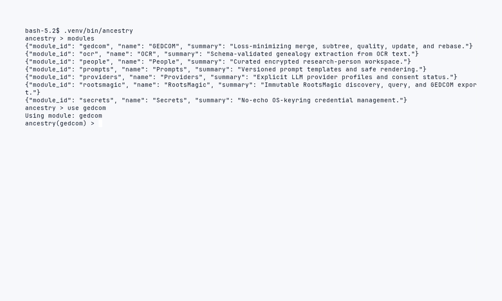

# Explore commands in the interactive console

Use the implemented prompt-toolkit/Rich REPL to inspect the available modules
and GEDCOM actions before running a task. This guide only uses navigation and
help: it does not open a genealogy file, create a workspace, select a provider,
or send a network request.

## Prerequisites

- Run `make setup` from the repository root first.
- Start in a terminal at that repository root. Keep credentials and private
  genealogy details out of interactive commands and history.

## Inspect the supported GEDCOM commands



Start the supported interactive console:

```console
.venv/bin/ancestry
```

At its prompt, enter the following controls one line at a time:

```text
ancestry > modules
ancestry > use gedcom
ancestry(gedcom) > info
ancestry(gedcom) > show actions
ancestry(gedcom) > back
ancestry > exit
```

`modules` lists enabled modules. `use gedcom` changes only the REPL context;
`info` and `show actions` describe the registered GEDCOM commands without
executing one. `back` clears the module context, and `exit` closes the session
when it has no active jobs.

The REPL and one-shot CLI use the same command specifications and application
services. When you are ready to perform the fictional offline task, use [run
an offline GEDCOM merge](run-an-offline-gedcom-merge.md); it names every input,
output, and `provider=none` explicitly.

## Recovery and safe exit

- For an unknown command or option, read the displayed usage error, use
  `help`, and return to the root prompt with `back` rather than trying shell
  syntax. The REPL is not a shell or Python evaluator.
- If a future command starts a job, use `jobs` to inspect it. Ctrl-C requests
  cooperative cancellation; when `exit` asks about active jobs, choose `wait`,
  `cancel`, or `stay` deliberately. Output publication completes or rolls back
  rather than leaving a partial bundle.
- Provider selection and cloud consent are explicit. `provider=none` is
  network-free even when provider keys exist, while any remote-provider
  workflow requires the appropriate provider selection and recorded consent.
  Read [privacy and consent](../explanation/PRIVACY_AND_CONSENT.md) before using one.

## Cleanup

This exploration creates no genealogy result. Type `exit` when you are done;
there is no generated file to remove. If you later create workspace data, use
[encrypted backup and recovery](../ENCRYPTED_BACKUPS.md) before changing it.
